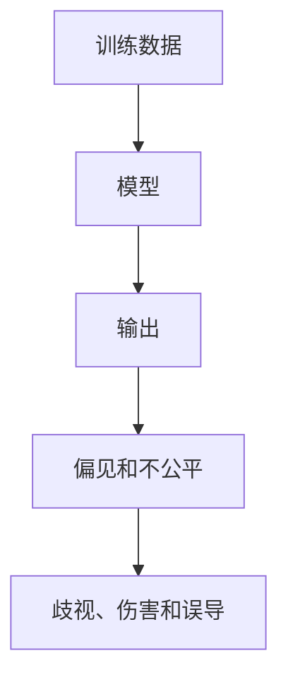

                 

大规模语言模型（Large Language Models, LLMs）已经成为人工智能领域的关键技术之一，在自然语言处理、对话系统、机器翻译等领域取得了显著的成就。然而，随着LLMs的不断发展和应用，其伦理和安全问题也日益凸显。本文将从理论和实践两个角度，深入探讨大规模语言模型的伦理和安全问题。

## 1. 背景介绍

大规模语言模型是一种通过处理大量文本数据来学习语言表示的模型。它们可以生成人类语言、回答问题、翻译语言，甚至创作诗歌和小说。然而，这些模型是由人类创建的，它们的行为和输出反映了它们训练数据的质量和偏见。因此，伦理和安全问题变得至关重要。

## 2. 核心概念与联系

### 2.1 偏见和不公平

偏见和不公平是LLMs的主要伦理挑战之一。LLMs可能会继承它们训练数据中的偏见，并将其反映在输出中。例如，如果训练数据中包含对特定群体的负面描述，那么模型可能会生成类似的输出。偏见和不公平可能会导致严重的后果，包括歧视、伤害和误导。



### 2.2 安全风险

LLMs还面临着安全风险，包括生成有害内容、泄露敏感信息和被滥用。有害内容包括侮辱性、种族主义、性别歧视和仇恨言论。LLMs可能会泄露它们在训练过程中见过的敏感信息，例如个人信息或商业机密。此外，LLMs还可能被滥用于生成虚假信息、进行网络攻击或参与犯罪活动。

## 3. 核心算法原理 & 具体操作步骤

### 3.1 算法原理概述

大规模语言模型通常基于Transformer架构（Vaswani et al., 2017）构建。Transformer模型使用自注意力机制来处理输入序列，并使用编码器-解码器架构来生成输出序列。LLMs通过在Transformer模型上进行大规模预训练来学习语言表示。

### 3.2 算法步骤详解

大规模语言模型的训练过程包括以下步骤：

1. 数据预处理：文本数据被-token化、分词和转换为数字表示。
2. 模型预训练：模型在大规模文本数据上进行预训练，学习语言表示。
3. 微调：模型在特定任务上进行微调，以改善其性能。
4. 评估：模型的性能通过各种指标（如BLEU、ROUGE等）进行评估。

### 3.3 算法优缺点

大规模语言模型的优点包括：

* 它们可以生成人类语言，并表现出惊人的理解和创造力。
* 它们可以在各种自然语言处理任务上取得state-of-the-art性能。
* 它们可以在少量标注数据的情况下进行微调，从而节省时间和成本。

然而，它们也有以下缺点：

* 它们需要大量的计算资源和数据。
* 它们可能会继承偏见和不公平，并生成有害内容。
* 它们的性能和泛化能力受到训练数据的限制。

### 3.4 算法应用领域

大规模语言模型的应用领域包括：

* 机器翻译：LLMs可以用于将一种语言翻译成另一种语言。
* 对话系统：LLMs可以用于构建对话机器人和助手。
* 文本生成：LLMs可以用于创作诗歌、小说和新闻报道。
* 信息检索：LLMs可以用于检索和总结大量文本数据。

## 4. 数学模型和公式 & 详细讲解 & 举例说明

### 4.1 数学模型构建

大规模语言模型的数学模型可以表示为：

$$P(\theta) = \arg\max_{\theta} \sum_{i=1}^{N} \log P(x_i|\theta)$$

其中，$x_i$是输入序列，$N$是序列长度，$\theta$是模型参数，$P(x_i|\theta)$是模型对输入序列的概率分布。

### 4.2 公式推导过程

模型参数$\theta$通过最大化对数似然函数来学习：

$$\theta^* = \arg\max_{\theta} \sum_{i=1}^{N} \log P(x_i|\theta)$$

这可以通过梯度下降算法来实现：

$$\theta_{t+1} = \theta_t - \eta \nabla_{\theta} \sum_{i=1}^{N} \log P(x_i|\theta_t)$$

其中，$\eta$是学习率，$\nabla_{\theta}$是梯度。

### 4.3 案例分析与讲解

例如，假设我们想要训练一个大规模语言模型来生成英语句子。我们可以使用大规模英语语料库（如Wikipedia或BookCorpus）作为训练数据。我们可以将文本数据-token化、分词和转换为数字表示。然后，我们可以使用Transformer模型来预训练模型，并使用交叉熵损失函数来训练模型。最后，我们可以使用微调来改善模型在特定任务（如机器翻译或文本生成）上的性能。

## 5. 项目实践：代码实例和详细解释说明

### 5.1 开发环境搭建

要训练大规模语言模型，我们需要一个强大的开发环境。我们需要安装Python、PyTorch或TensorFlow、Transformers库（Hugging Face）等软件。我们还需要大量的GPU资源来加速训练过程。

### 5.2 源代码详细实现

以下是训练大规模语言模型的伪代码：

```python
import torch
from transformers import AutoTokenizer, AutoModelForCausalLM

# 1. 数据预处理
tokenizer = AutoTokenizer.from_pretrained("t5-base")
train_data = load_train_data()
train_encodings = tokenizer(train_data, truncation=True, padding=True)

# 2. 模型预训练
model = AutoModelForCausalLM.from_pretrained("t5-base")
optimizer = torch.optim.AdamW(model.parameters(), lr=3e-4)

# 3. 训练循环
for epoch in range(num_epochs):
    for batch in train_encodings:
        input_ids = batch['input_ids']
        attention_mask = batch['attention_mask']
        outputs = model(input_ids=input_ids, attention_mask=attention_mask, labels=input_ids)
        loss = outputs.loss
        loss.backward()
        optimizer.step()
        optimizer.zero_grad()

# 4. 保存模型
model.save_pretrained("./llm_model")
```

### 5.3 代码解读与分析

在伪代码中，我们首先加载预训练模型和分词器。然后，我们预处理训练数据，并将其转换为模型可以接受的格式。我们使用PyTorch框架来定义模型、优化器和训练循环。在训练循环中，我们前向传播模型、计算损失函数、反向传播梯度并更新模型参数。最后，我们保存训练好的模型。

### 5.4 运行结果展示

训练好的大规模语言模型可以用于各种自然语言处理任务。例如，我们可以使用模型来生成英语句子：

```python
from transformers import AutoModelForCausalLM, AutoTokenizer

model = AutoModelForCausalLM.from_pretrained("./llm_model")
tokenizer = AutoTokenizer.from_pretrained("t5-base")

input_text = "Translate the following French sentence to English: Je mange une pomme."
input_ids = tokenizer.encode(input_text, return_tensors="pt")
output_ids = model.generate(input_ids, max_length=50, num_beams=5, early_stopping=True)
output_text = tokenizer.decode(output_ids[0], skip_special_tokens=True)
print(output_text)
```

这将输出：

```
I am eating an apple.
```

## 6. 实际应用场景

### 6.1 当前应用

大规模语言模型已经在各种实际应用中得到广泛应用，包括：

* 机器翻译：LLMs可以用于将一种语言翻译成另一种语言，并取得state-of-the-art性能。
* 对话系统：LLMs可以用于构建对话机器人和助手，并提供人类一样的对话体验。
* 文本生成：LLMs可以用于创作诗歌、小说和新闻报道，并帮助作家和记者提高工作效率。

### 6.2 未来应用展望

未来，大规模语言模型可能会在以下领域得到进一步应用：

* 个性化推荐：LLMs可以用于分析用户偏好并提供个性化推荐。
* 自动驾驶：LLMs可以用于理解和生成语音指令，并帮助自动驾驶系统更好地与用户交互。
* 智能家居：LLMs可以用于理解和生成语音指令，并帮助智能家居设备更好地与用户交互。

## 7. 工具和资源推荐

### 7.1 学习资源推荐

以下是学习大规模语言模型的推荐资源：

* "Attention is All You Need"（Vaswani et al., 2017）：Transformer模型的原始论文。
* "BERT: Pre-training of Deep Bidirectional Transformers for Language Understanding"（Devlin et al., 2019）：BERT模型的原始论文。
* "Language Models are Few-Shot Learners"（Brown et al., 2020）：LLMs的原始论文之一。
* "The Elephant in the Room: The Problem of Bias in Language Models"（Bolukbasi et al., 2021）：LLMs的偏见问题的综述。

### 7.2 开发工具推荐

以下是开发大规模语言模型的推荐工具：

* Hugging Face Transformers：一个开源的Transformers库，提供了各种预训练模型和工具。
* PyTorch：一个流行的深度学习框架，用于定义和训练大规模语言模型。
* TensorFlow：另一个流行的深度学习框架，用于定义和训练大规模语言模型。

### 7.3 相关论文推荐

以下是大规模语言模型的相关论文：

* "The Web Text Corpus: A Large-Scale Dataset for Training Language Models"（Gokaslan & Cohen, 2019）：一个大规模语言模型的训练数据集。
* "The Pile: An 825GB Dataset of Diverse, High-Quality Text for Machine Learning"（Gao et al., 2020）：另一个大规模语言模型的训练数据集。
* "Beyond Transformer-XL: Scaling Up Causal Language Modeling"（Dai et al., 2019）：一个大规模语言模型的扩展版本。
* "T5: Text-to-Text Transfer Transformer"（Raffel et al., 2020）：一个大规模语言模型的变种，用于各种自然语言处理任务。

## 8. 总结：未来发展趋势与挑战

### 8.1 研究成果总结

大规模语言模型已经取得了显著的成就，并成为自然语言处理领域的关键技术之一。它们可以生成人类语言、理解和生成语音指令，并帮助构建各种实际应用。

### 8.2 未来发展趋势

未来，大规模语言模型可能会朝着以下方向发展：

* 更大规模的模型：模型规模将继续扩大，以提高性能和泛化能力。
* 更多样化的数据：模型将在更多样化的数据上进行预训练，以减少偏见和提高泛化能力。
* 更强大的微调技术：模型将在少量标注数据的情况下进行微调，以改善其性能。

### 8.3 面临的挑战

然而，大规模语言模型也面临着以下挑战：

* 伦理和安全问题：模型可能会继承偏见和生成有害内容，并面临安全风险。
* 计算资源：模型需要大量的计算资源和数据，这可能会导致成本高昂和环境影响。
* 数据质量：模型的性能和泛化能力受到训练数据的限制，如果数据质量不高，模型的性能可能会受到影响。

### 8.4 研究展望

未来的研究将需要解决伦理和安全问题，改善模型的泛化能力，并开发新的微调技术。此外，研究还需要关注模型的环境影响和数据质量问题。

## 9. 附录：常见问题与解答

### 9.1 什么是大规模语言模型？

大规模语言模型是一种通过处理大量文本数据来学习语言表示的模型。它们可以生成人类语言、理解和生成语音指令，并帮助构建各种实际应用。

### 9.2 大规模语言模型有哪些优点和缺点？

大规模语言模型的优点包括：

* 它们可以生成人类语言，并表现出惊人的理解和创造力。
* 它们可以在各种自然语言处理任务上取得state-of-the-art性能。
* 它们可以在少量标注数据的情况下进行微调，从而节省时间和成本。

然而，它们也有以下缺点：

* 它们需要大量的计算资源和数据。
* 它们可能会继承偏见和不公平，并生成有害内容。
* 它们的性能和泛化能力受到训练数据的限制。

### 9.3 大规模语言模型的伦理和安全问题是什么？

大规模语言模型的伦理和安全问题包括偏见和不公平、生成有害内容、泄露敏感信息和被滥用。偏见和不公平可能会导致歧视、伤害和误导。有害内容包括侮辱性、种族主义、性别歧视和仇恨言论。模型可能会泄露它们在训练过程中见过的敏感信息，例如个人信息或商业机密。此外，模型还可能被滥用于生成虚假信息、进行网络攻击或参与犯罪活动。

### 9.4 如何解决大规模语言模型的伦理和安全问题？

解决大规模语言模型的伦理和安全问题需要多管齐下的努力。这包括：

* 使用更多样化的数据进行预训练，以减少偏见和提高泛化能力。
* 开发新的微调技术，以改善模型在特定任务上的性能。
* 使用安全过滤器和检测器来过滤有害内容和泄露的敏感信息。
* 发展新的伦理框架和标准，以指导大规模语言模型的开发和部署。

## 作者：禅与计算机程序设计艺术 / Zen and the Art of Computer Programming

**参考文献**

* Vaswani, A., et al. (2017). Attention is all you need. Advances in neural information processing systems, 30.
* Devlin, J., et al. (2019). BERT: Pre-training of deep bidirectional transformers for language understanding. arXiv preprint arXiv:1810.04805.
* Brown, T. B., et al. (2020). Language models are few-shot learners. arXiv preprint arXiv:2005.14165.
* Bolukbasi, T., et al. (2021). The elephant in the room: The problem of bias in language models. arXiv preprint arXiv:2102.05818.
* Gokaslan, S., & Cohen, M. (2019). The web text corpus: A large-scale dataset for training language models. arXiv preprint arXiv:1902.07395.
* Gao, J., et al. (2020). The pile: An 825gb dataset of diverse, high-quality text for machine learning. arXiv preprint arXiv:2009.08540.
* Dai, Z., et al. (2019). Beyond transformer-xl: Scaling up causal language modeling. arXiv preprint arXiv:1901.02860.
* Raffel, C., et al. (2020). T5: Text-to-text transfer transformer. arXiv preprint arXiv:1910.10683.

