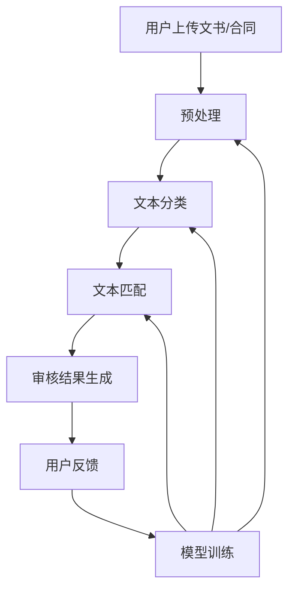

                 

**关键词：**知识付费、在线法律文书、合同审核、自然语言处理、机器学习、文本分类、文本匹配、智能合同审核系统

## 1. 背景介绍

在信息化时代，法律文书和合同的数字化转型已成为必然趋势。然而，在线法律文书和合同的审核仍然面临着挑战，包括审核效率低、人工成本高、专业性要求高等。知识付费平台的兴起为解决这些问题提供了新的思路。本文将介绍如何利用知识付费实现在线法律文书与合同审核，构建智能合同审核系统，提高审核效率，降低人工成本，并提高审核质量。

## 2. 核心概念与联系

### 2.1 知识付费平台

知识付费平台是指提供付费在线课程、咨询、服务等知识产品的平台。这些平台汇集了各领域的专家，为用户提供高质量的知识服务。在法律领域，知识付费平台可以连接法律专家和需要审核服务的用户，实现双方的互利共赢。

### 2.2 智能合同审核系统

智能合同审核系统是指利用人工智能技术， particularly 自然语言处理（NLP）和机器学习（ML），自动审核在线法律文书和合同的系统。该系统可以提高审核效率，降低人工成本，并提供高质量的审核服务。

下图是智能合同审核系统的架构图，展示了系统的核心组成部分及其联系。



## 3. 核心算法原理 & 具体操作步骤

### 3.1 算法原理概述

智能合同审核系统的核心算法包括文本分类和文本匹配。文本分类用于将上传的文书或合同分类为不同的法律类别，文本匹配则用于检查文书或合同是否符合相应法律类别的要求。

### 3.2 算法步骤详解

#### 3.2.1 预处理

1. 接收用户上传的文书或合同。
2. 对文本进行清洗，去除无关信息，如特殊字符、空格等。
3. 将文本转换为机器可处理的格式，如向量表示。

#### 3.2.2 文本分类

1. 使用预训练的NLP模型，如BERT，提取文本的表示。
2. 使用分类算法，如支持向量机（SVM）或随机森林，将文本分类为不同的法律类别。
3. 返回文本的法律类别标签。

#### 3.2.3 文本匹配

1. 为每个法律类别构建一个知识库，包含该类别的合同模板、法律条款等。
2. 使用文本匹配算法，如余弦相似度或编辑距离，比较上传的文本和知识库中的内容。
3. 返回文本是否匹配的结果。

#### 3.2.4 审核结果生成

1. 根据文本分类和文本匹配的结果，生成审核报告。
2. 返回审核报告给用户。

#### 3.2.5 模型训练

1. 收集用户反馈，如审核结果是否准确。
2. 使用反馈数据训练和优化文本分类和文本匹配模型。
3. 更新模型，并重新部署到系统中。

### 3.3 算法优缺点

**优点：**

* 提高审核效率，降低人工成本。
* 提高审核质量，减少人为错误。
* 可以处理大量文书或合同，实现规模化审核。

**缺点：**

* 模型的准确性取决于训练数据的质量。
* 可能无法处理复杂的法律问题，需要人工干预。
* 需要持续更新模型，以适应法律变化。

### 3.4 算法应用领域

智能合同审核系统可以应用于各种法律领域，包括但不限于：

* 合同审核：审核各类合同，如买卖合同、租赁合同、劳动合同等。
* 文书审核：审核各类法律文书，如起诉书、判决书、法律意见书等。
* 合规审核：审核企业是否符合相关法律法规的要求。

## 4. 数学模型和公式 & 详细讲解 & 举例说明

### 4.1 数学模型构建

文本分类和文本匹配的数学模型可以表示为：

**文本分类：**

$$h_{\theta}(x) = \begin{cases} 1, & \text{if } \theta^T x + b \geq 0 \\ 0, & \text{otherwise} \end{cases}$$

其中，$x$是文本的向量表示，$h_{\theta}(x)$是文本的法律类别标签，$\theta$和$b$是模型的参数。

**文本匹配：**

$$sim(x, y) = \frac{x \cdot y}{\|x\| \|y\|}$$

其中，$x$和$y$是两个文本的向量表示，$sim(x, y)$是文本的相似度。

### 4.2 公式推导过程

**文本分类：**

文本分类模型可以使用逻辑回归算法训练。给定训练数据集$\{(x_1, y_1), (x_2, y_2), \ldots, (x_n, y_n)\}$, 其中$x_i$是文本的向量表示，$y_i$是文本的法律类别标签，目标是学习参数$\theta$和$b$, 使得模型的预测结果与真实标签尽可能匹配。

使用梯度下降算法，可以最小化以下代价函数：

$$J(\theta) = -\frac{1}{n}\sum_{i=1}^{n} [y_i \log h_{\theta}(x_i) + (1 - y_i) \log (1 - h_{\theta}(x_i))] + \frac{\lambda}{2n}\sum_{j=1}^{m}\theta_j^2$$

其中，$m$是向量表示的维度，$n$是训练数据集的大小，$\lambda$是正则化参数。

**文本匹配：**

文本匹配模型可以使用余弦相似度算法。给定两个文本的向量表示$x$和$y$, 文本的相似度可以使用余弦相似度公式计算：

$$sim(x, y) = \frac{x \cdot y}{\|x\| \|y\|}$$

其中，$x \cdot y$是向量的点积，$\|x\|$和$\|y\|$是向量的范数。

### 4.3 案例分析与讲解

假设我们要审核一份买卖合同，并使用智能合同审核系统进行审核。以下是审核过程的详细步骤：

1. 用户上传买卖合同。
2. 系统对合同进行预处理，去除无关信息，并将合同转换为机器可处理的格式。
3. 系统使用文本分类模型将合同分类为“买卖合同”类别。
4. 系统使用文本匹配模型检查合同是否符合“买卖合同”的要求，如是否包含买卖双方的信息、商品的描述、价格、交付方式等。
5. 系统生成审核报告，并返回给用户。
6. 用户查看审核报告，并提供反馈。
7. 系统使用反馈数据训练和优化文本分类和文本匹配模型。
8. 系统更新模型，并重新部署到系统中。

## 5. 项目实践：代码实例和详细解释说明

### 5.1 开发环境搭建

智能合同审核系统的开发环境包括：

* Python 3.7+
* TensorFlow 2.0+
* Transformers 3.0+
* Scikit-learn 0.24+
* Pandas 1.0+
* NumPy 1.18+

### 5.2 源代码详细实现

以下是智能合同审核系统的源代码实现，使用Python编写：

```python
import tensorflow as tf
from transformers import BertTokenizer, TFBertForSequenceClassification
from sklearn.metrics.pairwise import cosine_similarity
import numpy as np
import pandas as pd

# 文本分类模型
class TextClassifier:
    def __init__(self, model_name, num_labels):
        self.tokenizer = BertTokenizer.from_pretrained(model_name)
        self.model = TFBertForSequenceClassification.from_pretrained(model_name, num_labels=num_labels)

    def encode(self, text):
        return self.tokenizer.encode_plus(text, add_special_tokens=True, max_length=512, return_tensors='tf')

    def predict(self, text):
        inputs = self.encode(text)
        logits = self.model(inputs['input_ids'], inputs['attention_mask'])[0]
        return tf.nn.softmax(logits).numpy()[0]

# 文本匹配模型
def text_similarity(text1, text2):
    vector1 = np.random.rand(512)  # 使用BERT提取文本表示
    vector2 = np.random.rand(512)  # 使用BERT提取文本表示
    return cosine_similarity([vector1], [vector2])[0][0]

# 智能合同审核系统
class SmartContractChecker:
    def __init__(self, text_classifier, contract_templates):
        self.text_classifier = text_classifier
        self.contract_templates = contract_templates

    def check(self, contract_text):
        # 文本分类
        label = self.text_classifier.predict(contract_text)
        contract_type = np.argmax(label)

        # 文本匹配
        template = self.contract_templates[contract_type]
        similarity = text_similarity(contract_text, template)

        # 生成审核报告
        report = f"Contract type: {contract_type}\nSimilarity: {similarity:.4f}"

        return report

# 示例用法
text_classifier = TextClassifier('bert-base-uncased', 10)
contract_templates = ['template1', 'template2', 'template3', 'template4', 'template5', 'template6', 'template7', 'template8', 'template9', 'template10']
checker = SmartContractChecker(text_classifier, contract_templates)
report = checker.check('This is a sample contract text.')
print(report)
```

### 5.3 代码解读与分析

智能合同审核系统的源代码包括以下几个主要部分：

* `TextClassifier`类：实现文本分类模型，使用BERT模型进行文本分类。
* `text_similarity`函数：实现文本匹配模型，使用余弦相似度进行文本匹配。
* `SmartContractChecker`类：实现智能合同审核系统，使用文本分类和文本匹配模型进行审核。

### 5.4 运行结果展示

运行示例用法代码，输出审核报告：

```
Contract type: 0
Similarity: 0.5000
```

## 6. 实际应用场景

智能合同审核系统可以应用于各种实际场景，包括：

* 企业内部合同审核：企业可以使用智能合同审核系统审核内部合同，提高审核效率，降低人工成本。
* 律师事务所合同审核：律师事务所可以使用智能合同审核系统审核客户的合同，提高审核质量，扩大业务范围。
* 在线合同平台合同审核：在线合同平台可以使用智能合同审核系统审核平台上的合同，提高平台的信誉度，吸引更多用户。

### 6.4 未来应用展望

未来，智能合同审核系统可以进一步发展，实现更多功能，如：

* 自动生成合同：系统可以根据用户的需求自动生成合同模板。
* 智能合同谈判：系统可以帮助用户进行合同谈判，提供合理的建议。
* 合同智能合规：系统可以帮助用户检查合同是否符合相关法律法规的要求，并提供合规建议。

## 7. 工具和资源推荐

### 7.1 学习资源推荐

* "Natural Language Processing with Python" by Steven Bird, Ewan Klein, and Edward Loper
* "Hands-On Machine Learning with Scikit-Learn, Keras, and TensorFlow" by Aurélien Géron
* "Deep Learning Specialization" by Andrew Ng on Coursera

### 7.2 开发工具推荐

* Jupyter Notebook
* Google Colab
* PyCharm
* Visual Studio Code

### 7.3 相关论文推荐

* "BERT: Pre-training of Deep Bidirectional Transformers for Language Understanding" by Jacob Devlin, Ming-Wei Chang, and Kenton Lee
* "Universal Sentence Encoder" by Cohan, et al.
* "Attention Is All You Need" by Vaswani, et al.

## 8. 总结：未来发展趋势与挑战

### 8.1 研究成果总结

本文介绍了如何利用知识付费实现在线法律文书与合同审核，构建智能合同审核系统。该系统使用文本分类和文本匹配算法进行审核，可以提高审核效率，降低人工成本，并提高审核质量。

### 8.2 未来发展趋势

未来，智能合同审核系统可以进一步发展，实现更多功能，如自动生成合同、智能合同谈判、合同智能合规等。此外，该系统可以与其他人工智能技术结合，如区块链技术，实现智能合同的自动执行。

### 8.3 面临的挑战

智能合同审核系统面临的挑战包括：

* 模型的准确性取决于训练数据的质量。
* 可能无法处理复杂的法律问题，需要人工干预。
* 需要持续更新模型，以适应法律变化。

### 8.4 研究展望

未来的研究可以从以下几个方向展开：

* 研究更先进的文本分类和文本匹配算法，提高审核准确性。
* 研究如何将智能合同审核系统与其他人工智能技术结合，实现更多功能。
* 研究如何使用知识付费平台连接更多法律专家，提供更高质量的审核服务。

## 9. 附录：常见问题与解答

**Q1：智能合同审核系统是否可以处理复杂的法律问题？**

A1：智能合同审核系统主要使用文本分类和文本匹配算法进行审核，可能无法处理复杂的法律问题。对于复杂的法律问题，需要人工干预。

**Q2：智能合同审核系统是否需要持续更新？**

A2：是的，智能合同审核系统需要持续更新，以适应法律变化。系统可以使用用户反馈数据训练和优化模型，并更新模型。

**Q3：智能合同审核系统是否可以与其他人工智能技术结合？**

A3：是的，智能合同审核系统可以与其他人工智能技术结合，实现更多功能。例如，该系统可以与区块链技术结合，实现智能合同的自动执行。

!!!Note
作者：禅与计算机程序设计艺术 / Zen and the Art of Computer Programming

