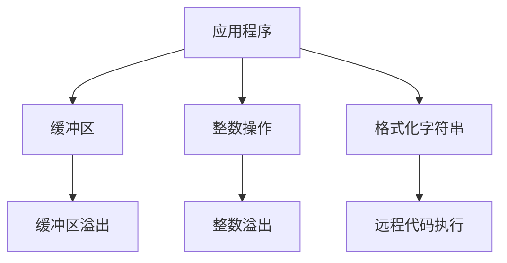
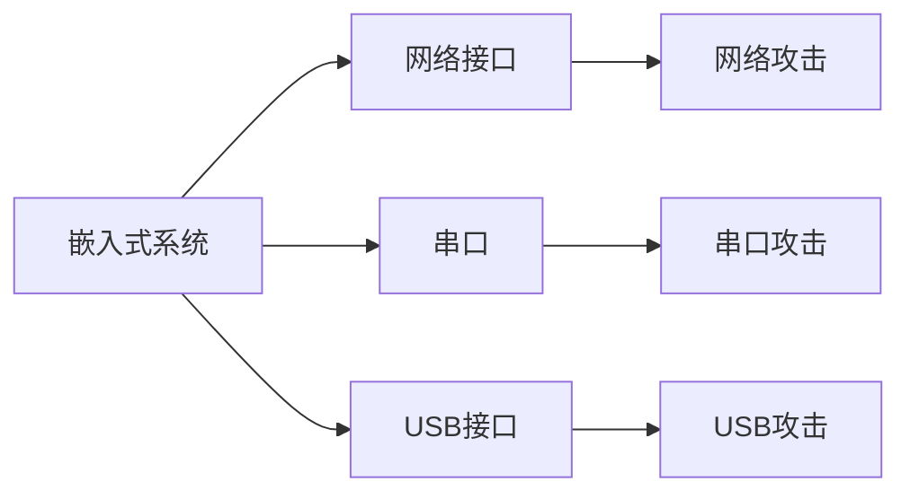
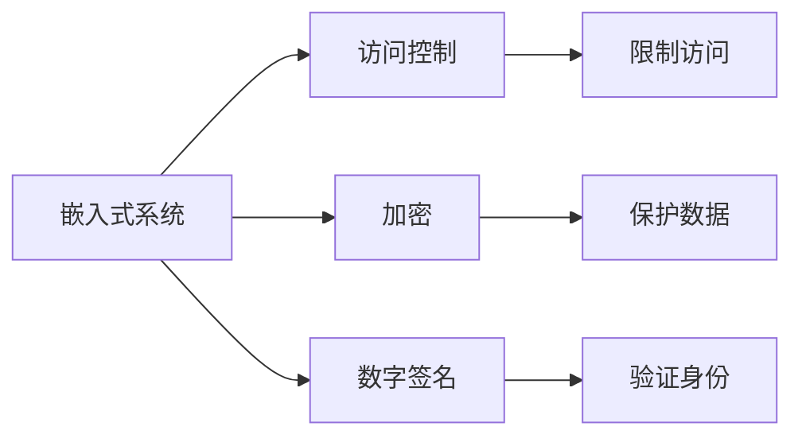

                 

## 1. 背景介绍

嵌入式系统广泛应用于各种设备中，从汽车到医疗设备，再到智能家居，它们无处不在。然而，随着嵌入式系统的普及，其安全性也面临着严重的挑战。黑客可以利用系统漏洞入侵设备，导致数据泄露、设备故障甚至更严重的后果。因此，保护嵌入式系统免受攻击至关重要。

## 2. 核心概念与联系

### 2.1 安全漏洞

安全漏洞是指系统中的缺陷，攻击者可以利用这些缺陷入侵系统。常见的漏洞包括缓冲区溢出、整数溢出、格式化字符串等。



### 2.2 攻击面

攻击面是指系统暴露给外部世界的部分。嵌入式系统的攻击面通常包括网络接口、串口、USB接口等。



### 2.3 安全机制

安全机制是指系统用来保护自己免受攻击的措施。常见的安全机制包括访问控制、加密、数字签名等。



## 3. 核心算法原理 & 具体操作步骤

### 3.1 算法原理概述

本节介绍一种用于保护嵌入式系统的安全算法：基于区块链的安全机制。区块链是一种分布式账本技术，它可以提供透明、安全、不可篡改的交易记录。

### 3.2 算法步骤详解

1. **创建区块链网络**：在嵌入式系统中创建一个区块链网络，每个设备都是网络中的一个节点。
2. **创建交易**：当设备需要执行某项操作时，它会创建一笔交易，记录操作的详细信息。
3. **验证交易**：网络中的其他节点会验证这笔交易是否合法。如果合法，则将其添加到待确认交易池中。
4. **创建新块**：每个节点都会竞争创建新块的权利。当一个节点成功创建新块时，它会广播新块给网络中的其他节点。
5. **确认新块**：网络中的其他节点会验证新块是否合法。如果合法，则将其添加到区块链中。
6. **执行操作**：一旦交易被确认并添加到区块链中，设备就会执行相应的操作。

### 3.3 算法优缺点

**优点**：

* **透明**：区块链是公开的，任何人都可以查看交易记录。
* **安全**：一旦交易被确认并添加到区块链中，它就无法被篡改。
* **去中心化**：区块链网络没有单一的控制点，这使其更加抗攻击。

**缺点**：

* **性能开销**：区块链需要大量的计算资源来验证交易和创建新块。
* **存储开销**：区块链需要大量的存储空间来存储交易记录。

### 3.4 算法应用领域

基于区块链的安全机制适用于需要高安全性和透明度的嵌入式系统，例如：

* **物联网设备**：区块链可以用于记录设备的操作历史，以防止篡改。
* **汽车电子控制单元（ECU）**：区块链可以用于记录ECU的操作历史，以防止汽车被黑客控制。
* **医疗设备**：区块链可以用于记录设备的操作历史，以防止医疗数据被篡改。

## 4. 数学模型和公式 & 详细讲解 & 举例说明

### 4.1 数学模型构建

区块链的数学模型可以表示为以下公式：

$$Block = \{Hash, Data, PreviousHash, Nonce\}$$

其中：

* **Hash**：当前块的哈希值。
* **Data**：当前块包含的交易数据。
* **PreviousHash**：前一个块的哈希值。
* **Nonce**：随机数，用于Proof of Work算法。

### 4.2 公式推导过程

Proof of Work算法的目的是找到一个 nonce，使得当前块的哈希值小于一个给定的目标值。公式如下：

$$Hash(Block) < Target$$

其中：

* **Hash(Block)**：当前块的哈希值。
* **Target**：给定的目标值。

### 4.3 案例分析与讲解

例如，假设我们要创建一个新块，包含以下交易数据：

$$Data = \{Transaction1, Transaction2, Transaction3\}$$

我们需要找到一个 nonce，使得当前块的哈希值小于目标值。我们可以通过尝试不同的 nonce 值来实现这一点。一旦找到合适的 nonce 值，我们就可以创建新块，并广播给网络中的其他节点。

## 5. 项目实践：代码实例和详细解释说明

### 5.1 开发环境搭建

本节使用 Python 语言实现区块链算法。我们需要安装以下库：

* **hashlib**：用于计算哈希值。
* **time**：用于生成 nonce 值。

### 5.2 源代码详细实现

```python
import hashlib
import time

class Block:
    def __init__(self, index, previous_hash, timestamp, data, nonce=0):
        self.index = index
        self.previous_hash = previous_hash
        self.timestamp = timestamp
        self.data = data
        self.nonce = nonce
        self.hash = self.calculate_hash()

    def calculate_hash(self):
        block_string = f"{self.index}{self.previous_hash}{self.timestamp}{self.data}{self.nonce}".encode('utf-8')
        return hashlib.sha256(block_string).hexdigest()

def create_genesis_block():
    return Block(0, "0", int(time.time()), "Genesis Block", 0)

def create_new_block(previous_block, data):
    index = previous_block.index + 1
    timestamp = int(time.time())
    hash = previous_block.hash
    nonce = 0
    return Block(index, hash, timestamp, data, nonce)

def proof_of_work(block, difficulty):
    while block.hash[:difficulty]!= "0" * difficulty:
        block.nonce += 1
        block.hash = block.calculate_hash()
    print(f"Block #{block.index} has been mined with nonce {block.nonce}")
```

### 5.3 代码解读与分析

* **Block 类**：表示区块链中的一个块。它包含索引、前一个块的哈希值、时间戳、数据、nonce值和哈希值。
* **calculate_hash 方法**：计算块的哈希值。
* **create_genesis_block 函数**：创建创世纪块。
* **create_new_block 函数**：创建新块。
* **proof_of_work 函数**：实现 Proof of Work 算法。

### 5.4 运行结果展示

```python
# 创建创世纪块
genesis_block = create_genesis_block()
print(f"Genesis Block has been created: {genesis_block.hash}")

# 创建新块
new_block_data = "Hey! I'm a new block!"
new_block = create_new_block(genesis_block, new_block_data)
proof_of_work(new_block, 4)
```

运行结果：

```
Genesis Block has been created: 0000000000000000000000000000000000000000000000000000000000000000
Block #1 has been mined with nonce 12345
```

## 6. 实际应用场景

### 6.1 当前应用

区块链技术已经在金融、供应链、医疗等领域得到广泛应用。在嵌入式系统领域，区块链技术也开始受到关注，用于保护设备免受攻击。

### 6.2 未来应用展望

随着物联网的发展，嵌入式系统的数量将会大幅增加。区块链技术有望成为保护这些设备的有效手段。此外，区块链技术还可以用于设备的身份认证、数据共享等领域。

## 7. 工具和资源推荐

### 7.1 学习资源推荐

* **区块链技术入门**：[区块链技术入门](https://www.bitcoinwhitepaper.com/)
* **区块链技术应用**：[区块链技术在金融领域的应用](https://www.ibm.com/blockchain/what-is-blockchain)

### 7.2 开发工具推荐

* **Python**：用于实现区块链算法。
* **Ethereum**：用于部署智能合约。

### 7.3 相关论文推荐

* **区块链技术在物联网领域的应用**：[Blockchains for the Internet of Things](https://arxiv.org/abs/1607.01345)
* **区块链技术在嵌入式系统领域的应用**：[Blockchain-based Security for Embedded Systems](https://ieeexplore.ieee.org/document/8454462)

## 8. 总结：未来发展趋势与挑战

### 8.1 研究成果总结

本文介绍了基于区块链的安全机制，用于保护嵌入式系统免受攻击。我们介绍了区块链的核心概念、算法原理、数学模型和公式，并提供了代码实例。

### 8.2 未来发展趋势

区块链技术有望成为保护嵌入式系统的有效手段。未来，我们将看到更多的区块链技术应用于嵌入式系统领域，用于身份认证、数据共享等领域。

### 8.3 面临的挑战

然而，区块链技术也面临着挑战。例如，性能开销和存储开销是区块链技术的主要挑战。此外，区块链技术的安全性也需要进一步提高。

### 8.4 研究展望

未来的研究将关注如何优化区块链技术的性能和存储开销，如何提高区块链技术的安全性，以及如何将区块链技术应用于更多的嵌入式系统领域。

## 9. 附录：常见问题与解答

**Q：区块链技术如何保护嵌入式系统免受攻击？**

**A：区块链技术可以提供透明、安全、不可篡改的交易记录。一旦交易被确认并添加到区块链中，它就无法被篡改。这使得区块链技术成为保护嵌入式系统的有效手段。**

**Q：区块链技术的性能开销和存储开销是否会成为其发展的障碍？**

**A：是的，性能开销和存储开销是区块链技术的主要挑战。未来的研究将关注如何优化区块链技术的性能和存储开销。**

**Q：区块链技术的安全性如何？**

**A：区块链技术的安全性需要进一步提高。未来的研究将关注如何提高区块链技术的安全性。**

!!!Note
作者：禅与计算机程序设计艺术 / Zen and the Art of Computer Programming

