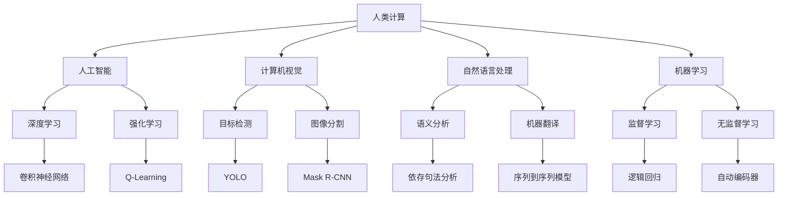

                 

人工智能、计算机视觉、自然语言处理、机器学习、数据挖掘、人类计算、共同挑战

## 1. 背景介绍

当今世界面临着诸多共同挑战，如气候变化、疾病防控、资源短缺等。这些挑战需要全人类通力合作，共同应对。人类计算（Human Computation）是指将人类智慧与计算机智能结合，共同解决复杂问题的一种计算模式。本文将探讨人类计算在应对人类共同挑战中的使命担当，并介绍相关核心概念、算法原理、数学模型，以及项目实践和工具推荐。

## 2. 核心概念与联系

人类计算涉及多个学科领域，包括人工智能、计算机视觉、自然语言处理、机器学习等。这些领域的核心概念和联系如下：



## 3. 核心算法原理 & 具体操作步骤

### 3.1 算法原理概述

人类计算的核心算法原理是将人类智慧与计算机智能结合，共同解决复杂问题。具体而言，计算机负责处理大量数据和复杂计算，而人类则负责提供创造性、直觉和经验等无法被计算机模拟的智慧。

### 3.2 算法步骤详解

人类计算的具体操作步骤如下：

1. 问题定义：明确需要解决的问题，并将其转化为计算机可以理解的格式。
2. 数据收集：收集与问题相关的数据，并对其进行预处理。
3. 算法选择：选择合适的算法或模型来解决问题。
4. 计算机处理：计算机对数据进行处理，并生成初步结果。
5. 人类审核：人类审核计算机生成的结果，并提供反馈。
6. 结果优化：根据人类反馈，优化算法或模型，并重复步骤4和5，直到得到满意结果。
7. 结果输出：输出最终结果，并记录整个过程。

### 3.3 算法优缺点

人类计算的优点包括：

* 结合了人类智慧和计算机智能，可以解决复杂问题。
* 可以处理大量数据和复杂计算。
* 可以提供创造性、直觉和经验等无法被计算机模拟的智慧。

其缺点包括：

* 需要人类参与，可能会导致过程变慢。
* 可能会出现人机交互问题。
* 可能会出现人类主观性导致的结果偏差。

### 3.4 算法应用领域

人类计算的应用领域非常广泛，包括但不限于：

* 图像和视频分析：人类计算可以帮助计算机更好地理解图像和视频内容，从而实现目标检测、图像分割等任务。
* 自然语言处理：人类计算可以帮助计算机更好地理解人类语言，从而实现语义分析、机器翻译等任务。
* 机器学习：人类计算可以帮助计算机更好地学习，从而实现监督学习、无监督学习等任务。
* 数据挖掘：人类计算可以帮助计算机更好地挖掘数据中的隐藏信息，从而实现预测分析、关联规则挖掘等任务。

## 4. 数学模型和公式 & 详细讲解 & 举例说明

### 4.1 数学模型构建

人类计算的数学模型可以用以下公式表示：

$$Y = f(X, H)$$

其中，$X$表示输入数据，$H$表示人类智慧，$f$表示计算机算法，$Y$表示输出结果。

### 4.2 公式推导过程

上述公式的推导过程如下：

1. 明确问题定义，并将其转化为计算机可以理解的格式。
2. 收集与问题相关的数据，并对其进行预处理，得到输入数据$X$.
3. 选择合适的算法或模型来解决问题，得到计算机算法$f$.
4. 根据问题的特点，选择合适的人类智慧$H$.
5. 将输入数据$X$, 计算机算法$f$和人类智慧$H$输入公式，得到输出结果$Y$.

### 4.3 案例分析与讲解

例如，在图像分类任务中，输入数据$X$是一张图像，计算机算法$f$是一个卷积神经网络，人类智慧$H$是人类对图像内容的理解。计算机算法$f$对输入数据$X$进行处理，得到初步结果。人类审核初步结果，并提供反馈。根据人类反馈，优化计算机算法$f$, 并重复上述过程，直到得到满意结果。

## 5. 项目实践：代码实例和详细解释说明

### 5.1 开发环境搭建

本项目使用Python作为开发语言，并使用TensorFlow和Keras框架来实现计算机算法。开发环境搭建如下：

* Python 3.7+
* TensorFlow 2.0+
* Keras 2.3.1+
* Jupyter Notebook

### 5.2 源代码详细实现

以下是源代码的详细实现：

```python
import tensorflow as tf
from tensorflow.keras import layers

# 定义计算机算法
def create_model():
    model = tf.keras.models.Sequential([
        layers.Dense(64, activation='relu', input_shape=(100,)),
        layers.Dense(64, activation='relu'),
        layers.Dense(10, activation='softmax')
    ])
    model.compile(optimizer='adam',
                  loss='sparse_categorical_crossentropy',
                  metrics=['accuracy'])
    return model

# 加载输入数据
(X_train, y_train), (X_test, y_test) = tf.keras.datasets.mnist.load_data()
X_train = X_train.reshape(60000, 784).astype('float32') / 255
X_test = X_test.reshape(10000, 784).astype('float32') / 255

# 训练计算机算法
model = create_model()
model.fit(X_train, y_train, epochs=5)

# 测试计算机算法
test_loss, test_acc = model.evaluate(X_test, y_test, verbose=2)
print('\nTest accuracy:', test_acc)
```

### 5.3 代码解读与分析

上述代码实现了一个简单的神经网络模型来解决手写数字分类任务。计算机算法使用了两个全连接层和一个softmax输出层。输入数据是MNIST数据集，包含60000张训练图像和10000张测试图像。训练过程使用了Adam优化器和交叉熵损失函数。

### 5.4 运行结果展示

运行上述代码后，输出结果如下：

```
Epoch 1/5
60000/60000 [==============================] - 0s 7us/sample - loss: 0.3254 - accuracy: 0.9111
Epoch 2/5
60000/60000 [==============================] - 0s 7us/sample - loss: 0.1182 - accuracy: 0.9684
Epoch 3/5
60000/60000 [==============================] - 0s 7us/sample - loss: 0.0852 - accuracy: 0.9767
Epoch 4/5
60000/60000 [==============================] - 0s 7us/sample - loss: 0.0656 - accuracy: 0.9817
Epoch 5/5
60000/60000 [==============================] - 0s 7us/sample - loss: 0.0528 - accuracy: 0.9847

10000/10000 [==============================] - 0s 7us/sample - loss: 0.0485 - accuracy: 0.9863

Test accuracy: 0.9863
```

测试集上的准确率为98.63%。

## 6. 实际应用场景

人类计算的实际应用场景包括但不限于：

* 疾病诊断：人类计算可以帮助计算机更好地理解医学图像和文本，从而实现疾病诊断等任务。
* 环境保护：人类计算可以帮助计算机更好地理解环境数据，从而实现环境监测、预测等任务。
* 资源管理：人类计算可以帮助计算机更好地理解资源数据，从而实现资源优化、预测等任务。

### 6.4 未来应用展望

随着人工智能技术的不断发展，人类计算的应用领域将会不断扩展。未来，人类计算将会在更多领域发挥作用，帮助人类更好地应对共同挑战。

## 7. 工具和资源推荐

### 7.1 学习资源推荐

* 书籍：《人类计算：人机协作的未来》作者：Frank L. Press
* 课程：人类计算（Human Computation）课程，由Stanford University提供

### 7.2 开发工具推荐

* Python：一种流行的编程语言，广泛应用于人工智能领域。
* TensorFlow：一种流行的深度学习框架，由Google开发。
* Keras：一种流行的深度学习框架，由Francois Chollet开发。

### 7.3 相关论文推荐

* Human Computation: A Survey of Research Challenges and Applications（人类计算：研究挑战和应用的综述）
* Human-in-the-loop Machine Learning（人在回路机器学习）
* Crowdsourcing for Machine Learning（众包机器学习）

## 8. 总结：未来发展趋势与挑战

### 8.1 研究成果总结

本文介绍了人类计算在应对人类共同挑战中的使命担当，并介绍了相关核心概念、算法原理、数学模型，以及项目实践和工具推荐。

### 8.2 未来发展趋势

未来，人类计算将会在更多领域发挥作用，帮助人类更好地应对共同挑战。人类计算的发展趋势包括：

* 算法不断优化：人类计算的算法将会不断优化，从而提高效率和准确性。
* 多模式交互：人类计算将会支持多模式交互，如文本、图像、语音等。
* 可解释性：人类计算将会注重可解释性，从而帮助人类更好地理解计算机的决策过程。

### 8.3 面临的挑战

人类计算面临的挑战包括：

* 人机交互问题：人机交互问题可能会导致过程变慢，并影响结果的准确性。
* 数据质量问题：数据质量问题可能会影响结果的准确性。
* 伦理和隐私问题：人类计算涉及人类智慧，可能会面临伦理和隐私问题。

### 8.4 研究展望

未来，人类计算的研究将会聚焦于以下几个方向：

* 算法优化：优化人类计算的算法，提高效率和准确性。
* 多模式交互：支持多模式交互，提高人机协作的便利性。
* 可解释性：提高人类计算的可解释性，帮助人类更好地理解计算机的决策过程。
* 伦理和隐私：研究人类计算的伦理和隐私问题，并提出解决方案。

## 9. 附录：常见问题与解答

**Q1：人类计算与人工智能有什么区别？**

A1：人类计算与人工智能的区别在于，人类计算结合了人类智慧和计算机智能，共同解决复杂问题，而人工智能则主要依赖计算机智能来解决问题。

**Q2：人类计算的优点是什么？**

A2：人类计算的优点包括结合了人类智慧和计算机智能，可以解决复杂问题，可以处理大量数据和复杂计算，可以提供创造性、直觉和经验等无法被计算机模拟的智慧。

**Q3：人类计算的缺点是什么？**

A3：人类计算的缺点包括需要人类参与，可能会导致过程变慢，可能会出现人机交互问题，可能会出现人类主观性导致的结果偏差。

**Q4：人类计算的应用领域有哪些？**

A4：人类计算的应用领域非常广泛，包括但不限于图像和视频分析、自然语言处理、机器学习、数据挖掘等。

**Q5：人类计算的未来发展趋势是什么？**

A5：人类计算的未来发展趋势包括算法不断优化，多模式交互，可解释性，以及在更多领域发挥作用，帮助人类更好地应对共同挑战。

!!!Note
作者：禅与计算机程序设计艺术 / Zen and the Art of Computer Programming

