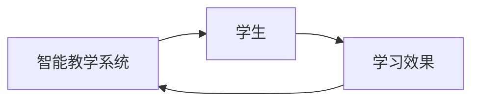

                 

## 强化学习：在教育领域中的应用

> 关键词：强化学习、教育、智能教学系统、个性化学习、人工智能

## 1. 背景介绍

在当今信息爆炸的时代，个性化学习已成为教育领域的热门话题。传统的标准化教学模式难以满足每个学生的学习需求，智能教学系统应运而生。其中，强化学习（Reinforcement Learning，RL）作为一种人工智能（Artificial Intelligence，AI）技术，在教育领域展现出巨大的应用潜力。

## 2. 核心概念与联系

强化学习是一种机器学习方法，它允许智能体（Agent）在与环境（Environment）交互的过程中学习，以最大化某个目标函数。在教育领域，智能体通常是智能教学系统，环境是学生，目标函数是学生的学习效果。



## 3. 核心算法原理 & 具体操作步骤

### 3.1 算法原理概述

强化学习算法的核心是学习智能体在给定状态下采取何种行动以最大化未来回报。在教育领域，智能教学系统需要学习在给定学生学习状态下采取何种教学行动以最大化学生的学习效果。

### 3.2 算法步骤详解

1. 状态（State）表示：学生的学习状态，如当前理解水平、学习进度等。
2. 行动（Action）选择：智能教学系统根据学生的学习状态选择教学行动，如提供何种类型的练习题、何时提供反馈等。
3. 回报（Reward）设计：学生的学习效果，如学习进度、理解水平的提高等。
4. 学习（Learning）：智能教学系统根据学生的学习效果调整教学行动，以最大化学生的学习效果。

### 3.3 算法优缺点

优点：强化学习算法可以学习个性化的教学策略，适应学生的学习需求，提高学习效果。

缺点：强化学习算法需要大量的数据和时间进行学习，且学习效果受环境的影响较大。

### 3.4 算法应用领域

强化学习在教育领域的应用包括智能教学系统、个性化学习路径规划、学习成绩预测等。

## 4. 数学模型和公式 & 详细讲解 & 举例说明

### 4.1 数学模型构建

强化学习的数学模型包括状态转移函数（State Transition Function）、回报函数（Reward Function）和策略（Policy）。

### 4.2 公式推导过程

状态转移函数：$S_{t+1} = T(S_t, A_t, \epsilon)$

回报函数：$R_t = r(S_t, A_t, S_{t+1})$

策略：$\pi(a|s) = P(A_t = a|S_t = s)$

### 4.3 案例分析与讲解

例如，在智能教学系统中，状态可以表示为学生的学习进度、理解水平等，行动可以表示为提供何种类型的练习题、何时提供反馈等，回报可以表示为学生的学习进度、理解水平的提高等。

## 5. 项目实践：代码实例和详细解释说明

### 5.1 开发环境搭建

强化学习项目需要Python环境，推荐使用Anaconda进行环境管理。常用的强化学习库包括Stable Baselines3、Keras-RL等。

### 5.2 源代码详细实现

以下是一个简单的强化学习算法Q-Learning的Python实现：

```python
import numpy as np

class QLearning:
    def __init__(self, actions, learning_rate=0.01, discount_factor=0.9, exploration_rate=1.0, exploration_decay=0.995):
        self.actions = actions
        self.learning_rate = learning_rate
        self.discount_factor = discount_factor
        self.exploration_rate = exploration_rate
        self.exploration_decay = exploration_decay
        self.q_table = {}

    def update_q_table(self, state, action, reward, next_state):
        if state not in self.q_table:
            self.q_table[state] = np.zeros(len(self.actions))
        if next_state not in self.q_table:
            self.q_table[next_state] = np.zeros(len(self.actions))
        old_value = self.q_table[state][action]
        next_max = np.max(self.q_table[next_state])
        new_value = (1 - self.learning_rate) * old_value + self.learning_rate * (reward + self.discount_factor * next_max)
        self.q_table[state][action] = new_value

    def get_action(self, state):
        if np.random.uniform(0, 1) < self.exploration_rate:
            action = np.random.choice(self.actions)
        else:
            action = np.argmax(self.q_table[state])
        self.exploration_rate *= self.exploration_decay
        return action
```

### 5.3 代码解读与分析

该代码实现了Q-Learning算法，包括更新Q表、选择行动等功能。学习率、折扣因子、探索率和探索衰减因子等参数可以根据需要进行调整。

### 5.4 运行结果展示

在智能教学系统中，可以使用该算法学习个性化的教学策略，并根据学生的学习效果调整教学行动。

## 6. 实际应用场景

### 6.1 当前应用

强化学习在教育领域的当前应用包括智能教学系统、个性化学习路径规划、学习成绩预测等。

### 6.2 未来应用展望

未来，强化学习在教育领域的应用将更加广泛，如个性化学习内容推荐、智能辅导等。

## 7. 工具和资源推荐

### 7.1 学习资源推荐

推荐阅读《强化学习：机器学习序列》一书，该书系统地介绍了强化学习的原理和算法。

### 7.2 开发工具推荐

推荐使用Python进行强化学习开发，常用的强化学习库包括Stable Baselines3、Keras-RL等。

### 7.3 相关论文推荐

推荐阅读论文《Deep Reinforcement Learning for Intelligent Tutoring Systems》等。

## 8. 总结：未来发展趋势与挑战

### 8.1 研究成果总结

强化学习在教育领域的应用取得了显著成果，如智能教学系统、个性化学习路径规划等。

### 8.2 未来发展趋势

未来，强化学习在教育领域的应用将更加广泛，如个性化学习内容推荐、智能辅导等。

### 8.3 面临的挑战

强化学习在教育领域的应用面临的挑战包括数据获取困难、算法效率等。

### 8.4 研究展望

未来的研究方向包括个性化学习内容推荐、智能辅导等。

## 9. 附录：常见问题与解答

**Q：强化学习需要大量的数据吗？**

**A：**是的，强化学习需要大量的数据进行学习。在教育领域，需要大量的学生学习数据。

**Q：强化学习的学习效果受环境的影响吗？**

**A：**是的，强化学习的学习效果受环境的影响较大。在教育领域，环境包括学生的学习状态、教学内容等。

**Q：强化学习在教育领域的应用有哪些？**

**A：**强化学习在教育领域的应用包括智能教学系统、个性化学习路径规划、学习成绩预测等。

## 作者：禅与计算机程序设计艺术 / Zen and the Art of Computer Programming

