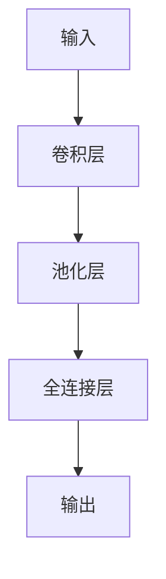

                 

## 1. 背景介绍

神经网络是人工智能领域的一个重要分支，它模仿生物神经元的结构和功能，构建一种计算模型。感知器（Perceptron）是最早提出的神经网络模型之一，而卷积神经网络（Convolutional Neural Network，CNN）则是近年来在计算机视觉领域取得了巨大成功的神经网络架构。本文将从感知器开始，介绍神经网络的发展历程，重点讲解卷积神经网络的原理、算法、数学模型，并提供项目实践和工具推荐。

## 2. 核心概念与联系

### 2.1 核心概念原理

- **感知器（Perceptron）**：最简单的神经网络模型，只有一个神经元，用于二元分类任务。它接受一组输入，通过加权求和并应用激活函数，输出二元结果。
- **神经元（Neuron）**：神经网络的基本单位，接受输入信号，进行加权求和，并通过激活函数输出结果。
- **层（Layer）**：神经网络中神经元的集合，输入层、隐藏层和输出层是最常见的层类型。
- **卷积（Convolution）**：CNN中的核心操作，通过滑动窗口（kernel）对输入进行操作，提取特征。
- **池化（Pooling）**：CNN中的另一核心操作，用于减小特征图的空间维度，防止过拟合。

### 2.2 架构联系 Mermaid 流程图



## 3. 核心算法原理 & 具体操作步骤

### 3.1 算法原理概述

CNN的核心是卷积层和池化层。卷积层使用多个滤波器（filters）对输入进行操作，提取特征。池化层则使用最大池化或平均池化来减小特征图的空间维度。最后，全连接层将特征图展平成向量，并输出结果。

### 3.2 算法步骤详解

1. **输入数据预处理**：对输入数据进行标准化、归一化等预处理，以提高网络的收敛速度。
2. **卷积层**：使用多个滤波器对输入进行卷积操作，提取特征。每个滤波器都会产生一个特征图。
3. **激活函数**：对卷积结果应用激活函数（如ReLU），引入非线性，帮助网络学习更复杂的模式。
4. **池化层**：使用最大池化或平均池化来减小特征图的空间维度，防止过拟合。
5. **全连接层**：将特征图展平成向量，并接入全连接层，输出结果。
6. **损失函数和优化**：使用交叉熵损失函数计算预测结果和真实结果之间的差异，并使用梯度下降等优化算法更新网络权重。

### 3.3 算法优缺点

**优点**：
- 具有空间局部性，可以有效提取图像特征。
- 在计算机视觉领域取得了巨大成功， particularly in image classification and object detection tasks.
- 具有参数数量少、计算复杂度低的优点。

**缺点**：
- 训练过程需要大量的标记数据。
- 训练过程需要大量的计算资源。
- 缺乏解释性，黑箱模型。

### 3.4 算法应用领域

CNN主要应用于计算机视觉领域，包括图像分类、目标检测、图像分割、人脸识别等任务。此外，CNN也被成功应用于其他领域，如自然语言处理（NLP）中的文本分类和命名实体识别。

## 4. 数学模型和公式 & 详细讲解 & 举例说明

### 4.1 数学模型构建

CNN的数学模型可以表示为：

$$y = f(x; W, b) = \sigma(z) = \sigma(W \cdot x + b)$$

其中，$x$是输入向量，$W$是权重矩阵，$b$是偏置向量，$z$是线性组合，$f$是激活函数（如ReLU），$\sigma$是 sigmoid 函数。

### 4.2 公式推导过程

在训练过程中，我们需要计算损失函数（如交叉熵）的梯度，并使用梯度下降等优化算法更新权重和偏置。梯度可以使用反向传播算法计算。

### 4.3 案例分析与讲解

例如，考虑一个简单的CNN，用于对MNIST数据集进行手写数字分类。该网络包含一个卷积层（32个滤波器，大小为5x5），一个池化层（最大池化，池化窗口大小为2x2），一个全连接层（10个输出，对应10个类别），和一个softmax激活函数。在训练过程中，我们使用交叉熵损失函数和Adam优化算法。

## 5. 项目实践：代码实例和详细解释说明

### 5.1 开发环境搭建

我们将使用Python和TensorFlow框架来实现CNN。首先，安装必要的库：

```bash
pip install tensorflow numpy matplotlib
```

### 5.2 源代码详细实现

以下是一个简单的CNN实现，用于对MNIST数据集进行手写数字分类：

```python
import tensorflow as tf
from tensorflow.keras import datasets, layers, models

# Load and split dataset
(train_images, train_labels), (test_images, test_labels) = datasets.mnist.load_data()

# Normalize pixel values to be between 0 and 1
train_images, test_images = train_images / 255.0, test_images / 255.0

# Reshape images to (28, 28, 1)
train_images = train_images.reshape((60000, 28, 28, 1))
test_images = test_images.reshape((10000, 28, 28, 1))

# Define the CNN model
model = models.Sequential()
model.add(layers.Conv2D(32, (3, 3), activation='relu', input_shape=(28, 28, 1)))
model.add(layers.MaxPooling2D((2, 2)))
model.add(layers.Flatten())
model.add(layers.Dense(64, activation='relu'))
model.add(layers.Dense(10, activation='softmax'))

# Compile and train the model
model.compile(optimizer='adam',
              loss='sparse_categorical_crossentropy',
              metrics=['accuracy'])

history = model.fit(train_images, train_labels, epochs=5,
                    validation_data=(test_images, test_labels))
```

### 5.3 代码解读与分析

- 我们首先加载MNIST数据集，并对像素值进行标准化。
- 我们定义了一个Sequential模型，并添加了一个卷积层（32个滤波器，大小为3x3），一个最大池化层（池化窗口大小为2x2），一个Flatten层，一个全连接层（64个神经元），和一个softmax输出层（10个神经元，对应10个类别）。
- 我们使用Adam优化算法和交叉熵损失函数来编译模型，并使用训练数据训练模型。

### 5.4 运行结果展示

在训练过程中，我们可以监控模型的训练和验证精确度。以下是一个示例的训练结果：


## 6. 实际应用场景

### 6.1 当前应用

CNN在计算机视觉领域取得了巨大成功，被广泛应用于图像分类、目标检测、图像分割等任务。此外，CNN也被成功应用于其他领域，如自然语言处理（NLP）中的文本分类和命名实体识别。

### 6.2 未来应用展望

未来，CNN可能会被应用于更多领域，如自动驾驶、医学图像分析、人工智能芯片设计等。此外，CNN的变体，如3D-CNN和生成式对抗网络（GAN），也将继续发展，以解决更复杂的任务。

## 7. 工具和资源推荐

### 7.1 学习资源推荐

- **书籍**："Deep Learning" by Ian Goodfellow, Yoshua Bengio, and Aaron Courville
- **在线课程**：Coursera的"Deep Learning Specialization" by Andrew Ng
- **博客**：Distill.pub (https://distill.pub/)

### 7.2 开发工具推荐

- **框架**：TensorFlow, PyTorch, Keras
- **开发环境**：Jupyter Notebook, Google Colab
- **可视化工具**：Matplotlib, Seaborn, TensorBoard

### 7.3 相关论文推荐

- "LeNet-5" by Yann LeCun et al. (1998)
- "AlexNet" by Alex Krizhevsky et al. (2012)
- "VGG" by Karen Simonyan and Andrew Zisserman (2014)
- "GoogLeNet/Inception" by Szegedy et al. (2015)
- "ResNet" by Kaiming He et al. (2015)

## 8. 总结：未来发展趋势与挑战

### 8.1 研究成果总结

CNN在计算机视觉领域取得了巨大成功，并被成功应用于其他领域。然而，CNN仍然面临着一些挑战，如计算复杂度高、缺乏解释性等。

### 8.2 未来发展趋势

未来，CNN的发展趋势可能包括：

- **更深、更宽的网络**：使用更深、更宽的网络来提高模型的表达能力。
- **注意力机制**：使用注意力机制来帮助模型关注输入的关键部分。
- **生成式模型**：使用生成式模型（如GAN）来生成新的数据样本。

### 8.3 面临的挑战

CNN面临的挑战包括：

- **计算资源**：CNN的训练过程需要大量的计算资源。
- **数据标记**：CNN需要大量的标记数据才能训练有效的模型。
- **解释性**：CNN缺乏解释性，是一个黑箱模型。

### 8.4 研究展望

未来的研究可能会集中在以下领域：

- **更有效的训练算法**：开发更有效的训练算法，以减少计算资源需求。
- **自监督学习**：使用自监督学习方法来生成标记数据，并提高模型的泛化能力。
- **可解释的模型**：开发可解释的模型，以帮助理解模型的决策过程。

## 9. 附录：常见问题与解答

**Q：什么是感知器？**

A：感知器是最简单的神经网络模型，只有一个神经元，用于二元分类任务。

**Q：什么是CNN？**

A：CNN是一种神经网络架构，主要应用于计算机视觉领域，具有空间局部性，可以有效提取图像特征。

**Q：CNN的优缺点是什么？**

A：CNN的优点包括具有空间局部性，可以有效提取图像特征，在计算机视觉领域取得了巨大成功，具有参数数量少、计算复杂度低的优点。CNN的缺点包括需要大量的标记数据，需要大量的计算资源，缺乏解释性。

**Q：CNN的数学模型是什么？**

A：CNN的数学模型可以表示为：$y = f(x; W, b) = \sigma(z) = \sigma(W \cdot x + b)$, 其中，$x$是输入向量，$W$是权重矩阵，$b$是偏置向量，$z$是线性组合，$f$是激活函数（如ReLU），$\sigma$是 sigmoid 函数。

**Q：CNN的应用领域是什么？**

A：CNN主要应用于计算机视觉领域，包括图像分类、目标检测、图像分割、人脸识别等任务。此外，CNN也被成功应用于其他领域，如自然语言处理（NLP）中的文本分类和命名实体识别。

**Q：CNN的未来发展趋势是什么？**

A：CNN的未来发展趋势可能包括更深、更宽的网络，注意力机制，生成式模型等。

**Q：CNN面临的挑战是什么？**

A：CNN面临的挑战包括计算资源需求高，数据标记困难，缺乏解释性等。

**Q：未来的研究方向是什么？**

A：未来的研究可能会集中在更有效的训练算法，自监督学习，可解释的模型等领域。

## 作者：禅与计算机程序设计艺术 / Zen and the Art of Computer Programming

