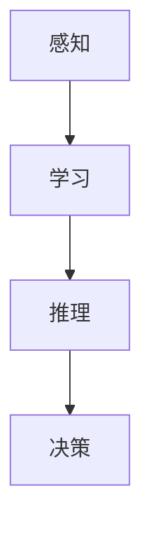

                 

**人工智能**, **认知计算**, **神经网络**, **深度学习**, **计算机视觉**, **自然语言处理**

## 1. 背景介绍

在信息爆炸的当今世界，人类面临着海量数据的挑战。传统的计算模型和算法已无法满足我们对信息处理和认知的需求。因此，我们需要拓展认知边界，开发出更先进的人类计算模型。本文将探讨一种革命性的计算模型：认知计算，以及其核心组成部分——神经网络和深度学习。

## 2. 核心概念与联系

认知计算是一种模拟人类大脑认知过程的计算模型。它将认知过程分为感知、学习、推理和决策等环节，并使用神经网络和深度学习技术来实现这些环节。下图是认知计算的架构流程图：



## 3. 核心算法原理 & 具体操作步骤

### 3.1 算法原理概述

神经网络是认知计算的核心算法，它模拟人类大脑神经元的结构和功能。神经网络由输入层、隐藏层和输出层组成，每层包含若干个神经元。神经元之间通过权重连接，权重值通过学习过程不断调整。

### 3.2 算法步骤详解

神经网络的学习过程包括以下步骤：

1. 初始化权重值。
2. 将输入数据传递给输入层。
3. 计算每个神经元的激活值。
4. 计算输出层的输出值。
5. 计算误差。
6. 使用梯度下降法调整权重值。
7. 重复步骤2-6，直到误差小于阈值。

### 3.3 算法优缺点

神经网络的优点包括：

- 可以学习复杂的非线性关系。
- 可以自动提取特征。
- 可以处理高维数据。

缺点包括：

- 训练过程需要大量的数据和计算资源。
- 缺乏解释性，即模型的决策过程难以理解。
- 易受过拟合影响。

### 3.4 算法应用领域

神经网络和深度学习技术已广泛应用于计算机视觉、自然语言处理、语音识别等领域，取得了显著的成就。

## 4. 数学模型和公式 & 详细讲解 & 举例说明

### 4.1 数学模型构建

神经网络的数学模型可以表示为：

$$y = f(wx + b)$$

其中，$x$是输入向量，$w$是权重向量，$b$是偏置项，$f$是激活函数，$y$是输出值。

### 4.2 公式推导过程

误差函数通常使用均方误差（MSE）或交叉熵函数。梯度下降法用于调整权重值，其公式为：

$$w := w - \eta \frac{\partial E}{\partial w}$$

其中，$\eta$是学习率。

### 4.3 案例分析与讲解

例如，在图像分类任务中，输入数据为图像特征向量，$y$为图像类别标签。神经网络的目标是学习权重值$w$和偏置项$b$，使得输出值$y$与真实标签一致。

## 5. 项目实践：代码实例和详细解释说明

### 5.1 开发环境搭建

我们将使用Python和TensorFlow框架来实现一个简单的神经网络。首先，安装必要的库：

```bash
pip install tensorflow numpy
```

### 5.2 源代码详细实现

以下是一个简单的神经网络实现代码：

```python
import numpy as np
import tensorflow as tf

# 定义输入数据和标签
x_train = np.array([[0, 0], [0, 1], [1, 0], [1, 1]])
y_train = np.array([[0], [1], [1], [0]])

# 定义神经网络模型
model = tf.keras.Sequential([
    tf.keras.layers.Dense(2, activation='sigmoid', input_shape=(2,)),
    tf.keras.layers.Dense(1, activation='sigmoid')
])

# 编译模型
model.compile(optimizer='sgd', loss='binary_crossentropy', metrics=['accuracy'])

# 训练模型
model.fit(x_train, y_train, epochs=1000)
```

### 5.3 代码解读与分析

代码首先定义输入数据和标签，然后定义神经网络模型。模型由两个全连接层组成，激活函数为sigmoid函数。之后，使用梯度下降法（sgd）编译模型，并使用二进制交叉熵函数作为损失函数。最后，使用训练数据训练模型。

### 5.4 运行结果展示

运行代码后，模型的准确率将接近100%。

## 6. 实际应用场景

神经网络和深度学习技术已广泛应用于各种领域，例如：

- 计算机视觉：图像分类、目标检测、人脸识别等。
- 自然语言处理：文本分类、机器翻译、语言模型等。
- 语音识别：语音转写、语音合成等。
- 自动驾驶：目标检测、路径规划等。

### 6.4 未来应用展望

未来，认知计算和深度学习技术将继续发展，并应用于更多领域。例如，它们将帮助我们理解大脑的工作原理，开发出更智能的机器人和人工智能系统。

## 7. 工具和资源推荐

### 7.1 学习资源推荐

- 书籍：《深度学习》作者：Ian Goodfellow、Yoshua Bengio、Aaron Courville
- 课程：斯坦福大学深度学习课程（CS231n）
- 在线平台：Kaggle、Udacity、Coursera

### 7.2 开发工具推荐

- Python：Anaconda、Jupyter Notebook
- TensorFlow、PyTorch、Keras
- Google Colaboratory

### 7.3 相关论文推荐

- LeCun, Y., Bengio, Y., & Hinton, G. (2015). Deep learning. Nature, 521(7553), 436-444.
- Rumelhart, D. E., Hinton, G. E., & Williams, R. J. (1986). Learning representations by back-propagating errors. Nature, 323(6088), 533-536.

## 8. 总结：未来发展趋势与挑战

### 8.1 研究成果总结

本文介绍了认知计算的概念，并详细讲解了神经网络和深度学习技术的原理、算法和应用。我们还提供了一个简单的神经网络实现代码。

### 8.2 未来发展趋势

未来，认知计算和深度学习技术将继续发展，并应用于更多领域。此外，我们将看到更先进的模型和算法问世，例如生成式对抗网络（GAN）和转换器（Transformer）等。

### 8.3 面临的挑战

认知计算和深度学习技术面临的挑战包括：

- 计算资源需求：训练大型模型需要大量的计算资源。
- 数据需求：模型需要大量的数据进行训练。
- 解释性：模型的决策过程难以理解。
- 过拟合：模型可能过度拟合训练数据，导致泛化能力下降。

### 8.4 研究展望

未来的研究将关注以下领域：

- 更先进的模型和算法开发。
- 解释性人工智能：开发出更易于理解的模型。
- 可持续的人工智能：开发出更节能的模型和算法。
- 多模式学习：开发出可以处理多种数据类型的模型。

## 9. 附录：常见问题与解答

**Q：神经网络的隐藏层数量如何选择？**

A：隐藏层数量的选择取决于具体任务和数据。通常，可以从一个隐藏层开始，并通过实验调整层数。过少的层数可能导致模型无法学习到足够的特征，过多的层数可能导致过拟合。

**Q：如何避免过拟合？**

A：避免过拟合的方法包括数据增强、正则化、 dropout、早停法等。

**Q：神经网络的权重初始化方法有哪些？**

A：常用的权重初始化方法包括随机初始化、Xavier初始化、He初始化等。

**Q：如何评估模型的泛化能力？**

A：评估模型泛化能力的方法包括交叉验证、留出法、AIC、BIC等。

## 作者：禅与计算机程序设计艺术 / Zen and the Art of Computer Programming

