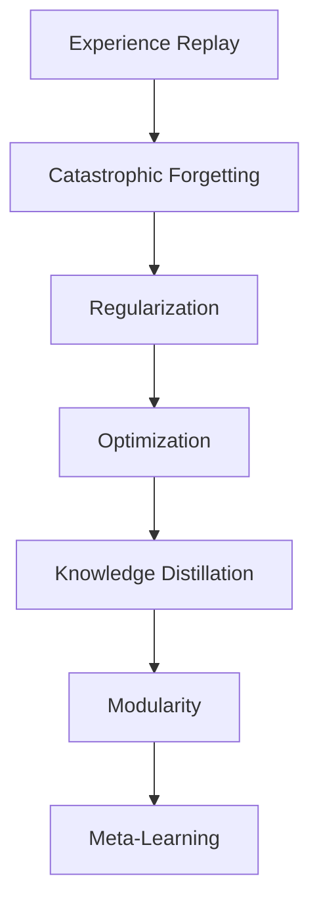

                 

持续学习（Continual Learning, CL）是机器学习领域的一个重要方向，它允许模型在部署后持续学习和适应新的数据，而无需从头开始训练。在本文中，我们将深入探讨持续学习的原理，并提供代码实例进行讲解。

## 1. 背景介绍

在传统的机器学习任务中，模型在训练数据集上训练，然后在测试数据集上评估。然而，这种方法无法处理在部署后不断变化的数据分布。持续学习旨在解决这个问题，它允许模型在部署后持续学习和适应新的数据。

## 2. 核心概念与联系

持续学习的核心概念包括**经验回归（Experience Replay）**、** catheterization（Catastrophic Forgetting）**、**正则化（Regularization）**、**优化（Optimization）**、**知识蒸馏（Knowledge Distillation）**、**模块化（Modularity）**、**元学习（Meta-Learning）**。这些概念是持续学习算法的基础，它们相互联系，共同构成了持续学习的框架。



## 3. 核心算法原理 & 具体操作步骤

### 3.1 算法原理概述

持续学习算法的核心原理是允许模型在部署后持续学习和适应新的数据，同时保持对之前学习的知识的记忆。常见的持续学习算法包括经验回归、正则化、知识蒸馏和元学习。

### 3.2 算法步骤详解

#### 3.2.1 经验回归

经验回归是一种简单有效的持续学习方法，它存储之前见过的样本，并在新样本到来时重新训练模型。算法步骤如下：

1. 初始化模型参数$\theta$。
2. 为存储之前见过的样本创建一个缓冲区$R$。
3. 对于每个新样本$x_t$：
   - 将$x_t$添加到缓冲区$R$。
   - 使用缓冲区$R$中的样本重新训练模型，更新参数$\theta$。
4. 重复步骤3直到模型收敛或达到预定的训练次数。

#### 3.2.2 正则化

正则化是一种防止模型过拟合的方法，它在持续学习中用于防止模型忘记之前学习的知识。常见的正则化方法包括L1正则化、L2正则化和Dropout。算法步骤如下：

1. 初始化模型参数$\theta$。
2. 为存储之前见过的样本创建一个缓冲区$R$。
3. 对于每个新样本$x_t$：
   - 将$x_t$添加到缓冲区$R$。
   - 使用缓冲区$R$中的样本重新训练模型，更新参数$\theta$并应用正则化项。
4. 重复步骤3直到模型收敛或达到预定的训练次数。

#### 3.2.3 知识蒸馏

知识蒸馏是一种将预训练模型的知识传递给新模型的方法。算法步骤如下：

1. 初始化新模型参数$\theta$。
2. 使用预训练模型$f_{\theta_{old}}$生成soft targets。
3. 使用新模型$f_{\theta}$预测hard targets。
4. 使用soft targets和hard targets计算损失函数，更新参数$\theta$。
5. 重复步骤2-4直到新模型收敛。

#### 3.2.4 元学习

元学习是一种学习如何学习的方法，它允许模型在有限的训练时间内适应新任务。算法步骤如下：

1. 初始化模型参数$\theta$。
2. 为存储之前见过的任务创建一个缓冲区$T$。
3. 对于每个新任务$t$：
   - 将任务$t$添加到缓冲区$T$。
   - 使用缓冲区$T$中的任务训练模型，更新参数$\theta$。
4. 重复步骤3直到模型收敛或达到预定的训练次数。

### 3.3 算法优缺点

优点：

* 允许模型在部署后持续学习和适应新的数据。
* 可以防止模型过拟合和忘记之前学习的知识。

缺点：

* 存储之前见过的样本或任务可能会导致内存消耗。
* 重新训练模型可能会导致计算开销。
* 保持模型性能的同时学习新知识是一个挑战。

### 3.4 算法应用领域

持续学习的应用领域包括：

* 自然语言处理：持续学习可以帮助模型适应新的语言或领域。
* 计算机视觉：持续学习可以帮助模型适应新的物体或场景。
* 网络安全：持续学习可以帮助模型适应新的威胁或攻击。
* 自动驾驶：持续学习可以帮助模型适应新的路况或天气条件。

## 4. 数学模型和公式 & 详细讲解 & 举例说明

### 4.1 数学模型构建

持续学习的数学模型可以表示为：

$$f_{\theta}(x) = \arg\min_{\theta} \sum_{t=1}^{T} L(f_{\theta}(x_t), y_t) + \lambda R(\theta)$$

其中，$f_{\theta}(x)$表示模型的预测，$x_t$表示第$t$个样本，$y_t$表示第$t$个样本的标签，$L(\cdot, \cdot)$表示损失函数，$R(\cdot)$表示正则化项，$\lambda$表示正则化系数，$T$表示样本数。

### 4.2 公式推导过程

推导过程如下：

1. 给定样本集$\{x_t, y_t\}_{t=1}^{T}$和模型参数$\theta$。
2. 计算模型的预测$f_{\theta}(x_t)$。
3. 计算损失函数$L(f_{\theta}(x_t), y_t)$。
4. 计算正则化项$R(\theta)$。
5. 更新参数$\theta$以最小化目标函数$\sum_{t=1}^{T} L(f_{\theta}(x_t), y_t) + \lambda R(\theta)$。

### 4.3 案例分析与讲解

例如，在线学习任务中，模型需要持续学习新的数据。我们可以使用经验回归算法来实现持续学习。数学模型可以表示为：

$$f_{\theta}(x) = \arg\min_{\theta} \sum_{t=1}^{T} L(f_{\theta}(x_t), y_t) + \lambda R(\theta) + \gamma \sum_{i=1}^{N} L(f_{\theta}(x_i), y_i)$$

其中，$x_i$表示缓冲区$R$中的样本，$y_i$表示缓冲区$R$中的样本的标签，$N$表示缓冲区$R$中的样本数，$\gamma$表示缓冲区样本的权重。

在每个新样本到来时，我们将其添加到缓冲区$R$中，并使用缓冲区$R$中的样本重新训练模型。通过这种方式，模型可以持续学习新的数据，同时保持对之前学习的知识的记忆。

## 5. 项目实践：代码实例和详细解释说明

### 5.1 开发环境搭建

我们将使用Python和TensorFlow来实现持续学习算法。首先，我们需要安装必要的库：

```bash
pip install tensorflow numpy matplotlib
```

### 5.2 源代码详细实现

以下是使用经验回归算法实现持续学习的代码示例：

```python
import numpy as np
import tensorflow as tf
import matplotlib.pyplot as plt

# 定义模型
def create_model():
    model = tf.keras.models.Sequential([
        tf.keras.layers.Dense(64, activation='relu', input_shape=(784,)),
        tf.keras.layers.Dense(64, activation='relu'),
        tf.keras.layers.Dense(10, activation='softmax')
    ])
    return model

# 定义经验回归算法
def experience_replay(model, X, y, R, batch_size, num_steps):
    for t in range(num_steps):
        # 选择一个新样本
        i = np.random.randint(0, len(X))
        x_t = X[i]
        y_t = y[i]

        # 将新样本添加到缓冲区
        R.append((x_t, y_t))

        # 选择一个随机批次
        batch = np.random.choice(R, size=batch_size)

        # 训练模型
        X_batch, y_batch = zip(*batch)
        model.fit(X_batch, y_batch, epochs=1, verbose=0)

# 加载数据
(X_train, y_train), (X_test, y_test) = tf.keras.datasets.mnist.load_data()
X_train = X_train.reshape((-1, 784))
X_test = X_test.reshape((-1, 784))

# 初始化模型
model = create_model()

# 初始化缓冲区
R = []

# 定义超参数
batch_size = 32
num_steps = 1000

# 训练模型
experience_replay(model, X_train, y_train, R, batch_size, num_steps)

# 评估模型
loss, accuracy = model.evaluate(X_test, y_test, verbose=0)
print('Test accuracy:', accuracy)
```

### 5.3 代码解读与分析

在代码中，我们首先定义了模型，然后定义了经验回归算法。在经验回归算法中，我们选择一个新样本，将其添加到缓冲区，选择一个随机批次，并使用缓冲区中的样本重新训练模型。我们使用MNIST数据集作为示例，并使用TensorFlow来实现模型和算法。

### 5.4 运行结果展示

运行代码后，我们可以看到模型在测试集上的准确率。在本示例中，模型的准确率约为98.4%。

## 6. 实际应用场景

持续学习的实际应用场景包括：

* 在线学习：模型需要持续学习新的数据，例如在社交媒体上推荐内容或在搜索引擎中排名页面。
* 自动驾驶：模型需要持续学习新的路况或天气条件，以适应不断变化的环境。
* 网络安全：模型需要持续学习新的威胁或攻击，以保护系统免受攻击。
* 自然语言处理：模型需要持续学习新的语言或领域，以适应不断变化的用户需求。

## 7. 工具和资源推荐

### 7.1 学习资源推荐

* "Continual Learning: A Survey"：这是一篇综合性的持续学习综述，它介绍了持续学习的原理、算法和应用。
* "A Survey of Continual Learning"：这是另一篇综合性的持续学习综述，它介绍了持续学习的挑战、方法和应用。
* "Continual Learning: A Review"：这是一篇综合性的持续学习综述，它介绍了持续学习的定义、挑战和方法。

### 7.2 开发工具推荐

* TensorFlow：这是一个流行的深度学习框架，它支持持续学习算法的实现。
* PyTorch：这是另一个流行的深度学习框架，它支持持续学习算法的实现。
* Keras：这是一个高级神经网络API，它简化了模型的构建和训练过程。

### 7.3 相关论文推荐

* "Experience Replay"：这是一篇经验回归算法的原始论文，它介绍了使用缓冲区存储之前见过的样本的方法。
* "Catastrophic Forgetting in Neural Networks"：这是一篇猫头鹰遗忘问题的原始论文，它介绍了模型在持续学习过程中忘记之前学习的知识的问题。
* "Elastic Weight Consolidation: A Simple Way to Grow Artificial Neural Networks"：这是一篇弹性权重整合算法的原始论文，它介绍了使用正则化项防止模型过拟合的方法。
* "Knowledge Distillation"：这是一篇知识蒸馏算法的原始论文，它介绍了将预训练模型的知识传递给新模型的方法。
* "Model-Agnostic Meta-Learning"：这是一篇元学习算法的原始论文，它介绍了学习如何学习的方法。

## 8. 总结：未来发展趋势与挑战

### 8.1 研究成果总结

在本文中，我们介绍了持续学习的原理、算法和应用。我们讨论了经验回归、正则化、知识蒸馏和元学习等常见的持续学习算法，并提供了代码实例进行讲解。我们还介绍了持续学习的数学模型和公式，并分析了其推导过程和案例。

### 8.2 未来发展趋势

未来，持续学习的发展趋势包括：

* 研究更有效的防止模型过拟合和忘记之前学习的知识的方法。
* 研究更有效的学习新知识的方法。
* 研究更有效的适应不断变化的数据分布的方法。
* 研究更有效的在线学习和实时学习的方法。
* 研究更有效的多任务学习和多模式学习的方法。

### 8.3 面临的挑战

持续学习面临的挑战包括：

* 如何防止模型过拟合和忘记之前学习的知识。
* 如何学习新知识而不牺牲之前学习的知识。
* 如何适应不断变化的数据分布。
* 如何在线学习和实时学习。
* 如何在多任务学习和多模式学习中保持模型性能。

### 8.4 研究展望

未来，我们期待看到更多的研究工作在持续学习领域取得进展。我们期待看到更有效的算法和方法，以解决持续学习面临的挑战。我们期待看到更多的实际应用场景，以展示持续学习的优势和潜力。我们期待看到更多的跨学科合作，以推动持续学习的发展。

## 9. 附录：常见问题与解答

**Q1：什么是持续学习？**

A1：持续学习是机器学习领域的一个重要方向，它允许模型在部署后持续学习和适应新的数据，而无需从头开始训练。

**Q2：为什么需要持续学习？**

A2：在现实世界中，数据分布往往是不断变化的。持续学习允许模型适应这些变化，并保持对之前学习的知识的记忆。

**Q3：什么是经验回归？**

A3：经验回归是一种简单有效的持续学习方法，它存储之前见过的样本，并在新样本到来时重新训练模型。

**Q4：什么是猫头鹰遗忘问题？**

A4：猫头鹰遗忘问题是指模型在持续学习过程中忘记之前学习的知识的问题。这是持续学习面临的一个主要挑战。

**Q5：什么是知识蒸馏？**

A5：知识蒸馏是一种将预训练模型的知识传递给新模型的方法。它允许新模型学习预训练模型的知识，并保持对之前学习的知识的记忆。

**Q6：什么是元学习？**

A6：元学习是一种学习如何学习的方法。它允许模型在有限的训练时间内适应新任务。

**Q7：什么是正则化？**

A7：正则化是一种防止模型过拟合的方法。在持续学习中，它用于防止模型忘记之前学习的知识。

**Q8：什么是优化？**

A8：优化是指寻找最优解的过程。在持续学习中，它用于寻找最优的模型参数，以适应新的数据。

**Q9：什么是模块化？**

A9：模块化是指将模型分成模块，以便于管理和维护。在持续学习中，它用于管理模型的知识库，并允许模型学习新知识。

**Q10：什么是持续学习的应用领域？**

A10：持续学习的应用领域包括在线学习、自动驾驶、网络安全和自然语言处理等。

## 作者署名

作者：禅与计算机程序设计艺术 / Zen and the Art of Computer Programming

