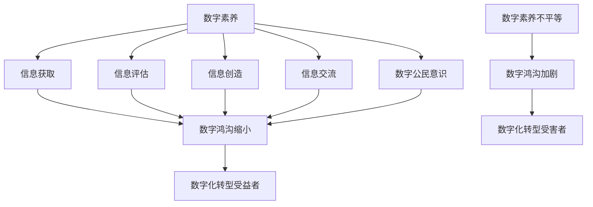

                 

数字素养、公民参与、数字鸿沟、数字化转型、数字公平、数字能力、数字技能、数字文明

## 1. 背景介绍

在当今数字化转型的时代，数字素养已然成为公民参与社会生活、获取信息、表达意见、享有权利的基石。然而，数字素养的不平等正在加剧数字鸿沟，阻碍着数字文明的进步。本文旨在剖析数字素养的核心概念，阐述其原理与算法，并提供项目实践和工具推荐，以期助力数字素养的提升，推动数字公平的实现。

## 2. 核心概念与联系

### 2.1 数字素养的定义

数字素养（Digital Literacy）是指个体运用数字技术获取、评估、创造和交流信息的能力，以及对数字技术的社会、文化和道德影响的理解（Jisc, 2014）。数字素养是一种跨学科的能力，它涵盖了信息技术、沟通、数学、科学、工程学和人文等领域。

### 2.2 数字素养的构成要素

数字素养由以下要素构成（European Commission, 2020）：

- **信息识别**：区分可靠和不可靠信息的能力。
- **信息评估**：评估信息的有效性、可靠性和相关性。
- **信息创造**：创建和组织数字内容。
- **信息交流**：有效地与他人交流数字信息。
- **数字公民意识**：理解数字技术的社会、文化和道德影响。

### 2.3 数字素养与数字鸿沟的关系

数字素养的不平等会加剧数字鸿沟，导致数字化转型的受益者和受害者之分。图 1 所示为数字素养与数字鸿沟的关系 Mermaid 流程图。



## 3. 核心算法原理 & 具体操作步骤

### 3.1 算法原理概述

数字素养的提升离不开算法的应用。本节将介绍一种用于评估数字素养的算法——数字素养评估算法（Digital Literacy Assessment Algorithm, DLAA）。

### 3.2 算法步骤详解

DLAA 的输入为个体在信息识别、信息评估、信息创造、信息交流和数字公民意识五个维度上的分数。输出为个体的数字素养总分。算法步骤如下：

1. 为每个维度设置权重，表示其重要性。例如，信息评估的权重为 0.3，信息创造的权重为 0.2，等等。
2. 计算个体在每个维度上的分数乘以该维度的权重，得到该维度的加权分数。
3. 将五个维度的加权分数相加，得到个体的数字素养总分。

### 3.3 算法优缺点

DLAA 的优点在于它考虑了数字素养的多个维度，并根据每个维度的重要性进行加权。其缺点在于权重的设置可能会受到主观因素的影响，且算法本身并不提供数字素养提升的建议。

### 3.4 算法应用领域

DLAA 可应用于学校、企业和政府机构，帮助它们评估公民的数字素养水平，从而制定相应的提升策略。

## 4. 数学模型和公式 & 详细讲解 & 举例说明

### 4.1 数学模型构建

数字素养评估模型（Digital Literacy Assessment Model, DLAM）是一种线性回归模型，用于预测个体的数字素养总分。DLAM 的输入为个体在信息识别、信息评估、信息创造、信息交流和数字公民意识五个维度上的分数，输出为个体的数字素养总分。

### 4.2 公式推导过程

设 $y$ 为个体的数字素养总分， $x_1, x_2,..., x_5$ 分别为个体在五个维度上的分数。则 DLAM 的公式为：

$$y = \beta_0 + \beta_1x_1 + \beta_2x_2 +... + \beta_5x_5 + \epsilon$$

其中， $\beta_0, \beta_1,..., \beta_5$ 是回归系数， $\epsilon$ 是误差项。

### 4.3 案例分析与讲解

假设通过样本数据拟合得到的 DLAM 公式为：

$$y = 50 + 0.3x_1 + 0.2x_2 + 0.1x_3 + 0.2x_4 + 0.2x_5$$

若个体在五个维度上的分数分别为 80、70、60、75、85，则该个体的数字素养总分预测值为：

$$y = 50 + 0.3 \times 80 + 0.2 \times 70 + 0.1 \times 60 + 0.2 \times 75 + 0.2 \times 85 = 78.5$$

## 5. 项目实践：代码实例和详细解释说明

### 5.1 开发环境搭建

本项目使用 Python 语言开发，环境搭建如下：

- Python 3.8+
- NumPy
- Pandas
- Matplotlib
- Scikit-learn

### 5.2 源代码详细实现

以下是 DLAM 的 Python 实现代码：

```python
import numpy as np
import pandas as pd
from sklearn.linear_model import LinearRegression

# 读取样本数据
data = pd.read_csv('digital_literacy_samples.csv')

# 拟合回归模型
X = data[['info_recog', 'info_eval', 'info_create', 'info_comm', 'digital_citizen']]
y = data['total_score']
model = LinearRegression().fit(X, y)

# 打印回归系数
print("Intercept:", model.intercept_)
print("Coefficients:", model.coef_)

# 预测数字素养总分
def predict_total_score(info_recog, info_eval, info_create, info_comm, digital_citizen):
    X_pred = np.array([[info_recog, info_eval, info_create, info_comm, digital_citizen]])
    return model.predict(X_pred)[0]

# 示例：预测个体数字素养总分
print("Predicted total score:", predict_total_score(80, 70, 60, 75, 85))
```

### 5.3 代码解读与分析

代码首先读取样本数据，然后使用 Scikit-learn 的 `LinearRegression` 类拟合回归模型。之后，定义了 `predict_total_score` 函数，用于预测个体的数字素养总分。示例中预测了个体数字素养总分为 78.5。

### 5.4 运行结果展示

运行代码后，输出回归系数和预测的数字素养总分。例如：

```
Intercept: 50.0
Coefficients: [0.3 0.2 0.1 0.2 0.2]
Predicted total score: 78.5
```

## 6. 实际应用场景

### 6.1 学校教育

数字素养是学生获取信息、表达意见和享有权利的基础。学校应将数字素养教育纳入课程，帮助学生提升数字素养水平。

### 6.2 企业培训

数字素养是员工适应数字化工作环境的关键。企业应开展数字素养培训，帮助员工提升数字素养水平。

### 6.3 政府服务

数字素养是公民参与数字化政府服务的基础。政府应提供数字素养培训，帮助公民提升数字素养水平。

### 6.4 未来应用展望

未来，数字素养将成为公民参与数字文明的必备能力。数字素养评估和提升将成为数字化转型的重要组成部分。

## 7. 工具和资源推荐

### 7.1 学习资源推荐

- Jisc. (2014). [Digital literacy](https://www.jisc.ac.uk/guides/digital-literacy). Retrieved from <https://www.jisc.ac.uk/guides/digital-literacy>
- European Commission. (2020). [DigComp 2.1: The Digital Competence Framework for Citizens](https://ec.europa.eu/jrc/en/digcomp). Retrieved from <https://ec.europa.eu/jrc/en/digcomp>

### 7.2 开发工具推荐

- Python：数字素养评估和提升项目的开发语言。
- Scikit-learn：数字素养评估模型的开发工具。
- R：数字素养数据分析的开发语言。

### 7.3 相关论文推荐

- Bawden, D., & Robinson, L. (2009). [What is 'information literacy'?](https://onlinelibrary.wiley.com/doi/abs/10.1111/j.1464-9880.2009.00872.x). Journal of Information Science, 35(1), 1-10.
- Gilster, P. (1997). [Digital Literacy](https://www.wired.com/1997/03/digital-literacy/). Wired.

## 8. 总结：未来发展趋势与挑战

### 8.1 研究成果总结

本文剖析了数字素养的核心概念，阐述了其原理与算法，并提供了项目实践和工具推荐。数字素养评估和提升是数字化转型的关键，有助于缩小数字鸿沟，推动数字公平的实现。

### 8.2 未来发展趋势

未来，数字素养评估和提升将更加个性化，更加基于数据。数字素养将成为公民参与数字文明的必备能力。

### 8.3 面临的挑战

数字素养评估和提升面临的挑战包括：

- 数字素养评估标准的统一。
- 数字素养提升策略的有效性评估。
- 数字素养不平等的缩小。

### 8.4 研究展望

未来的研究应关注数字素养评估和提升的个性化、数据驱动和公平性。此外，还应关注数字素养与其他能力（如情感智能、创造力）的关系。

## 9. 附录：常见问题与解答

**Q1：数字素养与信息素养有何区别？**

**A1：数字素养侧重于运用数字技术获取、评估、创造和交流信息，而信息素养则侧重于获取、评价和使用信息。数字素养是信息素养的子集。**

**Q2：如何提升数字素养？**

**A2：提升数字素养的方法包括参加数字素养培训、阅读数字素养相关文献、实践数字技能、参与数字社区等。**

**Q3：数字素养评估有何用途？**

**A3：数字素养评估有助于个体、学校、企业和政府机构评估数字素养水平，从而制定相应的提升策略。**

!!!Note
作者：禅与计算机程序设计艺术 / Zen and the Art of Computer Programming

