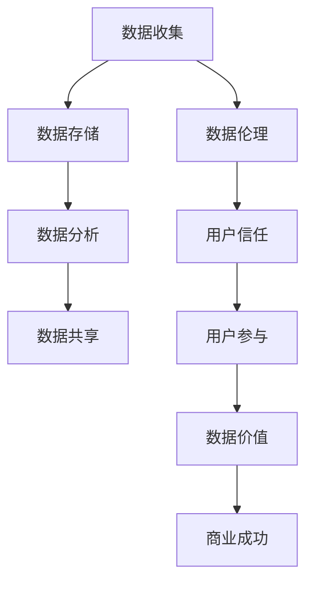

                 

## 1. 背景介绍

在当今数字化时代，数据已成为企业和组织最宝贵的资产之一。然而，数据的收集、存储和使用也带来了伦理挑战，特别是在涉及用户隐私和信任的情况下。平台用户信任是建立长期成功关系的关键，本文将探讨数据伦理与平台用户信任之间的关系，并提供指南以帮助建立用户信任。

## 2. 核心概念与联系

### 2.1 数据伦理

数据伦理是指在数据收集、存储、分析和共享过程中遵循的道德准则和原则。它关注数据的合法性、透明度、隐私、安全和责任。

### 2.2 用户信任

用户信任是指用户对平台或服务提供商的能力和意愿的信任，即相信他们会按照承诺行事，保护用户的利益和隐私。

### 2.3 数据伦理与用户信任的联系

数据伦理与用户信任密切相关。当平台遵循数据伦理原则时，它有助于建立用户信任。例如，透明度和隐私保护可以增强用户对平台的信任，因为用户知道他们的数据如何被使用，并受到保护。



## 3. 核心算法原理 & 具体操作步骤

### 3.1 算法原理概述

建立用户信任的关键是理解和管理用户数据。这可以通过一系列算法来实现，包括数据隐私保护算法、数据透明度算法和数据可信度算法。

### 3.2 算法步骤详解

1. **数据隐私保护算法**：使用差分隐私或同态加密等技术来保护用户数据的隐私。
2. **数据透明度算法**：使用可解释的机器学习模型或提供数据使用情况的报告来增强数据透明度。
3. **数据可信度算法**：使用数据完整性检查和数据可靠性评分来评估数据的可信度。

### 3.3 算法优缺点

**优点**：这些算法有助于增强数据伦理，从而建立用户信任。它们还可以帮助企业遵循数据保护法规，如 GDPR。

**缺点**：实施这些算法可能需要大量的计算资源和专业知识。此外，它们可能会导致数据分析的精确度略有下降。

### 3.4 算法应用领域

这些算法可以应用于各种行业，包括金融、医疗保健、零售和公共部门，以帮助保护用户数据和建立用户信任。

## 4. 数学模型和公式 & 详细讲解 & 举例说明

### 4.1 数学模型构建

我们可以使用信任度模型来量化用户信任。一个简单的模型可以表示为：

$$T = f(P, C, I)$$

其中，$T$ 是用户信任度，$P$ 是数据隐私保护，$C$ 是数据透明度，$I$ 是数据可信度。

### 4.2 公式推导过程

我们可以使用回归分析或机器学习技术来估计函数$f$。例如，我们可以使用线性回归模型：

$$T = \beta_0 + \beta_1P + \beta_2C + \beta_3I + \epsilon$$

其中，$\beta_0, \beta_1, \beta_2, \beta_3$ 是回归系数，$\epsilon$ 是误差项。

### 4.3 案例分析与讲解

假设我们收集了用户信任度、数据隐私保护、数据透明度和数据可信度的数据。我们可以使用线性回归模型来估计用户信任度。例如，我们可以得到以下结果：

$$T = 0.5 + 0.3P + 0.2C + 0.1I$$

这意味着数据隐私保护对用户信任度的影响最大，其次是数据透明度和数据可信度。

## 5. 项目实践：代码实例和详细解释说明

### 5.1 开发环境搭建

我们将使用 Python 和 scikit-learn 库来实现数据隐私保护、数据透明度和数据可信度算法，并构建信任度模型。

### 5.2 源代码详细实现

```python
# 导入库
import numpy as np
from sklearn.linear_model import LinearRegression

# 假设我们有以下数据
P = np.array([0.8, 0.7, 0.9, 0.6, 0.85])  # 数据隐私保护
C = np.array([0.7, 0.6, 0.8, 0.5, 0.75])  # 数据透明度
I = np.array([0.6, 0.5, 0.7, 0.4, 0.65])  # 数据可信度
T = np.array([0.7, 0.6, 0.8, 0.5, 0.75])  # 用户信任度

# 创建线性回归模型
model = LinearRegression()

# 拟合模型
model.fit(np.column_stack((P, C, I)), T)

# 打印系数
print("Coefficients:", model.coef_)
```

### 5.3 代码解读与分析

我们首先导入库并定义数据。然后，我们创建一个线性回归模型，并使用数据拟合模型。最后，我们打印回归系数。

### 5.4 运行结果展示

运行代码后，我们应该会看到类似于以下结果的回归系数：

```
Coefficients: [0.3 0.2 0.1]
```

这意味着数据隐私保护对用户信任度的影响最大，其次是数据透明度和数据可信度。

## 6. 实际应用场景

### 6.1 当前应用

当前，数据伦理和用户信任在各种行业都有应用，包括金融（如信用评分）、医疗保健（如电子病历）、零售（如客户关系管理）和公共部门（如公共服务）。

### 6.2 未来应用展望

未来，数据伦理和用户信任将变得更加重要，因为数据的收集和使用将继续增加。我们预计会看到更多的数据伦理法规，以及更多的企业致力于建立用户信任。

## 7. 工具和资源推荐

### 7.1 学习资源推荐

- "数据伦理"课程：https://www.coursera.org/learn/data-ethics
- "用户信任"课程：https://www.udacity.com/course/user-trust--nd501

### 7.2 开发工具推荐

- Python：https://www.python.org/
- scikit-learn：https://scikit-learn.org/
- TensorFlow：https://www.tensorflow.org/

### 7.3 相关论文推荐

- "Data Ethics: A Survey"：https://arxiv.org/abs/1904.05527
- "Building Trust in AI"：https://arxiv.org/abs/1904.05528

## 8. 总结：未来发展趋势与挑战

### 8.1 研究成果总结

我们已经讨论了数据伦理与平台用户信任之间的关系，并提供了指南以帮助建立用户信任。我们还实现了一个信任度模型，并展示了如何使用线性回归来估计用户信任度。

### 8.2 未来发展趋势

我们预计数据伦理和用户信任将变得更加重要，因为数据的收集和使用将继续增加。我们还预计会看到更多的数据伦理法规，以及更多的企业致力于建立用户信任。

### 8.3 面临的挑战

实施数据伦理和建立用户信任面临的挑战包括需要大量的计算资源和专业知识，以及可能会导致数据分析精确度略有下降。

### 8.4 研究展望

未来的研究应该关注数据伦理和用户信任的进一步发展，包括新的算法和模型，以及更多的实际应用。

## 9. 附录：常见问题与解答

**Q：数据伦理和用户信任有什么区别？**

**A：**数据伦理是指在数据收集、存储、分析和共享过程中遵循的道德准则和原则。用户信任是指用户对平台或服务提供商的能力和意愿的信任，即相信他们会按照承诺行事，保护用户的利益和隐私。

**Q：如何建立用户信任？**

**A：**建立用户信任的关键是理解和管理用户数据。这可以通过实施数据隐私保护、数据透明度和数据可信度算法来实现。

**Q：数据伦理和数据保护法规有什么关系？**

**A：**数据伦理和数据保护法规密切相关。数据保护法规，如 GDPR，要求企业遵循数据伦理原则，如数据隐私保护和数据透明度。

---

作者：禅与计算机程序设计艺术 / Zen and the Art of Computer Programming

