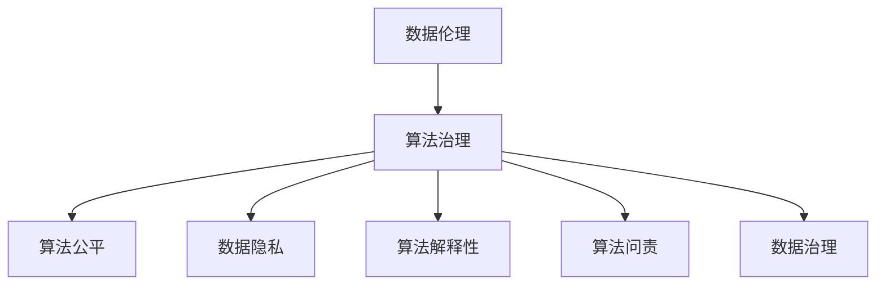

                 

- 数据伦理
- 算法治理
- 算法公平
- 数据隐私
- 算法解释性
- 算法问责
- 数据治理

## 1. 背景介绍

在大数据和人工智能时代，算法无处不在，从搜索引擎到自动驾驶，从金融风控到司法判决，算法已深入我们的生活和社会治理的方方面面。然而，算法并非中立，它们反映了设计者的偏见，并可能导致不公平、侵犯隐私和缺乏解释性等问题。因此，数据伦理、算法治理与规范成为当前亟待解决的关键挑战。

## 2. 核心概念与联系

### 2.1 数据伦理

数据伦理是指在收集、存储、处理和使用数据时，应遵循的道德准则和原则。它关注数据的合法性、透明度、问责制和对个人的尊重。

### 2.2 算法治理

算法治理是指对算法系统的设计、开发、部署和使用进行监管和控制，以确保其公平、透明、问责和有效。它包括算法的开发过程、测试、评估和审计。

### 2.3 算法公平

算法公平是指算法系统对不同群体的影响应是公平的，不应导致系统性的偏见或歧视。它包括代表性偏见、算法偏见和结果偏见等方面。

### 2.4 数据隐私

数据隐私是指个人数据的保护，包括数据收集、存储、处理和共享的合法性和透明度。它包括个人可识别信息（PII）的保护和匿名化技术。

### 2.5 算法解释性

算法解释性是指算法系统应能够解释其决策过程，使得用户和决策者能够理解和信任算法系统。它包括可解释性算法和解释性技术的开发。

### 2.6 算法问责

算法问责是指对算法系统的决策和影响负责，包括设计者、开发者和部署者的责任。它包括问责制机制的设计和实施。

### 2.7 数据治理

数据治理是指对数据生命周期的管理，包括数据收集、存储、处理、共享和删除。它包括数据质量、数据安全和数据合规性的管理。

这些概念密切相关，数据伦理是算法治理的基础，算法公平、数据隐私、算法解释性和算法问责是算法治理的关键维度，数据治理则是数据生命周期的管理。



## 3. 核心算法原理 & 具体操作步骤

### 3.1 算法原理概述

算法治理和数据伦理涉及多种算法和技术，包括偏见检测算法、公平性评估算法、数据匿名化算法、可解释性算法和问责制机制等。

### 3.2 算法步骤详解

#### 3.2.1 偏见检测算法

偏见检测算法旨在识别算法系统中的偏见。常用的偏见检测方法包括：

1. 代表性偏见检测：比较训练数据集和目标群体的统计特征。
2. 算法偏见检测：比较算法系统对不同群体的响应。
3. 结果偏见检测：比较算法系统的输出对不同群体的影响。

#### 3.2.2 公平性评估算法

公平性评估算法旨在量化算法系统的公平性。常用的公平性评估指标包括：

1. 统计平等：比较不同群体的机会平等。
2. 结果平等：比较不同群体的结果平等。
3. 机会公平：比较不同群体的机会平等和结果平等。

#### 3.2.3 数据匿名化算法

数据匿名化算法旨在保护个人隐私，常用的数据匿名化技术包括：

1. 删除敏感属性：从数据集中删除个人可识别信息。
2.  generalization：将敏感属性的值聚合为更宽泛的类别。
3. 扰动：添加噪声以隐藏个人可识别信息。

#### 3.2.4 可解释性算法

可解释性算法旨在使算法系统的决策过程更易于理解。常用的可解释性技术包括：

1. LIME：本地解释方法，用于解释单个预测的决策过程。
2. SHAP：SHapley Additive exPlanations，用于解释单个预测的决策过程。
3. 可视化：使用可视化工具展示算法系统的决策过程。

#### 3.2.5 问责制机制

问责制机制旨在对算法系统的决策和影响负责。常用的问责制机制包括：

1. 审计：对算法系统的决策过程进行审计。
2. 问责制报告：定期发布问责制报告，描述算法系统的决策过程和影响。
3. 问责制机构：设立问责制机构，监督算法系统的决策过程和影响。

### 3.3 算法优缺点

优点：

* 算法治理和数据伦理有助于提高算法系统的公平性、透明度和问责制。
* 它们有助于保护个人隐私和数据安全。
* 它们有助于建立信任，使得用户和决策者更容易接受和信任算法系统。

缺点：

* 算法治理和数据伦理的实施可能会增加成本和复杂性。
* 它们可能会限制算法系统的性能和准确性。
* 它们可能会导致新的偏见和不公平。

### 3.4 算法应用领域

算法治理和数据伦理适用于各种领域，包括：

* 金融：风险评估、信贷决策和反洗钱等。
* 司法：预测性警务、判决支持系统和监狱管理等。
* 雇用：招聘决策和人力资源管理等。
* 社交媒体：内容推荐和用户互动等。

## 4. 数学模型和公式 & 详细讲解 & 举例说明

### 4.1 数学模型构建

数学模型是算法治理和数据伦理的基础。常用的数学模型包括：

* 偏见检测模型：用于检测算法系统中的偏见。
* 公平性评估模型：用于量化算法系统的公平性。
* 数据匿名化模型：用于保护个人隐私。
* 可解释性模型：用于解释算法系统的决策过程。
* 问责制模型：用于对算法系统的决策和影响负责。

### 4.2 公式推导过程

例如，统计平等是公平性评估指标之一，其公式为：

$$Disparity = \frac{\max_{s \in S} |P(s|Y=1) - P(s|Y=0)|}{0.5}$$

其中，$S$是保护属性的取值集，$P(s|Y=1)$是正面结果的条件概率，$P(s|Y=0)$是负面结果的条件概率。该公式计算保护属性的最大条件概率差异，并将其标准化为[0,1]之间。

### 4.3 案例分析与讲解

例如，考虑一个信贷决策系统，该系统使用借款者的年龄、性别、收入和信用历史来预测违约风险。我们可以使用统计平等公式来评估该系统的公平性：

$$Disparity = \frac{\max_{s \in S} |P(s|Y=1) - P(s|Y=0)|}{0.5} = \frac{|P(male|Y=1) - P(male|Y=0)| + |P(female|Y=1) - P(female|Y=0)|}{2}$$

其中，$S$是性别的取值集，$P(male|Y=1)$是男性借款者的条件概率，$P(male|Y=0)$是女性借款者的条件概率。如果该系统对男性和女性借款者的条件概率差异很小，则该系统是公平的。

## 5. 项目实践：代码实例和详细解释说明

### 5.1 开发环境搭建

我们将使用Python和常用的数据科学库（如Pandas、NumPy、Scikit-learn）来实现偏见检测算法。我们还将使用Matplotlib和Seaborn进行可视化。

### 5.2 源代码详细实现

```python
import pandas as pd
import numpy as np
from sklearn.model_selection import train_test_split
from sklearn.linear_model import LogisticRegression
from sklearn.metrics import confusion_matrix
import matplotlib.pyplot as plt
import seaborn as sns

# 加载数据集
data = pd.read_csv('credit_data.csv')

# 分割数据集
X = data[['age', 'income', 'loan_amount']]
y = data['default']
X_train, X_test, y_train, y_test = train_test_split(X, y, test_size=0.2, random_state=42)

# 训练模型
model = LogisticRegression()
model.fit(X_train, y_train)

# 预测结果
y_pred = model.predict(X_test)

# 计算混淆矩阵
cm = confusion_matrix(y_test, y_pred)

# 可视化混淆矩阵
sns.heatmap(cm, annot=True, fmt='d', cmap='Blues')
plt.xlabel('Predicted')
plt.ylabel('True')
plt.show()
```

### 5.3 代码解读与分析

该代码实现了一个简单的信贷决策系统。它首先加载数据集，然后分割数据集为训练集和测试集。它然后训练一个逻辑回归模型，并使用测试集进行预测。它计算混淆矩阵，并使用Seaborn绘制混淆矩阵。

### 5.4 运行结果展示

运行该代码将生成一个混淆矩阵，显示预测结果和真实结果。混淆矩阵可用于评估模型的性能和公平性。

## 6. 实际应用场景

### 6.1 算法治理

算法治理适用于各种领域，包括金融、司法、雇用和社交媒体等。例如，金融机构可以使用偏见检测算法来检测信贷决策系统中的偏见，并使用公平性评估算法来评估系统的公平性。司法部门可以使用预测性警务系统来预测犯罪活动，并使用问责制机制来监督系统的决策过程。

### 6.2 数据伦理

数据伦理适用于各种领域，包括金融、医疗、零售和社交媒体等。例如，金融机构可以使用数据匿名化算法来保护客户隐私，并使用可解释性算法来解释信贷决策过程。医疗机构可以使用数据治理机制来管理患者数据，并使用问责制机制来监督数据的使用。

### 6.3 未来应用展望

未来，算法治理和数据伦理将变得越来越重要。随着算法系统的广泛应用，公平性、透明度和问责制将成为关键挑战。数据伦理将成为数据管理的核心，数据治理将成为数据生命周期的关键维度。算法治理和数据伦理将成为算法系统设计和部署的标准实践。

## 7. 工具和资源推荐

### 7.1 学习资源推荐

* "Fairness, Accountability, and Transparency in Machine Learning" by S. Barocas, A. Kleinberg, and M. Raghavan
* "Weapons of Math Destruction" by C. O'Neil
* "Automating Inequality" by V. Eubanks

### 7.2 开发工具推荐

* Python：常用的数据科学库（如Pandas、NumPy、Scikit-learn）
* R：常用的数据科学库（如dplyr、ggplot2、caret）
* TensorFlow：用于构建和部署机器学习模型的开源平台
* IBM Watson：提供一系列人工智能和数据分析服务的平台

### 7.3 相关论文推荐

* "Bias in Human Decision Making" by A. Kleinberg, M. Mullainathan, and S. Raghavan
* "Fairness Definitions and Their Politics" by S. Barocas, A. Kleinberg, and M. Raghavan
* "Equality of Opportunity in Supervised Learning" by F. Hardt, E. Price, and A. Srebro

## 8. 总结：未来发展趋势与挑战

### 8.1 研究成果总结

算法治理和数据伦理是当前亟待解决的关键挑战。本文介绍了算法治理和数据伦理的核心概念、算法原理和数学模型，并提供了项目实践和实际应用场景。我们还推荐了学习资源、开发工具和相关论文。

### 8.2 未来发展趋势

未来，算法治理和数据伦理将变得越来越重要。随着算法系统的广泛应用，公平性、透明度和问责制将成为关键挑战。数据伦理将成为数据管理的核心，数据治理将成为数据生命周期的关键维度。算法治理和数据伦理将成为算法系统设计和部署的标准实践。

### 8.3 面临的挑战

然而，算法治理和数据伦理面临着许多挑战。这些挑战包括：

* 算法治理和数据伦理的实施可能会增加成本和复杂性。
* 它们可能会限制算法系统的性能和准确性。
* 它们可能会导致新的偏见和不公平。
* 它们需要跨学科合作，涉及计算机科学、统计学、伦理学和法学等领域。

### 8.4 研究展望

未来的研究将需要解决这些挑战，并开发新的算法和技术来提高算法系统的公平性、透明度和问责制。此外，未来的研究还需要开发新的伦理框架和政策，以指导算法系统的设计和部署。

## 9. 附录：常见问题与解答

### 9.1 问：算法治理和数据伦理有什么区别？

答：算法治理和数据伦理是密切相关的概念，但它们有所不同。算法治理关注算法系统的设计、开发、部署和使用，以确保其公平、透明、问责和有效。数据伦理则关注数据的收集、存储、处理和使用，以确保其合法性、透明度、问责制和对个人的尊重。

### 9.2 问：算法治理和数据伦理为什么重要？

答：算法治理和数据伦理之所以重要，是因为算法系统和数据管理在我们的生活和社会治理中无处不在。它们反映了设计者的偏见，并可能导致不公平、侵犯隐私和缺乏解释性等问题。算法治理和数据伦理有助于提高算法系统和数据管理的公平性、透明度和问责制，从而建立信任，保护个人隐私和数据安全。

### 9.3 问：如何实施算法治理和数据伦理？

答：实施算法治理和数据伦理需要跨学科合作，涉及计算机科学、统计学、伦理学和法学等领域。它需要开发新的算法和技术，以提高算法系统的公平性、透明度和问责制。它还需要开发新的伦理框架和政策，以指导算法系统和数据管理的设计和部署。此外，它需要问责制机制，以监督算法系统和数据管理的决策过程和影响。

!!!Note
作者：禅与计算机程序设计艺术 / Zen and the Art of Computer Programming

