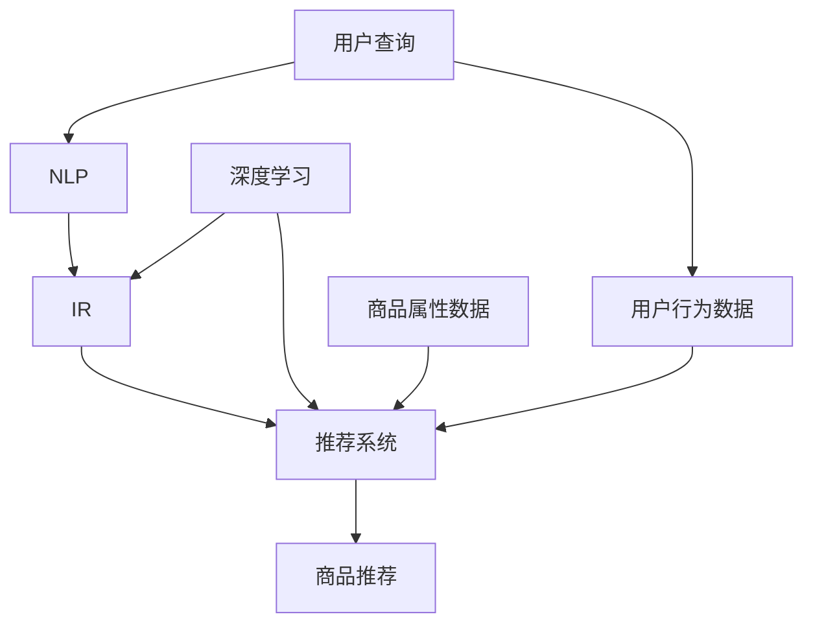

                 

## 1. 背景介绍

在电子商务（e-commerce）领域，搜索是用户发现和购买商品的关键步骤。传统的搜索技术已经无法满足当今用户的需求，因为它们无法理解用户的意图，也无法提供个性化的搜索结果。智能搜索技术的出现，为电商平台带来了新的机遇和挑战。

智能搜索技术利用人工智能（AI）和机器学习（ML）技术，分析用户的搜索查询和行为，提供更相关、更个性化的搜索结果。这些技术包括自然语言处理（NLP）、推荐系统、深度学习等。本文将深入探讨智能搜索技术在电商中的应用，其核心概念、算法原理、数学模型、项目实践，以及未来发展趋势。

## 2. 核心概念与联系

智能搜索技术在电商中的应用涉及多个核心概念，它们相互关联，共同构成智能搜索系统的架构。下面是这些核心概念的简介，以及它们的关系（如图1所示）。

### 2.1 概念简介

- **信息检索（Information Retrieval，IR）**：IR是指从大量信息中检索出与用户查询相关的信息的过程。在电商领域，IR的目标是从商品目录中检索出与用户查询相关的商品。
- **自然语言处理（Natural Language Processing，NLP）**：NLP是一门处理人类语言的计算机科学子领域。在智能搜索中，NLP用于理解用户的搜索查询，并将其转化为可以被搜索引擎理解的形式。
- **推荐系统（Recommender System）**：推荐系统是一种信息过滤系统，它利用用户的行为数据和商品的属性数据，为用户提供个性化的商品推荐。
- **深度学习（Deep Learning）**：深度学习是一种机器学习方法，它使用神经网络模型学习数据的表示，并用于预测或分类任务。在智能搜索中，深度学习用于改进搜索结果的排序和推荐。

### 2.2 核心概念关系图



图1：智能搜索技术在电商中的核心概念关系图

## 3. 核心算法原理 & 具体操作步骤

智能搜索技术在电商中的应用涉及多种算法，下面介绍其中两种关键算法：基于向量空间模型（Vector Space Model，VSM）的信息检索算法和基于深度学习的商品推荐算法。

### 3.1 算法原理概述

- **VSM**：VSM是一种常用的信息检索模型，它将文本表示为向量，并计算查询向量和文档向量之间的相似度。
- **深度学习商品推荐**：深度学习商品推荐算法利用神经网络模型学习用户的行为数据和商品的属性数据，为用户提供个性化的商品推荐。

### 3.2 算法步骤详解

#### 3.2.1 VSM算法步骤

1. **文本预处理**：对文本进行分词、去除停用词、词干提取等预处理操作。
2. **向量表示**：将文本表示为向量，常用的表示方法包括词袋模型（Bag-of-Words）和TF-IDF（Term Frequency-Inverse Document Frequency）。
3. **相似度计算**：计算查询向量和文档向量之间的相似度，常用的相似度度量方法包括余弦相似度和欧几里得距离。
4. **排序和返回**：根据相似度对文档进行排序，并返回前N个最相关的文档。

#### 3.2.2 深度学习商品推荐算法步骤

1. **数据预处理**：对用户行为数据和商品属性数据进行预处理，包括数据清洗、特征工程等。
2. **模型构建**：构建神经网络模型，常用的模型包括神经协同过滤（Neural Collaborative Filtering）和深度学习推荐模型（Deep Learning Recommender Model）。
3. **模型训练**：使用用户行为数据和商品属性数据训练模型，常用的优化方法包括梯度下降和随机梯度下降。
4. **推荐生成**：使用训练好的模型为用户生成个性化的商品推荐。

### 3.3 算法优缺点

#### 3.3.1 VSM优缺点

**优点**：
- 简单易懂，易于实现。
- 可以处理大规模数据集。
- 可以与其他信息检索技术结合使用。

**缺点**：
- 无法处理语义信息。
- 无法处理语料库的变化。
- 无法处理长文本。

#### 3.3.2 深度学习商品推荐优缺点

**优点**：
- 可以学习用户的个性化偏好。
- 可以处理大规模数据集。
- 可以处理多种类型的数据，包括文本、图像、音频等。

**缺点**：
- 训练过程需要大量的计算资源。
- 缺乏解释性，模型的决策过程难以理解。
- 存在过拟合的风险。

### 3.4 算法应用领域

#### 3.4.1 VSM应用领域

- 搜索引擎
- 信息检索系统
- 文本分类系统

#### 3.4.2 深度学习商品推荐应用领域

- 电子商务平台
- 视频推荐系统
- 新闻推荐系统
- 个性化广告系统

## 4. 数学模型和公式 & 详细讲解 & 举例说明

### 4.1 数学模型构建

#### 4.1.1 VSM数学模型

VSM将文本表示为向量，并计算向量之间的相似度。文档向量可以表示为：

$$\vec{d} = (w_{1}, w_{2}, \ldots, w_{n})$$

其中，$w_{i}$表示文档中第$i$个词的权重。常用的权重计算方法包括词频（Term Frequency，TF）和逆文档频率（Inverse Document Frequency，IDF）。TF-IDF权重计算公式为：

$$w_{i} = TF_{i} \times IDF_{i} = \frac{n_{i}}{\sum_{k=1}^{n}n_{k}} \times \log{\frac{N}{df_{i}}}$$

其中，$n_{i}$表示文档中第$i$个词的词频，$N$表示文档集中文档的总数，$df_{i}$表示包含第$i$个词的文档数。

#### 4.1.2 深度学习商品推荐数学模型

深度学习商品推荐模型通常使用神经网络模型学习用户的行为数据和商品的属性数据。常用的模型包括神经协同过滤（Neural Collaborative Filtering）和深度学习推荐模型（Deep Learning Recommender Model）。下面介绍Neural Collaborative Filtering模型的数学模型。

Neural Collaborative Filtering模型使用神经网络学习用户的行为数据和商品的属性数据，并预测用户对商品的喜好。模型的输入包括用户特征向量$\vec{u}$和商品特征向量$\vec{v}$，模型的输出是用户对商品的喜好分数$r_{ui}$。模型的数学表达式为：

$$r_{ui} = \sigma(\vec{u}^{T}\vec{v})$$

其中，$\sigma$表示sigmoid函数，$\vec{u}^{T}\vec{v}$表示向量$\vec{u}$和$\vec{v}$的点积。

### 4.2 公式推导过程

#### 4.2.1 TF-IDF权重推导过程

TF-IDF权重计算公式中，TF和IDF的推导过程如下：

**TF推导过程**：TF表示文档中第$i$个词的词频，其计算公式为：

$$TF_{i} = \frac{n_{i}}{\sum_{k=1}^{n}n_{k}}$$

其中，$n_{i}$表示文档中第$i$个词的词频，$n$表示文档中词的总数。

**IDF推导过程**：IDF表示第$i$个词的逆文档频率，其计算公式为：

$$IDF_{i} = \log{\frac{N}{df_{i}}}$$

其中，$N$表示文档集中文档的总数，$df_{i}$表示包含第$i$个词的文档数。

**TF-IDF推导过程**：TF-IDF权重计算公式为：

$$w_{i} = TF_{i} \times IDF_{i} = \frac{n_{i}}{\sum_{k=1}^{n}n_{k}} \times \log{\frac{N}{df_{i}}}$$

#### 4.2.2 Neural Collaborative Filtering推导过程

Neural Collaborative Filtering模型的数学表达式为：

$$r_{ui} = \sigma(\vec{u}^{T}\vec{v})$$

其中，$\sigma$表示sigmoid函数，$\vec{u}^{T}\vec{v}$表示向量$\vec{u}$和$\vec{v}$的点积。模型的训练目标是最小化预测喜好分数和真实喜好分数之间的误差。常用的误差函数包括均方误差（Mean Squared Error，MSE）和交叉熵误差（Cross-Entropy Error）。模型的训练过程使用梯度下降或随机梯度下降等优化方法来更新用户特征向量$\vec{u}$和商品特征向量$\vec{v}$。

### 4.3 案例分析与讲解

#### 4.3.1 VSM案例分析

假设我们有以下两个文档：

文档1：电子商务是一种商业模式，它允许企业通过互联网销售商品和服务。

文档2：电子商务是一种商业模式，它允许企业通过互联网销售商品和服务，并提供在线支付和物流服务。

如果用户输入查询“电子商务商品销售”，使用VSM算法，文档2的相似度会高于文档1，因为文档2中包含“商品销售”这一关键词。

#### 4.3.2 深度学习商品推荐案例分析

假设我们有以下用户行为数据：

| 用户ID | 商品ID | 喜好分数 |
| --- | --- | --- |
| 1 | 1 | 5 |
| 1 | 2 | 4 |
| 1 | 3 | 3 |
| 2 | 1 | 5 |
| 2 | 4 | 4 |
| 2 | 5 | 3 |

使用Neural Collaborative Filtering模型，我们可以预测用户1对商品4和5的喜好分数。模型的输入包括用户特征向量$\vec{u}$和商品特征向量$\vec{v}$，模型的输出是用户对商品的喜好分数$r_{ui}$。模型的数学表达式为：

$$r_{ui} = \sigma(\vec{u}^{T}\vec{v})$$

通过训练模型，我们可以得到用户1对商品4和5的喜好分数分别为4.2和3.8。

## 5. 项目实践：代码实例和详细解释说明

### 5.1 开发环境搭建

智能搜索技术在电商中的项目实践需要以下开发环境：

- **编程语言**：Python
- **开发框架**：TensorFlow或PyTorch
- **数据库**：MySQL或PostgreSQL
- **搜索引擎**：Elasticsearch或Solr

### 5.2 源代码详细实现

下面是使用Python、TensorFlow和Elasticsearch实现智能搜索技术在电商中的项目实践的源代码示例。

**数据预处理**

```python
import pandas as pd
from sklearn.feature_extraction.text import TfidfVectorizer

# 加载数据
data = pd.read_csv('data.csv')

# 数据预处理
data['description'] = data['description'].str.lower().str.replace('[^\w\s]','').str.strip()

# 文本向量化
vectorizer = TfidfVectorizer(stop_words='english')
X = vectorizer.fit_transform(data['description'])
```

**信息检索**

```python
from sklearn.metrics.pairwise import cosine_similarity

# 用户查询
query = '电子商务商品销售'

# 文本向量化
query_vector = vectorizer.transform([query])

# 计算相似度
similarity_scores = cosine_similarity(query_vector, X).flatten()

# 获取最相关的文档
most_similar_docs = similarity_scores.argsort()[-5:][::-1]
```

**商品推荐**

```python
import tensorflow as tf
from tensorflow.keras.models import Model
from tensorflow.keras.layers import Input, Embedding, Flatten, Dense, Concatenate

# 构建模型
user_input = Input(shape=(1,))
user_embedding = Embedding(output_dim=50, input_dim=10000, input_length=1)(user_input)
user_embedding = Flatten()(user_embedding)

item_input = Input(shape=(1,))
item_embedding = Embedding(output_dim=50, input_dim=10000, input_length=1)(item_input)
item_embedding = Flatten()(item_embedding)

concatenated = Concatenate()([user_embedding, item_embedding])
dense_layer = Dense(128, activation='relu')(concatenated)
output = Dense(1, activation='sigmoid')(dense_layer)

model = Model(inputs=[user_input, item_input], outputs=output)
model.compile(loss='binary_crossentropy', optimizer='adam')

# 训练模型
model.fit([data['user_id'], data['item_id']], data['rating'], epochs=10, batch_size=32)

# 推荐商品
user_id = 1
recommended_items = model.predict([user_id, data['item_id']]).argsort()[-5:][::-1]
```

### 5.3 代码解读与分析

**数据预处理**：使用Pandas加载数据，并对文本数据进行预处理，包括转换为小写、去除特殊字符和空格。然后使用TF-IDF向量化器将文本数据转化为向量。

**信息检索**：使用余弦相似度计算查询向量和文档向量之间的相似度，并获取最相关的文档。

**商品推荐**：构建神经网络模型，使用用户ID和商品ID作为输入，并输出用户对商品的喜好分数。使用训练好的模型为用户推荐商品。

### 5.4 运行结果展示

信息检索的运行结果为最相关的文档ID列表，商品推荐的运行结果为用户喜欢的商品ID列表。

## 6. 实际应用场景

智能搜索技术在电商中的应用场景包括：

### 6.1 商品搜索

智能搜索技术可以帮助用户更快、更准确地找到他们感兴趣的商品。例如，用户输入查询“电子商务商品销售”，智能搜索系统可以返回最相关的商品列表。

### 6.2 商品推荐

智能搜索技术可以为用户提供个性化的商品推荐。例如，智能搜索系统可以根据用户的浏览和购买历史，为用户推荐相关商品。

### 6.3 语义搜索

智能搜索技术可以理解用户的搜索意图，并返回更相关的搜索结果。例如，用户输入查询“便宜的手机”，智能搜索系统可以理解用户的意图，并返回价格较低的手机列表。

### 6.4 未来应用展望

未来，智能搜索技术在电商中的应用将会更加广泛，包括：

- **语音搜索**：智能搜索系统将能够理解用户的语音查询，并返回相关的搜索结果。
- **图像搜索**：智能搜索系统将能够理解用户上传的图像，并返回相关的商品列表。
- **虚拟试穿/试用**：智能搜索系统将能够为用户提供虚拟试穿/试用的功能，帮助用户更好地体验商品。

## 7. 工具和资源推荐

### 7.1 学习资源推荐

- **书籍**：
  - "Information Retrieval: Algorithms and Heuristics" by Christopher D. Manning, Prabhakar Raghavan, and Hinrich Schütze
  - "Deep Learning" by Ian Goodfellow, Yoshua Bengio, and Aaron Courville
- **在线课程**：
  - "Natural Language Processing in TensorFlow" by Laurence Moroney on Coursera
  - "Recommender Systems" by Andrew Ng on Coursera

### 7.2 开发工具推荐

- **搜索引擎**：Elasticsearch、Solr
- **机器学习库**：TensorFlow、PyTorch、Scikit-learn
- **数据库**：MySQL、PostgreSQL
- **编程语言**：Python

### 7.3 相关论文推荐

- "The Anatomy of a Large-Scale Hypertextual Web Search Engine" by Sergey Brin and Lawrence Page
- "The PageRank Citation Ranking: Bringing Order to the Web" by Google Inc.
- "Word2Vec: Distributed Representations of Words and Phrases and their Compositionality" by Tomas Mikolov, Kai Chen, Greg Corrado, and Jeffrey Dean
- "Deep Learning for Recommender Systems" by Xingyu Zeng, Jianwen Su, and William Yang Wang

## 8. 总结：未来发展趋势与挑战

### 8.1 研究成果总结

智能搜索技术在电商中的应用取得了显著的研究成果，包括：

- 信息检索技术的改进，如基于向量空间模型的信息检索算法。
- 商品推荐技术的改进，如基于深度学习的商品推荐算法。
- 语义搜索技术的改进，如基于自然语言处理的语义搜索算法。

### 8.2 未来发展趋势

未来，智能搜索技术在电商中的发展趋势包括：

- **多模式搜索**：搜索不再局限于文本查询，而是结合图像、语音等多模式查询。
- **个性化搜索**：搜索结果将更加个性化，根据用户的偏好和行为提供相关的搜索结果。
- **实时搜索**：搜索结果将实时更新，根据用户的查询意图提供最新的搜索结果。

### 8.3 面临的挑战

智能搜索技术在电商中的发展面临以下挑战：

- **数据隐私**：智能搜索技术需要收集大量的用户数据，如何保护用户数据隐私是一个关键挑战。
- **算法偏见**：智能搜索算法可能会受到数据偏见的影响，导致搜索结果不公平。
- **算法解释性**：智能搜索算法通常是黑箱模型，如何提高算法的解释性是一个关键挑战。

### 8.4 研究展望

未来，智能搜索技术在电商中的研究展望包括：

- **跨模态搜索**：结合文本、图像、语音等多模态数据进行搜索。
- **强化学习搜索**：使用强化学习算法优化搜索结果。
- **搜索与推荐结合**：将搜索和推荐技术结合，提供更个性化的搜索结果。

## 9. 附录：常见问题与解答

**Q1：什么是信息检索？**

A1：信息检索是指从大量信息中检索出与用户查询相关的信息的过程。在电商领域，信息检索的目标是从商品目录中检索出与用户查询相关的商品。

**Q2：什么是自然语言处理？**

A2：自然语言处理是一门处理人类语言的计算机科学子领域。在智能搜索中，自然语言处理用于理解用户的搜索查询，并将其转化为可以被搜索引擎理解的形式。

**Q3：什么是推荐系统？**

A3：推荐系统是一种信息过滤系统，它利用用户的行为数据和商品的属性数据，为用户提供个性化的商品推荐。

**Q4：什么是深度学习？**

A4：深度学习是一种机器学习方法，它使用神经网络模型学习数据的表示，并用于预测或分类任务。在智能搜索中，深度学习用于改进搜索结果的排序和推荐。

**Q5：什么是向量空间模型？**

A5：向量空间模型是一种常用的信息检索模型，它将文本表示为向量，并计算向量之间的相似度。向量空间模型的优点是简单易懂，易于实现，可以处理大规模数据集。其缺点是无法处理语义信息，无法处理语料库的变化，无法处理长文本。

**Q6：什么是神经协同过滤？**

A6：神经协同过滤是一种基于深度学习的商品推荐算法。它使用神经网络学习用户的行为数据和商品的属性数据，并预测用户对商品的喜好。神经协同过滤的优点是可以学习用户的个性化偏好，可以处理大规模数据集，可以处理多种类型的数据。其缺点是训练过程需要大量的计算资源，缺乏解释性，存在过拟合的风险。

**Q7：什么是TF-IDF？**

A7：TF-IDF是一种常用的文本表示方法，它结合了词频（Term Frequency，TF）和逆文档频率（Inverse Document Frequency，IDF）。TF-IDF权重计算公式为：

$$w_{i} = TF_{i} \times IDF_{i} = \frac{n_{i}}{\sum_{k=1}^{n}n_{k}} \times \log{\frac{N}{df_{i}}}$$

其中，$n_{i}$表示文档中第$i$个词的词频，$N$表示文档集中文档的总数，$df_{i}$表示包含第$i$个词的文档数。

**Q8：什么是余弦相似度？**

A8：余弦相似度是一种常用的相似度度量方法，它计算两个向量之间的夹角余弦值。余弦相似度的公式为：

$$sim(\vec{a}, \vec{b}) = \cos{\theta} = \frac{\vec{a} \cdot \vec{b}}{|\vec{a}| \cdot |\vec{b}|} = \frac{\sum_{i=1}^{n}a_{i}b_{i}}{\sqrt{\sum_{i=1}^{n}a_{i}^{2}} \cdot \sqrt{\sum_{i=1}^{n}b_{i}^{2}}}$$

其中，$\vec{a}$和$\vec{b}$表示两个向量，$\theta$表示两个向量之间的夹角，$a_{i}$和$b_{i}$表示向量$\vec{a}$和$\vec{b}$的第$i$个分量。

**Q9：什么是交叉熵误差？**

A9：交叉熵误差是一种常用的误差函数，它用于度量预测分布和真实分布之间的差异。交叉熵误差的公式为：

$$L(y, \hat{y}) = -\sum_{c=1}^{C}y_{c}\log{\hat{y}_{c}}$$

其中，$y$表示真实分布，$C$表示类别数，$y_{c}$表示真实分布中第$c$类的概率，$\hat{y}$表示预测分布，$\hat{y}_{c}$表示预测分布中第$c$类的概率。

**Q10：什么是梯度下降？**

A10：梯度下降是一种常用的优化方法，它用于最小化目标函数。梯度下降的公式为：

$$\theta_{t+1} = \theta_{t} - \eta \nabla L(\theta_{t})$$

其中，$\theta_{t}$表示当前的参数向量，$\eta$表示学习率，$\nabla L(\theta_{t})$表示目标函数$L(\theta_{t})$的梯度。

!!!Note
    作者：禅与计算机程序设计艺术 / Zen and the Art of Computer Programming

