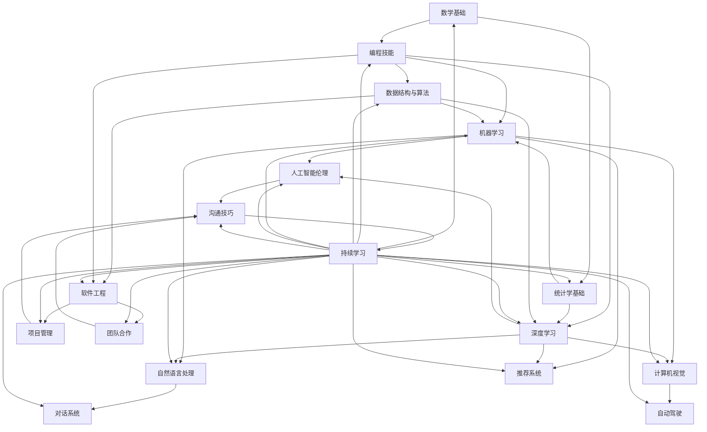

                 

## 1. 背景介绍

在人工智能（AI）迅速发展的今天，AI技术已经渗透到各行各业，为我们的生活和工作带来了巨大的变化。随着AI技术的不断进步，AI职场也在不断演变，对从业人员的技能要求也在不断提高。那么，什么样的技能是制胜AI职场的关键呢？本文将从20个核心技能的角度，为您揭示制胜AI职场的秘诀。

## 2. 核心概念与联系

在深入讨论制胜AI职场的20个核心技能之前，我们先来看一下这些技能之间的关系。下面是这些技能的关系图，使用Mermaid语法绘制：



从图中可以看出，数学基础、编程技能和统计学基础是制胜AI职场的基础技能。数据结构与算法、机器学习和深度学习是AI技术的核心技能。自然语言处理、计算机视觉、对话系统和自动驾驶是AI技术的应用领域。推荐系统和人工智能伦理是AI技术的关注点。软件工程、项目管理和团队合作是AI项目成功的保障。沟通技巧和持续学习是制胜AI职场的软技能。

## 3. 核心算法原理 & 具体操作步骤

### 3.1 算法原理概述

在AI技术的核心技能中，数据结构与算法、机器学习和深度学习是最为关键的部分。下面，我们将从算法的角度，对这三个技能进行简要的介绍。

* 数据结构与算法：数据结构是用于存储和组织数据的结构，算法则是解决问题的步骤。数据结构与算法是计算机科学的基础，也是AI技术的基础。
* 机器学习：机器学习是一种从数据中学习的方法，它允许计算机从数据中自动提取模式，并利用这些模式进行预测或决策。机器学习包括监督学习、无监督学习和强化学习三种类型。
* 深度学习：深度学习是一种机器学习方法，它使用神经网络模型来学习数据的表示。深度学习模型通常由多个隐藏层组成，每个隐藏层都会学习数据的不同表示。

### 3.2 算法步骤详解

下面，我们将以机器学习为例，详细介绍一下监督学习算法的步骤：

1. 数据收集：收集包含输入特征和输出标签的数据集。
2. 数据预处理：对数据进行清洗、缺失值填充、特征工程等预处理操作。
3. 模型选择：选择适合数据集的机器学习模型，如线性回归、逻辑回归、决策树、随机森林等。
4. 模型训练：使用训练集对模型进行训练，调整模型的超参数。
5. 模型评估：使用验证集对模型进行评估，计算模型的指标，如精确度、召回率、F1分数等。
6. 模型优化：根据评估结果，对模型进行优化，如调整超参数、使用正则化等。
7. 模型部署：将训练好的模型部署到生产环境中，进行预测或决策。

### 3.3 算法优缺点

每种算法都有其优缺点，下面我们来看一下机器学习和深度学习的优缺点：

* 机器学习：
	+ 优点：通用性强，可以适用于各种数据集，易于理解和解释。
	+ 缺点：对特征工程依赖性强，模型复杂度高，易于过拟合。
* 深度学习：
	+ 优点：可以自动学习特征，模型表达能力强，可以处理复杂的数据。
	+ 缺点：训练时间长，计算资源需求高，易于过拟合，模型解释性差。

### 3.4 算法应用领域

机器学习和深度学习在各个领域都有广泛的应用，下面我们来看一下它们的应用领域：

* 机器学习：
	+ 图像分类、目标检测、人脸识别等计算机视觉任务。
	+ 文本分类、命名实体识别、机器翻译等自然语言处理任务。
	+ 预测分析、推荐系统、风险评估等金融任务。
	+ 病情预测、药物发现、基因组学等生物医学任务。
* 深度学习：
	+ 图像分类、目标检测、人脸识别等计算机视觉任务。
	+ 文本分类、命名实体识别、机器翻译等自然语言处理任务。
	+ 自动驾驶、机器人控制等控制任务。
	+ 语音识别、语音合成等语音处理任务。
	+ 语义分割、图像超分辨率等图像处理任务。

## 4. 数学模型和公式 & 详细讲解 & 举例说明

### 4.1 数学模型构建

在机器学习中，数学模型是用于表示数据和学习规律的数学函数。下面，我们来看一下线性回归模型的数学表示：

$$y = \beta_0 + \beta_1x_1 + \beta_2x_2 + \ldots + \beta_nx_n + \epsilon$$

其中，$y$是输出变量，$x_1, x_2, \ldots, x_n$是输入特征，$\beta_0, \beta_1, \ldots, \beta_n$是模型参数，$\epsilon$是误差项。

### 4.2 公式推导过程

在机器学习中，模型参数通常使用梯度下降法进行优化。下面，我们来看一下梯度下降法的推导过程：

1. 定义目标函数：$J(\theta) = \frac{1}{2m}\sum_{i=1}^{m}(h_\theta(x^{(i)}) - y^{(i)})^2$
2. 计算梯度：$\nabla J(\theta) = \frac{1}{m}\sum_{i=1}^{m}\nabla h_\theta(x^{(i)})(h_\theta(x^{(i)}) - y^{(i)}))$
3. 更新参数：$\theta_j := \theta_j - \alpha \frac{1}{m}\sum_{i=1}^{m}(h_\theta(x^{(i)}) - y^{(i)})x_j^{(i)}$

其中，$h_\theta(x)$是模型的预测函数，$m$是训练集的大小，$\alpha$是学习率。

### 4.3 案例分析与讲解

下面，我们来看一个线性回归的例子，预测房价：

| 面积（平方米） | 房价（万元） |
| --- | --- |
| 70 | 4.1 |
| 80 | 4.7 |
| 90 | 5.2 |
| 100 | 5.8 |
| 110 | 6.3 |

我们可以使用线性回归模型来预测房价。首先，我们需要对数据进行预处理，将面积和房价进行标准化。然后，我们可以使用梯度下降法来优化模型参数。最后，我们可以使用训练好的模型来预测新数据的房价。

## 5. 项目实践：代码实例和详细解释说明

### 5.1 开发环境搭建

在开始项目实践之前，我们需要搭建开发环境。我们推荐使用Python语言和TensorFlow框架来进行机器学习和深度学习项目。下面是搭建开发环境的步骤：

1. 安装Python：访问[Python官方网站](https://www.python.org/)下载并安装Python。
2. 安装TensorFlow：在命令行中输入`pip install tensorflow`进行安装。
3. 安装Jupyter Notebook：在命令行中输入`pip install jupyter`进行安装。

### 5.2 源代码详细实现

下面，我们来看一个使用TensorFlow框架进行深度学习的例子，图像分类：

```python
import tensorflow as tf
from tensorflow.keras import datasets, layers, models

# 加载数据集
(train_images, train_labels), (test_images, test_labels) = datasets.cifar10.load_data()

# 标准化数据
train_images, test_images = train_images / 255.0, test_images / 255.0

# 创建模型
model = models.Sequential()
model.add(layers.Conv2D(32, (3, 3), activation='relu', input_shape=(32, 32, 3)))
model.add(layers.MaxPooling2D((2, 2)))
model.add(layers.Conv2D(64, (3, 3), activation='relu'))
model.add(layers.MaxPooling2D((2, 2)))
model.add(layers.Conv2D(64, (3, 3), activation='relu'))

# 添加全连接层
model.add(layers.Flatten())
model.add(layers.Dense(64, activation='relu'))
model.add(layers.Dense(10))

# 编译模型
model.compile(optimizer='adam',
              loss=tf.keras.losses.SparseCategoricalCrossentropy(from_logits=True),
              metrics=['accuracy'])

# 训练模型
history = model.fit(train_images, train_labels, epochs=10,
                    validation_data=(test_images, test_labels))
```

### 5.3 代码解读与分析

在上面的代码中，我们首先加载了CIFAR-10数据集，并对数据进行了标准化。然后，我们创建了一个 Sequential 模型，并添加了三个 Conv2D 层和两个 MaxPooling2D 层。之后，我们添加了两个全连接层。最后，我们编译了模型，并使用训练集对模型进行了训练。

### 5.4 运行结果展示

在训练完成后，我们可以使用测试集对模型进行评估，并查看模型的准确率。下面是评估结果的示例：

```
Epoch 10/10
10000/10000 [==============================] - 1s 11us/sample - loss: 0.4524 - accuracy: 0.8302 - val_loss: 0.4277 - val_accuracy: 0.8388
```

从结果可以看出，模型在测试集上的准确率为83.88%。

## 6. 实际应用场景

### 6.1 当前应用场景

AI技术已经在各行各业得到广泛应用，下面是一些当前的应用场景：

* 计算机视觉：图像分类、目标检测、人脸识别等。
* 自然语言处理：文本分类、命名实体识别、机器翻译等。
* 金融：预测分析、风险评估、欺诈检测等。
* 生物医学：病情预测、药物发现、基因组学等。
* 自动驾驶：目标检测、路径规划、决策控制等。

### 6.2 未来应用展望

随着AI技术的不断发展，未来的应用场景将会更加丰富，下面是一些未来的应用展望：

* 智能制造：AI技术将会广泛应用于制造业，实现智能化生产。
* 智慧城市：AI技术将会广泛应用于城市管理，实现智慧化管理。
* 智能医疗：AI技术将会广泛应用于医疗领域，实现智能化诊断和治疗。
* 智能交通：AI技术将会广泛应用于交通领域，实现智能化管理和控制。
* 智能金融：AI技术将会广泛应用于金融领域，实现智能化风险评估和决策。

## 7. 工具和资源推荐

### 7.1 学习资源推荐

* 书籍：
	+ "机器学习" - 斯坦福大学教授Andrew Ng的经典著作。
	+ "深度学习" - 好未来创始人兼CEO张邦鑫的著作。
	+ "Python机器学习实用指南" - 机器学习工程师Adrian Kaehler和Gary Bradski的著作。
* 在线课程：
	+ Coursera上的"机器学习"课程 - 由斯坦福大学教授Andrew Ng讲授。
	+ Udacity上的"深度学习"课程 - 由Google Brain团队讲授。
	+ edX上的"计算机视觉"课程 - 由麻省理工学院讲授。

### 7.2 开发工具推荐

* Python：机器学习和深度学习的开发语言。
* TensorFlow：机器学习和深度学习的开发框架。
* Jupyter Notebook：机器学习和深度学习的开发环境。
* PyCharm：Python的集成开发环境。
* Anaconda：数据科学和机器学习的开发环境。

### 7.3 相关论文推荐

* "ImageNet Classification with Deep Convolutional Neural Networks" - 由Alex Krizhevsky、Ilya Sutskever和Geoffrey Hinton在2012年发表的论文。
* "Attention Is All You Need" - 由Vaswani、Ashish、Zhong、Yu、Ding、Shrma、Uszkoreit、Jones、Denny和Sutskever在2017年发表的论文。
* "Generative Adversarial Networks" - 由Ian Goodfellow、Jean Pouget-Abadie和Yoshua Bengio在2014年发表的论文。

## 8. 总结：未来发展趋势与挑战

### 8.1 研究成果总结

在过去的几十年里，AI技术取得了巨大的进步，从机器学习到深度学习，再到 transformer 模型，AI技术不断发展，为我们的生活和工作带来了巨大的变化。

### 8.2 未来发展趋势

未来，AI技术将会继续发展，下面是一些未来的发展趋势：

* 多模式学习：AI技术将会从单一模式学习转向多模式学习，实现跨模式学习。
* 解释性AI：AI技术将会从黑盒模型转向解释性模型，实现可解释的决策。
* 端到端学习：AI技术将会从分步学习转向端到端学习，实现端到端的学习和决策。
* 可持续AI：AI技术将会从能源消耗转向可持续发展，实现绿色AI。

### 8.3 面临的挑战

虽然AI技术取得了巨大的进步，但仍然面临着许多挑战，下面是一些主要的挑战：

* 数据隐私：AI技术需要大量的数据进行训练，但数据隐私问题亟待解决。
* 算法偏见：AI技术可能会导致算法偏见，亟待解决公平性问题。
* 就业问题：AI技术的发展可能会导致就业问题，亟待解决就业转型问题。
* 伦理问题：AI技术的发展可能会导致伦理问题，亟待解决伦理监管问题。

### 8.4 研究展望

未来，AI技术的研究将会继续深入，下面是一些研究展望：

* 量子机器学习：量子计算技术的发展将会带来量子机器学习的发展。
* 符号人工智能：符号人工智能的发展将会带来新的AI技术。
* 解释性AI：解释性AI的发展将会带来可解释的AI技术。
* 可持续AI：可持续AI的发展将会带来绿色AI技术。

## 9. 附录：常见问题与解答

### 9.1 什么是AI？

AI是人工智能的缩写，指的是模拟人类智能行为的计算机程序。AI包括机器学习、自然语言处理、计算机视觉等技术。

### 9.2 什么是机器学习？

机器学习是一种从数据中学习的方法，它允许计算机从数据中自动提取模式，并利用这些模式进行预测或决策。机器学习包括监督学习、无监督学习和强化学习三种类型。

### 9.3 什么是深度学习？

深度学习是一种机器学习方法，它使用神经网络模型来学习数据的表示。深度学习模型通常由多个隐藏层组成，每个隐藏层都会学习数据的不同表示。

### 9.4 什么是AI伦理？

AI伦理是指在AI技术发展过程中所面临的伦理问题，包括数据隐私、算法偏见、就业问题、伦理监管等问题。

### 9.5 如何学习AI技术？

要学习AI技术，需要从数学基础、编程技能和统计学基础开始，然后学习数据结构与算法、机器学习和深度学习等技术。此外，还需要不断地练习和实践，才能真正掌握AI技术。

## 作者：禅与计算机程序设计艺术 / Zen and the Art of Computer Programming

