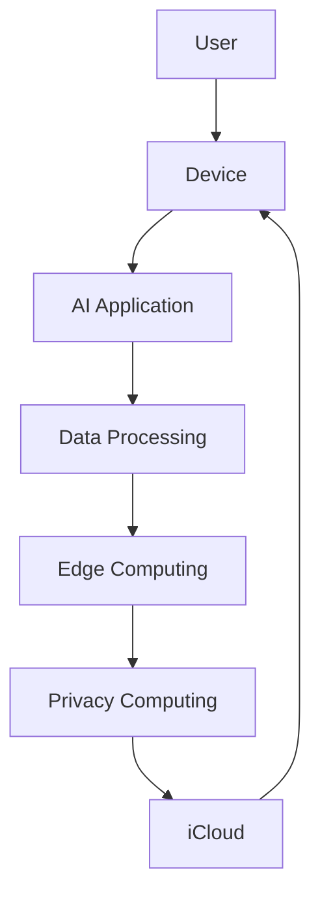

                 

## 1. 背景介绍

在当今的数字化世界中，人工智能（AI）已经渗透到我们的日常生活中，从语音助手到自动驾驶汽车，再到智能家居，AI无处不在。作为全球科技巨头之一的苹果公司，也在积极拥抱AI，并将其集成到其产品和服务中。 recent announcement of Apple's new AI applications has sparked significant interest in the tech industry and beyond. This article aims to delve into the details of these AI applications, their underlying technologies, and the market opportunities they present.

## 2. 核心概念与联系

### 2.1 核心概念

苹果的AI应用建立在以下核心概念之上：

- **机器学习（ML）**：一种AI子集，它使得系统能够从数据中学习，而无需被明确编程。
- **深度学习（DL）**：一种ML子集，它使用神经网络模型来模拟人类大脑的学习过程。
- **边缘计算（Edge Computing）**：一种分布式计算架构，它将数据处理和计算任务从云端转移到网络边缘设备上。
- **隐私计算（Privacy Computing）**：一种计算模式，它允许数据在保护隐私的情况下进行分析和处理。

### 2.2 核心架构

苹果的AI应用在其设备上运行，并利用iCloud进行同步和备份。以下是其核心架构的Mermaid流程图：



## 3. 核心算法原理 & 具体操作步骤

### 3.1 算法原理概述

苹果的AI应用使用DL算法，如卷积神经网络（CNN）和循环神经网络（RNN），来处理和分析数据。这些算法在设备上运行，无需连接到互联网。

### 3.2 算法步骤详解

1. **数据收集**：AI应用从设备上的数据源（如相机、麦克风、传感器等）收集数据。
2. **数据预处理**：收集的数据被预处理以去除噪声和异常值，并转换为适合ML算法的格式。
3. **模型训练**：预处理后的数据用于训练DL模型。训练过程包括反向传播和优化算法，如Adam或RMSProp。
4. **模型部署**：训练好的模型部署在设备上，用于实时数据分析。
5. **预测和分析**：模型分析数据并做出预测，这些预测用于驱动AI应用的功能。

### 3.3 算法优缺点

**优点**：

- **实时处理**：边缘计算允许AI应用在设备上实时处理数据。
- **隐私保护**：隐私计算允许数据在设备上处理，无需上传到云端。
- **高效能**：DL算法在设备上运行，无需连接到互联网，从而提高了效率。

**缺点**：

- **计算资源**：DL算法需要大量的计算资源，这对设备的性能提出了挑战。
- **数据量**：DL算法需要大量的数据来训练模型，这对设备上的数据提出了要求。
- **模型更新**：一旦模型部署在设备上，它就需要定期更新以保持其准确性。

### 3.4 算法应用领域

苹果的AI应用在各种领域都有应用，包括：

- **图像和视频分析**：用于人脸识别、物体检测、场景分析等。
- **语音识别**：用于语音助手、语音转文本等。
- **传感器数据分析**：用于健康监测、运动跟踪等。

## 4. 数学模型和公式 & 详细讲解 & 举例说明

### 4.1 数学模型构建

DL模型通常使用神经元和神经网络来构建。神经元使用激活函数（如ReLU、sigmoid等）来处理输入，并输出结果。神经网络则是神经元的集合，它们通过权重和偏差连接在一起。

### 4.2 公式推导过程

DL模型的训练过程涉及到最小化损失函数。给定一个神经网络模型$f(x; \theta)$，其中$x$是输入，$\theta$是模型的参数，损失函数$L(y, f(x; \theta))$衡量模型预测$f(x; \theta)$和真实值$y$之间的差异。训练过程旨在找到最小化$L(y, f(x; \theta))$的$\theta$值。

### 4.3 案例分析与讲解

例如，在图像分类任务中，输入$x$是图像，真实值$y$是图像的类别，模型$f(x; \theta)$是一个CNN。损失函数通常是交叉熵损失函数：

$$L(y, f(x; \theta)) = -\sum_{c=1}^{C}y_c \log(f_c(x; \theta))$$

其中$C$是类别数，$y_c$是真实值$y$的第$c$个类别的概率，$f_c(x; \theta)$是模型$f(x; \theta)$的第$c$个类别的预测概率。

## 5. 项目实践：代码实例和详细解释说明

### 5.1 开发环境搭建

要开发苹果的AI应用，需要以下开发环境：

- **硬件**：一台Mac电脑，配备Apple M1芯片或更高版本。
- **软件**：macOS Monterey或更高版本，Xcode 13或更高版本，Core ML Tools。

### 5.2 源代码详细实现

以下是一个简单的图像分类应用的源代码示例：

```swift
import CoreML
import Vision

func classifyImage(image: CIImage) {
    guard let model = try? VNCoreMLModel(for: imageClassificationModel().model) else {
        fatalError("Failed to load Core ML model.")
    }

    let request = VNCoreMLRequest(model: model) { request, error in
        guard let results = request.results as? [VNClassificationObservation],
              let topResult = results.first else {
            fatalError("Unexpected result type from VNCoreMLRequest.")
        }

        print("Classification: \(topResult.identifier) with confidence: \(topResult.confidence)")
    }

    let handler = VNImageRequestHandler(ciImage: image)
    do {
        try handler.perform([request])
    } catch {
        print("Failed to perform image request: \(error)")
    }
}
```

### 5.3 代码解读与分析

这段代码使用Core ML框架来加载预训练的图像分类模型，并使用Vision框架来执行图像分类请求。`VNCoreMLRequest`将Core ML模型转换为Vision请求，`VNImageRequestHandler`则用于处理图像请求。

### 5.4 运行结果展示

当这段代码运行时，它会打印出图像的分类结果，以及该结果的置信度。

## 6. 实际应用场景

### 6.1 当前应用

苹果的AI应用已经在其设备上广泛应用，包括：

- **Face ID**：用于解锁设备和进行Apple Pay交易。
- **Siri**：用于语音控制设备和执行任务。
- **Memoji**：用于创建个性化的动画头像。
- **Smart HDR**：用于拍摄照片时自动调整曝光。

### 6.2 未来应用展望

未来，苹果的AI应用可能会扩展到更多领域，如：

- **自动驾驶**：用于感知和决策。
- **健康监测**：用于分析传感器数据，监测用户的健康状况。
- **增强现实（AR）**：用于创建更丰富的AR体验。

## 7. 工具和资源推荐

### 7.1 学习资源推荐

- **Apple Developer Documentation**：提供了有关苹果AI应用开发的官方文档。
- **Stanford University's CS231n：Convolutional Neural Networks for Visual Recognition**：提供了有关CNN的深入讲解。
- **Hands-On Machine Learning with Scikit-Learn, Keras, and TensorFlow**：提供了有关ML和DL的实践指南。

### 7.2 开发工具推荐

- **Xcode**：苹果的集成开发环境（IDE），用于开发iOS和macOS应用。
- **Core ML Tools**：用于转换DL模型以在苹果设备上运行。
- **Create ML**：苹果的ML框架，用于训练和部署ML模型。

### 7.3 相关论文推荐

- **LeCun, Y., Bengio, Y., & Hinton, G. (2015). Deep learning**. Nature, 521(7553), 436-444.
- **Goodfellow, I., Bengio, Y., & Courville, A. (2016). Deep learning**. MIT press.

## 8. 总结：未来发展趋势与挑战

### 8.1 研究成果总结

苹果的AI应用已经取得了显著的成就，从Face ID到Siri，它们已经成为苹果设备的关键特性。然而，仍然有许多挑战需要克服。

### 8.2 未来发展趋势

未来，苹果的AI应用可能会朝着以下方向发展：

- **更强大的模型**：开发更复杂的DL模型，以提高准确性和效率。
- **更多的应用**：将AI应用扩展到更多领域，如自动驾驶和健康监测。
- **更好的隐私保护**：开发更先进的隐私保护技术，以保护用户数据。

### 8.3 面临的挑战

然而，苹果的AI应用也面临着一些挑战：

- **计算资源**：DL模型需要大量的计算资源，这对设备的性能提出了挑战。
- **数据量**：DL模型需要大量的数据来训练，这对设备上的数据提出了要求。
- **模型更新**：一旦模型部署在设备上，它就需要定期更新以保持其准确性。

### 8.4 研究展望

未来的研究可能会集中在以下领域：

- **模型压缩**：开发技术来压缩DL模型，以节省计算资源。
- **增强学习**：开发技术来使DL模型能够从少量数据中学习。
- **隐私保护技术**：开发更先进的隐私保护技术，以保护用户数据。

## 9. 附录：常见问题与解答

**Q：苹果的AI应用需要连接到互联网吗？**

A：不需要。苹果的AI应用在设备上运行，无需连接到互联网。

**Q：苹果的AI应用需要大量的数据吗？**

A：是的，DL模型需要大量的数据来训练。然而，苹果的隐私保护技术允许数据在设备上处理，无需上传到云端。

**Q：苹果的AI应用需要大量的计算资源吗？**

A：是的，DL模型需要大量的计算资源。然而，苹果的设备配备了强大的处理器，可以处理这些计算任务。

!!!Note
作者：禅与计算机程序设计艺术 / Zen and the Art of Computer Programming

