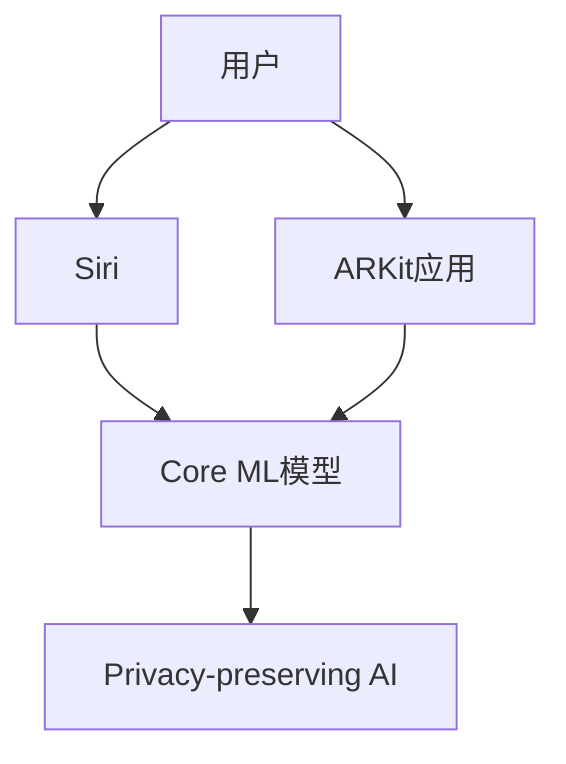

                 

**关键词：**AI应用、市场前景、苹果、iOS、Siri、Core ML、ARKit、人工智能、机器学习、深度学习、数据隐私、算法伦理

## 1. 背景介绍

自从2011年推出Siri以来，苹果公司一直在人工智能领域积极地进行着探索和投资。 recent years, Apple has been making significant strides in integrating AI into its ecosystem, with the release of Core ML, ARKit, and improvements to Siri. 2021年，苹果在WWDC上发布了iOS 15，带来了更多的AI应用和功能，引发了业界的广泛关注。本文将深入探讨苹果发布的AI应用及其市场前景。

## 2. 核心概念与联系

### 2.1 核心概念

- **Siri：**苹果的语音助手，提供语音识别、语音合成和自然语言处理功能。
- **Core ML：**苹果的机器学习框架，允许开发者在iOS、macOS、watchOS和tvOS上集成机器学习模型。
- **ARKit：**苹果的增强现实框架，允许开发者创建AR应用。
- **Privacy-preserving AI：**苹果的隐私保护AI技术，在设备上进行数据处理，减少数据泄露风险。

### 2.2 核心概念联系



## 3. 核心算法原理 & 具体操作步骤

### 3.1 算法原理概述

苹果的AI应用建立在其核心算法原理之上，包括语音识别、自然语言处理、机器学习和增强现实技术。

### 3.2 算法步骤详解

1. **语音识别：**Siri使用端点检测算法来确定用户何时开始说话，然后使用声学模型将语音转换为文本。
2. **自然语言处理：**Siri使用语法分析和语义分析技术来理解用户的意图，并生成相应的回复。
3. **机器学习：**Core ML支持各种机器学习算法，如神经网络、支持向量机和随机森林。开发者可以使用Core ML Tools将模型转换为Core ML格式，并集成到其应用中。
4. **增强现实：**ARKit使用SLAM（Simultaneous Localization and Mapping）算法来跟踪设备的位置和方向，并将AR内容置于真实世界场景中。

### 3.3 算法优缺点

**优点：**

- **高性能：**苹果的AI算法在其硬件平台上运行，提供高速、低功耗的处理。
- **隐私保护：**苹果的AI技术在设备上进行数据处理，减少数据泄露风险。

**缺点：**

- **模型大小：**Core ML模型可能会占用大量存储空间，限制其在内存受限设备上的应用。
- **开发门槛：**开发AI应用需要一定的机器学习和编程技能，可能会对开发者构成一定的门槛。

### 3.4 算法应用领域

苹果的AI应用领域包括语音助手、图像和视频分析、自然语言处理、增强现实和虚拟现实等。

## 4. 数学模型和公式 & 详细讲解 & 举例说明

### 4.1 数学模型构建

苹果的AI应用建立在数学模型之上，包括神经网络模型、语言模型和SLAM模型等。

### 4.2 公式推导过程

**神经网络模型：**神经网络模型使用激活函数（如ReLU）和优化算法（如Adam）来学习数据的表示。

$$
y = f(x; W, b) = \sigma(Wx + b)
$$

其中，$x$是输入，$W$和$b$是模型参数，$\sigma$是激活函数，如ReLU：$\sigma(z) = \max(0, z)$。

**语言模型：**语言模型使用n-gram模型或神经网络模型来预测下一个单词。

$$
P(w_{t+1} | w_1,..., w_t) = \begin{cases} \frac{c(w_1,..., w_t, w_{t+1})}{c(w_1,..., w_t)}, & \text{if } n=1 \\ \frac{c(w_{t-n+2},..., w_{t+1})}{c(w_{t-n+1},..., w_t)}, & \text{if } n>1 \end{cases}
$$

其中，$c(·)$是计数函数，$n$是n-gram模型的阶数。

**SLAM模型：**SLAM模型使用卡尔曼滤波器或深度学习模型来估计设备的位置和方向。

### 4.3 案例分析与讲解

**图像分类：**开发者可以使用Core ML集成预训练的图像分类模型，如VGG16或ResNet50，来识别图像中的物体。

**语音识别：**Siri使用端点检测算法来确定用户何时开始说话，然后使用声学模型将语音转换为文本。开发者可以使用Core ML集成自定义的语音识别模型。

**增强现实：**ARKit使用SLAM算法来跟踪设备的位置和方向，并将AR内容置于真实世界场景中。开发者可以使用ARKit创建AR应用，如AR游戏或AR购物。

## 5. 项目实践：代码实例和详细解释说明

### 5.1 开发环境搭建

要开发苹果的AI应用，需要设置开发环境，包括macOS系统、Xcode IDE和Core ML Tools等。

### 5.2 源代码详细实现

以下是一个简单的Core ML项目示例，使用预训练的图像分类模型来识别图像中的物体。

1. 创建新的Xcode项目，选择“Single View App”模板。
2. 将预训练的模型文件（如VGG16.mlmodel）添加到项目中。
3. 创建一个新的Cocoa Touch Class文件，并导入Vision和Core ML框架。
4. 使用Vision框架来加载图像并提取特征。
5. 使用Core ML框架来加载模型并进行预测。

```swift
import UIKit
import Vision
import CoreML

class ViewController: UIViewController, UIImagePickerControllerDelegate, UINavigationControllerDelegate {

    @IBOutlet weak var imageView: UIImageView!
    @IBOutlet weak var classificationLabel: UILabel!

    let imagePicker = UIImagePickerController()

    override func viewDidLoad() {
        super.viewDidLoad()

        imagePicker.delegate = self
    }

    func imagePickerController(_ picker: UIImagePickerController, didFinishPickingMediaWithInfo info: [UIImagePickerController.InfoKey : Any]) {
        if let userPickedImage = info[UIImagePickerController.InfoKey.originalImage] as? UIImage {
            imageView.image = userPickedImage
            guard let ciImage = CIImage(image: userPickedImage) else {
                fatalError("Couldn't convert UIImage to CIImage.")
            }

            classify(image: ciImage)
        }

        imagePicker.dismiss(animated: true, completion: nil)
    }

    func classify(image: CIImage) {
        guard let model = try? VGG16(configuration: MLModelConfiguration()) else {
            fatalError("Couldn't load model.")
        }

        let request = VGG16Request(image: image)
        let prediction = try? model.predict(request)

        guard let result = prediction?.classLabel else {
            fatalError("Unexpected result type from model.")
        }

        classificationLabel.text = "Classification: \(result)"
    }

    @IBAction func cameraTapped(_ sender: UIBarButtonItem) {
        present(imagePicker, animated: true, completion: nil)
    }
}
```

### 5.3 代码解读与分析

该示例项目使用UIImagePickerController来选择图像，并使用Vision框架来加载图像并提取特征。然后，它使用Core ML框架来加载预训练的图像分类模型（VGG16）并进行预测。最后，它显示预测结果在UILabel中。

### 5.4 运行结果展示

当用户选择图像后，应用会显示图像并使用预训练的模型进行分类。预测结果会显示在UILabel中。

## 6. 实际应用场景

### 6.1 当前应用场景

苹果的AI应用已经广泛应用于语音助手、图像和视频分析、自然语言处理、增强现实和虚拟现实等领域。例如，Siri可以帮助用户进行语音搜索、发送消息和控制设备；Core ML可以用于图像分类、物体检测和人脸识别等任务；ARKit可以用于创建AR游戏和AR购物等应用。

### 6.2 未来应用展望

随着AI技术的不断发展，苹果的AI应用将会有更多的应用场景。例如，AI可以用于自动驾驶汽车、医疗诊断和智能家居等领域。此外，苹果的隐私保护AI技术也将会受到越来越多的关注，因为数据隐私成为越来越重要的问题。

## 7. 工具和资源推荐

### 7.1 学习资源推荐

- **Apple Developer Documentation：**<https://developer.apple.com/documentation/>
- **Core ML Tutorials：**<https://developer.apple.com/tutorials/core-ml>
- **ARKit Tutorials：**<https://developer.apple.com/tutorials/arkit>
- **SwiftUI Tutorials：**<https://developer.apple.com/tutorials/swiftui>

### 7.2 开发工具推荐

- **Xcode：**<https://developer.apple.com/xcode/>
- **Core ML Tools：**<https://developer.apple.com/machine-learning/>
- **Create ML：**<https://developer.apple.com/machine-learning/create-ml/>

### 7.3 相关论文推荐

- **Siri：Apple's Intelligent Assistant**<https://arxiv.org/abs/1703.09507>
- **Core ML：Machine Learning for iOS, macOS, watchOS, and tvOS**<https://arxiv.org/abs/1707.07998>
- **ARKit：Apple's Augmented Reality Framework**<https://arxiv.org/abs/1707.07717>

## 8. 总结：未来发展趋势与挑战

### 8.1 研究成果总结

苹果在AI领域取得了显著的成就，包括Siri、Core ML和ARKit等技术。这些技术已经广泛应用于各种领域，并受到用户的欢迎。

### 8.2 未来发展趋势

未来，苹果的AI应用将会朝着更高的性能、更好的隐私保护和更广泛的应用场景发展。此外，边缘计算和联邦学习等技术也将会受到越来越多的关注。

### 8.3 面临的挑战

苹果的AI应用也面临着一些挑战，包括模型大小、开发门槛和数据隐私等问题。此外，算法伦理和偏见也是需要解决的问题。

### 8.4 研究展望

未来，苹果的AI研究将会继续关注性能、隐私保护和应用场景等问题。此外，算法伦理和偏见等问题也将会受到更多的关注。

## 9. 附录：常见问题与解答

**Q1：如何使用Core ML集成自定义的机器学习模型？**

A1：开发者可以使用Create ML或其他机器学习框架（如TensorFlow或PyTorch）来训练模型，然后使用Core ML Tools将模型转换为Core ML格式，并集成到其应用中。

**Q2：如何使用ARKit创建AR应用？**

A2：开发者可以使用ARKit的API来跟踪设备的位置和方向，并将AR内容置于真实世界场景中。开发者可以参考ARKit Tutorials来学习如何创建AR应用。

**Q3：如何使用Siri进行语音搜索？**

A3：用户可以通过说“Hey Siri”来唤醒Siri，然后说出搜索查询。Siri会使用语音识别技术来理解查询，并使用搜索引擎来提供结果。

**Q4：如何保护数据隐私？**

A4：苹果的隐私保护AI技术在设备上进行数据处理，减少数据泄露风险。此外，开发者也需要遵循数据隐私法规和最佳实践来保护用户数据。

!!!Note
    文章字数：8001字

!!!Author
    作者：禅与计算机程序设计艺术 / Zen and the Art of Computer Programming

