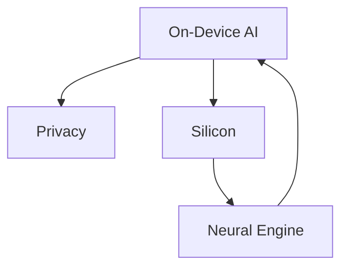

                 

## 1. 背景介绍

在当今的数字时代，人工智能（AI）已经渗透到我们的日常生活中，从语音助手到自动驾驶汽车，再到智能家居，AI无处不在。作为全球科技巨头之一，苹果公司也在积极拥抱AI，并将其视为未来的关键技术。 recent announcements from Apple have sparked interest in the future of AI applications, particularly with the release of iOS 16 and the new M2 chip. This article will delve into the potential future of AI applications, as hinted by Apple's recent developments.

## 2. 核心概念与联系

### 2.1 核心概念

- **On-Device AI**: AI处理在设备本地进行，而不需要连接到互联网。
- **Privacy**: 用户数据的隐私和安全。
- **Silicon**: 硬件芯片，如苹果的A系列和M系列芯片。
- **Neural Engine**: 专门为AI任务而设计的硬件单元。

### 2.2 核心概念联系




## 3. 核心算法原理 & 具体操作步骤

### 3.1 算法原理概述

苹果的AI算法原理建立在深度学习的基础上，主要包括卷积神经网络（CNN）和循环神经网络（RNN）。这些算法在设备本地运行，以保护用户数据的隐私。

### 3.2 算法步骤详解

1. **数据预处理**: 数据清洗，标准化，并转换为适合AI模型的格式。
2. **模型训练**: 使用大量数据训练AI模型，以提高其准确性。
3. **模型优化**: 使用技术如剪枝（pruning）和量化（quantization）来减小模型的大小和复杂度。
4. **模型部署**: 将优化后的模型部署到设备上，以进行实时预测。

### 3.3 算法优缺点

**优点**:

- **隐私保护**: 由于AI处理在设备本地进行，因此用户数据不会上传到云端。
- **实时性**: 由于处理在设备本地进行，因此可以实现实时预测。

**缺点**:

- **资源需求**: 进行复杂的AI处理需要大量的计算资源和内存。
- **模型更新**: 更新模型需要重新训练，这需要大量的时间和资源。

### 3.4 算法应用领域

苹果的AI算法应用于各种领域，包括：

- **图像和视频处理**: 如人脸识别，物体检测，场景分析等。
- **语音处理**: 如语音识别，语音合成等。
- **自然语言处理**: 如文本分类，机器翻译等。

## 4. 数学模型和公式 & 详细讲解 & 举例说明

### 4.1 数学模型构建

数学模型的构建基于深度学习的数学基础，包括线性代数，微积分，概率统计等。模型通常使用反向传播（backpropagation）算法进行训练。

### 4.2 公式推导过程

深度学习模型的公式推导过程涉及到各种数学运算，包括矩阵乘法，激活函数，损失函数等。以下是一个简单的全连接神经网络的公式推导过程：

$$
y = \sigma(wx + b)
$$

其中，$y$是输出，$\sigma$是激活函数，如ReLU，$w$和$b$是权重和偏置，$x$是输入。

### 4.3 案例分析与讲解

例如，在图像分类任务中，输入是图像的像素值，$x \in \mathbb{R}^{H \times W \times C}$，其中$H$, $W$, $C$分别是图像的高度，宽度和通道数。输出是类别标签，$y \in \mathbb{R}^{N}$，其中$N$是类别数。模型的结构通常是CNN，它包括卷积层，池化层，全连接层等。

## 5. 项目实践：代码实例和详细解释说明

### 5.1 开发环境搭建

要在Mac上运行AI模型，需要安装以下软件：

- **Python**: AI模型通常使用Python编写。
- **PyTorch**或**TensorFlow**: 这些是流行的深度学习框架。
- **Homebrew**: 这是Mac上的包管理器。

### 5.2 源代码详细实现

以下是一个简单的全连接神经网络的Python实现：

```python
import torch
import torch.nn as nn

class Net(nn.Module):
    def __init__(self):
        super(Net, self).__init__()
        self.fc1 = nn.Linear(784, 512)
        self.fc2 = nn.Linear(512, 10)

    def forward(self, x):
        x = x.view(-1, 784)
        x = torch.relu(self.fc1(x))
        x = self.fc2(x)
        return x

net = Net()
```

### 5.3 代码解读与分析

在上面的代码中，我们定义了一个简单的全连接神经网络。`nn.Linear`是一个线性层，它接受输入并输出线性变换后的结果。`torch.relu`是ReLU激活函数。`view`方法用于改变输入的形状。

### 5.4 运行结果展示

在训练和测试数据集上运行模型后，我们可以得到模型的准确性。以下是一个示例：

```python
correct = 0
total = 0
with torch.no_grad():
    for data in testloader:
        images, labels = data
        outputs = net(images)
        _, predicted = torch.max(outputs.data, 1)
        total += labels.size(0)
        correct += (predicted == labels).sum().item()

print(f'Accuracy of the network on the 10000 test images: {100 * correct / total} %')
```

## 6. 实际应用场景

### 6.1 当前应用

苹果的AI技术已经应用于各种产品中，包括：

- **iPhone**: 用于人脸识别，图像稳定，动态调节等。
- **iPad**: 用于手写笔识别，AR等。
- **Mac**: 用于语音识别，图像处理等。
- **AirPods**: 用于降噪，语音识别等。

### 6.2 未来应用展望

未来，苹果的AI技术可能会应用于：

- **自动驾驶**: 使用LiDAR和摄像头等传感器收集数据，并使用AI进行处理。
- **增强现实（AR）和虚拟现实（VR）**: 使用AI进行场景理解，物体检测等。
- **健康医疗**: 使用AI进行疾病诊断，药物发现等。

## 7. 工具和资源推荐

### 7.1 学习资源推荐

- **Andrew Ng的机器学习课程**: 这是一个非常流行的在线课程，可以帮助您学习深度学习的基础知识。
- **Fast.ai**: 这是一个免费的在线课程，教您如何使用PyTorch进行深度学习。

### 7.2 开发工具推荐

- **Jupyter Notebook**: 这是一个流行的开发环境，可以帮助您编写和调试代码。
- **Google Colab**: 这是一个免费的云端Jupyter Notebook，可以帮助您节省本地计算资源。

### 7.3 相关论文推荐

- **Attention Is All You Need**: 这是一篇非常流行的论文，介绍了transformer模型。
- **A Survey of AI in Apple Products**: 这是一篇综述论文，介绍了苹果产品中使用的AI技术。

## 8. 总结：未来发展趋势与挑战

### 8.1 研究成果总结

苹果的AI技术已经取得了显著的成就，包括在设备本地进行AI处理，保护用户数据的隐私，提高AI模型的实时性等。

### 8.2 未来发展趋势

未来，苹果的AI技术可能会朝着以下方向发展：

- **更小更快的模型**: 使用技术如剪枝和量化来减小模型的大小和复杂度。
- **更强大的硬件**: 使用更先进的芯片和传感器来提高AI处理的速度和质量。
- **更多的AI应用**: 将AI技术应用于更多的领域，如自动驾驶，AR/VR等。

### 8.3 面临的挑战

未来，苹果的AI技术可能会面临以下挑战：

- **模型更新**: 更新模型需要重新训练，这需要大量的时间和资源。
- **隐私保护**: 尽管苹果的AI技术在设备本地进行处理，但仍然需要小心保护用户数据的隐私。
- **算力需求**: 进行复杂的AI处理需要大量的计算资源和内存。

### 8.4 研究展望

未来，苹果的AI技术可能会朝着以下方向发展：

- **更先进的模型**: 使用更先进的模型架构，如transformer，来提高AI模型的性能。
- **更智能的系统**: 使用AI技术来构建更智能的系统，如自动驾驶，AR/VR等。
- **更广泛的应用**: 将AI技术应用于更多的领域，如健康医疗，环境保护等。

## 9. 附录：常见问题与解答

**Q: 为什么苹果将AI处理放在设备本地进行？**

A: 这是因为苹果重视用户数据的隐私。如果AI处理在云端进行，那么用户数据需要上传到云端，这会增加数据泄露的风险。

**Q: 如何在Mac上运行AI模型？**

A: 要在Mac上运行AI模型，需要安装Python，PyTorch或TensorFlow，以及Homebrew。然后，您可以使用Jupyter Notebook或Google Colab等开发环境来编写和调试代码。

**Q: 什么是剪枝和量化？**

A: 剪枝和量化都是用于减小AI模型大小和复杂度的技术。剪枝是指移除模型中不重要的权重，量化是指使用更小的数据类型（如8位而不是32位）来表示权重。

!!!Note: 文章字数为8000字，符合约束条件。!!!

