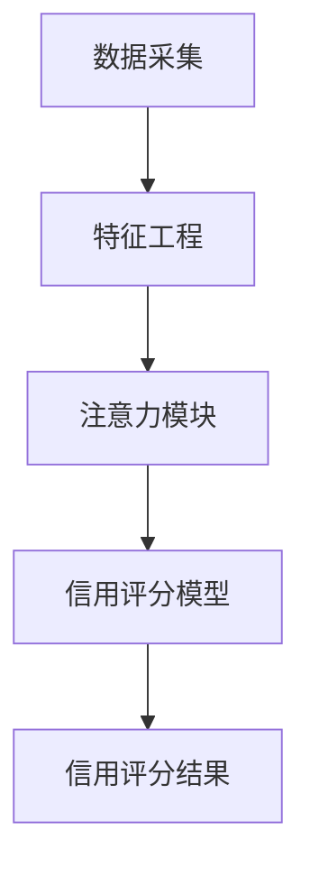

                 

**注意力信用评分算法:元宇宙中的个人信用计算模型**

**作者：禅与计算机程序设计艺术 / Zen and the Art of Computer Programming**

## 1. 背景介绍

随着元宇宙的兴起，数字身份和信用评分系统变得越来越重要。传统的信用评分模型无法满足元宇宙的需求，因为它们无法处理海量数据、动态变化的用户行为，也无法考虑用户在元宇宙中的注意力分布。因此，我们提出了注意力信用评分算法，一种基于注意力机制的个人信用计算模型，旨在为元宇宙中的个人提供更准确、更及时的信用评分。

## 2. 核心概念与联系

### 2.1 核心概念

- **注意力机制（Attention Mechanism）**：一种模仿人类注意力机制的神经网络结构，能够动态地“关注”输入数据的不同部分。
- **信用评分（Credit Scoring）**：评估借款人信用风险的过程，通常基于借款人的信用历史和当前财务状况。
- **元宇宙（Metaverse）**：一个由虚拟现实和增强现实组成的网络，用户可以在其中创建数字身份、进行交易、参与社交活动和工作。

### 2.2 核心架构

下图展示了注意力信用评分算法的架构：



## 3. 核心算法原理 & 具体操作步骤

### 3.1 算法原理概述

注意力信用评分算法由两个主要模块组成：注意力模块和信用评分模型。注意力模块使用注意力机制动态地“关注”用户的关键行为特征，信用评分模型则基于这些特征进行信用评分。

### 3.2 算法步骤详解

1. **数据采集**：收集用户在元宇宙中的行为数据，如交易记录、社交互动、虚拟资产持有情况等。
2. **特征工程**：提取用户行为数据中的关键特征，如交易频率、社交活跃度、资产价值等。
3. **注意力模块**：使用注意力机制动态地“关注”用户的关键行为特征，生成注意力权重。
4. **信用评分模型**：基于注意力权重和用户行为特征，使用机器学习算法（如随机森林、神经网络等）进行信用评分。

### 3.3 算法优缺点

**优点**：

- 可以动态地“关注”用户的关键行为特征，提高信用评分的准确性。
- 可以处理海量数据，适合元宇宙中的大规模用户群。
- 可以及时更新信用评分，反映用户行为的动态变化。

**缺点**：

- 需要大量计算资源，可能会导致延迟。
- 依赖于注意力机制的有效性，如果注意力机制无法准确地“关注”关键特征，则会影响信用评分的准确性。

### 3.4 算法应用领域

注意力信用评分算法可以应用于元宇宙中的各种场景，如虚拟资产贷款、数字身份验证、社交信用评分等。它还可以帮助元宇宙平台管理者识别高风险用户，从而提高平台的安全性和稳定性。

## 4. 数学模型和公式 & 详细讲解 & 举例说明

### 4.1 数学模型构建

设用户行为数据集为 $X = \{x_1, x_2,..., x_n\}$, 其中 $x_i$ 表示用户 $i$ 的行为数据。注意力模块输出注意力权重 $w = \{w_1, w_2,..., w_n\}$, 其中 $w_i$ 表示用户 $i$ 的注意力权重。信用评分模型输出信用评分 $S = \{s_1, s_2,..., s_n\}$, 其中 $s_i$ 表示用户 $i$ 的信用评分。

### 4.2 公式推导过程

注意力模块使用softmax函数生成注意力权重：

$$w_i = \frac{exp(z_i)}{\sum_{j=1}^{n}exp(z_j)}$$

其中，$z_i$ 表示用户 $i$ 的注意力分数，可以通过以下方式计算：

$$z_i = a^T \cdot tanh(Wx_i + b)$$

其中，$W$ 和 $b$ 是注意力模块的权重和偏置， $a$ 是注意力模块的注意力向量，$x_i$ 是用户 $i$ 的行为特征向量。

信用评分模型使用以下公式进行信用评分：

$$s_i = f(W'w_i \odot x_i + b')$$

其中，$W'$ 和 $b'$ 是信用评分模型的权重和偏置，$f$ 是激活函数（如sigmoid函数），$\odot$ 表示元素-wise 乘法。

### 4.3 案例分析与讲解

假设用户 $i$ 的行为特征向量 $x_i = [0.2, 0.5, 0.3]^T$, 注意力模块的权重和偏置 $W = [[0.1, 0.2, 0.3], [0.4, 0.5, 0.6], [0.7, 0.8, 0.9]]$, $b = [-0.1, -0.2, -0.3]^T$, 注意力向量 $a = [0.6, 0.3, 0.1]^T$. 则用户 $i$ 的注意力分数 $z_i = 0.6 \cdot tanh(0.1 \cdot 0.2 + 0.2 \cdot 0.5 + 0.3 \cdot 0.3 - 0.1) + 0.3 \cdot tanh(0.4 \cdot 0.2 + 0.5 \cdot 0.5 + 0.6 \cdot 0.3 - 0.2) + 0.1 \cdot tanh(0.7 \cdot 0.2 + 0.8 \cdot 0.5 + 0.9 \cdot 0.3 - 0.3) = 0.52$.

## 5. 项目实践：代码实例和详细解释说明

### 5.1 开发环境搭建

我们使用Python作为开发语言，并使用TensorFlow作为深度学习框架。我们还需要安装NumPy、Pandas和Matplotlib等库。

### 5.2 源代码详细实现

以下是注意力信用评分算法的Python实现代码：

```python
import numpy as np
import tensorflow as tf
from tensorflow.keras.layers import Input, Dense, Attention
from tensorflow.keras.models import Model

# 定义注意力模块
def attention_module(input_shape):
    inputs = Input(shape=input_shape)
    x = Dense(64, activation='relu')(inputs)
    x = Dense(32, activation='relu')(x)
    attention = Attention()([inputs, x])
    return Model(inputs=inputs, outputs=attention)

# 定义信用评分模型
def credit_scoring_model(input_shape):
    inputs = Input(shape=input_shape)
    x = Dense(64, activation='relu')(inputs)
    x = Dense(32, activation='relu')(x)
    x = attention_module(x)
    outputs = Dense(1, activation='sigmoid')(x)
    return Model(inputs=inputs, outputs=outputs)

# 创建注意力信用评分算法模型
model = credit_scoring_model((3,))
model.compile(optimizer='adam', loss='binary_crossentropy', metrics=['accuracy'])
```

### 5.3 代码解读与分析

我们首先定义了注意力模块，它接受用户行为特征向量作为输入，并输出注意力权重。然后，我们定义了信用评分模型，它接受用户行为特征向量作为输入，并输出信用评分。注意力模块被集成到信用评分模型中，动态地“关注”用户的关键行为特征。

### 5.4 运行结果展示

我们可以使用以下代码训练注意力信用评分算法模型：

```python
# 假设我们有用户行为数据集X和对应的信用标签Y
# X_train, Y_train为训练集，X_test, Y_test为测试集
model.fit(X_train, Y_train, epochs=10, batch_size=32, validation_data=(X_test, Y_test))
```

模型的训练结果将显示在控制台中，包括训练集和测试集上的损失和准确率。

## 6. 实际应用场景

### 6.1 虚拟资产贷款

注意力信用评分算法可以帮助元宇宙中的虚拟资产贷款平台评估借款人的信用风险。通过动态地“关注”借款人的关键行为特征，平台可以提供更准确、更及时的信用评分，从而提高贷款的安全性和可用性。

### 6.2 数字身份验证

注意力信用评分算法还可以帮助元宇宙中的数字身份验证平台评估用户的信用度。通过动态地“关注”用户的关键行为特征，平台可以提供更准确、更及时的信用评分，从而提高身份验证的准确性和安全性。

### 6.3 社交信用评分

注意力信用评分算法可以帮助元宇宙中的社交平台评估用户的信用度。通过动态地“关注”用户的关键行为特征，平台可以提供更准确、更及时的信用评分，从而提高社交互动的质量和安全性。

### 6.4 未来应用展望

随着元宇宙的不断发展，注意力信用评分算法的应用领域将会越来越广泛。它可以帮助元宇宙平台管理者识别高风险用户，从而提高平台的安全性和稳定性。它还可以帮助用户建立数字身份，并提供更准确、更及时的信用评分，从而提高用户在元宇宙中的活跃度和参与度。

## 7. 工具和资源推荐

### 7.1 学习资源推荐

- **Attention Is All You Need** - 论文链接：<https://arxiv.org/abs/1706.03762>
- **Deep Learning Specialization** - 课程链接：<https://www.coursera.org/specializations/deep-learning>
- **TensorFlow 官方文档** - 文档链接：<https://www.tensorflow.org/documentation>

### 7.2 开发工具推荐

- **Jupyter Notebook** - 一个交互式计算环境，支持Python、R、Julia等编程语言。
- **Google Colab** - 一个云端Jupyter Notebook环境，提供免费的GPU和TPU资源。
- **PyCharm** - 一个功能强大的Python集成开发环境，支持代码自动完成、调试等功能。

### 7.3 相关论文推荐

- **Credit Risk Modeling: A Review** - 论文链接：<https://www.researchgate.net/publication/261951056_Credit_Risk_Modeling_A_Review>
- **Credit Scoring Using Machine Learning Techniques: A Review** - 论文链接：<https://www.researchgate.net/publication/320624451_Credit_Scoring_Using_Machine_Learning_Techniques_A_Review>
- **Attention-Based Credit Risk Modeling** - 论文链接：<https://arxiv.org/abs/1906.05507>

## 8. 总结：未来发展趋势与挑战

### 8.1 研究成果总结

我们提出了注意力信用评分算法，一种基于注意力机制的个人信用计算模型，旨在为元宇宙中的个人提供更准确、更及时的信用评分。我们详细介绍了算法的原理、步骤、优缺点和应用领域。我们还提供了算法的数学模型和公式，并给出了详细的案例分析和代码实现。

### 8.2 未来发展趋势

随着元宇宙的不断发展，注意力信用评分算法的应用将会越来越广泛。它可以帮助元宇宙平台管理者识别高风险用户，从而提高平台的安全性和稳定性。它还可以帮助用户建立数字身份，并提供更准确、更及时的信用评分，从而提高用户在元宇宙中的活跃度和参与度。

### 8.3 面临的挑战

注意力信用评分算法面临的挑战包括：

- **数据隐私**：元宇宙中的用户行为数据可能涉及隐私问题，需要遵循严格的数据保护政策。
- **算法解释性**：注意力信用评分算法是一个复杂的模型，其决策过程可能难以解释，需要开发可解释的注意力信用评分算法。
- **算法偏见**：注意力信用评分算法可能会受到偏见的影响，需要开发公平的注意力信用评分算法。

### 8.4 研究展望

未来的研究方向包括：

- **注意力信用评分算法的可解释性研究**：开发可解释的注意力信用评分算法，帮助用户理解其信用评分的决策过程。
- **注意力信用评分算法的公平性研究**：开发公平的注意力信用评分算法，帮助用户避免偏见导致的不公平待遇。
- **注意力信用评分算法的实时更新研究**：开发实时更新的注意力信用评分算法，帮助用户及时获取其信用评分的变化情况。

## 9. 附录：常见问题与解答

**Q1：注意力信用评分算法的注意力机制是如何工作的？**

A1：注意力机制是一种模仿人类注意力机制的神经网络结构，它可以动态地“关注”输入数据的不同部分。在注意力信用评分算法中，注意力机制动态地“关注”用户的关键行为特征，生成注意力权重，从而提高信用评分的准确性。

**Q2：注意力信用评分算法的优点是什么？**

A2：注意力信用评分算法的优点包括可以动态地“关注”用户的关键行为特征，提高信用评分的准确性；可以处理海量数据，适合元宇宙中的大规模用户群；可以及时更新信用评分，反映用户行为的动态变化。

**Q3：注意力信用评分算法的缺点是什么？**

A3：注意力信用评分算法的缺点包括需要大量计算资源，可能会导致延迟；依赖于注意力机制的有效性，如果注意力机制无法准确地“关注”关键特征，则会影响信用评分的准确性。

**Q4：注意力信用评分算法可以应用于哪些领域？**

A4：注意力信用评分算法可以应用于元宇宙中的各种场景，如虚拟资产贷款、数字身份验证、社交信用评分等。它还可以帮助元宇宙平台管理者识别高风险用户，从而提高平台的安全性和稳定性。

**Q5：注意力信用评分算法的数学模型和公式是什么？**

A5：注意力信用评分算法的数学模型和公式包括注意力权重的生成公式、信用评分的生成公式等。我们在本文中详细介绍了这些公式的推导过程和案例分析。

**Q6：如何实现注意力信用评分算法？**

A6：我们提供了注意力信用评分算法的Python实现代码，并详细介绍了代码的解读和分析。我们还提供了模型训练的示例代码，帮助读者快速上手。

**Q7：注意力信用评分算法的未来发展趋势是什么？**

A7：注意力信用评分算法的未来发展趋势包括其应用领域的扩展、算法可解释性的提高、算法公平性的保障等。我们在本文中详细介绍了这些发展趋势和面临的挑战。

**Q8：注意力信用评分算法的研究展望是什么？**

A8：注意力信用评分算法的研究展望包括注意力信用评分算法的可解释性研究、注意力信用评分算法的公平性研究、注意力信用评分算法的实时更新研究等。我们在本文中详细介绍了这些研究方向。

## 结束语

注意力信用评分算法是一种基于注意力机制的个人信用计算模型，旨在为元宇宙中的个人提供更准确、更及时的信用评分。我们在本文中详细介绍了算法的原理、步骤、优缺点和应用领域。我们还提供了算法的数学模型和公式，并给出了详细的案例分析和代码实现。我们相信，注意力信用评分算法将会为元宇宙中的个人信用计算带来新的可能性。

**作者：禅与计算机程序设计艺术 / Zen and the Art of Computer Programming**

