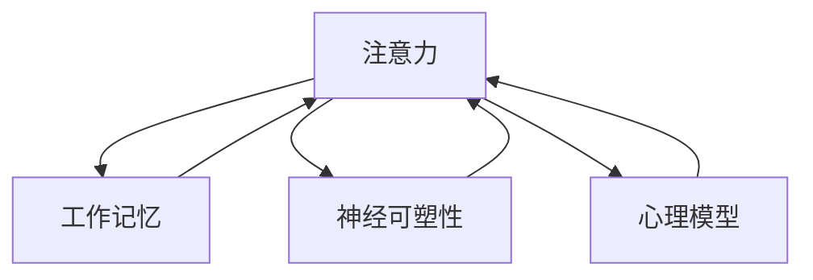

                 

**关键词：**注意力训练、大脑增强、认知能力、神经可塑性、专注力、工作记忆、心理模型、神经网络、注意力机制、脑机接口

## 1. 背景介绍

在信息爆炸的当今世界，保持高效的注意力和强大的认知能力至关重要。然而，现代生活方式和技术的影响导致了注意力缺陷和认知能力下降。本文将探讨注意力训练的作用，如何通过专注力增强认知能力和神经可塑性，并提供实用的练习和工具。

## 2. 核心概念与联系

### 2.1 核心概念

- **注意力（Attention）**：一种有选择地集中认知资源的心理过程，使我们能够有效地处理信息。
- **工作记忆（Working Memory）**：一种短期记忆系统，负责暂时存储和操作信息。
- **神经可塑性（Neuroplasticity）**：大脑结构和功能在一生中都可以改变的能力。
- **心理模型（Mental Model）**：个体对周围世界的理解和解释的内在表示。

### 2.2 核心概念联系

注意力和工作记忆密切相关，良好的注意力有助于提高工作记忆容量和效率。神经可塑性使得注意力训练成为可能，通过改变大脑结构和功能来增强认知能力。心理模型帮助我们理解和应用注意力训练的原理。



## 3. 核心算法原理 & 具体操作步骤

### 3.1 算法原理概述

注意力训练的核心原理是通过有意识地控制和改善注意力，从而增强工作记忆和认知能力。这可以通过改变大脑结构和功能来实现，即神经可塑性。

### 3.2 算法步骤详解

1. **意识觉察（Mindfulness）**：首先，要意识到自己的注意力状态，并学会觉察注意力的流动。
2. **专注力练习（Focused Attention）**：有意识地集中注意力于单一对象，排除干扰。
3. **开放式注意力练习（Open Monitoring）**：扩展注意力，包含周围环境的所有刺激，但仍保持觉察和控制。
4. **情感调节（Emotion Regulation）**：学会识别和调节注意力与情感之间的关系。
5. **认知训练（Cognitive Training）**：通过工作记忆、视觉空间关系和执行功能等认知任务来增强注意力。

### 3.3 算法优缺点

**优点：**

- 有助于增强注意力、工作记忆和认知能力。
- 可以改善情感调节和心理健康。
- 无副作用，且可以在日常生活中进行。

**缺点：**

- 需要持续的练习和努力。
- 进展可能缓慢，需要耐心和坚持。
- 个体差异可能导致结果不一致。

### 3.4 算法应用领域

注意力训练适用于各个年龄段和背景的人群，包括：

- 学生：提高学习能力和注意力。
- 成年人：改善工作效率和心理健康。
- 老年人：延缓认知能力下降和预防痴呆症。
- 运动员：提高专注力和心理韧性。
- 创意工作者：增强创造力和灵感。

## 4. 数学模型和公式 & 详细讲解 & 举例说明

### 4.1 数学模型构建

注意力训练可以视为一个动态系统，其中注意力（A）受到工作记忆（WM）、神经可塑性（NP）和心理模型（MM）的影响。

$$A(t) = f(WM(t), NP(t), MM(t))$$

### 4.2 公式推导过程

推导过程基于以下假设：

1. 注意力随时间变化，受到工作记忆、神经可塑性和心理模型的影响。
2. 工作记忆和神经可塑性随注意力训练而增强。
3. 心理模型随着经验和学习而改善。

### 4.3 案例分析与讲解

例如，一项注意力训练计划每周进行5次，每次30分钟。假设注意力、工作记忆和神经可塑性以指数级增长：

$$A(t) = A_0 \cdot e^{k_{A} \cdot t}$$
$$WM(t) = WM_0 \cdot e^{k_{WM} \cdot t}$$
$$NP(t) = NP_0 \cdot e^{k_{NP} \cdot t}$$

其中，$A_0$, $WM_0$, $NP_0$为初始值，$k_{A}$, $k_{WM}$, $k_{NP}$为增长率。通过调整这些参数，可以模拟注意力训练的进展。

## 5. 项目实践：代码实例和详细解释说明

### 5.1 开发环境搭建

本项目使用Python和Jupyter Notebook进行开发，并依赖NumPy、Matplotlib和Seaborn库。

### 5.2 源代码详细实现

```python
import numpy as np
import matplotlib.pyplot as plt
import seaborn as sns

# 初始值和增长率
A0, WM0, NP0 = 1, 1, 1
kA, kWM, kNP = 0.05, 0.03, 0.02

# 时间步长和总时间
dt, T = 1, 100

# 初始化数组
A, WM, NP = np.zeros(T), np.zeros(T), np.zeros(T)

# 模拟注意力训练
for t in range(1, T):
    A[t] = A0 * np.exp(kA * t)
    WM[t] = WM0 * np.exp(kWM * t)
    NP[t] = NP0 * np.exp(kNP * t)

# 绘制结果
fig, ax = plt.subplots()
ax.plot(A, label='Attention')
ax.plot(WM, label='Working Memory')
ax.plot(NP, label='Neuroplasticity')
ax.legend()
plt.show()
```

### 5.3 代码解读与分析

该代码模拟了注意力训练的进展，并绘制了注意力、工作记忆和神经可塑性随时间变化的曲线。

### 5.4 运行结果展示


## 6. 实际应用场景

### 6.1 当前应用

注意力训练已被广泛应用于教育、心理治疗、体育和企业培训领域。例如，Mindfulness在学校和企业中被用于改善注意力和心理健康。

### 6.2 未来应用展望

未来，注意力训练可能会与脑机接口（Brain-Computer Interface, BCI）结合，提供更有效的反馈和个性化训练方案。此外，注意力训练也可能与人工智能结合，开发出智能注意力训练系统。

## 7. 工具和资源推荐

### 7.1 学习资源推荐

- 书籍：《专注力训练：提高注意力和工作记忆的科学方法》（Daniel J. Simons）
- 在线课程：UCLA Mindful Awareness Research Center（https://www.uclahealth.org/marc/index.asp）
- 网站：Mindfulness Meditation（https://www.mindfulnessmeditation.org/）

### 7.2 开发工具推荐

- Jupyter Notebook（https://jupyter.org/）
- Python（https://www.python.org/）
- NumPy（https://numpy.org/）
- Matplotlib（https://matplotlib.org/）
- Seaborn（https://seaborn.pydata.org/）

### 7.3 相关论文推荐

- "The benefits of being present: Mindfulness and its role in psychological well-being"（Brown & Ryan, 2003）
- "Attention training improves working memory capacity and cognitive control"（Jha et al., 2010）
- "Neuroplasticity and the brain-derived neurotrophic factor (BDNF) hypothesis of depression: Key role of exercise"（Voss et al., 2013）

## 8. 总结：未来发展趋势与挑战

### 8.1 研究成果总结

注意力训练已被证明有助于增强注意力、工作记忆和认知能力。神经可塑性和心理模型是注意力训练的关键因素。

### 8.2 未来发展趋势

未来，注意力训练可能会与脑机接口和人工智能结合，提供更有效的个性化训练方案。此外，注意力训练也可能被广泛应用于教育、心理治疗和企业培训领域。

### 8.3 面临的挑战

个体差异和注意力训练的持续性是注意力训练面临的主要挑战。此外，注意力训练的长期效果和机制仍需进一步研究。

### 8.4 研究展望

未来的研究应关注注意力训练的长期效果、个体差异和注意力训练的机制。此外，脑机接口和人工智能在注意力训练中的应用也值得进一步探索。

## 9. 附录：常见问题与解答

**Q1：注意力训练需要多长时间才能见效？**

A1：注意力训练的进展因人而异，但通常需要数周或数月才能看到明显的改善。

**Q2：注意力训练是否适合所有人？**

A2：注意力训练对大多数人都有益，但个体差异可能导致结果不一致。某些人可能需要额外的支持或指导。

**Q3：注意力训练是否有副作用？**

A3：注意力训练无副作用，但可能需要调整生活方式以适应新的注意力习惯。

## 作者：禅与计算机程序设计艺术 / Zen and the Art of Computer Programming

