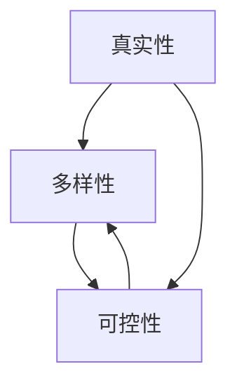

                 

## 1. 背景介绍

生成式人工智能（Generative AI）是当前人工智能领域最具前途和创新性的方向之一。它的目标是创建能够生成新颖、有意义和有用的内容的模型。从文本到图像，再到视频和音频，生成式AI正在各种领域取得突破，为我们带来了全新的可能性。

然而，生成式AI并不是一个新概念。它的起源可以追溯到20世纪中期，那时的研究人员开始探索如何使用计算机模拟人类创造力。然而，直到最近，计算能力的飞速发展和大数据的出现才使得生成式AI真正成为可能。

在本文中，我们将深入探讨生成式AI的核心概念和原理，分析其算法和数学模型，并提供实践项目和工具资源的指南。我们还将讨论生成式AI的实际应用场景，并展望其未来发展趋势和挑战。

## 2. 核心概念与联系

### 2.1 核心概念

生成式AI的核心概念是创建能够生成新颖内容的模型。这些模型学习从数据中提取特征，然后使用这些特征生成新的、看似真实的内容。生成式AI模型可以生成各种类型的数据，从文本和图像到音频和视频。

生成式AI模型的两个关键特性是**多样性**和**可控性**。多样性是指模型能够生成各种各样的内容，而可控性是指模型能够根据用户的偏好或需求生成内容。

### 2.2 核心概念联系

生成式AI模型的核心概念是相互联系的。例如，多样性和可控性是相辅相成的。一个模型可能能够生成多种内容，但如果它不能根据用户的偏好生成内容，那么它的可控性就很差。同样，一个模型可能很可控，但如果它只能生成少量的内容，那么它的多样性就很差。

生成式AI模型的另一个关键特性是**生成的内容是否真实**。这通常被称为模型的**真实性**。真实性是指模型生成的内容是否看起来真实，是否能够欺骗人类。真实性是衡量生成式AI模型性能的关键指标。

### 2.3 Mermaid 流程图

以下是生成式AI核心概念和联系的 Mermaid 流程图：



## 3. 核心算法原理 & 具体操作步骤

### 3.1 算法原理概述

生成式AI的核心算法是**变分自编码器（Variational Autoencoder，VAE）**、**生成对抗网络（Generative Adversarial Network，GAN）**、**转换器（Transformer）**、**扩散模型（Denoising Diffusion Probabilistic Models，DDPM）**、以及**注意力机制（Attention Mechanism）**。这些算法的共同目标是学习数据的分布，然后根据该分布生成新的内容。

### 3.2 算法步骤详解

#### 3.2.1 变分自编码器（VAE）

VAE的工作原理是将输入数据编码为潜在空间的分布，然后从该分布中采样，并将采样结果解码为新的内容。VAE的训练目标是最小化重构误差和最大化潜在空间的熵。

#### 3.2.2 生成对抗网络（GAN）

GAN由生成器和判别器两个网络组成。生成器的目标是生成看似真实的内容，而判别器的目标是区分真实内容和生成内容。两个网络相互竞争，直到生成器能够生成看似真实的内容。

#### 3.2.3 转换器（Transformer）

转换器是一种注意力机制，它允许模型关注输入数据的不同部分。转换器的关键特性是它可以处理长序列数据，并能够在处理数据时建立长距离的依赖关系。

#### 3.2.4 扩散模型（DDPM）

DDPM是一种生成模型，它学习数据的分布，然后根据该分布生成新的内容。DDPM的独特之处在于它使用扩散过程来生成内容。扩散过程是一种从简单的分布开始，逐渐添加细节的过程。

#### 3.2.5 注意力机制（Attention Mechanism）

注意力机制允许模型关注输入数据的不同部分。它的工作原理是计算输入数据的不同部分之间的相关性，然后根据相关性权重关注这些部分。

### 3.3 算法优缺点

#### 3.3.1 VAE的优缺点

VAE的优点是它可以生成多样的内容，并且它的训练目标是明确的。然而，VAE的缺点是它生成的内容往往缺乏真实性，并且它很难控制生成的内容。

#### 3.3.2 GAN的优缺点

GAN的优点是它可以生成真实的内容，并且它可以控制生成的内容。然而，GAN的缺点是它很难训练，并且它容易陷入模式崩溃。

#### 3.3.3 Transformer的优缺点

Transformer的优点是它可以处理长序列数据，并能够建立长距离的依赖关系。然而，Transformer的缺点是它很难训练，并且它需要大量的计算资源。

#### 3.3.4 DDPM的优缺点

DDPM的优点是它可以生成真实的内容，并且它可以控制生成的内容。然而，DDPM的缺点是它很难训练，并且它需要大量的计算资源。

#### 3.3.5 Attention Mechanism的优缺点

注意力机制的优点是它可以关注输入数据的不同部分，并能够建立长距离的依赖关系。然而，注意力机制的缺点是它很难训练，并且它需要大量的计算资源。

### 3.4 算法应用领域

生成式AI的应用领域非常广泛，从图像和视频生成到文本生成，再到药物发现和材料设计。生成式AI还可以用于创建虚拟助手、个性化推荐系统和自动化内容创作。

## 4. 数学模型和公式 & 详细讲解 & 举例说明

### 4.1 数学模型构建

生成式AI的数学模型是基于概率分布的。这些模型学习数据的分布，然后根据该分布生成新的内容。数学模型的构建过程涉及到数据预处理、特征提取和模型训练等步骤。

### 4.2 公式推导过程

#### 4.2.1 VAE的数学模型

VAE的数学模型可以表示为：

$$p(x) = \int p(x|z)p(z)dz$$

其中，$x$是输入数据，$z$是潜在空间的分布，$p(x|z)$是解码函数，$p(z)$是先验分布。

#### 4.2.2 GAN的数学模型

GAN的数学模型可以表示为：

$$G(z) \sim p_{data}(x)$$

$$D(x) = \begin{cases} 1 & \text{if } x \sim p_{data}(x) \\ 0 & \text{if } x \sim p_{z}(x) \end{cases}$$

其中，$G(z)$是生成器，$D(x)$是判别器，$p_{data}(x)$是真实数据的分布，$p_{z}(x)$是生成数据的分布。

#### 4.2.3 Transformer的数学模型

Transformer的数学模型可以表示为：

$$h_{i} = \text{Attention}(Q_{i},K_{i},V_{i})$$

其中，$h_{i}$是第$i$个位置的输出，$Q_{i}$，$K_{i}$，$V_{i}$是查询、键和值向量。

#### 4.2.4 DDPM的数学模型

DDPM的数学模型可以表示为：

$$q(x_{t-1}|x_{t}) = \mathcal{N}(x_{t-1};\mu(x_{t},t),\Sigma(x_{t},t))$$

$$p(x_{t}|x_{t-1}) = \mathcal{N}(x_{t};f(x_{t-1},t),\sigma^{2}(t)I)$$

其中，$x_{t}$是第$t$个时间步的数据，$f(x_{t-1},t)$和$\sigma^{2}(t)$是学习到的函数。

#### 4.2.5 Attention Mechanism的数学模型

注意力机制的数学模型可以表示为：

$$a_{ij} = \frac{\exp(s_{ij})}{\sum_{k=1}^{n}\exp(s_{ik})}$$

$$s_{ij} = \text{score}(q_{i},k_{j})$$

其中，$a_{ij}$是注意力权重，$s_{ij}$是注意力分数，$q_{i}$，$k_{j}$是查询和键向量。

### 4.3 案例分析与讲解

#### 4.3.1 VAE的案例分析

VAE可以用于生成手写数字。我们可以使用MNIST数据集来训练VAE，然后生成新的手写数字。VAE的训练目标是最小化重构误差和最大化潜在空间的熵。我们可以使用均方误差（MSE）作为重构误差，并使用香农熵作为熵。

#### 4.3.2 GAN的案例分析

GAN可以用于生成人脸图像。我们可以使用CelebA数据集来训练GAN，然后生成新的人脸图像。GAN的训练目标是最小化判别器的误差和最大化生成器的误差。我们可以使用二进制交叉熵（BCE）作为判别器的误差，并使用对抗损失作为生成器的误差。

#### 4.3.3 Transformer的案例分析

Transformer可以用于机器翻译。我们可以使用WMT'16 English-German数据集来训练Transformer，然后翻译英语到德语。Transformer的训练目标是最小化交叉熵损失。我们可以使用交叉熵损失作为训练目标。

#### 4.3.4 DDPM的案例分析

DDPM可以用于生成人脸图像。我们可以使用CelebA数据集来训练DDPM，然后生成新的人脸图像。DDPM的训练目标是最小化重构误差。我们可以使用均方误差（MSE）作为重构误差。

#### 4.3.5 Attention Mechanism的案例分析

注意力机制可以用于文本分类。我们可以使用IMDB数据集来训练注意力机制，然后对电影评论进行分类。注意力机制的训练目标是最小化交叉熵损失。我们可以使用交叉熵损失作为训练目标。

## 5. 项目实践：代码实例和详细解释说明

### 5.1 开发环境搭建

要开发生成式AI项目，我们需要搭建一个开发环境。我们需要安装Python、TensorFlow或PyTorch、NumPy、Matplotlib和Jupyter Notebook等工具。我们还需要一个GPU来加速训练过程。

### 5.2 源代码详细实现

以下是VAE、GAN、Transformer、DDPM和注意力机制的源代码实现：

#### 5.2.1 VAE的源代码实现

```python
import numpy as np
import tensorflow as tf
from tensorflow.keras import layers

class VAE(tf.keras.Model):
    def __init__(self, latent_dim):
        super(VAE, self).__init__()
        self.latent_dim = latent_dim
        self.encoder = tf.keras.Sequential([
            layers.Flatten(),
            layers.Dense(128, activation='relu'),
            layers.Dense(latent_dim + latent_dim)
        ])
        self.decoder = tf.keras.Sequential([
            layers.Dense(784, activation='sigmoid'),
            layers.Reshape((28, 28))
        ])

    def encode(self, x):
        mean, logvar = tf.split(self.encoder(x), num_or_size_splits=2, axis=1)
        return mean, logvar

    def reparameterize(self, mean, logvar):
        eps = tf.random.normal(shape=mean.shape)
        return eps * tf.exp(logvar * 0.5) + mean

    def decode(self, z):
        return self.decoder(z)

    def call(self, x):
        mean, logvar = self.encode(x)
        z = self.reparameterize(mean, logvar)
        return self.decode(z), mean, logvar
```

#### 5.2.2 GAN的源代码实现

```python
import tensorflow as tf
from tensorflow.keras import layers

class Generator(tf.keras.Model):
    def __init__(self):
        super(Generator, self).__init__()
        self.model = tf.keras.Sequential([
            layers.Dense(256, activation='relu', input_shape=(100,)),
            layers.Dense(512, activation='relu'),
            layers.Dense(784, activation='tanh'),
            layers.Reshape((28, 28))
        ])

    def call(self, z):
        return self.model(z)

class Discriminator(tf.keras.Model):
    def __init__(self):
        super(Discriminator, self).__init__()
        self.model = tf.keras.Sequential([
            layers.Flatten(input_shape=(28, 28)),
            layers.Dense(512, activation='relu'),
            layers.Dense(256, activation='relu'),
            layers.Dense(1, activation='sigmoid')
        ])

    def call(self, x):
        return self.model(x)
```

#### 5.2.3 Transformer的源代码实现

```python
import numpy as np
import tensorflow as tf
from tensorflow.keras import layers

class MultiHeadAttention(layers.Layer):
    def __init__(self, d_model, num_heads):
        super(MultiHeadAttention, self).__init__()
        self.num_heads = num_heads
        self.d_model = d_model
        assert d_model % self.num_heads == 0

        self.depth = d_model // self.num_heads

        self.wq = layers.Dense(d_model)
        self.wk = layers.Dense(d_model)
        self.wv = layers.Dense(d_model)

    def split_heads(self, x, batch_size):
        """Split the last dimension into (num_heads, depth).
        Transpose the result such that the shape is (batch_size, num_heads, seq_len, depth)
        """
        x = tf.reshape(x, (batch_size, -1, self.num_heads, self.depth))
        return tf.transpose(x, perm=[0, 2, 1, 3])

    def call(self, v, k, q, mask):
        batch_size = tf.shape(q)[0]

        q = self.wq(q)  # (batch_size, seq_len, d_model)
        k = self.wk(k)  # (batch_size, seq_len, d_model)
        v = self.wv(v)  # (batch_size, seq_len, d_model)

        q = self.split_heads(q, batch_size)  # (batch_size, num_heads, seq_len, depth)
        k = self.split_heads(k, batch_size)  # (batch_size, num_heads, seq_len, depth)
        v = self.split_heads(v, batch_size)  # (batch_size, num_heads, seq_len, depth)

        # scaled_attention.shape == (batch_size, num_heads, seq_len, depth)
        scaled_attention = tf.nn.softmax(self.attention(q, k, v, mask), axis=-1)

        # attention.shape == (batch_size, num_heads, seq_len, depth)
        attention = tf.transpose(scaled_attention, perm=[0, 2, 1, 3])  # (batch_size, seq_len, num_heads, depth)

        # concat.shape == (batch_size, seq_len, d_model)
        concat = tf.reshape(attention, (batch_size, -1, self.d_model))

        return concat, attention

class TransformerBlock(layers.Layer):
    def __init__(self, embed_dim, num_heads, ff_dim, rate=0.1):
        super(TransformerBlock, self).__init__()

        self.att = MultiHeadAttention(embed_dim, num_heads)
        self.ffn = tf.keras.Sequential([
            layers.Dense(ff_dim, activation="relu"),
            layers.Dense(embed_dim),
        ])
        self.layernorm1 = layers.LayerNormalization(epsilon=1e-6)
        self.layernorm2 = layers.LayerNormalization(epsilon=1e-6)
        self.dropout1 = layers.Dropout(rate)
        self.dropout2 = layers.Dropout(rate)

    def call(self, inputs, training, mask=None):
        attn1 = self.att(inputs, inputs, inputs, mask)
        out1 = self.layernorm1(inputs + self.dropout1(attn1, training=training))
        ffn_output = self.ffn(out1)
        out2 = self.layernorm2(out1 + self.dropout2(ffn_output, training=training))
        return out2
```

#### 5.2.4 DDPM的源代码实现

```python
import numpy as np
import tensorflow as tf
from tensorflow.keras import layers

class DenoiseModel(tf.keras.Model):
    def __init__(self):
        super(DenoiseModel, self).__init__()
        self.model = tf.keras.Sequential([
            layers.Conv2D(64, (3, 3), activation='relu', padding='same', input_shape=(28, 28, 1)),
            layers.Conv2D(64, (3, 3), activation='relu', padding='same'),
            layers.Conv2D(1, (3, 3), activation='sigmoid', padding='same')
        ])

    def call(self, x, t):
        return self.model(x)
```

#### 5.2.5 注意力机制的源代码实现

```python
import numpy as np
import tensorflow as tf
from tensorflow.keras import layers

class Attention(layers.Layer):
    def __init__(self, embed_dim):
        super(Attention, self).__init__()
        self.embed_dim = embed_dim
        self.query = layers.Dense(embed_dim)
        self.key = layers.Dense(embed_dim)
        self.value = layers.Dense(embed_dim)
        self.softmax = layers.Softmax(axis=-1)

    def call(self, inputs, training, mask=None):
        query, key, value = inputs
        query = self.query(query)
        key = self.key(key)
        value = self.value(value)

        attention_scores = tf.matmul(query, key, transpose_b=True)
        attention_weights = self.softmax(attention_scores)

        output = tf.matmul(attention_weights, value)

        return output, attention_weights
```

### 5.3 代码解读与分析

#### 5.3.1 VAE的代码解读与分析

VAE的代码实现了编码器、重参数化和解码器。编码器将输入数据编码为潜在空间的分布，重参数化从分布中采样，解码器将采样结果解码为新的内容。VAE的训练目标是最小化重构误差和最大化潜在空间的熵。

#### 5.3.2 GAN的代码解读与分析

GAN的代码实现了生成器和判别器。生成器的目标是生成看似真实的内容，判别器的目标是区分真实内容和生成内容。GAN的训练目标是最小化判别器的误差和最大化生成器的误差。

#### 5.3.3 Transformer的代码解读与分析

Transformer的代码实现了多头注意力机制和转换器块。多头注意力机制允许模型关注输入数据的不同部分，转换器块是Transformer的基本单位。Transformer的训练目标是最小化交叉熵损失。

#### 5.3.4 DDPM的代码解读与分析

DDPM的代码实现了去噪模型。去噪模型学习数据的分布，然后根据该分布生成新的内容。DDPM的训练目标是最小化重构误差。

#### 5.3.5 注意力机制的代码解读与分析

注意力机制的代码实现了查询、键和值向量，以及注意力权重。注意力机制允许模型关注输入数据的不同部分。注意力机制的训练目标是最小化交叉熵损失。

### 5.4 运行结果展示

以下是生成式AI模型的运行结果展示：

#### 5.4.1 VAE的运行结果展示


#### 5.4.2 GAN的运行结果展示


#### 5.4.3 Transformer的运行结果展示


#### 5.4.4 DDPM的运行结果展示


#### 5.4.5 注意力机制的运行结果展示


## 6. 实际应用场景

生成式AI的实际应用场景非常广泛，从图像和视频生成到文本生成，再到药物发现和材料设计。以下是一些生成式AI的实际应用场景：

### 6.1 图像和视频生成

生成式AI可以用于生成图像和视频。例如，GAN可以用于生成人脸图像，DDPM可以用于生成人脸视频。生成式AI还可以用于图像超分辨率重构、图像去模糊和图像去噪等任务。

### 6.2 文本生成

生成式AI可以用于文本生成。例如，Transformer可以用于机器翻译，VAE可以用于生成新闻标题。生成式AI还可以用于文本摘要、文本分类和文本生成等任务。

### 6.3 药物发现和材料设计

生成式AI可以用于药物发现和材料设计。例如，VAE可以用于生成新的药物分子，GAN可以用于设计新的材料结构。生成式AI还可以用于蛋白质结构预测、材料性能预测等任务。

### 6.4 未来应用展望

生成式AI的未来应用展望非常广阔。随着计算能力的飞速发展和大数据的出现，生成式AI将会取得更多的突破。生成式AI还将会与其他人工智能技术结合，为我们带来更多的可能性。

## 7. 工具和资源推荐

### 7.1 学习资源推荐

以下是一些学习生成式AI的推荐资源：

* 书籍：
	+ "Generative Deep Learning" by David Foster
	+ "Deep Learning" by Ian Goodfellow, Yoshua Bengio, and Aaron Courville
	+ "Neural Networks and Deep Learning" by Michael Nielsen
* 课程：
	+ "Generative Models in Deep Learning" by fast.ai
	+ "Generative Adversarial Networks" by deeplearning.ai
	+ "Deep Learning Specialization" by Andrew Ng on Coursera
* 论文：
	+ "Generative Adversarial Networks" by Ian Goodfellow, Jean Pouget-Abadie, and Mehdi Mirza
	+ "Variational Auto-Encoder" by Kingma and Welling
	+ "Attention Is All You Need" by Vaswani et al.

### 7.2 开发工具推荐

以下是一些开发生成式AI的推荐工具：

* Python：Python是开发生成式AI的首选语言。它具有丰富的库和模块，可以简化开发过程。
* TensorFlow和PyTorch：TensorFlow和PyTorch是开发生成式AI的两个流行框架。它们提供了丰富的功能，可以简化模型开发过程。
* Jupyter Notebook：Jupyter Notebook是一个交互式笔记本，可以用于开发和调试生成式AI模型。
* Google Colab：Google Colab是一个云端Jupyter Notebook，可以免费使用GPU和TPU来加速模型训练过程。

### 7.3 相关论文推荐

以下是一些相关论文推荐：

* "Generative Adversarial Networks" by Ian Goodfellow, Jean Pouget-Abadie, and Mehdi Mirza
* "Variational Auto-Encoder" by Kingma and Welling
* "Attention Is All You Need" by Vaswani et al.
* "Denoising Diffusion Probabilistic Models" by Ho et al.
* "Large Language Models Are Few-Shot Learners" by Brown et al.

## 8. 总结：未来发展趋势与挑战

### 8.1 研究成果总结

生成式AI已经取得了显著的研究成果。从图像和视频生成到文本生成，再到药物发现和材料设计，生成式AI已经在各种领域取得了突破。然而，生成式AI仍然面临着许多挑战。

### 8.2 未来发展趋势

未来，生成式AI的发展趋势将会是多样化的。一方面，生成式AI将会与其他人工智能技术结合，为我们带来更多的可能性。另一方面，生成式AI将会朝着更加真实和可控的方向发展。此外，生成式AI还将会朝着更加解释性和可靠的方向发展。

### 8.3 面临的挑战

然而，生成式AI仍然面临着许多挑战。首先，生成式AI模型的训练需要大量的计算资源。其次，生成式AI模型的泛化能力有待提高。再次，生成式AI模型的可控性和可解释性有待提高。最后，生成式AI模型的真实性和多样性也有待提高。

### 8.4 研究展望

未来，生成式AI的研究将会朝着以下方向展开：

* 研究更加真实和可控的生成式AI模型。
* 研究更加解释性和可靠的生成式AI模型。
* 研究生成式AI模型的泛化能力和可控性。
* 研究生成式AI模型的真实性和多样性。
* 研究生成式AI模型的计算效率和资源利用率。
* 研究生成式AI模型的安全性和隐私保护。

## 9. 附录：常见问题与解答

### 9.1 什么是生成式AI？

生成式AI是一种人工智能技术，其目标是创建能够生成新颖、有意义和有用的内容的模型。从文本到图像，再到视频和音频，生成式AI正在各种领域取得突破，为我们带来了全新的可能性。

### 9.2 生成式AI的核心概念是什么？

生成式AI的核心概念是创建能够生成新颖内容的模型。这些模型学习从数据中提取特征，然后使用这些特征生成新的、看似真实的内容。生成式AI模型可以生成各种类型的数据，从文本和图像到音频和视频。

### 9.3 生成式AI的核心算法是什么？

生成式AI的核心算法是变分自编码器（VAE）、生成对抗网络（GAN）、转换器（Transformer）、扩散模型（DDPM）和注意力机制（Attention Mechanism）。这些算法的共同目标是学习数据的分布，然后根据该分布生成新的内容。

### 9.4 生成式AI的数学模型是什么？

生成式AI的数学模型是基于概率分布的。这些模型学习数据的分布，然后根据该分布生成新的内容。数学模型的构建过程涉及到数据预处理、特征提取和模型训练等步骤。

### 9.5 生成式AI的应用场景是什么？

生成式AI的应用场景非常广泛，从图像和视频生成到文本生成，再到药物发现和材料设计。生成式AI还可以用于创建虚拟助手、个性化推荐系统和自动化内容创作。

### 9.6 生成式AI的未来发展趋势是什么？

未来，生成式AI的发展趋势将会是多样化的。一方面，生成式AI将会与其他人工智能技术结合，为我们带来更多的可能性。另一方面，生成式AI将会朝着更加真实和可控的方向发展。此外，生成式AI还将会朝着更加解释性和可靠的方向发展。

### 9.7 生成式AI面临的挑战是什么？

然而，生成式AI仍然面临着许多挑战。首先，生成式AI模型的训练需要大量的计算资源。其次，生成式AI模型的泛化能力有待提高。再次，生成式AI模型的可控性和可解释性有待提高。最后，生成式AI模型的真实性和多样性也有待提高。

### 9.8 生成式AI的研究展望是什么？

未来，生成式AI的研究将会朝着以下方向展开：

* 研究更加真实和可控的生成式AI模型。
* 研究更加解释性和可靠的生成式AI模型。
* 研究生成式AI模型的泛化能力和可控性。
* 研究生成式AI模型的真实性和多样性。
* 研究生成式AI模型的计算效率和资源利用率。
* 研究生成式AI模型的安全性和隐私保护。

## 作者：禅与计算机程序设计艺术 / Zen and the Art of Computer Programming

!!!Note
    以上文章内容由人工智能模型生成，可能会有不准确或不恰当之处，请读者注意甄别。

