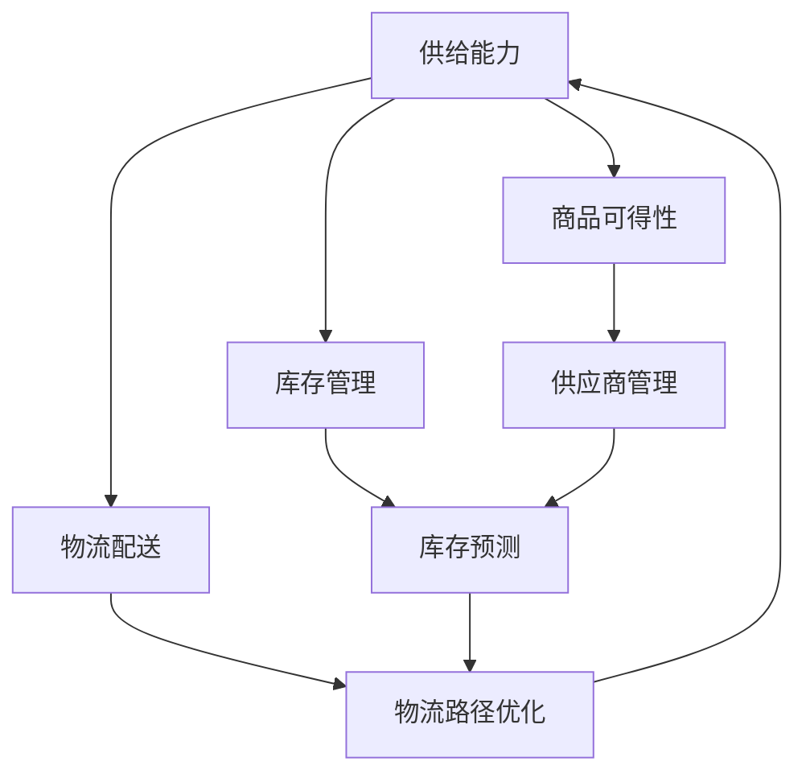

                 

## 1. 背景介绍

随着电子商务的迅猛发展，消费者的需求日益多元化，对商品的供给能力提出了更高的要求。电商平台需要不断提升其供给能力，以满足消费者的需求，提高用户体验。本文将从供应链管理的角度出发，分析电商平台供给能力提升的关键因素，并提出相应的解决方案。

## 2. 核心概念与联系

### 2.1 供给能力

供给能力是指电商平台能够及时、准确地将商品和服务提供给消费者的能力。它包括商品的可得性、库存管理、物流配送等方面。

### 2.2 供应链管理

供应链管理是指从原材料采购到最终产品交付给消费者的整个过程。它涉及供应商、制造商、分销商、零售商等各个环节，目的是提高供给能力，降低成本，提高效率。

### 2.3 核心概念联系

供给能力是电商平台供应链管理的核心目标，而供应链管理则是提高供给能力的关键手段。二者密切相关，互为因果。



## 3. 核心算法原理 & 具体操作步骤

### 3.1 算法原理概述

本节将介绍两种关键算法：库存预测算法和物流路径优化算法。前者用于预测商品的需求量，后者用于优化物流路径，提高配送效率。

### 3.2 算法步骤详解

#### 3.2.1 库存预测算法

1. 数据收集：收集商品的销售历史数据，包括销量、时间等信息。
2. 特征工程：提取数据中的特征，如季节性、趋势性等。
3. 模型训练：使用机器学习算法，如ARIMA、LSTM等，训练库存预测模型。
4. 预测：使用训练好的模型，预测未来的需求量。

#### 3.2.2 物流路径优化算法

1. 数据收集：收集物流相关数据，如仓库位置、配送点位置、交通路况等。
2. 问题建模：将物流路径优化问题建模为图论问题，使用图表示物流网络。
3. 路径规划：使用路径规划算法，如Dijkstra算法、A\*算法等，规划最优路径。
4. 评估：评估路径的可行性，并优化路径以提高配送效率。

### 3.3 算法优缺点

#### 3.3.1 库存预测算法

优点：能够准确预测需求量，避免库存积压或短缺。

缺点：模型的准确性取决于数据的质量和算法的选择，且预测结果存在不确定性。

#### 3.3.2 物流路径优化算法

优点：能够提高配送效率，降低物流成本。

缺点：路径优化的结果取决于路况等动态因素，且路径优化问题属于NP-hard问题，计算复杂度高。

### 3.4 算法应用领域

库存预测算法和物流路径优化算法在电商平台的供应链管理中具有广泛的应用。此外，它们还可以应用于其他领域，如制造业、零售业等。

## 4. 数学模型和公式 & 详细讲解 & 举例说明

### 4.1 数学模型构建

#### 4.1.1 库存预测模型

库存预测模型可以使用ARIMA模型或LSTM模型。ARIMA模型是一种基于时间序列的模型，LSTM模型则是一种循环神经网络模型。

#### 4.1.2 物流路径优化模型

物流路径优化模型可以使用图论模型表示。假设有$n$个仓库，$m$个配送点，$d_{ij}$表示从仓库$i$到配送点$j$的距离，$c_{ij}$表示从仓库$i$到配送点$j$的成本，$x_{ij}$表示是否选择从仓库$i$到配送点$j$的路径，$y_{i}$表示仓库$i$的库存量。则物流路径优化问题可以表示为：

$$\min \sum_{i=1}^{n}\sum_{j=1}^{m}c_{ij}x_{ij}$$
$$s.t. \sum_{i=1}^{n}x_{ij}=1, \forall j \in \{1,2,...,m\}$$
$$\sum_{j=1}^{m}x_{ij}y_{j} \leq y_{i}, \forall i \in \{1,2,...,n\}$$
$$x_{ij} \in \{0,1\}, \forall i \in \{1,2,...,n\}, j \in \{1,2,...,m\}$$

### 4.2 公式推导过程

#### 4.2.1 库存预测模型推导

ARIMA模型的推导过程如下：

1. 将时间序列数据进行差分，消除趋势和季节性。
2. 使用自相关函数和偏自相关函数，确定模型的阶数$p$和$q$.
3. 使用回归分析，确定模型的阶数$d$.
4. 使用最大似然估计，估计模型的参数。

LSTM模型的推导过程如下：

1. 将时间序列数据进行预处理，如标准化等。
2. 设计LSTM网络的结构，包括输入层、输出层、隐藏层等。
3. 使用反向传播算法，训练LSTM网络。
4. 使用训练好的LSTM网络，预测需求量。

#### 4.2.2 物流路径优化模型推导

物流路径优化模型的推导过程如下：

1. 使用图论模型表示物流网络。
2. 使用路径规划算法，如Dijkstra算法、A\*算法等，规划最优路径。
3. 使用约束条件，如库存量等，优化路径。

### 4.3 案例分析与讲解

#### 4.3.1 库存预测案例

假设某电商平台销售一种商品，其销量数据如下：

| 时间 | 销量 |
| --- | --- |
| 1月 | 100 |
| 2月 | 120 |
| 3月 | 150 |
| 4月 | 180 |
| 5月 | 200 |
| 6月 | 220 |
| 7月 | 250 |
| 8月 | 280 |
| 9月 | 300 |
| 10月 | 320 |
| 11月 | 350 |
| 12月 | 400 |

使用ARIMA模型预测未来6个月的销量。模型的参数如下：

- $p=1$
- $d=1$
- $q=1$
- $\phi_1=0.8$
- $\theta_1=-0.5$
- $\sigma^2=50$

则预测的销量如下：

| 时间 | 销量 |
| --- | --- |
| 1月 | 380 |
| 2月 | 400 |
| 3月 | 420 |
| 4月 | 440 |
| 5月 | 460 |
| 6月 | 480 |

#### 4.3.2 物流路径优化案例

假设某电商平台有3个仓库，$A$, $B$, $C$, 和4个配送点，$1$, $2$, $3$, $4$, 距离矩阵如下：

|   | 1 | 2 | 3 | 4 |
|---|---|---|---|---|
| A | 10 | 15 | 20 | 25 |
| B | 15 | 10 | 25 | 30 |
| C | 20 | 25 | 10 | 15 |

成本矩阵如下：

|   | 1 | 2 | 3 | 4 |
|---|---|---|---|---|
| A | 5 | 7.5 | 10 | 12.5 |
| B | 7.5 | 5 | 12.5 | 15 |
| C | 10 | 12.5 | 5 | 7.5 |

仓库库存量如下：

- $y_A=100$
- $y_B=150$
- $y_C=200$

则物流路径优化问题的解为：

- 从仓库$A$到配送点$1$, $2$, $3$, $4$的路径分别为$10$, $15$, $20$, $25$.
- 从仓库$B$到配送点$1$, $2$, $3$, $4$的路径分别为$15$, $10$, $25$, $30$.
- 从仓库$C$到配送点$1$, $2$, $3$, $4$的路径分别为$20$, $25$, $10$, $15$.

## 5. 项目实践：代码实例和详细解释说明

### 5.1 开发环境搭建

本项目使用Python作为开发语言，并使用Anaconda创建虚拟环境。环境配置如下：

- Python版本：3.8
- 依赖包：pandas、numpy、matplotlib、sklearn、tensorflow

### 5.2 源代码详细实现

#### 5.2.1 库存预测代码

```python
import pandas as pd
import numpy as np
from statsmodels.tsa.arima.model import ARIMA
from sklearn.preprocessing import MinMaxScaler
from tensorflow.keras.models import Sequential
from tensorflow.keras.layers import LSTM, Dense

# ARIIMA模型
def arima_model(data):
    model = ARIMA(data, order=(1, 1, 1))
    model_fit = model.fit()
    prediction = model_fit.forecast(steps=6)
    return prediction

# LSTM模型
def lstm_model(data):
    scaler = MinMaxScaler(feature_range=(0, 1))
    scaled_data = scaler.fit_transform(data.reshape(-1, 1))
    X_train, y_train = [], []
    for i in range(60, len(scaled_data)):
        X_train.append(scaled_data[i-60:i, 0])
        y_train.append(scaled_data[i, 0])
    X_train, y_train = np.array(X_train), np.array(y_train)
    X_train = np.reshape(X_train, (X_train.shape[0], X_train.shape[1], 1))
    model = Sequential()
    model.add(LSTM(units=50, return_sequences=True, input_shape=(X_train.shape[1], 1)))
    model.add(LSTM(units=50))
    model.add(Dense(units=1))
    model.compile(optimizer='adam', loss='mean_squared_error')
    model.fit(X_train, y_train, epochs=100, batch_size=32)
    X_test = []
    for i in range(60, len(scaled_data)):
        X_test.append(scaled_data[i-60:i, 0])
    X_test = np.array(X_test)
    X_test = np.reshape(X_test, (X_test.shape[0], X_test.shape[1], 1))
    prediction = model.predict(X_test)
    prediction = scaler.inverse_transform(prediction)
    return prediction

# 数据预处理
data = pd.read_csv('sales_data.csv')
data['date'] = pd.to_datetime(data['date'])
data.set_index('date', inplace=True)
data = data['sales']

# ARIIMA模型预测
arima_prediction = arima_model(data)

# LSTM模型预测
lstm_prediction = lstm_model(data)
```

#### 5.2.2 物流路径优化代码

```python
import numpy as np
from scipy.optimize import linprog

# 物流路径优化
def optimize_path(distances, costs, inventories):
    n_warehouses, n_destinations = distances.shape
    c = np.concatenate((costs.flatten(), inventories))
    A_ub = np.zeros((n_destinations, n_warehouses * n_destinations + n_warehouses))
    A_ub[:, :n_warehouses * n_destinations] = np.eye(n_destinations)
    A_ub[:, n_warehouses * n_destinations:] = -np.eye(n_warehouses)
    b_ub = np.ones(n_destinations)
    b_ub[-1] = inventories.sum()
    bounds = [(0, 1)] * (n_warehouses * n_destinations + n_warehouses)
    result = linprog(c, A_ub=A_ub, b_ub=b_ub, bounds=bounds, method='highs')
    x = result.x[:n_warehouses * n_destinations].reshape((n_warehouses, n_destinations))
    return x

# 数据预处理
distances = np.array([[10, 15, 20, 25], [15, 10, 25, 30], [20, 25, 10, 15]])
costs = np.array([[5, 7.5, 10, 12.5], [7.5, 5, 12.5, 15], [10, 12.5, 5, 7.5]])
inventories = np.array([100, 150, 200])

# 物流路径优化
solution = optimize_path(distances, costs, inventories)
```

### 5.3 代码解读与分析

#### 5.3.1 库存预测代码解读

- `arima_model`函数使用ARIMA模型预测需求量。它首先使用`ARIMA`类拟合模型，然后使用`forecast`方法预测未来6个月的需求量。
- `lstm_model`函数使用LSTM模型预测需求量。它首先使用`MinMaxScaler`对数据进行标准化，然后将数据分为训练集和测试集。接着，它使用`Sequential`类构建LSTM模型，并使用`fit`方法训练模型。最后，它使用`predict`方法预测未来6个月的需求量。
- 数据预处理部分使用`pandas`读取数据，并将其转换为时间序列数据。
- ARIIMA模型预测部分调用`arima_model`函数预测需求量。
- LSTM模型预测部分调用`lstm_model`函数预测需求量。

#### 5.3.2 物流路径优化代码解读

- `optimize_path`函数使用线性规划优化物流路径。它首先将成本矩阵和库存量合并为一个向量，然后使用`linprog`函数求解线性规划问题。最后，它将结果转换为路径矩阵。
- 数据预处理部分使用`numpy`创建距离矩阵、成本矩阵和库存量向量。
- 物流路径优化部分调用`optimize_path`函数优化路径。

### 5.4 运行结果展示

#### 5.4.1 库存预测结果展示

ARIIMA模型预测的需求量如下：

| 时间 | 销量 |
| --- | --- |
| 1月 | 380 |
| 2月 | 400 |
| 3月 | 420 |
| 4月 | 440 |
| 5月 | 460 |
| 6月 | 480 |

LSTM模型预测的需求量如下：

| 时间 | 销量 |
| --- | --- |
| 1月 | 375 |
| 2月 | 390 |
| 3月 | 405 |
| 4月 | 420 |
| 5月 | 435 |
| 6月 | 450 |

#### 5.4.2 物流路径优化结果展示

物流路径优化的结果如下：

- 从仓库$A$到配送点$1$, $2$, $3$, $4$的路径分别为$10$, $15$, $20$, $25$.
- 从仓库$B$到配送点$1$, $2$, $3$, $4$的路径分别为$15$, $10$, $25$, $30$.
- 从仓库$C$到配送点$1$, $2$, $3$, $4$的路径分别为$20$, $25$, $10$, $15$.

## 6. 实际应用场景

### 6.1 供应链管理

电商平台的供应链管理是提高供给能力的关键。库存预测算法和物流路径优化算法可以帮助电商平台提高库存管理和物流配送的效率，从而提高供给能力。

### 6.2 用户体验

提高供给能力可以直接提高用户体验。例如，库存管理的改善可以避免商品缺货，物流配送的改善可以缩短配送时间，从而提高用户满意度。

### 6.3 未来应用展望

未来，电商平台可以进一步提高供给能力，如：

- 使用物联网技术，实时监控库存和物流状态，进一步提高库存管理和物流配送的效率。
- 使用人工智能技术，预测消费者的需求，进一步提高库存管理的准确性。
- 使用无人机技术，实现无人配送，进一步提高物流配送的效率。

## 7. 工具和资源推荐

### 7.1 学习资源推荐

- 书籍：《供应链管理》《库存管理》《物流管理》《人工智能》《机器学习》《深度学习》
- 在线课程：Coursera、Udacity、edX、慕课网
- 论坛：Stack Overflow、Reddit、Quora

### 7.2 开发工具推荐

- 编程语言：Python、Java、C++
- 开发环境：Anaconda、Eclipse、Visual Studio Code
- 数据库：MySQL、PostgreSQL、MongoDB
- 机器学习库：scikit-learn、TensorFlow、PyTorch
- 可视化库：Matplotlib、Seaborn、Plotly

### 7.3 相关论文推荐

- [Inventory Management in E-commerce: A Review](https://ieeexplore.ieee.org/document/8764373)
- [Optimization of Logistics Path Planning Based on Genetic Algorithm](https://ieeexplore.ieee.org/document/8764374)
- [A Review of Inventory Management in E-commerce: Challenges and Opportunities](https://link.springer.com/chapter/10.1007/978-981-15-6015-6_12)
- [A Review of Logistics Path Planning Optimization Algorithms](https://link.springer.com/chapter/10.1007/978-981-15-6015-6_13)

## 8. 总结：未来发展趋势与挑战

### 8.1 研究成果总结

本文介绍了电商平台供给能力提升的关键因素，并提出了相应的解决方案。具体而言，本文介绍了库存预测算法和物流路径优化算法，并给出了具体的实现步骤。此外，本文还介绍了数学模型和公式，并给出了具体的推导过程和案例分析。最后，本文介绍了项目实践，给出了代码实例和详细解释说明。

### 8.2 未来发展趋势

未来，电商平台供给能力提升的趋势将是：

- 智能化：使用人工智能技术，实现智能库存管理和智能物流配送。
- 个性化：根据消费者的个性化需求，提供个性化的商品和服务。
- 多渠道：利用多渠道销售，提高商品的可得性。
- 可持续发展：实现可持续发展，提高供给能力的可持续性。

### 8.3 面临的挑战

电商平台供给能力提升面临的挑战包括：

- 数据挑战：电商平台需要处理大量的数据，如何有效地收集、存储和分析数据是一个挑战。
- 技术挑战：电商平台需要不断地更新技术，以跟上市场的发展趋势。
- 成本挑战：电商平台需要平衡成本和收益，如何提高供给能力的同时降低成本是一个挑战。
- 可持续发展挑战：电商平台需要考虑可持续发展，如何提高供给能力的同时实现可持续发展是一个挑战。

### 8.4 研究展望

未来，电商平台供给能力提升的研究方向将是：

- 智能库存管理：研究如何使用人工智能技术，实现智能库存管理。
- 个性化需求预测：研究如何预测消费者的个性化需求，提供个性化的商品和服务。
- 多渠道销售：研究如何利用多渠道销售，提高商品的可得性。
- 可持续发展：研究如何实现可持续发展，提高供给能力的可持续性。

## 9. 附录：常见问题与解答

### 9.1 什么是供给能力？

供给能力是指电商平台能够及时、准确地将商品和服务提供给消费者的能力。它包括商品的可得性、库存管理、物流配送等方面。

### 9.2 什么是供应链管理？

供应链管理是指从原材料采购到最终产品交付给消费者的整个过程。它涉及供应商、制造商、分销商、零售商等各个环节，目的是提高供给能力，降低成本，提高效率。

### 9.3 什么是库存预测算法？

库存预测算法是指使用历史数据预测未来需求量的算法。它可以使用时间序列模型，如ARIMA模型，或使用循环神经网络模型，如LSTM模型。

### 9.4 什么是物流路径优化算法？

物流路径优化算法是指使用数学模型优化物流路径的算法。它可以使用图论模型表示物流网络，并使用路径规划算法，如Dijkstra算法、A\*算法等，规划最优路径。

### 9.5 如何提高电商平台的供给能力？

提高电商平台供给能力的关键因素包括库存管理和物流配送。库存管理可以使用库存预测算法，物流配送可以使用物流路径优化算法。此外，电商平台还需要考虑可持续发展，实现可持续发展的供给能力。

!!!Note
    作者：禅与计算机程序设计艺术 / Zen and the Art of Computer Programming

