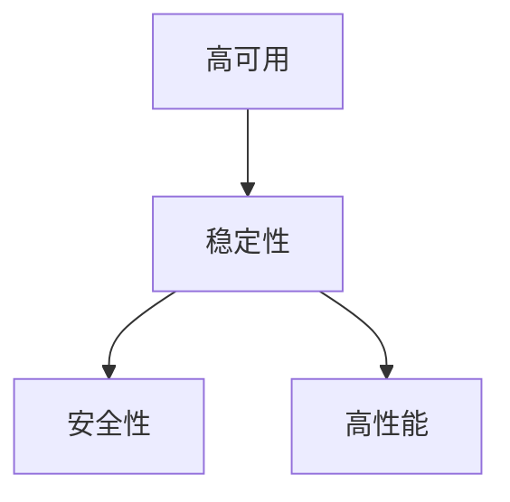

                 

## 1. 背景介绍

在当今快速发展的电子商务领域，保障电商系统的高可用、稳定性、安全性和高性能是至关重要的。本文将深入探讨电商系统的这些关键能力，并提供实用的解决方案和最佳实践。

## 2. 核心概念与联系

### 2.1 关键概念

- **高可用（High Availability，HA）**：指系统在故障发生时能够及时自动恢复，从而保证系统的可用性。
- **稳定性（Stability）**：指系统在正常运行期间不出现故障或错误，能够持续提供服务。
- **安全性（Security）**：指系统能够抵御各种安全威胁，保护系统和数据免受未授权访问和破坏。
- **高性能（High Performance）**：指系统能够快速响应用户请求，提供流畅的用户体验。

### 2.2 架构联系

电商系统的高可用、稳定性、安全性和高性能是相互关联的。例如，高可用需要稳定性作为基础，而稳定性又依赖于安全性和高性能。下图展示了这些概念的关系：



## 3. 核心算法原理 & 具体操作步骤

### 3.1 算法原理概述

在电商系统中，保障高可用、稳定性、安全性和高性能的关键是正确设计和实现系统的各个组件。这包括但不限于负载均衡、故障转移、数据库连接池、缓存、安全认证和授权、性能优化等。

### 3.2 算法步骤详解

#### 3.2.1 负载均衡

负载均衡是保障系统高可用和高性能的关键。常用的负载均衡算法包括轮询、随机、IP哈希等。下面是轮询算法的实现步骤：

1. 维护一个服务器列表。
2. 记录当前服务器索引。
3. 每次接收到请求时，根据当前索引选择服务器。
4. 请求处理完成后，索引加1，并循环使用。

#### 3.2.2 故障转移

故障转移是保障系统高可用的关键。常用的故障转移算法包括主备切换、多活集群等。下面是主备切换算法的实现步骤：

1. 维护一个主服务器和一个备服务器。
2. 主服务器处理所有请求。
3. 监控主服务器的状态。
4. 如果主服务器故障，则将备服务器切换为主服务器。

#### 3.2.3 安全认证和授权

安全认证和授权是保障系统安全性的关键。常用的认证和授权算法包括用户名/密码、令牌、OAuth等。下面是用户名/密码认证算法的实现步骤：

1. 用户输入用户名和密码。
2. 从数据库中查询用户信息。
3. 使用密码哈希算法（如BCrypt）验证密码是否匹配。
4. 如果匹配，则生成令牌并返回给用户。

### 3.3 算法优缺点

每种算法都有其优缺点。例如，轮询算法简单易行，但可能导致服务器负载不均衡；主备切换算法可以快速恢复故障，但备服务器资源可能被浪费；用户名/密码认证算法简单易行，但容易受到暴力破解攻击。

### 3.4 算法应用领域

这些算法在电商系统的各个组件中广泛应用，包括但不限于Web服务器、应用服务器、数据库服务器、缓存服务器、消息队列服务器等。

## 4. 数学模型和公式 & 详细讲解 & 举例说明

### 4.1 数学模型构建

在电商系统中，可以使用数学模型来分析和优化系统的性能。例如，可以使用Little's Law来分析系统的吞吐量和响应时间：

$$ Throughput = \frac{1}{Response\ Time} $$

### 4.2 公式推导过程

Little's Law是基于以下假设推导出来的：

1. 系统处于稳定状态。
2. 系统的输入和输出率相等。
3. 系统中的任务数量等于输入率乘以响应时间。

### 4.3 案例分析与讲解

假设电商系统的响应时间为1秒，则根据Little's Law，系统的吞吐量为每秒1个请求。如果系统需要每秒处理100个请求，则响应时间需要降低到0.1秒。

## 5. 项目实践：代码实例和详细解释说明

### 5.1 开发环境搭建

在开始编写代码之前，需要搭建开发环境。推荐使用Docker和Kubernetes来搭建开发环境，以确保开发环境与生产环境一致。

### 5.2 源代码详细实现

下面是一个简单的轮询负载均衡算法的实现示例：

```python
import random

class LoadBalancer:
    def __init__(self, servers):
        self.servers = servers
        self.index = 0

    def get_server(self):
        server = self.servers[self.index]
        self.index = (self.index + 1) % len(self.servers)
        return server
```

### 5.3 代码解读与分析

在`LoadBalancer`类中，维护一个服务器列表和当前服务器索引。每次调用`get_server`方法时，根据当前索引选择服务器，并将索引加1，循环使用。

### 5.4 运行结果展示

下面是运行示例代码的结果：

```bash
>>> lb = LoadBalancer(['server1','server2','server3'])
>>> for _ in range(10):
...     print(lb.get_server())
...
server1
server2
server3
server1
server2
server3
server1
server2
server3
server1
```

## 6. 实际应用场景

### 6.1 电商平台

在电商平台中，保障系统的高可用、稳定性、安全性和高性能是至关重要的。例如，在双十一购物狂欢节期间，系统需要承受巨大的流量压力，必须保证系统的高可用和高性能；同时，系统还需要保证用户的账号安全和交易数据安全。

### 6.2 金融系统

在金融系统中，保障系统的高可用、稳定性、安全性和高性能同样至关重要。例如，在证券交易系统中，系统需要保证实时性和高可用，以免错失交易机会；同时，系统还需要保证交易数据的安全和完整性。

### 6.3 未来应用展望

随着技术的发展，电商系统的高可用、稳定性、安全性和高性能将面临更大的挑战。例如，边缘计算技术的发展将要求系统能够在边缘设备上运行，并提供更低的延迟和更高的吞吐量；同时，人工智能和机器学习技术的发展将要求系统能够提供更智能和更个性化的服务。

## 7. 工具和资源推荐

### 7.1 学习资源推荐

- [SREOps](https://sreops.co/)：提供了大量的SRE（Site Reliability Engineering）相关资源和最佳实践。
- [Google SRE Book](https://landing.google.com/sre/books/)：由Google SRE团队编写的SRE指南。
- [Site Reliability Engineering](https://www.oreilly.com/library/view/site-reliability-engineering/9781491929123/)：一本介绍SRE的权威书籍。

### 7.2 开发工具推荐

- [Prometheus](https://prometheus.io/)：一种开源的监控和报警系统。
- [Grafana](https://grafana.com/)：一种开源的可视化平台。
- [Kubernetes](https://kubernetes.io/)：一种开源的容器编排平台。

### 7.3 相关论文推荐

- [Dynamo: Amazon's Highly Available Key-value Store](https://www.allthingsdistributed.com/files/amazon-dynamo-sigod07.pdf)
- [The Google File System](https://research.google/pubs/pub194462/)
- [Bigtable: A Distributed Storage System for Structured Data](https://static.googleusercontent.com/media/research.google.com/en//archive/bigtable-osdi06.pdf)

## 8. 总结：未来发展趋势与挑战

### 8.1 研究成果总结

本文介绍了电商系统的高可用、稳定性、安全性和高性能保障的关键概念、算法原理、数学模型和工具资源。通过实践项目和实际应用场景分析，展示了这些概念和算法在电商系统中的应用。

### 8.2 未来发展趋势

未来，电商系统的高可用、稳定性、安全性和高性能保障将面临更大的挑战。随着技术的发展，系统需要能够适应更复杂的环境和更多样的需求。例如，系统需要能够在多云环境中运行，并提供更智能和更个性化的服务。

### 8.3 面临的挑战

电商系统的高可用、稳定性、安全性和高性能保障面临的挑战包括但不限于：

- **复杂性**：电商系统通常由大量的组件组成，保障系统的高可用、稳定性、安全性和高性能是一项复杂的任务。
- **可靠性**：系统需要能够在故障发生时快速恢复，并保证数据的完整性和一致性。
- **安全性**：系统需要能够抵御各种安全威胁，保护系统和数据免受未授权访问和破坏。
- **性能**：系统需要能够快速响应用户请求，提供流畅的用户体验。

### 8.4 研究展望

未来的研究方向包括但不限于：

- **自动化运维**：开发自动化运维工具，以提高系统的可靠性和安全性。
- **弹性架构**：设计弹性架构，以适应系统的变化和扩展需求。
- **人工智能和机器学习**：开发人工智能和机器学习算法，以提供更智能和更个性化的服务。

## 9. 附录：常见问题与解答

### 9.1 问：如何保障系统的高可用？

答：可以使用故障转移算法，如主备切换或多活集群，来保障系统的高可用。

### 9.2 问：如何保障系统的稳定性？

答：可以使用负载均衡算法，如轮询或随机，来保障系统的稳定性。同时，还需要定期监控系统的状态，并及时发现和解决故障。

### 9.3 问：如何保障系统的安全性？

答：可以使用安全认证和授权算法，如用户名/密码或令牌，来保障系统的安全性。同时，还需要定期更新系统的安全补丁，并保护系统免受未授权访问和破坏。

### 9.4 问：如何保障系统的高性能？

答：可以使用性能优化算法，如缓存或数据库连接池，来保障系统的高性能。同时，还需要定期监控系统的性能，并及时发现和解决性能瓶颈。

## 作者：禅与计算机程序设计艺术 / Zen and the Art of Computer Programming

