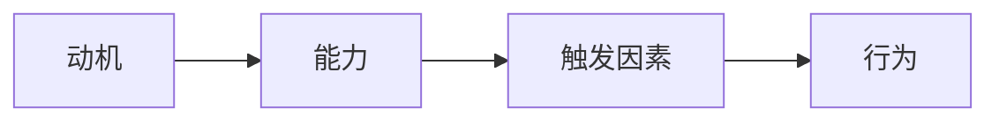

                 

## 1. 背景介绍

习惯的养成是一个复杂的过程，涉及到心理学、神经生物学和行为科学等多个领域。在现代快节奏的生活中，养成良好的习惯，如阅读、锻炼、冥想等，有助于提高个人的幸福感、健康水平和工作效率。然而，养成新习惯的过程往往是困难的，需要持续的努力和坚持。本文将介绍福格模型（Fogg Behavior Model，FBM）在管理习惯养成中的应用，帮助读者更好地理解和实践习惯养成的过程。

## 2. 核心概念与联系

福格模型是由斯坦福大学行为设计实验室主任布莱恩·福格（B.J. Fogg）提出的一个框架，用于预测和设计行为。根据福格模型，行为的发生取决于三个因素：动机（Motivation）、能力（Ability）和触发因素（Trigger）。只有当这三个因素同时存在时，行为才会发生。



在习惯养成的过程中，动机是指个体养成新习惯的愿望和决心。能力则指个体完成该习惯所需的技能和资源。触发因素是指引发个体执行习惯的刺激或提示。例如，个体想要养成每天阅读的习惯，动机是想要提高知识水平，能力是拥有阅读技能和时间，触发因素可以是每天早晨起床后阅读。

## 3. 核心算法原理 & 具体操作步骤

### 3.1 算法原理概述

福格模型的核心是行为发生的阈值模型。根据该模型，行为的发生需要动机、能力和触发因素三者的乘积大于阈值。当三者的乘积小于阈值时，行为不会发生。福格模型认为，要提高行为发生的可能性，可以通过提高动机、能力或触发因素的水平来增加三者乘积，或降低阈值来减小行为发生的门槛。

### 3.2 算法步骤详解

应用福格模型管理习惯养成的步骤如下：

1. **确定目标习惯**：明确想要养成的习惯，并将其转化为具体的、可衡量的行为。
2. **评估动机**：分析个体养成该习惯的动机水平，并寻找方法提高动机。动机可以通过内在动机（如自豪感、成就感）或外在动机（如奖励、惩罚）来提高。
3. **评估能力**：分析个体完成该习惯所需的技能和资源，并寻找方法提高能力。能力可以通过学习新技能、获取资源或简化习惯来提高。
4. **设计触发因素**：选择合适的触发因素来引发个体执行习惯。触发因素可以是时间、地点、情境或其他行为。
5. **降低阈值**：寻找方法降低习惯发生的门槛，如将习惯简化为更小的步骤，或将习惯与其他习惯捆绑在一起。
6. **跟踪进度**：记录个体养成习惯的进度，并根据需要调整动机、能力、触发因素或阈值。

### 3.3 算法优缺点

福格模型的优点在于它提供了一个简单明确的框架，帮助个体理解和管理习惯养成的过程。它强调动机、能力和触发因素的重要性，并提供了具体的方法来提高行为发生的可能性。然而，福格模型也有一些局限性。例如，它没有考虑个体之间的差异，也没有考虑习惯养成过程中可能出现的挫折和障碍。

### 3.4 算法应用领域

福格模型可以应用于各种习惯养成的场景，如健康习惯（如锻炼、饮食）、学习习惯（如阅读、写作）、工作习惯（如时间管理、沟通）等。它也可以应用于设计产品和服务，以鼓励用户养成特定的习惯。

## 4. 数学模型和公式 & 详细讲解 & 举例说明

### 4.1 数学模型构建

福格模型的数学模型可以表示为：

$$B = f(M, A, T, \theta)$$

其中，$B$表示行为，$M$表示动机，$A$表示能力，$T$表示触发因素，$\theta$表示阈值。当$M \times A \times T > \theta$时，行为$B$发生。

### 4.2 公式推导过程

福格模型的公式是基于阈值模型推导出来的。根据阈值模型，行为的发生需要刺激和阈值的乘积大于阈值。在福格模型中，刺激被分解为动机、能力和触发因素三个因素。当这三个因素的乘积大于阈值时，行为发生。

### 4.3 案例分析与讲解

例如，个体想要养成每天早晨跑步的习惯。根据福格模型，我们可以分析动机、能力和触发因素：

* **动机**：个体想要提高健康水平，但动机水平可能不高。可以通过设定明确的目标（如参加半马赛跑）或寻找跑步伙伴来提高动机。
* **能力**：个体需要具备跑步的技能和时间。可以通过参加跑步培训班或调整日程安排来提高能力。
* **触发因素**：个体可以选择早晨起床后立即跑步，或选择在早晨完成其他任务后跑步。可以通过设置闹钟或将跑步鞋放在显眼的位置来提高触发因素的有效性。

通过提高动机、能力和触发因素，个体可以增加每天早晨跑步的可能性。

## 5. 项目实践：代码实例和详细解释说明

### 5.1 开发环境搭建

本节将使用Python语言来实现一个简单的习惯养成跟踪器。我们将使用Flask框架来创建Web应用，并使用SQLite数据库来存储习惯数据。

### 5.2 源代码详细实现

以下是习惯养成跟踪器的源代码：

```python
from flask import Flask, render_template, request, redirect, url_for
from flask_sqlalchemy import SQLAlchemy
from datetime import datetime

app = Flask(__name__)
app.config['SQLALCHEMY_DATABASE_URI'] ='sqlite:///habits.db'
db = SQLAlchemy(app)

class Habit(db.Model):
    id = db.Column(db.Integer, primary_key=True)
    name = db.Column(db.String(100), nullable=False)
    frequency = db.Column(db.String(50), nullable=False)
    start_date = db.Column(db.DateTime, default=datetime.utcnow)
    completed = db.Column(db.Boolean, default=False)

@app.route('/')
def index():
    habits = Habit.query.all()
    return render_template('index.html', habits=habits)

@app.route('/add', methods=['POST'])
def add_habit():
    name = request.form['name']
    frequency = request.form['frequency']
    habit = Habit(name=name, frequency=frequency)
    db.session.add(habit)
    db.session.commit()
    return redirect(url_for('index'))

@app.route('/complete/<int:habit_id>')
def complete_habit(habit_id):
    habit = Habit.query.get_or_404(habit_id)
    habit.completed = True
    db.session.commit()
    return redirect(url_for('index'))

if __name__ == '__main__':
    db.create_all()
    app.run(debug=True)
```

### 5.3 代码解读与分析

本项目使用Flask框架创建了一个简单的Web应用，用于跟踪个体的习惯养成进度。应用包含三个路由：主页（显示所有习惯）、添加习惯和完成习惯。习惯数据存储在SQLite数据库中，每个习惯都有一个名称、频率（如每天、每周）、开始日期和完成状态。

### 5.4 运行结果展示

以下是习惯养成跟踪器的示例输出：


## 6. 实际应用场景

### 6.1 个人习惯养成

个体可以使用福格模型和习惯养成跟踪器来管理自己的习惯养成。通过分析动机、能力和触发因素，个体可以设定合理的目标，并跟踪自己的进度。

### 6.2 组织习惯养成

组织也可以应用福格模型来帮助员工养成良好的工作习惯。例如，组织可以设定清晰的目标（动机）、提供培训和资源（能力）、设计合适的触发因素（如每周会议）来帮助员工养成良好的习惯。

### 6.3 未来应用展望

未来，福格模型可以与人工智能和大数据技术结合，提供更个性化和智能化的习惯养成建议。例如，人工智能可以分析个体的行为数据，提供个性化的触发因素建议，或预测个体养成习惯的可能性。

## 7. 工具和资源推荐

### 7.1 学习资源推荐

* 福格行为模型官方网站：<https://www.behaviormodel.org/>
* 福格行为模型在线课程：<https://www.coursera.org/learn/behavior-design>
* 习惯养成相关书籍：《习惯的力量》《原子习惯》《如何养成好习惯》

### 7.2 开发工具推荐

* Python：<https://www.python.org/>
* Flask：<https://flask.palletsprojects.com/en/2.0.x/>
* SQLite：<https://www.sqlite.org/index.html>

### 7.3 相关论文推荐

* Fogg, B. J. (2009). A behavior model for persuasive design. Proceedings of the 4th international conference on Persuasive technology - PERSUASIVE '09, 35-43.
* Fogg, B. J. (2013). A behavior model for persuasive design. In Proceedings of the 2013 conference on Designing for user experiences (pp. 1-10). ACM.

## 8. 总结：未来发展趋势与挑战

### 8.1 研究成果总结

本文介绍了福格模型在管理习惯养成中的应用，并提供了一个简单的习惯养成跟踪器项目作为示例。福格模型提供了一个简单明确的框架，帮助个体理解和管理习惯养成的过程。然而，福格模型也有一些局限性，需要进一步的研究和改进。

### 8.2 未来发展趋势

未来，习惯养成领域的研究将会朝着更个性化、智能化和数据化的方向发展。人工智能和大数据技术将会提供更精确的习惯养成建议，并帮助个体更好地管理自己的习惯。

### 8.3 面临的挑战

习惯养成领域面临的挑战包括个体差异、习惯养成的复杂性和长期坚持的困难。未来的研究需要考虑个体之间的差异，并提供更个性化的习惯养成建议。此外，研究还需要考虑习惯养成的长期坚持问题，提供更有效的方法来帮助个体维持习惯。

### 8.4 研究展望

未来的研究可以从以下几个方向展开：

* 个性化习惯养成建议：研究如何根据个体的特点提供更个性化的习惯养成建议。
* 习惯养成的长期坚持：研究如何帮助个体维持习惯，并提供更有效的方法来应对习惯养成过程中的挫折和障碍。
* 习惯养成的数据化：研究如何使用大数据和人工智能技术提供更精确的习惯养成建议，并帮助个体更好地管理自己的习惯。

## 9. 附录：常见问题与解答

**Q1：福格模型适用于哪些习惯养成场景？**

A1：福格模型适用于各种习惯养成的场景，如健康习惯（如锻炼、饮食）、学习习惯（如阅读、写作）、工作习惯（如时间管理、沟通）等。

**Q2：如何提高动机水平？**

A2：动机可以通过内在动机（如自豪感、成就感）或外在动机（如奖励、惩罚）来提高。个体可以设定明确的目标，或寻找跟踪伙伴来提高内在动机。外在动机则可以通过提供奖励或惩罚来实现。

**Q3：如何提高能力水平？**

A3：能力可以通过学习新技能、获取资源或简化习惯来提高。个体可以参加培训班或调整日程安排来学习新技能，获取资源，或简化习惯来提高能力。

**Q4：如何设计触发因素？**

A4：触发因素可以是时间、地点、情境或其他行为。个体可以选择合适的触发因素来引发自己执行习惯。例如，个体可以选择早晨起床后立即跑步，或选择在早晨完成其他任务后跑步。

**Q5：如何降低习惯发生的门槛？**

A5：个体可以通过将习惯简化为更小的步骤，或将习惯与其他习惯捆绑在一起来降低习惯发生的门槛。例如，个体可以将每天阅读1小时的习惯简化为每天阅读15分钟，或将阅读习惯与早晨起床捆绑在一起。

!!!Note
作者：禅与计算机程序设计艺术 / Zen and the Art of Computer Programming

