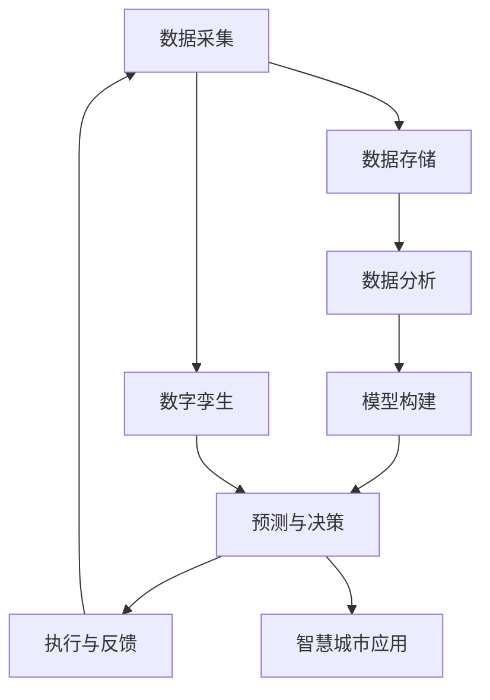

                 

**关键词：科技创新、社会治理、数字化转型、人工智能、大数据、智慧城市、数字孪生**

## 1. 背景介绍

在当今快速变化的世界中，科技创新正在各行各业掀起一场革命，社会治理也不例外。随着互联网、人工智能、物联网、大数据等技术的发展，数字化转型已经成为各国政府和城市管理者的共同目标。本文将探讨科技创新如何为社会治理带来新的思路和解决方案，重点关注人工智能、大数据和数字孪生等前沿技术在智慧城市建设中的应用。

## 2. 核心概念与联系

### 2.1 关键概念

- **智慧城市（Smart City）**：利用信息和通信技术（ICT）连接城市各个领域，实现可持续发展和高效治理的城市。
- **人工智能（AI）**：模拟人类智能的计算机系统，能够学习、推理和解决复杂问题的技术。
- **大数据（Big Data）**：规模巨大、复杂度高、速度快、价值密度低的数据集，需要新的处理和分析方法。
- **数字孪生（Digital Twin）**：利用物联网、传感器和数字模型，实时映射和模拟物理世界的数字副本。

### 2.2 核心概念联系 Mermaid 流程图



## 3. 核心算法原理 & 具体操作步骤

### 3.1 算法原理概述

本节将介绍两种关键算法：决策树和神经网络，它们在智慧城市应用中广泛用于数据分析和预测。

### 3.2 算法步骤详解

#### 3.2.1 决策树（Decision Tree）

1. 选择最重要的特征，将数据集分成两个子集。
2. 对每个子集重复步骤1，直到所有数据都被分类。
3. 创建决策树，其中每个内部节点表示一个特征，每个分支表示特征的可能值，每个叶子节点表示一个类别。

#### 3.2.2 神经网络（Neural Network）

1. 初始化权重和偏置。
2. 正向传播：输入数据通过网络，计算每层神经元的输出。
3. 计算误差：比较网络输出和真实值，计算误差。
4. 反向传播：根据误差调整权重和偏置。
5. 重复步骤2-4，直到误差小于阈值或达到最大迭代次数。

### 3.3 算法优缺点

| 算法 | 优点 | 缺点 |
| --- | --- | --- |
| 决策树 | 可解释性高、易于理解和构建 | 易过拟合、不适合连续值特征 |
| 神经网络 | 适合复杂非线性问题、自动学习特征 | 可解释性低、训练时间长 |

### 3.4 算法应用领域

决策树和神经网络在智慧城市应用中广泛用于交通预测、环境监测、能源管理等领域。

## 4. 数学模型和公式 & 详细讲解 & 举例说明

### 4.1 数学模型构建

#### 4.1.1 决策树模型

决策树模型基于信息增益或基尼系数构建。信息增益衡量特征对目标变量的不确定性减少，基尼系数衡量特征对目标变量的纯度。

#### 4.1.2 神经网络模型

神经网络模型基于误差反向传播算法构建，使用梯度下降优化权重和偏置。激活函数（如ReLU、sigmoid）引入非线性，使网络能够学习复杂模式。

### 4.2 公式推导过程

#### 4.2.1 决策树模型公式

信息增益：
$$Gain(S, A) = H(S) - H(S|A)$$
基尼系数：
$$Gini(S) = \sum_{i=1}^{c} p_i(1 - p_i)$$
其中，$H(S)$是数据集$S$的熵，$p_i$是类别$i$的概率，$c$是类别数。

#### 4.2.2 神经网络模型公式

误差函数（如均方误差）：
$$E = \frac{1}{2} \sum (y_i - \hat{y}_i)^2$$
梯度下降更新规则：
$$\theta_{ij} := \theta_{ij} - \eta \frac{\partial E}{\partial \theta_{ij}}$$
其中，$\theta_{ij}$是权重，$y_i$是真实值，$\hat{y}_i$是预测值，$\eta$是学习率。

### 4.3 案例分析与讲解

假设我们要构建一个决策树模型预测城市交通拥堵。特征包括天气、时间、交通事故等，目标变量是拥堵等级。我们可以使用信息增益或基尼系数选择最重要的特征，然后递归构建决策树。

## 5. 项目实践：代码实例和详细解释说明

### 5.1 开发环境搭建

本项目使用Python、Scikit-learn和TensorFlow库。我们需要安装以下依赖项：

```bash
pip install pandas numpy scikit-learn tensorflow
```

### 5.2 源代码详细实现

#### 5.2.1 决策树实现

```python
from sklearn.model_selection import train_test_split
from sklearn.tree import DecisionTreeClassifier
from sklearn.metrics import accuracy_score

# 加载数据
X, y = load_data()

# 分割数据集
X_train, X_test, y_train, y_test = train_test_split(X, y, test_size=0.2, random_state=42)

# 构建决策树模型
dt = DecisionTreeClassifier(random_state=42)
dt.fit(X_train, y_train)

# 预测并评估模型
y_pred = dt.predict(X_test)
print("Accuracy:", accuracy_score(y_test, y_pred))
```

#### 5.2.2 神经网络实现

```python
import tensorflow as tf
from tensorflow.keras.models import Sequential
from tensorflow.keras.layers import Dense

# 构建神经网络模型
model = Sequential()
model.add(Dense(64, activation='relu', input_shape=(X_train.shape[1],)))
model.add(Dense(64, activation='relu'))
model.add(Dense(1, activation='sigmoid'))

# 编译模型
model.compile(optimizer='adam', loss='binary_crossentropy', metrics=['accuracy'])

# 训练模型
model.fit(X_train, y_train, epochs=10, batch_size=32, validation_data=(X_test, y_test))

# 预测并评估模型
y_pred = model.predict_classes(X_test)
print("Accuracy:", accuracy_score(y_test, y_pred))
```

### 5.3 代码解读与分析

 decision tree code:
- `load_data()`函数加载数据集。
- `train_test_split()`函数将数据集分成训练集和测试集。
- `DecisionTreeClassifier()`函数构建决策树模型。
- `fit()`方法训练模型。
- `predict()`方法预测测试集的目标变量。
- `accuracy_score()`函数评估模型准确性。

 neural network code:
- `Sequential()`函数构建神经网络模型。
- `Dense()`函数添加全连接层。
- `compile()`方法编译模型，指定优化器、损失函数和评估指标。
- `fit()`方法训练模型。
- `predict_classes()`方法预测测试集的目标变量。
- `accuracy_score()`函数评估模型准确性。

### 5.4 运行结果展示

运行上述代码后，您将看到决策树和神经网络模型的准确性。准确性越高，模型性能越好。

## 6. 实际应用场景

### 6.1 智慧交通

决策树和神经网络可以用于预测交通拥堵、优化交通信号灯时长、规划公共交通路线等。

### 6.2 智慧环境

这些算法还可以用于环境监测，如空气质量预测、水质监测、垃圾分类等。

### 6.3 智慧能源

在能源管理领域，这些算法可以用于预测能源需求、优化能源分配、规划可再生能源布局等。

### 6.4 未来应用展望

随着技术的发展，人工智能和大数据在智慧城市中的应用将更加广泛。数字孪生技术将帮助城市管理者实时监控和优化城市基础设施。未来，智慧城市将更加智能、可持续和宜居。

## 7. 工具和资源推荐

### 7.1 学习资源推荐

- 书籍：《人工智能：一种现代 Approach》作者：斯图尔特·罗素、彼得·诺维格
- 课程：[Coursera - 机器学习](https://www.coursera.org/learn/machine-learning)
- 课程：[Udacity - 机器学习工程师纳米学位](https://www.udacity.com/course/machine-learning-engineer-nanodegree-foundation--nd009)

### 7.2 开发工具推荐

- Python：[Anaconda](https://www.anaconda.com/)
- R：[RStudio](https://www.rstudio.com/)
- TensorFlow：[TensorFlow](https://www.tensorflow.org/)
- Scikit-learn：[Scikit-learn](https://scikit-learn.org/)

### 7.3 相关论文推荐

- [智慧城市：概念、挑战和未来研究方向](https://ieeexplore.ieee.org/document/7924867)
- [人工智能在智慧城市中的应用：回顾和展望](https://link.springer.com/chapter/10.1007/978-981-15-6012-5_12)

## 8. 总结：未来发展趋势与挑战

### 8.1 研究成果总结

本文介绍了人工智能、大数据和数字孪生等前沿技术在智慧城市建设中的应用。我们讨论了决策树和神经网络等关键算法，并提供了项目实践和代码示例。

### 8.2 未来发展趋势

未来，智慧城市将更加智能化、数字化和可持续化。人工智能、物联网、5G和边缘计算等技术将推动智慧城市的发展。数字孪生技术将帮助城市管理者实时监控和优化城市基础设施。

### 8.3 面临的挑战

智慧城市建设面临的挑战包括数据安全、隐私保护、数字鸿沟、技术更新换代等。此外，智慧城市需要平衡技术发展和人文关怀，确保城市居民的福祉和幸福感。

### 8.4 研究展望

未来的研究将关注智慧城市的可持续发展、人文关怀和技术创新。我们需要开发更智能、更可靠、更安全的技术，帮助城市管理者实现可持续发展和高效治理。

## 9. 附录：常见问题与解答

**Q：什么是智慧城市？**

A：智慧城市是利用信息和通信技术（ICT）连接城市各个领域，实现可持续发展和高效治理的城市。

**Q：人工智能在智慧城市中的应用有哪些？**

A：人工智能在智慧城市中的应用包括交通预测、环境监测、能源管理、公共服务优化等。

**Q：数字孪生技术是什么？**

A：数字孪生技术是利用物联网、传感器和数字模型，实时映射和模拟物理世界的数字副本。

**Q：决策树和神经网络有什么区别？**

A：决策树易于理解和构建，但易过拟合，不适合连续值特征。神经网络适合复杂非线性问题，自动学习特征，但可解释性低，训练时间长。

**Q：如何构建决策树模型？**

A：决策树模型基于信息增益或基尼系数构建，选择最重要的特征，递归构建决策树。

**Q：如何构建神经网络模型？**

A：神经网络模型基于误差反向传播算法构建，使用梯度下降优化权重和偏置，引入非线性激活函数。

---

**作者：禅与计算机程序设计艺术 / Zen and the Art of Computer Programming**

