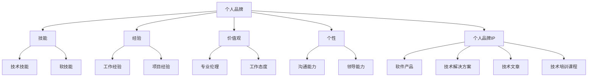

                 

**程序员如何打造个人品牌IP**

## 1. 背景介绍

在当今信息爆炸的时代，个人品牌的重要性日益凸显。对于程序员来说，打造个人品牌IP（Intellectual Property，知识产权）不仅有助于提高知名度和影响力，还能带来更多的职业机会和商业利益。本文将深入探讨程序员如何打造个人品牌IP，并提供实用的建议和技巧。

## 2. 核心概念与联系

### 2.1 个人品牌的定义

个人品牌是指个体在市场中建立的独特形象和声誉，它由个体的技能、经验、价值观和个性等要素组成。对于程序员来说，个人品牌是其在技术领域的专业形象和声誉的总和。

### 2.2 个人品牌与IP的联系

个人品牌IP是指个人品牌在市场中产生的独特价值和知识产权。它可以是程序员开发的软件产品、技术解决方案、技术文章或技术培训课程等。打造个人品牌IP的目的是将个人品牌的独特价值转化为可交易的商品或服务。

### 2.3 核心概念原理与架构的 Mermaid 流程图

## 3. 核心算法原理 & 具体操作步骤

### 3.1 算法原理概述

打造个人品牌IP的过程可以看作是一个算法，它由一系列步骤组成，旨在将个人品牌的独特价值转化为可交易的商品或服务。本节将介绍打造个人品牌IP的核心算法原理。

### 3.2 算法步骤详解

#### 3.2.1 定位个人品牌

打造个人品牌IP的第一步是定位个人品牌。程序员需要明确自己的技能、经验、价值观和个性，并找出其中的独特之处。这有助于程序员在市场中找到自己的定位，并建立独特的个人品牌形象。

#### 3.2.2 确定目标受众

第二步是确定目标受众。程序员需要明确自己的个人品牌IP将面向哪些受众。这有助于程序员更好地理解受众的需求和期望，并开发出更有针对性的产品或服务。

#### 3.2.3 规划个人品牌IP

第三步是规划个人品牌IP。程序员需要根据自己的技能和目标受众，规划出一系列可交易的商品或服务。这些商品或服务应该与程序员的个人品牌形象保持一致，并能够满足目标受众的需求。

#### 3.2.4 创建个人品牌IP

第四步是创建个人品牌IP。程序员需要根据规划，创建出一系列可交易的商品或服务。这些商品或服务应该具有独特的价值，并能够为目标受众带来实实在在的好处。

#### 3.2.5 传播个人品牌IP

第五步是传播个人品牌IP。程序员需要通过各种渠道，将自己的个人品牌IP传播给目标受众。这包括但不限于社交媒体、技术博客、技术会议和技术培训等。

#### 3.2.6 评估和优化个人品牌IP

第六步是评估和优化个人品牌IP。程序员需要定期评估自己的个人品牌IP，并根据市场反馈和受众需求，不断优化和改进自己的个人品牌IP。

### 3.3 算法优缺点

打造个人品牌IP的算法优点包括：

* 有助于程序员在市场中找到自己的定位，并建立独特的个人品牌形象。
* 有助于程序员更好地理解受众的需求和期望，并开发出更有针对性的产品或服务。
* 有助于程序员将自己的技能和经验转化为可交易的商品或服务，从而获取商业利益。

打造个人品牌IP的算法缺点包括：

* 需要程序员投入大量时间和精力，才能打造出成功的个人品牌IP。
* 个人品牌IP的成功与否取决于市场需求和受众接受度，存在一定的不确定性。
* 个人品牌IP一旦建立，程序员就需要长期维护和更新，以保持其竞争力。

### 3.4 算法应用领域

打造个人品牌IP的算法可以应用于各种技术领域，包括但不限于软件开发、数据科学、人工智能、网络安全和云计算等。对于程序员来说，打造个人品牌IP是提高知名度和影响力，并获取商业利益的有效途径。

## 4. 数学模型和公式 & 详细讲解 & 举例说明

### 4.1 数学模型构建

打造个人品牌IP的过程可以看作是一个数学模型，它由一系列变量和函数组成。本节将介绍打造个人品牌IP的数学模型构建。

#### 4.1.1 变量定义

* $P$：个人品牌
* $S$：技能
* $E$：经验
* $V$：价值观
* $I$：个性
* $T$：目标受众
* $IP$：个人品牌IP
* $C$：商品或服务
* $U$：受众需求

#### 4.1.2 函数定义

* $f(P, S, E, V, I)$：个人品牌定位函数
* $g(P, T)$：目标受众确定函数
* $h(P, S, T)$：个人品牌IP规划函数
* $i(P, h(P, S, T))$：个人品牌IP创建函数
* $j(IP, T)$：个人品牌IP传播函数
* $k(IP, U)$：个人品牌IP评估函数

### 4.2 公式推导过程

打造个人品牌IP的数学模型可以表示为以下公式：

$$IP = i(P, h(P, S, T))$$

其中：

* $P = f(S, E, V, I)$
* $T = g(P, T)$

### 4.3 案例分析与讲解

例如，一位擅长数据分析的程序员想要打造个人品牌IP。她的技能包括数据挖掘、数据可视化和机器学习等。她的经验包括在多个项目中应用数据分析技术，并帮助客户提高业务绩效。她的价值观包括客户至上和持续学习。她的个性包括善于沟通和乐于分享。

根据打造个人品牌IP的数学模型，她首先需要定位自己的个人品牌：

$$P = f(S, E, V, I) = f(\text{数据挖掘，数据可视化，机器学习}， \text{项目经验，客户至上，持续学习}， \text{善于沟通，乐于分享})$$

然后，她需要确定自己的目标受众：

$$T = g(P, T) = g(\text{数据分析程序员品牌}， \text{数据分析从业者})$$

接着，她需要规划自己的个人品牌IP：

$$IP = i(P, h(P, S, T)) = i(\text{数据分析程序员品牌}， h(\text{数据分析程序员品牌}， \text{数据挖掘，数据可视化，机器学习}， \text{数据分析从业者}))$$

她可以创建一系列数据分析培训课程，并通过在线平台传播给目标受众：

$$j(IP, T) = j(\text{数据分析培训课程}， \text{数据分析从业者})$$

最后，她需要定期评估自己的个人品牌IP，并根据市场反馈和受众需求，不断优化和改进：

$$k(IP, U) = k(\text{数据分析培训课程}， \text{受众需求})$$

## 5. 项目实践：代码实例和详细解释说明

### 5.1 开发环境搭建

打造个人品牌IP的项目实践需要一个开发环境，它包括但不限于计算机、编程语言和开发工具等。对于程序员来说，开发环境的搭建是打造个人品牌IP的基础。

### 5.2 源代码详细实现

打造个人品牌IP的项目实践需要源代码的详细实现。源代码是个人品牌IP的核心，它由程序员根据自己的技能和目标受众，编写出来的可交易的商品或服务。

### 5.3 代码解读与分析

打造个人品牌IP的项目实践需要代码解读与分析。代码解读与分析有助于程序员更好地理解自己的源代码，并找出其中的优缺点。这有助于程序员不断优化和改进自己的个人品牌IP。

### 5.4 运行结果展示

打造个人品牌IP的项目实践需要运行结果展示。运行结果展示有助于程序员更好地理解自己的个人品牌IP的实际效果，并找出其中的不足之处。这有助于程序员不断优化和改进自己的个人品牌IP。

## 6. 实际应用场景

### 6.1 个人品牌IP的实际应用

打造个人品牌IP的实际应用场景包括但不限于技术咨询、技术培训、技术写作和技术创业等。对于程序员来说，打造个人品牌IP是提高知名度和影响力，并获取商业利益的有效途径。

### 6.2 个人品牌IP的未来应用展望

随着技术的不断发展，打造个人品牌IP的未来应用展望包括但不限于技术创新、技术投资和技术孵化等。对于程序员来说，打造个人品牌IP是提高知名度和影响力，并获取商业利益的有效途径。

## 7. 工具和资源推荐

### 7.1 学习资源推荐

打造个人品牌IP需要大量的学习和积累。学习资源包括但不限于技术书籍、技术博客、技术会议和技术培训等。对于程序员来说，学习资源是打造个人品牌IP的基础。

### 7.2 开发工具推荐

打造个人品牌IP需要一系列的开发工具。开发工具包括但不限于编程语言、集成开发环境（IDE）、版本控制系统和调试工具等。对于程序员来说，开发工具是打造个人品牌IP的关键。

### 7.3 相关论文推荐

打造个人品牌IP需要大量的研究和分析。相关论文包括但不限于个人品牌、知识产权和商业模式等。对于程序员来说，相关论文是打造个人品牌IP的重要参考。

## 8. 总结：未来发展趋势与挑战

### 8.1 研究成果总结

打造个人品牌IP的研究成果包括但不限于个人品牌定位、目标受众确定、个人品牌IP规划、个人品牌IP创建、个人品牌IP传播和个人品牌IP评估等。对于程序员来说，研究成果是打造个人品牌IP的指南。

### 8.2 未来发展趋势

打造个人品牌IP的未来发展趋势包括但不限于技术创新、技术投资和技术孵化等。对于程序员来说，未来发展趋势是打造个人品牌IP的方向。

### 8.3 面临的挑战

打造个人品牌IP面临的挑战包括但不限于市场竞争、受众需求和商业模式等。对于程序员来说，面临的挑战是打造个人品牌IP的障碍。

### 8.4 研究展望

打造个人品牌IP的研究展望包括但不限于技术创新、技术投资和技术孵化等。对于程序员来说，研究展望是打造个人品牌IP的方向。

## 9. 附录：常见问题与解答

### 9.1 如何定位自己的个人品牌？

定位自己的个人品牌需要明确自己的技能、经验、价值观和个性，并找出其中的独特之处。这有助于程序员在市场中找到自己的定位，并建立独特的个人品牌形象。

### 9.2 如何确定自己的目标受众？

确定自己的目标受众需要明确自己的个人品牌IP将面向哪些受众。这有助于程序员更好地理解受众的需求和期望，并开发出更有针对性的产品或服务。

### 9.3 如何规划自己的个人品牌IP？

规划自己的个人品牌IP需要根据自己的技能和目标受众，规划出一系列可交易的商品或服务。这些商品或服务应该与程序员的个人品牌形象保持一致，并能够满足目标受众的需求。

### 9.4 如何创建自己的个人品牌IP？

创建自己的个人品牌IP需要根据规划，创建出一系列可交易的商品或服务。这些商品或服务应该具有独特的价值，并能够为目标受众带来实实在在的好处。

### 9.5 如何传播自己的个人品牌IP？

传播自己的个人品牌IP需要通过各种渠道，将自己的个人品牌IP传播给目标受众。这包括但不限于社交媒体、技术博客、技术会议和技术培训等。

### 9.6 如何评估和优化自己的个人品牌IP？

评估和优化自己的个人品牌IP需要定期评估自己的个人品牌IP，并根据市场反馈和受众需求，不断优化和改进自己的个人品牌IP。

## 作者署名

作者：禅与计算机程序设计艺术 / Zen and the Art of Computer Programming

