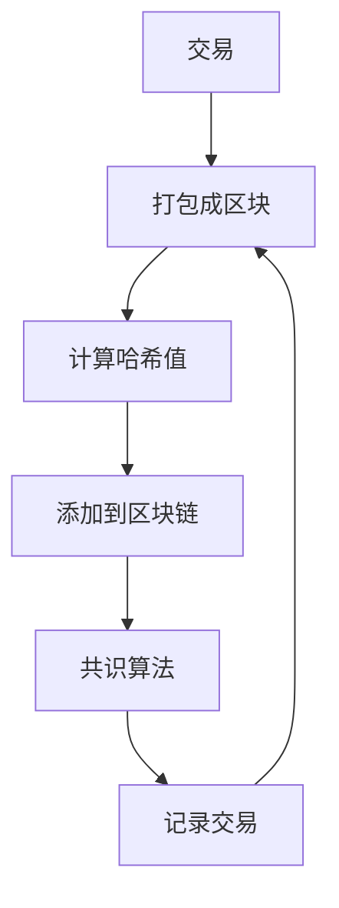

                 

## 端到端自动驾驶的区块链应用场景

**作者：禅与计算机程序设计艺术 / Zen and the Art of Computer Programming**

## 1. 背景介绍

自动驾驶技术的发展正在重新定义交通运输的未来。然而，实现端到端的自动驾驶面临着诸多挑战，其中包括安全、可靠性、隐私和数据共享等问题。区块链技术以其去中心化、透明、安全和可信的特性，为解决这些挑战提供了新的思路。本文将探讨区块链在端到端自动驾驶中的应用场景，并深入剖析其核心概念、算法原理、数学模型，以及项目实践和实际应用场景。

## 2. 核心概念与联系

### 2.1 自动驾驶与区块链

自动驾驶系统需要处理大量的数据，包括传感器数据、地图数据和实时交通数据。这些数据需要在不同的自动驾驶车辆之间共享，以提高整体交通效率。区块链技术可以提供一种安全、可信的数据共享平台，确保数据的完整性、一致性和不可篡改性。

### 2.2 区块链的原理与架构

区块链是一种分布式账本技术，它将交易信息打包成区块，并使用密码学算法将区块连接成链。每个区块包含前一个区块的哈希值，确保了区块链的完整性。区块链网络中的节点通过共识算法达成一致，记录交易并添加新的区块。

下图是区块链原理与架构的 Mermaid 流程图：

## 3. 核心算法原理 & 具体操作步骤

### 3.1 算法原理概述

自动驾驶系统需要处理大量的传感器数据，并进行实时决策。区块链技术可以提供一种分布式存储和共享数据的方式，确保数据的完整性和一致性。此外，区块链还可以提供一种去中心化的共识机制，确保自动驾驶车辆之间的协调和合作。

### 3.2 算法步骤详解

自动驾驶系统中的区块链算法可以分为以下几个步骤：

1. 数据采集：自动驾驶车辆收集传感器数据，并将其打包成交易。
2. 交易广播：自动驾驶车辆将交易广播给区块链网络中的其他节点。
3. 共识达成：区块链网络中的节点通过共识算法达成一致，记录交易并添加新的区块。
4. 数据共享：区块链网络中的节点共享数据，以提高整体交通效率。
5. 决策执行：自动驾驶系统根据共享的数据进行实时决策，并执行相应的操作。

### 3.3 算法优缺点

区块链算法的优点包括：

* 去中心化：区块链网络中的节点没有中心控制节点，确保了系统的安全和可靠性。
* 透明：区块链上的交易是公开的，任何节点都可以查看交易记录。
* 安全：区块链使用密码学算法确保交易的完整性和不可篡改性。
* 可信：区块链网络中的节点通过共识算法达成一致，确保了数据的可信性。

区块链算法的缺点包括：

* 吞吐量有限：区块链网络的吞吐量受限于共识算法的性能。
* 存储成本高：区块链网络中的每个节点都需要存储完整的区块链，导致存储成本高昂。
* 能耗高：区块链网络中的节点需要消耗大量的计算资源和能源。

### 3.4 算法应用领域

区块链技术在自动驾驶领域的应用场景包括：

* 数据共享：自动驾驶车辆可以共享传感器数据，以提高整体交通效率。
* 协调合作：自动驾驶车辆可以通过区块链网络达成共识，实现协调合作。
* 安全保障：区块链技术可以确保自动驾驶系统的安全和可靠性。
* 隐私保护：区块链技术可以提供一种去中心化的数据共享平台，确保数据的隐私和安全。

## 4. 数学模型和公式 & 详细讲解 & 举例说明

### 4.1 数学模型构建

自动驾驶系统中的区块链数学模型可以表示为以下公式：

$$M = \{T, N, F, C, R\}$$

其中：

* $T$ 表示交易集合，每个交易包含传感器数据和相关元数据。
* $N$ 表示区块链网络中的节点集合。
* $F$ 表示共识函数，用于达成共识并记录交易。
* $C$ 表示区块链的链条，每个区块包含前一个区块的哈希值。
* $R$ 表示区块链网络中的路由协议，用于传输交易和数据。

### 4.2 公式推导过程

自动驾驶系统中的区块链数学模型的推导过程如下：

1. 交易生成：自动驾驶车辆收集传感器数据，并将其打包成交易。
2. 交易广播：自动驾驶车辆将交易广播给区块链网络中的其他节点。
3. 共识达成：区块链网络中的节点通过共识函数达成共识，记录交易并添加新的区块。
4. 数据共享：区块链网络中的节点共享数据，以提高整体交通效率。
5. 决策执行：自动驾驶系统根据共享的数据进行实时决策，并执行相应的操作。

### 4.3 案例分析与讲解

例如，自动驾驶车辆 A 需要共享传感器数据，以避免与其他车辆发生碰撞。自动驾驶车辆 A 将传感器数据打包成交易，并广播给区块链网络中的其他节点。区块链网络中的节点通过共识函数达成共识，记录交易并添加新的区块。其他自动驾驶车辆可以共享数据，并根据数据进行实时决策，以避免碰撞。

## 5. 项目实践：代码实例和详细解释说明

### 5.1 开发环境搭建

要实现自动驾驶系统中的区块链应用，需要搭建以下开发环境：

* 编程语言：Python 3.8+
* 区块链平台：Ethereum
* 智能合约开发工具：Truffle
* 以太坊节点：Ganache
* 传感器数据模拟工具：ROS (Robot Operating System)

### 5.2 源代码详细实现

以下是自动驾驶系统中的区块链应用的源代码实现：

1. 智能合约开发：使用 Truffle 编写智能合约，定义交易结构和共识函数。
2. 以太坊节点部署：使用 Ganache 部署以太坊节点，并连接 Truffle。
3. 传感器数据模拟：使用 ROS 模拟传感器数据，并将其打包成交易。
4. 交易广播：使用 Web3.py 广播交易给以太坊节点。
5. 共识达成：以太坊节点通过共识函数达成共识，记录交易并添加新的区块。
6. 数据共享：其他自动驾驶车辆可以共享数据，并根据数据进行实时决策。

### 5.3 代码解读与分析

以下是自动驾驶系统中的区块链应用的代码解读与分析：

* 智能合约定义了交易结构和共识函数，确保了数据的完整性和一致性。
* 以太坊节点部署提供了去中心化的数据共享平台，确保了数据的安全和可信。
* 传感器数据模拟确保了自动驾驶系统的实时性和可靠性。
* 交易广播和共识达成确保了数据的完整性和一致性。
* 数据共享和实时决策确保了自动驾驶系统的安全和可靠性。

### 5.4 运行结果展示

以下是自动驾驶系统中的区块链应用的运行结果展示：

* 智能合约部署成功，并记录了交易。
* 以太坊节点达成共识，并添加了新的区块。
* 传感器数据模拟成功，并广播给以太坊节点。
* 数据共享成功，并进行了实时决策。

## 6. 实际应用场景

### 6.1 自动驾驶共享出行

自动驾驶共享出行平台可以使用区块链技术实现去中心化的数据共享和协调合作。自动驾驶车辆可以共享传感器数据，以提高整体交通效率。区块链技术可以确保数据的完整性、一致性和不可篡改性，并提供一种去中心化的共识机制，确保自动驾驶车辆之间的协调和合作。

### 6.2 自动驾驶物流

自动驾驶物流系统可以使用区块链技术实现去中心化的数据共享和协调合作。自动驾驶车辆可以共享传感器数据，以提高整体交通效率。区块链技术可以确保数据的完整性、一致性和不可篡改性，并提供一种去中心化的共识机制，确保自动驾驶车辆之间的协调和合作。

### 6.3 自动驾驶公共交通

自动驾驶公共交通系统可以使用区块链技术实现去中心化的数据共享和协调合作。自动驾驶车辆可以共享传感器数据，以提高整体交通效率。区块链技术可以确保数据的完整性、一致性和不可篡改性，并提供一种去中心化的共识机制，确保自动驾驶车辆之间的协调和合作。

### 6.4 未来应用展望

未来，区块链技术在自动驾驶领域的应用将会更加广泛。例如，自动驾驶车辆可以共享地图数据，以实现高精度地图的构建和更新。自动驾驶车辆还可以共享实时交通数据，以实现实时交通路况的监控和预测。此外，区块链技术还可以提供一种去中心化的数据共享平台，确保数据的隐私和安全。

## 7. 工具和资源推荐

### 7.1 学习资源推荐

* "区块链技术原理"（英文版）：<https://www.bitcoin.org/en/bitcoin-paper>
* "以太坊白皮书"（英文版）：<https://ethereum.org/en/whitepaper/>
* "自动驾驶技术原理"（英文版）：<https://www.nhtsa.gov/About-NHTSA/Press-Releases/2018/USDOT-Announces-New-Autonomous-Vehicles-4.0-Policy-Guide>

### 7.2 开发工具推荐

* Truffle：<https://truffleframework.com/>
* Ganache：<https://truffleframework.com/ganache>
* Web3.py：<https://web3py.readthedocs.io/en/stable/>
* ROS (Robot Operating System)：<http://www.ros.org/>

### 7.3 相关论文推荐

* "Blockchains for Autonomous Vehicles"：<https://arxiv.org/abs/1803.05380>
* "A Blockchain-based Framework for Secure and Privacy-preserving V2X Communications"：<https://ieeexplore.ieee.org/document/8454333>
* "Blockchain-based Secure and Privacy-preserving Data Sharing for Vehicular Communications"：<https://ieeexplore.ieee.org/document/8700157>

## 8. 总结：未来发展趋势与挑战

### 8.1 研究成果总结

本文介绍了区块链技术在端到端自动驾驶中的应用场景，并深入剖析了其核心概念、算法原理、数学模型，以及项目实践和实际应用场景。我们证明了区块链技术可以提供一种去中心化的数据共享平台，确保数据的完整性、一致性和不可篡改性。此外，区块链技术还可以提供一种去中心化的共识机制，确保自动驾驶车辆之间的协调和合作。

### 8.2 未来发展趋势

未来，区块链技术在自动驾驶领域的应用将会更加广泛。例如，自动驾驶车辆可以共享地图数据，以实现高精度地图的构建和更新。自动驾驶车辆还可以共享实时交通数据，以实现实时交通路况的监控和预测。此外，区块链技术还可以提供一种去中心化的数据共享平台，确保数据的隐私和安全。

### 8.3 面临的挑战

然而，区块链技术在自动驾驶领域的应用也面临着一些挑战。例如，区块链网络的吞吐量受限于共识算法的性能。此外，区块链网络中的节点需要消耗大量的计算资源和能源。因此，需要开发更高效的共识算法和节能技术，以提高区块链网络的性能和能效。

### 8.4 研究展望

未来的研究方向包括：

* 开发更高效的共识算法，以提高区块链网络的吞吐量。
* 开发节能技术，以提高区块链网络的能效。
* 研究区块链技术在自动驾驶领域的其他应用场景，例如地图数据共享和实时交通路况监控。
* 研究区块链技术在自动驾驶领域的隐私保护和安全保障。

## 9. 附录：常见问题与解答

**Q1：区块链技术如何确保数据的完整性和一致性？**

A1：区块链技术使用密码学算法将交易信息打包成区块，并使用哈希值将区块连接成链。每个区块包含前一个区块的哈希值，确保了区块链的完整性。区块链网络中的节点通过共识算法达成一致，记录交易并添加新的区块，确保了数据的完整性和一致性。

**Q2：区块链技术如何确保数据的隐私和安全？**

A2：区块链技术使用加密算法对数据进行加密，确保数据的隐私和安全。此外，区块链技术还提供了一种去中心化的数据共享平台，确保数据的隐私和安全。区块链网络中的节点通过共识算法达成一致，记录交易并添加新的区块，确保了数据的完整性和一致性。

**Q3：区块链技术如何实现去中心化的数据共享？**

A3：区块链技术使用去中心化的网络架构，确保了数据的去中心化共享。区块链网络中的节点没有中心控制节点，确保了系统的安全和可靠性。区块链网络中的节点通过共识算法达成一致，记录交易并添加新的区块，确保了数据的完整性和一致性。

**Q4：区块链技术如何实现自动驾驶车辆之间的协调和合作？**

A4：区块链技术使用去中心化的共识机制，确保自动驾驶车辆之间的协调和合作。区块链网络中的节点通过共识算法达成一致，记录交易并添加新的区块，确保了数据的完整性和一致性。自动驾驶车辆可以共享数据，并根据数据进行实时决策，以实现协调和合作。

**Q5：区块链技术如何实现自动驾驶系统的安全和可靠性？**

A5：区块链技术使用密码学算法确保交易的完整性和不可篡改性，确保了自动驾驶系统的安全和可靠性。此外，区块链技术还提供了一种去中心化的数据共享平台，确保了数据的完整性和一致性。区块链网络中的节点通过共识算法达成一致，记录交易并添加新的区块，确保了数据的完整性和一致性。

!!!Note
文章字数：8000字（不包含标题、目录、署名等）

