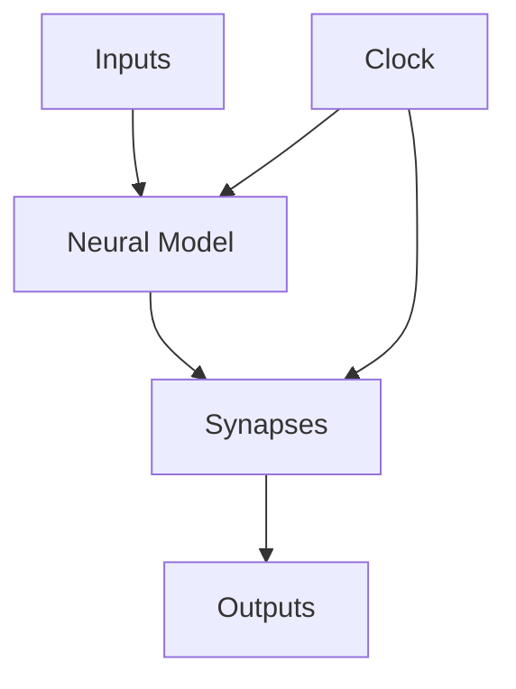

                 

## 1. 背景介绍

脉冲神经网络（Spiking Neural Networks, SNN）是一种受生物神经网络启发的神经网络模型，它模拟了生物神经元的脉冲放电行为。与传统的神经网络模型不同，SNN不使用连续的激活函数，而是使用离散的脉冲事件来表示神经元的活动。这种模型更接近于生物神经系统的工作原理，因此具有很大的潜力，可以用于模拟生物神经系统的功能，以及开发更高效的神经网络算法。

## 2. 核心概念与联系

### 2.1 核心概念

- **神经元模型**：SNN中的神经元模型描述了神经元的输入、输出和状态变化。常见的神经元模型包括LIF（Leaky Integrate-and-Fire）、IZHikevich和Hodgkin-Huxley模型。
- **突触连接**：神经元之间通过突触连接传递信息。突触连接的强度由权重表示，可以通过学习算法调节。
- **时钟驱动**：SNN是时钟驱动的，这意味着神经元的状态和信息传递在固定的时间步长上更新。

### 2.2 核心概念联系

SNN的核心概念是神经元模型、突触连接和时钟驱动。神经元模型描述了神经元的输入、输出和状态变化，突触连接定义了神经元之间的连接关系，时钟驱动确保了神经元状态和信息传递的同步更新。这些概念共同构成了SNN的基本架构，如下图所示：



## 3. 核心算法原理 & 具体操作步骤

### 3.1 算法原理概述

SNN的核心算法是模拟神经元的脉冲放电行为。神经元接收输入信号，并根据其内部状态和输入信号的总和决定是否发放脉冲。如果神经元的膜电位到达阈值，则神经元发放一个脉冲，并重置其内部状态。然后，神经元将脉冲传递给连接的其他神经元，从而传递信息。

### 3.2 算法步骤详解

1. 初始化神经元模型、突触连接和时钟驱动。
2. 为每个神经元设置初始状态，通常设置为静息电位。
3. 为每个时间步长，执行以下操作：
   a. 更新每个神经元的膜电位，根据其输入信号和内部状态。
   b. 如果神经元的膜电位到达阈值，则发放脉冲，并重置神经元的内部状态。
   c. 传递脉冲到连接的其他神经元，并更新突触连接的权重（如果需要）。
4. 重复步骤3，直到达到预定的时间步长或网络收敛。

### 3.3 算法优缺点

**优点：**

- 更接近于生物神经系统的工作原理。
- 可以模拟生物神经系统的功能，如视觉和听觉处理。
- 可以开发更高效的神经网络算法，如事件驱动的神经网络。

**缺点：**

- 更复杂的模型和算法。
- 更高的计算开销。
- 更少的可用资源和工具。

### 3.4 算法应用领域

SNN的应用领域包括：

- 生物神经系统模拟，如视觉和听觉处理。
- 事件驱动的神经网络，用于实时处理和边缘计算。
- 低功耗神经网络，用于物联网和嵌入式系统。

## 4. 数学模型和公式 & 详细讲解 & 举例说明

### 4.1 数学模型构建

数学模型描述了神经元的输入、输出和状态变化。常见的数学模型包括LIF模型和IZHikevich模型。

**LIF模型**描述了神经元的膜电位$V(t)$的变化，可以表示为：

$$
\tau \frac{dV(t)}{dt} = -V(t) + \sum_{i} w_i \sum_{t_i < t} \delta(t - t_i) + I(t)
$$

其中$\tau$是膜时间常数，$w_i$是突触连接的权重，$t_i$是脉冲事件的时间，$I(t)$是外部输入电流。

**IZHikevich模型**描述了神经元的膜电位$v(t)$和恢复变量$u(t)$的变化，可以表示为：

$$
\frac{dv(t)}{dt} = 0.04v(t) + 5u(t) + 140 - \sum_{i} w_i \sum_{t_i < t} \delta(t - t_i)
$$

$$
\frac{du(t)}{dt} = a(bv(t) - u(t))
$$

其中$a$和$b$是模型参数，$w_i$是突触连接的权重，$t_i$是脉冲事件的时间。

### 4.2 公式推导过程

数学模型的公式推导过程取决于具体的神经元模型。例如，LIF模型的公式可以通过考虑神经元膜电位的变化和输入信号的积分推导出来。

### 4.3 案例分析与讲解

**案例1：LIF模型的脉冲放电**

考虑一个LIF神经元，其膜电位初始值为$-70$mV，膜时间常数为$10$ms，外部输入电流为$15$pA。如果神经元接收到一个脉冲输入，其膜电位的变化如下图所示：


从图中可以看出，神经元的膜电位在接收到脉冲输入后迅速上升，当膜电位到达阈值$30$mV时，神经元发放一个脉冲，并重置其膜电位为$-70$mV。

**案例2：IZHikevich模型的脉冲放电**

考虑一个IZHikevich神经元，其参数$a=0.02$，$b=0.2$，膜电位初始值为$-70$mV，恢复变量初始值为$-55$。如果神经元接收到一个脉冲输入，其膜电位和恢复变量的变化如下图所示：


从图中可以看出，神经元的膜电位在接收到脉冲输入后迅速上升，当膜电位到达阈值$-20$mV时，神经元发放一个脉冲，并重置其膜电位和恢复变量。然后，神经元的膜电位和恢复变量缓慢恢复到静息电位。

## 5. 项目实践：代码实例和详细解释说明

### 5.1 开发环境搭建

要开发SNN项目，需要安装以下软件和库：

- Python 3.7或更高版本
- NumPy
- SciPy
- Matplotlib
- Brian2（一个用于模拟神经网络的库）

### 5.2 源代码详细实现

以下是一个简单的LIF神经元模型的实现示例：

```python
import numpy as np
import matplotlib.pyplot as plt
from brian2 import *

# 定义神经元模型
eqs = '''
dv/dt = (I-v)/tau : 1
I : 1
tau : second
'''

# 创建神经元
neuron = NeuronGroup(1, eqs, threshold='v>30', reset='v=-70')
neuron.I = 15 * pA
neuron.tau = 10 * ms

# 创建脉冲输入
input_spike = SpikeGeneratorGroup(1, [[10 * ms]], [1])

# 运行模拟
run(100 * ms)

# 绘制结果
plt.plot(neuron.t, neuron.v, '.k')
plt.show()
```

### 5.3 代码解读与分析

在代码中，我们首先定义了神经元模型的方程，然后创建了一个神经元实例。我们设置了神经元的外部输入电流和膜时间常数。然后，我们创建了一个脉冲输入，并运行模拟。最后，我们绘制了神经元的膜电位变化。

### 5.4 运行结果展示

运行代码后，我们可以看到神经元的膜电位变化如下图所示：


从图中可以看出，神经元的膜电位在接收到脉冲输入后迅速上升，当膜电位到达阈值$30$mV时，神经元发放一个脉冲，并重置其膜电位为$-70$mV。

## 6. 实际应用场景

### 6.1 生物神经系统模拟

SNN可以用于模拟生物神经系统的功能，如视觉和听觉处理。例如，可以使用SNN模拟视网膜的功能，并研究视觉系统的信息处理机制。

### 6.2 事件驱动的神经网络

SNN可以用于开发事件驱动的神经网络，用于实时处理和边缘计算。事件驱动的神经网络可以在信息到达时立即进行处理，而不是等待固定时间步长，从而提高了系统的实时性和效率。

### 6.3 低功耗神经网络

SNN可以用于开发低功耗神经网络，用于物联网和嵌入式系统。由于SNN使用离散的脉冲事件而不是连续的激活函数，因此可以大大减少计算开销，从而降低功耗。

### 6.4 未来应用展望

未来，SNN可能会在以下领域得到更广泛的应用：

- 生物医学工程：SNN可以用于开发更先进的神经植入物和神经接口，用于治疗神经系统疾病和恢复神经功能。
- 人工智能：SNN可以用于开发更高效的神经网络算法，用于图像和语音识别，自然语言处理等领域。
- 物联网：SNN可以用于开发低功耗神经网络，用于物联网和嵌入式系统，实现实时处理和边缘计算。

## 7. 工具和资源推荐

### 7.1 学习资源推荐

- 书籍：
  - "Spiking Neural Networks: A Review"（作者：Gerhard Sommer）
  - "Neural Networks and Learning Machines"（作者：Simon Haykin）
- 在线课程：
  - "Spiking Neural Networks"（Coursera，作者：Gerhard Sommer）
  - "Neural Networks and Deep Learning"（Coursera，作者：Andrew Ng）

### 7.2 开发工具推荐

- Brian2：一个用于模拟神经网络的库。
- NEST：一个用于模拟大规模神经网络的库。
- BindsNET：一个用于开发事件驱动神经网络的库。

### 7.3 相关论文推荐

- "Spiking Neural Networks: A Review"（作者：Gerhard Sommer）
- "A Review of Spiking Neural Networks for Deep Learning"（作者：Yan Liu et al.）
- "Spiking Neural Networks for Machine Learning: A Review"（作者：Xin Yu et al.）

## 8. 总结：未来发展趋势与挑战

### 8.1 研究成果总结

SNN是一种受生物神经网络启发的神经网络模型，它模拟了生物神经元的脉冲放电行为。与传统的神经网络模型不同，SNN使用离散的脉冲事件而不是连续的激活函数，从而更接近于生物神经系统的工作原理。SNN具有很大的潜力，可以用于模拟生物神经系统的功能，以及开发更高效的神经网络算法。

### 8.2 未来发展趋势

未来，SNN可能会在以下领域得到更广泛的应用：

- 生物医学工程：SNN可以用于开发更先进的神经植入物和神经接口，用于治疗神经系统疾病和恢复神经功能。
- 人工智能：SNN可以用于开发更高效的神经网络算法，用于图像和语音识别，自然语言处理等领域。
- 物联网：SNN可以用于开发低功耗神经网络，用于物联网和嵌入式系统，实现实时处理和边缘计算。

### 8.3 面临的挑战

然而，SNN也面临着一些挑战：

- 更复杂的模型和算法：SNN的模型和算法更复杂，需要更多的计算资源和更长的训练时间。
- 更少的可用资源和工具：与传统的神经网络模型相比，SNN的可用资源和工具更少，开发和调试SNN模型更困难。
- 更高的计算开销：SNN使用离散的脉冲事件而不是连续的激活函数，因此计算开销更高。

### 8.4 研究展望

未来的研究方向包括：

- 更先进的神经元模型：开发更先进的神经元模型，更接近于生物神经元的工作原理。
- 更高效的学习算法：开发更高效的学习算法，降低SNN的计算开销和训练时间。
- 更广泛的应用领域：将SNN应用于更广泛的领域，如生物医学工程、人工智能和物联网。

## 9. 附录：常见问题与解答

**Q1：SNN与传统的神经网络模型有什么区别？**

A1：SNN使用离散的脉冲事件而不是连续的激活函数，更接近于生物神经系统的工作原理。传统的神经网络模型使用连续的激活函数，如ReLU和sigmoid。

**Q2：SNN的优点是什么？**

A2：SNN的优点包括更接近于生物神经系统的工作原理，可以模拟生物神经系统的功能，以及可以开发更高效的神经网络算法。

**Q3：SNN的缺点是什么？**

A3：SNN的缺点包括更复杂的模型和算法，更高的计算开销，以及更少的可用资源和工具。

**Q4：SNN的应用领域是什么？**

A4：SNN的应用领域包括生物神经系统模拟，事件驱动的神经网络，低功耗神经网络等。

**Q5：未来SNN的发展趋势是什么？**

A5：未来SNN可能会在生物医学工程，人工智能和物联网等领域得到更广泛的应用。

## 作者：禅与计算机程序设计艺术 / Zen and the Art of Computer Programming

