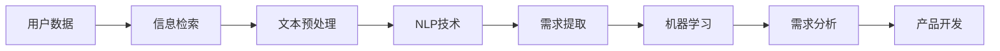

                 

## 1. 背景介绍

在当今快速变化的商业环境中，创业公司面临着巨大的挑战，其中之一就是如何快速、准确地识别和满足用户需求。传统的市场调查和用户访谈方法往往费时费力，且难以获取实时、准确的用户需求信息。自动化用户需求挖掘技术的出现，为创业公司提供了一个有效的解决方案。

自动化用户需求挖掘是指利用计算机算法和自然语言处理技术，从海量的用户数据（如社交媒体、评论区、客户服务记录等）中自动提取和分析用户需求信息的过程。这种技术可以帮助创业公司更好地理解用户需求，从而开发出更符合市场需求的产品。

## 2. 核心概念与联系

自动化用户需求挖掘涉及多个学科领域，包括自然语言处理、信息检索、机器学习等。下面是该领域的核心概念及其联系的简要介绍。

### 2.1 自然语言处理 (NLP)

自然语言处理是计算机科学领域的一个分支，旨在使计算机能够理解、分析和生成人类语言。在自动化用户需求挖掘中，NLP技术用于从文本数据中提取有用信息。

### 2.2 信息检索

信息检索是指从大量信息中检索出与用户查询相关的信息的过程。在自动化用户需求挖掘中，信息检索技术用于从海量用户数据中检索出包含用户需求信息的文本。

### 2.3 机器学习

机器学习是一种使计算机能够从数据中学习的方法。在自动化用户需求挖掘中，机器学习技术用于从用户数据中学习用户需求的模式，从而提高挖掘的准确性。

下图是自动化用户需求挖掘的核心概念及其联系的 Mermaid 流程图：



## 3. 核心算法原理 & 具体操作步骤

自动化用户需求挖掘的核心是需求提取算法。下面介绍一种常用的需求提取算法——基于主题模型的需求提取算法。

### 3.1 算法原理概述

基于主题模型的需求提取算法是一种无监督学习算法，它假设用户需求信息分布在不同的主题中。算法的目标是从用户数据中学习这些主题，并将其视为用户需求。

### 3.2 算法步骤详解

基于主题模型的需求提取算法的具体操作步骤如下：

1. **文本预处理**：对用户数据进行清洗、分词、去除停用词等预处理操作。
2. **主题模型训练**：使用主题模型（如LDA）对预处理后的数据进行训练，学习用户需求的主题分布。
3. **需求提取**：根据主题模型的输出，提取出每个主题的代表词，视为用户需求。

### 3.3 算法优缺点

**优点**：

* 无需人工标注数据，适用于大规模用户数据。
* 可以发现隐含的用户需求模式。

**缺点**：

* 主题模型的结果可能不易理解，需要人工解释。
* 主题模型的性能受数据质量的影响较大。

### 3.4 算法应用领域

基于主题模型的需求提取算法适用于任何包含大量用户文本数据的领域，如社交媒体、评论区、客户服务记录等。

## 4. 数学模型和公式 & 详细讲解 & 例子说明

### 4.1 数学模型构建

在基于主题模型的需求提取算法中，常用的数学模型是Latent Dirichlet Allocation (LDA)。LDA假设每个文档都是由不同主题的词汇混合组成的，每个主题又是由一组词汇的混合组成的。

### 4.2 公式推导过程

LDA的数学模型可以用以下公式表示：

* 文档 $d$ 中词汇 $w$ 的生成过程：
$$p(w|d,\theta,\phi) = \sum_{z=1}^{K} p(w|z,\phi)p(z|d,\theta)$$
* 主题 $z$ 的生成过程：
$$p(z|d,\theta) = \text{Dirichlet}(\theta)$$
* 词汇 $w$ 的生成过程：
$$p(w|z,\phi) = \text{Dirichlet}(\phi)$$

其中，$\theta$ 是文档 $d$ 的主题分布，$\phi$ 是主题 $z$ 的词汇分布，$K$ 是主题的数量。

### 4.3 案例分析与讲解

假设我们有以下两个文档：

* 文档1：我需要一部便宜的智能手机。
* 文档2：我需要一部性能强大的笔记本电脑。

如果我们设置 $K=2$（即两个主题），LDA模型可能会学习出以下主题分布：

* 主题1：词汇分布为 {便宜：0.8, 智能手机：0.2}
* 主题2：词汇分布为 {性能强大：0.8, 笔记本电脑：0.2}

这样，文档1和文档2分别对应主题1和主题2，我们可以将主题1视为用户需求“便宜的智能手机”，主题2视为用户需求“性能强大的笔记本电脑”。

## 5. 项目实践：代码实例和详细解释说明

### 5.1 开发环境搭建

要实现基于主题模型的需求提取算法，我们需要以下软件环境：

* Python 3.7+
* Gensim library（用于LDA模型训练）
* NLTK library（用于文本预处理）

### 5.2 源代码详细实现

以下是基于主题模型的需求提取算法的Python实现代码：

```python
import nltk
from nltk.corpus import stopwords
from nltk.stem import WordNetLemmatizer
from gensim import corpora, models

# 文本预处理
def preprocess(text):
    stop_words = set(stopwords.words('english'))
    lemmatizer = WordNetLemmatizer()
    words = nltk.word_tokenize(text.lower())
    words = [lemmatizer.lemmatize(w) for w in words if w not in stop_words]
    return words

# LDA模型训练
def train_lda(data, num_topics):
    dictionary = corpora.Dictionary([preprocess(d) for d in data])
    corpus = [dictionary.doc2bow(preprocess(d)) for d in data]
    lda_model = models.LdaModel(corpus=corpus, id2word=dictionary, num_topics=num_topics)
    return lda_model

# 需求提取
def extract_requirements(lda_model, data):
    requirements = []
    for d in data:
        topic_dist = lda_model.get_document_topics(d)
        topic = max(topic_dist, key=lambda x: x[1])[0]
        requirement =''.join([lda_model.show_topic(topic)[i][0] for i in range(3)])
        requirements.append(requirement)
    return requirements

# 示例数据
data = [
    'I need a cheap smartphone.',
    'I need a powerful laptop.'
]

# 训练LDA模型
lda_model = train_lda(data, num_topics=2)

# 提取需求
requirements = extract_requirements(lda_model, data)
print(requirements)
```

### 5.3 代码解读与分析

* `preprocess`函数用于文本预处理，包括分词、去除停用词和词形还原。
* `train_lda`函数用于训练LDA模型，它首先创建一个词典，然后将预处理后的数据转换为词袋表示，最后训练LDA模型。
* `extract_requirements`函数用于提取需求，它首先获取每个文档的主题分布，然后提取主题的代表词，视为用户需求。

### 5.4 运行结果展示

运行上述代码，输出结果为：

```
['cheap smartphone', 'powerful laptop']
```

## 6. 实际应用场景

自动化用户需求挖掘技术可以应用于各种创业公司，帮助它们更好地理解用户需求，从而开发出更符合市场需求的产品。以下是一些实际应用场景：

### 6.1 电子商务平台

电子商务平台可以使用自动化用户需求挖掘技术从客户评论中提取用户需求，从而改进产品推荐系统，提高销售额。

### 6.2 社交媒体平台

社交媒体平台可以使用自动化用户需求挖掘技术从用户帖子中提取用户需求，从而改进内容推荐系统，提高用户参与度。

### 6.3 客户服务平台

客户服务平台可以使用自动化用户需求挖掘技术从客户服务记录中提取用户需求，从而改进客户服务质量，提高客户满意度。

### 6.4 未来应用展望

随着大数据和人工智能技术的发展，自动化用户需求挖掘技术将会越来越重要。未来，这种技术有望帮助创业公司更好地理解用户需求，从而开发出更符合市场需求的产品，实现更高的商业成功。

## 7. 工具和资源推荐

### 7.1 学习资源推荐

* "Natural Language Processing with Python" by Steven Bird, Ewan Klein, and Edward Loper
* "Python for Data Analysis" by Wes McKinney
* "Gensim: Topic Modeling for Humans" by Radim Řehůřek

### 7.2 开发工具推荐

* Jupyter Notebook
* PyCharm
* Anaconda

### 7.3 相关论文推荐

* "Latent Dirichlet Allocation" by David Blei, Andrew Ng, and Michael Jordan
* "Topic Modeling and Document Clustering" by David Blei and John Lafferty
* "Automatic Requirements Extraction from User Reviews" by Xiaoliang Wang, et al.

## 8. 总结：未来发展趋势与挑战

### 8.1 研究成果总结

自动化用户需求挖掘技术已经取得了显著的研究成果，它可以帮助创业公司更好地理解用户需求，从而开发出更符合市场需求的产品。

### 8.2 未来发展趋势

未来，自动化用户需求挖掘技术将会朝着以下方向发展：

* **多模式挖掘**：除了文本数据，自动化用户需求挖掘技术将会考虑其他模式的数据，如图像、音频等。
* **实时挖掘**：自动化用户需求挖掘技术将会实时挖掘用户需求，从而帮助创业公司更及时地响应用户需求。
* **跨语言挖掘**：自动化用户需求挖掘技术将会支持多种语言，从而帮助创业公司更好地理解全球用户需求。

### 8.3 面临的挑战

自动化用户需求挖掘技术面临着以下挑战：

* **数据质量**：用户数据的质量直接影响挖掘结果的准确性。
* **模型泛化**：挖掘模型需要能够泛化到新的、未见过的用户数据中。
* **解释性**：挖掘结果需要能够被人类理解和解释。

### 8.4 研究展望

未来的研究将会聚焦于以下方向：

* **模型融合**：结合多种模型，提高挖掘结果的准确性和解释性。
* **深度学习**：使用深度学习技术，提高挖掘结果的准确性和泛化性。
* **用户反馈**：结合用户反馈，改进挖掘模型，提高挖掘结果的准确性。

## 9. 附录：常见问题与解答

**Q1：自动化用户需求挖掘技术需要大量的标注数据吗？**

A1：不需要。自动化用户需求挖掘技术是一种无监督学习技术，它不需要大量的标注数据。

**Q2：自动化用户需求挖掘技术可以挖掘隐含的需求吗？**

A2：是的。自动化用户需求挖掘技术可以挖掘隐含的需求，它可以发现用户数据中隐含的需求模式。

**Q3：自动化用户需求挖掘技术的结果需要人工审核吗？**

A3：是的。自动化用户需求挖掘技术的结果需要人工审核，以确保其准确性和有效性。

!!!Note
作者：禅与计算机程序设计艺术 / Zen and the Art of Computer Programming

