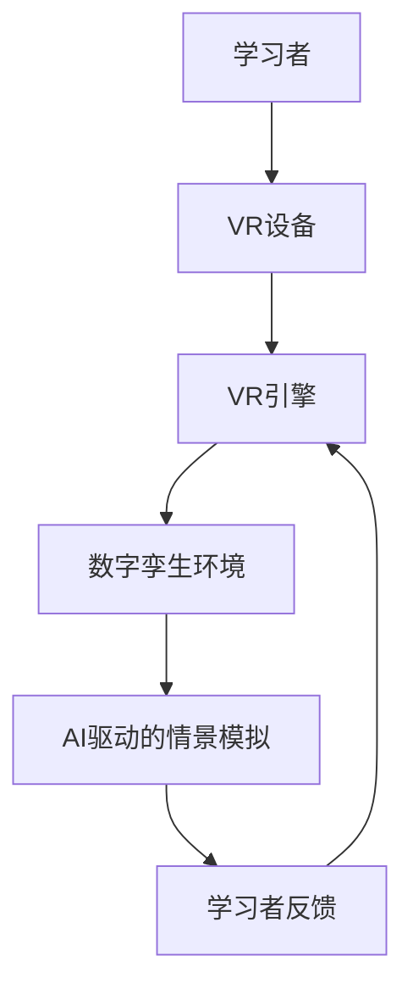

                 

**关键词：**虚拟现实（VR）、沉浸式学习、职业培训、创业模拟、人工智能（AI）、交互式学习环境、数字孪生、可视化、情景模拟

## 1. 背景介绍

随着技术的发展，虚拟现实（VR）和增强现实（AR）等前沿技术已经渗透到各行各业，其中之一就是教育培训领域。虚拟现实技术为职业培训带来了全新的可能性，使其更加沉浸、互动和有效。本文将探讨如何利用虚拟现实技术创建沉浸式的职业培训环境，重点关注创业模拟场景。

## 2. 核心概念与联系

### 2.1 核心概念

- **虚拟现实（VR）**：一种计算机模拟创建的交互式环境，用户可以通过特殊设备（如VR头盔）感知和互动。
- **沉浸式学习**：一种学习方法，通过创建逼真的、互动的学习环境，将学习者置于真实世界的情境中。
- **数字孪生**：利用物联网、AI、大数据和VR/AR等技术，创建与物理世界实物一一对应的数字化孪生体。
- **情景模拟**：一种学习方法，通过模拟真实世界的情境，帮助学习者理解和应对复杂的情况。

### 2.2 核心架构

下图展示了虚拟现实职场模拟创业培训的核心架构：



## 3. 核心算法原理 & 具体操作步骤

### 3.1 算法原理概述

创建虚拟现实职场模拟创业培训环境的核心算法包括：

- **三维重建算法**：用于创建数字孪生环境，如结构从点云（SfP）和多视角视觉（MVS）等。
- **物理引擎**：用于模拟物理世界的规律，如碰撞检测和刚体物理。
- **AI驱动的情景模拟算法**：用于创建动态的、智能的学习环境，如强化学习（RL）和生成对抗网络（GAN）。

### 3.2 算法步骤详解

1. **三维重建**：收集物理世界的数据（如点云数据），并使用三维重建算法创建数字孪生环境。
2. **物理模拟**：使用物理引擎为数字孪生环境添加物理规律，如重力和碰撞。
3. **AI驱动的情景模拟**：使用AI算法（如RL和GAN）为学习环境添加智能和动态特性，如员工和客户的行为。
4. **学习者互动**：学习者通过VR设备与数字孪生环境互动，并接收反馈。
5. **学习者反馈**：学习者的行为和决策被记录，并用于改进AI驱动的情景模拟。

### 3.3 算法优缺点

**优点：**

- 提供了逼真的、互动的学习环境。
- 学习者可以在安全的环境中练习和犯错。
- 可以记录和分析学习者的行为和决策。

**缺点：**

- 创建和维护数字孪生环境需要大量资源。
- AI驱动的情景模拟可能无法完全模拟真实世界的复杂性。
- 学习者可能会面临“数字疲劳”问题。

### 3.4 算法应用领域

虚拟现实职场模拟创业培训适用于各种需要情景模拟和互动学习的领域，如：

- 管理培训：学习者可以模拟管理决策和应对挑战。
- 销售培训：学习者可以练习与客户互动和推销产品。
- 客户服务培训：学习者可以模拟处理客户投诉和问题。

## 4. 数学模型和公式 & 详细讲解 & 举例说明

### 4.1 数学模型构建

数学模型用于描述学习环境的动态特性，如：

- **状态转移模型**：描述学习环境的状态如何随着学习者的行为而转移。
- **奖励函数**：描述学习者的行为是否有利于学习目标的实现。

### 4.2 公式推导过程

假设学习环境的状态为$s_t$，学习者的行为为$a_t$，奖励为$r_t$，则状态转移模型和奖励函数可以表示为：

$s_{t+1} = T(s_t, a_t, w)$

$r_t = R(s_t, a_t, w)$

其中，$T$和$R$分别表示状态转移函数和奖励函数，$w$表示环境参数。

### 4.3 案例分析与讲解

例如，在销售培训场景中，学习者的目标是最大化销售额。状态$s_t$可以表示为客户的满意度和学习者的当前位置，行为$a_t$可以表示为学习者的销售策略，奖励$r_t$可以表示为客户购买的产品数量。状态转移模型和奖励函数可以根据客户行为模型和销售策略的有效性进行调整。

## 5. 项目实践：代码实例和详细解释说明

### 5.1 开发环境搭建

- **VR引擎**：Unity或Unreal Engine。
- **编程语言**：C#（Unity）或C++（Unreal Engine）。
- **AI库**：TensorFlow或PyTorch。

### 5.2 源代码详细实现

以下是创建虚拟现实职场模拟创业培训环境的高级代码示例：

```csharp
using UnityEngine;
using UnityMLagents;

public class VRJobTraining : MonoBehaviour
{
    public GameObject learner;
    public GameObject environment;
    public AIController aiController;

    void Start()
    {
        // Initialize learner and environment
        learner = Instantiate(learner);
        environment = Instantiate(environment);

        // Initialize AI controller
        aiController = new AIController();
        aiController.Initialize(environment);
    }

    void Update()
    {
        // Get learner's action
        int action = GetLearnerAction();

        // Update environment based on learner's action
        environment.transform.position = aiController.GetNextState(action);

        // Update learner's position
        learner.transform.position = environment.transform.position;
    }

    int GetLearnerAction()
    {
        // Implement your own method to get learner's action
        // For example, using VR controller input
        return 0;
    }
}
```

### 5.3 代码解读与分析

- `VRJobTraining`脚本用于管理学习者和环境，并更新环境状态。
- `learner`和`environment`为学习者和环境的预制件。
- `AIController`类用于实现AI驱动的情景模拟，并更新环境状态。
- `GetLearnerAction()`方法用于获取学习者的行为输入。

### 5.4 运行结果展示

学习者可以通过VR设备与数字孪生环境互动，并接收反馈。学习者的行为和决策会影响环境的状态，从而改进AI驱动的情景模拟。

## 6. 实际应用场景

### 6.1 当前应用

虚拟现实职场模拟创业培训已经在各行各业得到应用，如：

- **管理培训**：学习者可以模拟管理决策和应对挑战，如处理危机和管理团队。
- **销售培训**：学习者可以练习与客户互动和推销产品，如处理客户投诉和销售技巧。
- **客户服务培训**：学习者可以模拟处理客户投诉和问题，如处理客户投诉和提供解决方案。

### 6.2 未来应用展望

未来，虚拟现实职场模拟创业培训有望在以下领域得到进一步应用：

- **远程协作**：学习者可以在虚拟环境中与全球同事协作，提高跨文化沟通和合作能力。
- **个性化学习**：利用AI技术，学习环境可以根据学习者的个性和需求进行定制，提供更有效的学习体验。
- **虚拟现实治疗**：学习者可以在安全的虚拟环境中练习应对压力和挑战，如公众演讲和面试。

## 7. 工具和资源推荐

### 7.1 学习资源推荐

- **书籍**："Virtual Reality for Serious Applications"和"Immersive Learning: A New Approach to Designing and Delivering Instruction for the Digital Age"。
- **在线课程**：Coursera和Udacity上的虚拟现实和人工智能课程。

### 7.2 开发工具推荐

- **VR引擎**：Unity和Unreal Engine。
- **AI库**：TensorFlow和PyTorch。
- **三维重建工具**：Autodesk ReCap和Trimble RealWorks。

### 7.3 相关论文推荐

- "Immersive Virtual Reality for Training and Education"和"Virtual Reality in Education: A Systematic Review and Future Research Agenda"。

## 8. 总结：未来发展趋势与挑战

### 8.1 研究成果总结

本文介绍了如何利用虚拟现实技术创建沉浸式的职业培训环境，重点关注创业模拟场景。我们讨论了核心概念、架构、算法原理、数学模型和实际应用场景。

### 8.2 未来发展趋势

未来，虚拟现实职场模拟创业培训有望在以下领域得到进一步发展：

- **个性化学习**：利用AI技术，学习环境可以根据学习者的个性和需求进行定制，提供更有效的学习体验。
- **虚拟现实治疗**：学习者可以在安全的虚拟环境中练习应对压力和挑战，如公众演讲和面试。
- **远程协作**：学习者可以在虚拟环境中与全球同事协作，提高跨文化沟通和合作能力。

### 8.3 面临的挑战

虚拟现实职场模拟创业培训面临的挑战包括：

- **成本**：创建和维护数字孪生环境需要大量资源。
- **技术限制**：虚拟现实技术的发展仍然面临技术限制，如延迟和视觉质量。
- **学习者适应**：学习者可能需要时间适应虚拟现实环境。

### 8.4 研究展望

未来的研究可以关注以下领域：

- **AI驱动的情景模拟**：改进AI算法以模拟更复杂和动态的学习环境。
- **个性化学习**：开发新的方法根据学习者的个性和需求定制学习环境。
- **虚拟现实治疗**：研究虚拟现实技术在压力管理和心理治疗中的应用。

## 9. 附录：常见问题与解答

**Q1：虚拟现实技术对学习者的影响是什么？**

**A1：虚拟现实技术可以提供更沉浸和互动的学习环境，从而提高学习者的参与度和记忆力。然而，学习者可能需要时间适应虚拟现实环境，并面临“数字疲劳”问题。**

**Q2：虚拟现实技术在创业培训中的优势是什么？**

**A2：虚拟现实技术可以提供更真实和互动的创业模拟环境，学习者可以练习和犯错，从而提高创业技能和信心。此外，虚拟现实技术可以帮助学习者理解和应对复杂的创业挑战。**

**Q3：虚拟现实技术在未来的发展趋势是什么？**

**A3：虚拟现实技术在未来有望得到进一步发展，如个性化学习、虚拟现实治疗和远程协作。然而，虚拟现实技术的发展仍然面临技术限制和成本问题。**

!!!Note
**作者：禅与计算机程序设计艺术 / Zen and the Art of Computer Programming**

