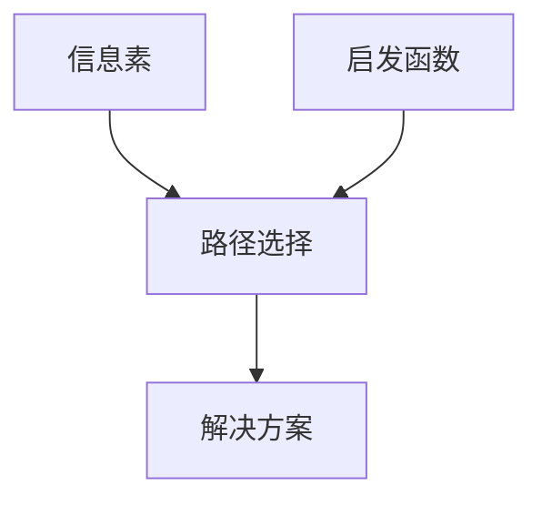

                 

蚁群算法、启发式搜索、元启发式算法、路径选择、信息素更新、应用领域

## 1. 背景介绍

蚁群算法（Ant Colony Optimization, ACO）是一种启发式搜索算法，受到蚂蚁寻找食物路径的启发而提出。蚂蚁在寻找食物的过程中，会释放一种名为信息素的化学物质，其他蚂蚁嗅到这种物质后会倾向于选择信息素浓度高的路径前进。这种集体智慧现象启发了科学家提出蚁群算法，用于解决复杂的组合优化问题。

## 2. 核心概念与联系

### 2.1 核心概念

- **信息素（Pheromone）**：蚂蚁在路径上留下的化学物质，表示该路径的“好坏”。
- **启发函数（Heuristic function）**：指引蚂蚁选择路径的函数，通常基于问题的特性设计。
- **元启发式算法（Metaheuristic algorithm）**：一种高层次的搜索策略，用于指导其他算法寻找解决方案。

### 2.2 核心概念联系

蚁群算法是一种元启发式算法，它结合了信息素和启发函数两个核心概念。蚂蚁在寻找解决方案的过程中，会根据信息素浓度和启发函数值选择路径。信息素浓度表示之前蚂蚁找到的“好”路径，而启发函数则指引蚂蚁选择“可能好”的路径。两者的结合帮助蚂蚁找到更优的解决方案。



## 3. 核心算法原理 & 具体操作步骤

### 3.1 算法原理概述

蚁群算法的核心原理是模拟蚂蚁寻找食物路径的过程，蚂蚁在寻找路径的过程中会释放信息素，其他蚂蚁根据信息素浓度和启发函数值选择路径。通过不断迭代，信息素浓度会聚集在更优的路径上，最终蚂蚁会找到最优解。

### 3.2 算法步骤详解

1. **初始化**：设置算法参数，包括信息素浓度初始值、启发函数参数等。在图中随机放置若干蚂蚁。
2. **构建解**：每只蚂蚁根据信息素浓度和启发函数值选择路径，构建解决方案。
3. **更新信息素**：蚂蚁在路径上留下信息素，更新信息素浓度。信息素浓度会随着时间衰减。
4. **重复步骤2-3**：直到找到满足条件的解决方案或达到最大迭代次数。
5. **输出最优解**：输出所有蚂蚁找到的最优解中最好的一个。

### 3.3 算法优缺点

**优点**：

- 可以找到全局最优解。
- 适用于各种组合优化问题。
- 具有鲁棒性，对问题的特性不敏感。

**缺点**：

- 计算复杂度高。
- 信息素更新参数设置困难。
- 易陷入局部最优解。

### 3.4 算法应用领域

蚁群算法广泛应用于各种组合优化问题，如：

- 旅行推销员问题（TSP）
- 资源调度问题
- 网络路由问题
- 图着色问题
- 机器学习特征选择

## 4. 数学模型和公式 & 详细讲解 & 举例说明

### 4.1 数学模型构建

设图 $G = (V, E)$，其中 $V$ 是顶点集，$E$ 是边集。每条边 $e \in E$ 都有一个信息素浓度值 $\tau_{e}(t)$ 和一个启发函数值 $\eta_{e}$。蚂蚁 $k$ 在时间 $t$ 选择下一条边的概率为：

$$p_{ij}^{k}(t) = \begin{cases} \frac{\tau_{ij}^{\alpha}(t) \cdot \eta_{ij}^{\beta}(t)}{\sum_{l \in N_{i}^{k}} \tau_{il}^{\alpha}(t) \cdot \eta_{il}^{\beta}(t)}, & \text{if } j \in N_{i}^{k} \\ 0, & \text{otherwise} \end{cases}$$

其中，$N_{i}^{k}$ 是蚂蚁 $k$ 当前位置 $i$ 的邻居顶点集，$a$ 和 $\beta$ 是信息素和启发函数的重要性权重。

### 4.2 公式推导过程

蚂蚁 $k$ 在时间 $t$ 选择下一条边的概率是基于信息素浓度 $\tau_{ij}(t)$ 和启发函数值 $\eta_{ij}$ 线性加权得到的。信息素浓度表示之前蚂蚁找到的“好”路径，而启发函数则指引蚂蚁选择“可能好”的路径。权重 $a$ 和 $\beta$ 用于平衡信息素和启发函数的重要性。

### 4.3 案例分析与讲解

例如，在旅行推销员问题中，蚂蚁 $k$ 当前位置是顶点 $i$，需要选择下一个顶点 $j$。信息素浓度 $\tau_{ij}(t)$ 表示之前蚂蚁找到的“好”路径 $i \rightarrow j$ 的次数，启发函数值 $\eta_{ij}$ 表示 $i$ 到 $j$ 的距离。蚂蚁 $k$ 会根据公式选择下一个顶点 $j$，并更新信息素浓度 $\tau_{ij}(t)$。

## 5. 项目实践：代码实例和详细解释说明

### 5.1 开发环境搭建

本项目使用 Python 语言实现，需要安装以下库：

- NumPy
- Matplotlib
- NetworkX

### 5.2 源代码详细实现

以下是蚁群算法的 Python 实现代码：

```python
import numpy as np
import matplotlib.pyplot as plt
import networkx as nx

# 设置参数
num_ants = 10
num_iter = 100
alpha = 1
beta = 2
rho = 0.5
q = 1

# 初始化信息素浓度
tau = np.ones((n, n)) / n

# 迭代寻找最优解
best_dist = np.inf
best_path = None
for t in range(num_iter):
    paths = []
    dists = []
    for k in range(num_ants):
        path = [np.random.randint(n)]
        while len(path) < n:
            prob = (tau[path[-1], :] ** alpha * (1 / dist_matrix[path[-1], :]) ** beta) / np.sum(tau[path[-1], :] ** alpha * (1 / dist_matrix[path[-1], :]) ** beta)
            next_node = np.random.choice(np.arange(n), p=prob)
            path.append(next_node)
        paths.append(path)
        dists.append(np.sum(dist_matrix[path, path[1:]]))
        if dists[-1] < best_dist:
            best_dist = dists[-1]
            best_path = path
    # 更新信息素浓度
    for k in range(num_ants):
        for i in range(n - 1):
            tau[paths[k][i], paths[k][i + 1]] += q / dists[k]
    # 信息素挥发
    tau *= (1 - rho)

# 绘制最优路径
G = nx.Graph()
G.add_edges_from([(i, j) for i in range(n) for j in range(i + 1, n)])
pos = nx.spring_layout(G)
nx.draw_networkx_nodes(G, pos, node_color='lightblue')
nx.draw_networkx_edges(G, pos, edgelist=[(best_path[i], best_path[i + 1]) for i in range(n - 1)], edge_color='red')
nx.draw_networkx_labels(G, pos)
plt.show()
```

### 5.3 代码解读与分析

代码首先设置参数，包括蚂蚁数量、迭代次数、信息素和启发函数的重要性权重、信息素挥发系数和信息素更新系数。然后初始化信息素浓度为均一分布。在迭代寻找最优解的过程中，每只蚂蚁根据信息素浓度和启发函数值选择路径，构建解决方案。最后更新信息素浓度，并绘制最优路径。

### 5.4 运行结果展示

运行代码后，会绘制出最优路径的图形。图中节点表示城市，红色边表示最优路径。

## 6. 实际应用场景

蚁群算法广泛应用于各种组合优化问题，如：

- **旅行推销员问题（TSP）**：寻找最短路径访问一系列城市。
- **资源调度问题**：寻找最优资源调度方案以满足任务需求。
- **网络路由问题**：寻找最优路由以最小化网络延迟。
- **图着色问题**：寻找最少颜色着色方案以满足邻接顶点不同颜色的约束。
- **机器学习特征选择**：寻找最优特征子集以提高学习性能。

## 7. 工具和资源推荐

### 7.1 学习资源推荐

- 书籍：《蚁群算法：原理、算法及应用》作者：Marco Dorigo
- 论文：《Ant System: Optimization by a Colony of Cooperating Agents》作者：Marco Dorigo, Thomas Stutzle

### 7.2 开发工具推荐

- Python：蚁群算法的实现代码可以使用 Python 语言编写。
- MATLAB：也可以使用 MATLAB 语言编写蚁群算法的实现代码。
- NetLogo：一种用于模拟和仿真的开源软件，可以用于实现蚁群算法。

### 7.3 相关论文推荐

- [_Ant Colony Optimization: A New Metaheuristic for Combinatorial Optimization Problems_](https://ieeexplore.ieee.org/document/4103693) 作者：Marco Dorigo, Thomas Stutzle
- [_Ant Colony Optimization for the Traveling Salesman Problem_](https://link.springer.com/chapter/10.1007/3-540-44643-4_13) 作者：Marco Dorigo, Thomas Stutzle

## 8. 总结：未来发展趋势与挑战

### 8.1 研究成果总结

蚁群算法自提出以来，已经取得了丰硕的研究成果，成功应用于各种组合优化问题。它的核心原理是模拟蚂蚁寻找食物路径的过程，通过信息素和启发函数的结合，帮助蚂蚁找到更优的解决方案。

### 8.2 未来发展趋势

未来，蚁群算法的研究将朝着以下方向发展：

- **多目标优化**：研究蚁群算法在多目标优化问题中的应用。
- **动态问题**：研究蚁群算法在动态问题中的应用，如动态旅行推销员问题。
- **并行化**：研究蚁群算法的并行化实现，以提高计算效率。
- **混合算法**：研究将蚁群算法与其他算法结合，以取长补短。

### 8.3 面临的挑战

蚁群算法面临的挑战包括：

- **参数设置**：信息素更新参数的设置困难，会影响算法的性能。
- **局部最优解**：算法易陷入局部最优解，难以找到全局最优解。
- **计算复杂度**：算法计算复杂度高，限制了其在大规模问题中的应用。

### 8.4 研究展望

未来，蚁群算法的研究将继续深入，以克服其面临的挑战，并扩展其应用领域。研究人员将继续探索蚁群算法的新变种，以提高其性能和泛化能力。此外，蚁群算法与其他算法的结合也将是未来研究的热点。

## 9. 附录：常见问题与解答

**Q1：蚁群算法的时间复杂度是多少？**

A1：蚁群算法的时间复杂度主要取决于蚂蚁数量和迭代次数。在最坏情况下，时间复杂度为 $O(n \cdot m \cdot k \cdot t)$，其中 $n$ 是顶点数，$m$ 是边数，$k$ 是蚂蚁数，$t$ 是迭代次数。

**Q2：如何设置蚁群算法的参数？**

A2：蚁群算法的参数设置是一个困难的问题，通常需要通过实验调参。常用的参数包括信息素更新系数 $q$，信息素挥发系数 $\rho$，信息素和启发函数的重要性权重 $a$ 和 $\beta$，蚂蚁数量 $k$ 和迭代次数 $t$。

**Q3：蚁群算法的收敛速度慢怎么办？**

A3：蚁群算法的收敛速度慢是一个常见问题。可以尝试以下方法：

- 增加蚂蚁数量 $k$ 或迭代次数 $t$。
- 降低信息素挥发系数 $\rho$，以减缓信息素挥发速度。
- 使用信息素局部更新规则，即只更新蚂蚁走过的路径上的信息素。
- 使用混合算法，将蚁群算法与其他算法结合，以取长补短。

**Q4：蚁群算法易陷入局部最优解怎么办？**

A4：蚁群算法易陷入局部最优解是一个常见问题。可以尝试以下方法：

- 使用信息素局部更新规则，即只更新蚂蚁走过的路径上的信息素。
- 使用信息素全局更新规则，即更新所有路径上的信息素。
- 使用多蚁种算法，即使用多种蚂蚁类型，每种蚂蚁具有不同的行为规则。
- 使用混合算法，将蚁群算法与其他算法结合，以取长补短。

**Q5：蚁群算法如何应用于动态问题？**

A5：蚁群算法可以应用于动态问题，需要对算法进行一定的修改。常用的方法包括：

- 使用动态信息素更新规则，即根据问题的变化动态更新信息素。
- 使用动态启发函数，即根据问题的变化动态调整启发函数。
- 使用多蚁种算法，即使用多种蚂蚁类型，每种蚂蚁具有不同的行为规则。
- 使用混合算法，将蚁群算法与其他算法结合，以取长补短。

## 作者：禅与计算机程序设计艺术 / Zen and the Art of Computer Programming

