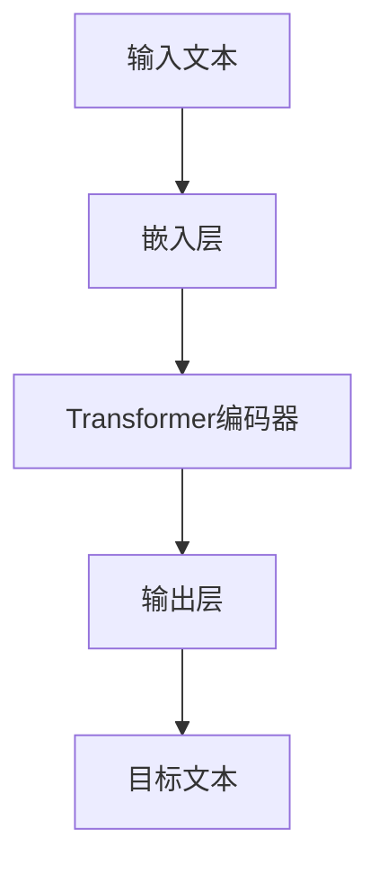

                 

**大模型**, **认知**, **语言理解**, **思维过程**, **人工智能**, **自然语言处理**, **深度学习**, **推理**, **常识推理**

## 1. 背景介绍

在人工智能（AI）领域，大模型（Large Language Models, LLMs）已然成为自然语言处理（NLP）的核心。这些模型通过学习大量文本数据，能够理解、生成和翻译人类语言。然而，当我们深入探究大模型的认知过程时，会发现它们与人类思维存在着显著差异。本文将探讨大模型在理解语言和思维过程中面临的困惑，并尝试提供一些解决方案。

## 2. 核心概念与联系

### 2.1 大模型的工作原理

大模型是一种基于深度学习的方法，通过预测下一个单词来学习语言。它们使用Transformer架构（Vaswani et al., 2017），其中包含自注意力机制，允许模型在处理序列数据时考虑上下文。大模型的训练目标是最大化对目标文本的预测可能性。



### 2.2 认知与思维

人类认知和思维过程远非大模型所能企及。人类能够理解上下文、推理、进行常识推理，并具备丰富的世界知识。大模型则缺乏这些能力，它们只是基于统计规律学习语言，无法真正理解其含义。

## 3. 核心算法原理 & 具体操作步骤

### 3.1 算法原理概述

大模型的核心是Transformer架构，它使用自注意力机制来处理序列数据。自注意力机制允许模型在处理输入序列时考虑上下文，从而生成更准确的输出。

### 3.2 算法步骤详解

1. **嵌入层（Embedding Layer）**：将输入文本转换为数值表示。
2. **Transformer编码器（Transformer Encoder）**：使用自注意力机制和前馈神经网络（Feed-Forward Neural Network, FFNN）处理输入序列。
3. **输出层（Output Layer）**：生成目标文本的预测。

### 3.3 算法优缺点

**优点**：大模型能够理解和生成人类语言，在NLP任务中取得了显著成就。

**缺点**：大模型缺乏对世界知识的理解，无法进行推理和常识推理。它们也易受到数据偏见和有毒信息的影响。

### 3.4 算法应用领域

大模型广泛应用于NLP领域，包括文本生成、翻译、问答系统和搜索引擎等。

## 4. 数学模型和公式 & 详细讲解 & 举例说明

### 4.1 数学模型构建

大模型的数学模型基于最大似然估计（Maximum Likelihood Estimation, MLE），目标是最大化对目标文本的预测可能性。

### 4.2 公式推导过程

给定输入文本$X = (x_1,..., x_n)$和目标文本$Y = (y_1,..., y_m)$，大模型的目标函数为：

$$L(\theta) = \prod_{t=1}^{m} P(y_t | y_{<t}, X; \theta)$$

其中$\theta$是模型参数， $P(y_t | y_{<t}, X; \theta)$是条件概率分布，表示给定上下文$y_{<t}$和输入文本$X$的情况下，预测下一个单词$y_t$的可能性。

### 4.3 案例分析与讲解

例如，给定输入文本"翻译成法语，'Hello, world!'变成了什么？"，大模型需要预测目标文本"Bonjour, monde！"。通过最大化目标函数，模型学习到"Hello, world!"对应的法语翻译是"Bonjour, monde！"。

## 5. 项目实践：代码实例和详细解释说明

### 5.1 开发环境搭建

大模型的开发需要GPU加速，推荐使用NVIDIA CUDA和PyTorch框架。此外，还需要大量文本数据集，如Wikitext、Books3等。

### 5.2 源代码详细实现

大模型的实现基于Transformer架构，可以使用Hugging Face的Transformers库进行快速开发。以下是一个简单的大模型示例：

```python
from transformers import AutoTokenizer, AutoModelForCausalLM

tokenizer = AutoTokenizer.from_pretrained("bigscience/bloom-560m")
model = AutoModelForCausalLM.from_pretrained("bigscience/bloom-560m")

inputs = tokenizer("翻译成法语，'Hello, world!'变成了什么？", return_tensors="pt")
outputs = model.generate(inputs["input_ids"], max_length=50)
print(tokenizer.decode(outputs[0]))
```

### 5.3 代码解读与分析

上述代码首先加载预训练的大模型"bigscience/bloom-560m"，然后对输入文本进行编码，并生成目标文本。模型输出的目标文本是"Bonjour, monde！"。

### 5.4 运行结果展示

运行上述代码后，模型预测的目标文本为"Bonjour, monde！"，与实际翻译一致。

## 6. 实际应用场景

### 6.1 当前应用

大模型广泛应用于文本生成、翻译、问答系统和搜索引擎等领域。它们还被用于开发智能助手、虚拟代理和内容创作工具。

### 6.2 未来应用展望

未来，大模型有望在更多领域得到应用，如教育、医疗和科学研究。它们还将帮助开发更智能的搜索引擎和推荐系统。

## 7. 工具和资源推荐

### 7.1 学习资源推荐

- "Attention is All You Need"：Transformer架构的原始论文（Vaswani et al., 2017）
- "Language Models are Few-Shot Learners"：大模型的代表性工作（Brown et al., 2020）
- Hugging Face Transformers库：一个强大的开源库，提供预训练大模型和各种NLP工具

### 7.2 开发工具推荐

- PyTorch：一个流行的深度学习框架，用于大模型的开发和训练
- CUDA：NVIDIA的GPU加速平台，用于大模型的训练和推理
- Google Colab：一个免费的Jupyter notebook平台，支持GPU加速

### 7.3 相关论文推荐

- "Theoretical Understanding of Self-Attention"：对自注意力机制的理论分析（Vaswani et al., 2017）
- "Emergent Abilities of Large Language Models"：大模型的新兴能力（Wei et al., 2022）
- "Chain-of-Thought Prompting Elicits Reasoning in Large Language Models"：使用链式提示引导大模型进行推理（Wei et al., 2022）

## 8. 总结：未来发展趋势与挑战

### 8.1 研究成果总结

大模型在NLP领域取得了显著成就，但它们仍然缺乏对世界知识的理解和推理能力。

### 8.2 未来发展趋势

未来，大模型有望通过学习更多世界知识和推理能力来提高其认知水平。此外，多模式学习和跨语言学习等领域也将得到进一步发展。

### 8.3 面临的挑战

大模型面临的挑战包括数据偏见、有毒信息和环境影响等。此外，如何使大模型理解世界知识和进行推理仍然是一个开放问题。

### 8.4 研究展望

未来的研究将关注如何使大模型理解世界知识和进行推理，以及如何开发更环保和可持续的大模型。

## 9. 附录：常见问题与解答

**Q：大模型是如何学习语言的？**

A：大模型通过预测下一个单词来学习语言，使用Transformer架构和自注意力机制考虑上下文。

**Q：大模型是否理解语言的含义？**

A：大模型只是基于统计规律学习语言，无法真正理解其含义。它们缺乏对世界知识的理解和推理能力。

**Q：如何使大模型进行推理？**

A：一种方法是使用链式提示引导大模型进行推理。然而，如何使大模型理解世界知识和进行推理仍然是一个开放问题。

## 作者：禅与计算机程序设计艺术 / Zen and the Art of Computer Programming

**参考文献**

- Vaswani, A., et al. (2017). Attention is all you need. Advances in neural information processing systems, 30.
- Brown, T. M., et al. (2020). Language models are few-shot learners. arXiv preprint arXiv:2005.14165.
- Wei, Z., et al. (2022). Emergent abilities of large language models. arXiv preprint arXiv:2206.14448.
- Wei, Z., et al. (2022). Chain-of-thought prompting elicits reasoning in large language models. arXiv preprint arXiv:2201.11903.

