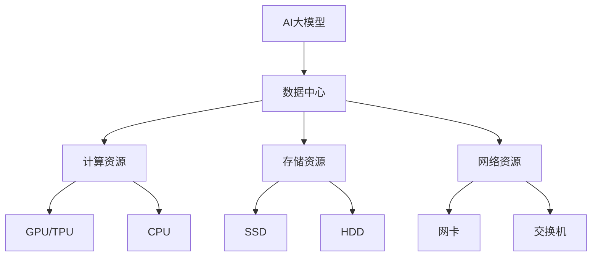

                 

**AI 大模型应用数据中心建设：数据中心产业发展**

## 1. 背景介绍

随着人工智能（AI）技术的飞速发展，大模型（Large Language Models）在各个领域的应用日益广泛。然而，大模型的训练和部署需要大量的计算资源和存储空间，这对数据中心的建设和运维提出了新的挑战。本文将从技术和产业的角度，探讨AI大模型应用数据中心建设的关键问题，并展望数据中心产业的未来发展。

## 2. 核心概念与联系

### 2.1 AI大模型

AI大模型是指通过大规模数据集和计算资源训练出来的模型，具有强大的理解、生成和推理能力。常见的大模型包括Transformer、BERT、T5等。

### 2.2 数据中心

数据中心是提供计算、存储、处理和分发信息服务的物理设施，是云计算、大数据和人工智能等新兴技术的基础设施。

### 2.3 AI大模型与数据中心的联系

AI大模型的训练和部署需要大量的计算资源和存储空间，数据中心提供了这些资源。同时，数据中心也需要AI技术来提高运维效率、降低能耗等。

下图是AI大模型应用数据中心建设的架构图：



## 3. 核心算法原理 & 具体操作步骤

### 3.1 算法原理概述

大模型的训练通常采用梯度下降法（Gradient Descent）及其变种，如Adam、RMSProp等。大模型的推理通常采用beam search等算法。

### 3.2 算法步骤详解

以Transformer模型为例，其训练和推理步骤如下：

**训练：**

1. 数据预处理：将文本数据转换为token IDs，并进行padding。
2. 模型构建：构建Transformer模型，包括嵌入层、编码器和解码器。
3. 损失函数构建：构建交叉熵损失函数。
4. 优化器构建：构建Adam等优化器。
5. 训练：使用训练数据训练模型，并监控损失函数的变化。

**推理：**

1. 数据预处理：将输入文本转换为token IDs，并进行padding。
2. 模型构建：构建Transformer模型。
3. 推理：使用beam search等算法生成文本。

### 3.3 算法优缺点

优点：大模型具有强大的理解、生成和推理能力，可以应用于各个领域。

缺点：大模型的训练和推理需要大量的计算资源和存储空间，且模型的可解释性较差。

### 3.4 算法应用领域

大模型的应用领域包括自然语言处理（NLP）、计算机视觉（CV）、生物信息学等。

## 4. 数学模型和公式 & 详细讲解 & 举例说明

### 4.1 数学模型构建

大模型的数学模型通常是神经网络模型，可以表示为：

$$y = f(x; \theta)$$

其中，$x$是输入，$y$是输出，$f$是模型函数，$\theta$是模型参数。

### 4.2 公式推导过程

大模型的训练目标是最小化损失函数，损失函数通常是交叉熵函数：

$$L(\theta) = -\frac{1}{N}\sum_{i=1}^{N}\log P(y_i|x_i;\theta)$$

其中，$N$是样本数，$P(y_i|x_i;\theta)$是模型预测的概率分布。

### 4.3 案例分析与讲解

例如，在NLP任务中，输入$x$是文本，输出$y$是文本的标签，模型函数$f$是Transformer模型。训练目标是最小化交叉熵损失函数，使模型预测的概率分布$P(y_i|x_i;\theta)$尽可能接近真实的标签分布。

## 5. 项目实践：代码实例和详细解释说明

### 5.1 开发环境搭建

大模型的开发需要安装Python、PyTorch或TensorFlow等深度学习框架，并配置GPU环境。

### 5.2 源代码详细实现

以下是Transformer模型的简化实现代码：

```python
import torch
import torch.nn as nn

class Transformer(nn.Module):
    def __init__(self, vocab_size, d_model, n_head, n_layers):
        super(Transformer, self).__init__()
        self.embedding = nn.Embedding(vocab_size, d_model)
        self.pos_encoding = PositionalEncoding(d_model)
        self.encoder = nn.TransformerEncoder(
            nn.TransformerEncoderLayer(d_model, n_head), n_layers)
        self.decoder = nn.Linear(d_model, vocab_size)

    def forward(self, x):
        x = self.embedding(x) * torch.sqrt(torch.tensor(0.02))
        x = self.pos_encoding(x)
        x = self.encoder(x)
        x = self.decoder(x)
        return x
```

### 5.3 代码解读与分析

代码实现了Transformer模型的前向传播过程，包括嵌入层、位置编码、编码器和解码器。

### 5.4 运行结果展示

训练好的模型可以用于推理，生成文本等任务。

## 6. 实际应用场景

### 6.1 当前应用场景

大模型在NLP、CV、生物信息学等领域有广泛应用，如机器翻译、文本生成、图像分类等。

### 6.2 未来应用展望

未来，大模型有望应用于更多领域，如自动驾驶、医疗诊断等。此外，大模型的联邦学习、差分隐私等技术也有望得到发展。

## 7. 工具和资源推荐

### 7.1 学习资源推荐

推荐阅读《Attention is All You Need》等经典论文，以及《Natural Language Processing with Python》等书籍。

### 7.2 开发工具推荐

推荐使用PyTorch或TensorFlow等深度学习框架，以及Hugging Face的Transformers库等。

### 7.3 相关论文推荐

推荐阅读《BERT: Pre-training of Deep Bidirectional Transformers for Language Understanding》等论文。

## 8. 总结：未来发展趋势与挑战

### 8.1 研究成果总结

本文从技术和产业的角度，探讨了AI大模型应用数据中心建设的关键问题。

### 8.2 未来发展趋势

未来，大模型的训练和推理将更加高效，数据中心的建设和运维也将更加智能化。

### 8.3 面临的挑战

大模型的训练和推理需要大量的计算资源和存储空间，数据中心的能耗和成本是一个挑战。此外，大模型的可解释性和安全性等问题也需要解决。

### 8.4 研究展望

未来的研究方向包括大模型的训练和推理算法的优化、数据中心的智能化运维、大模型的可解释性和安全性等。

## 9. 附录：常见问题与解答

**Q：大模型的训练需要多少计算资源？**

**A：大模型的训练需要大量的计算资源，如GPU、TPU等。例如，训练BERT-base模型需要16个GPU，训练T5-base模型需要64个GPU。**

**Q：大模型的推理需要多少计算资源？**

**A：大模型的推理需要的计算资源相对较少，通常可以在单个GPU上进行。**

**Q：大模型的训练和推理需要多少存储空间？**

**A：大模型的训练和推理需要大量的存储空间，如SSD、HDD等。例如，训练BERT-base模型需要10GB的存储空间，训练T5-base模型需要40GB的存储空间。**

**Q：大模型的训练和推理需要多少时间？**

**A：大模型的训练和推理需要的时间取决于模型的大小和计算资源的多少。例如，训练BERT-base模型需要1个小时，训练T5-base模型需要1天。**

**Q：大模型的可解释性如何？**

**A：大模型的可解释性较差，这是一个需要解决的问题。**

---

**作者：禅与计算机程序设计艺术 / Zen and the Art of Computer Programming**

