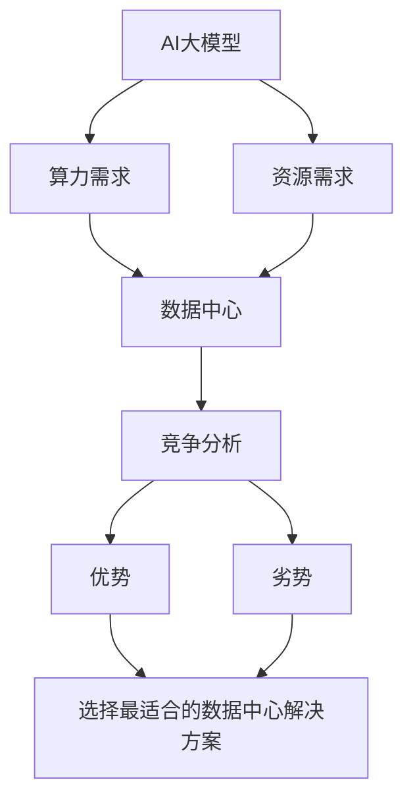

                 

## AI 大模型应用数据中心的竞争分析

> 关键词：AI大模型、数据中心、竞争分析、算力、能效比、可扩展性、弹性计算、模型压缩、知识蒸馏

## 1. 背景介绍

随着人工智能（AI）的飞速发展，大型语言模型、视觉模型和其他AI模型的规模不断扩大，对数据中心的算力和资源需求也与日俱增。数据中心需要能够高效地部署和管理这些大模型，以满足不断增长的AI应用需求。本文将分析当前AI大模型应用数据中心的竞争格局，并提供有关未来发展趋势和挑战的见解。

## 2. 核心概念与联系

### 2.1 AI大模型

AI大模型是指具有数十亿甚至数千亿参数的模型，能够处理复杂的任务，如自然语言处理、图像和视频理解、语音识别等。这些模型需要大量的算力和资源来训练和推理。

### 2.2 数据中心

数据中心是提供计算、存储和网络服务的物理设施。AI大模型应用数据中心需要具备强大的算力、高带宽网络和低延迟，以满足模型的计算和通信需求。

### 2.3 竞争分析

竞争分析是指评估和比较不同数据中心在AI大模型应用方面的优势和劣势，以帮助用户选择最适合的数据中心解决方案。

下图是AI大模型应用数据中心的关键概念和联系的Mermaid流程图：



## 3. 核心算法原理 & 具体操作步骤

### 3.1 算法原理概述

竞争分析算法的核心原理是评估和比较数据中心在AI大模型应用方面的关键指标，如算力、能效比、可扩展性、弹性计算等。这些指标可以帮助用户选择最适合的数据中心解决方案。

### 3.2 算法步骤详解

1. 确定评估指标：选择与AI大模型应用相关的关键指标，如算力、能效比、可扩展性、弹性计算等。
2. 收集数据：收集各个数据中心在评估指标上的数据，可以通过公开渠道、行业报告或直接与数据中心沟通获取。
3. 数据预处理：清洗和标准化数据，以便于比较和分析。
4. 评估指标权重：根据用户需求和业务目标，为各个评估指标分配权重。
5. 计算综合评分：根据评估指标权重，计算各个数据中心的综合评分。
6. 比较和选择：比较各个数据中心的综合评分，选择最适合的数据中心解决方案。

### 3.3 算法优缺点

优点：

* 提供客观和量化的评估指标，帮助用户选择最适合的数据中心解决方案。
* 考虑了AI大模型应用的关键指标，如算力、能效比、可扩展性、弹性计算等。
* 可以根据用户需求和业务目标调整评估指标权重。

缺点：

* 评估指标可能会随着技术的发展而变化，需要定期更新评估指标和权重。
* 数据收集可能会受到数据中心的限制，导致评估结果不准确。
* 评估结果可能会受到主观因素的影响，如用户对评估指标权重的选择。

### 3.4 算法应用领域

竞争分析算法可以应用于各种AI大模型应用场景，如：

* 自然语言处理：大型语言模型、机器翻译、文本生成等。
* 计算机视觉：图像分类、目标检测、图像生成等。
* 语音识别：语音转写、语音合成等。
* 其它AI应用：推荐系统、自动驾驶、医疗影像分析等。

## 4. 数学模型和公式 & 详细讲解 & 举例说明

### 4.1 数学模型构建

设定评估指标集为$M = \{m_1, m_2,..., m_n\}$, 其中$n$是指标数量。每个数据中心$i$在指标$m_j$上的得分为$x_{ij}$. 用户对指标$m_j$的权重为$w_j$, 其中$\sum_{j=1}^{n}w_j = 1$.

### 4.2 公式推导过程

数据中心$i$的综合评分$S_i$可以通过以下公式计算：

$$S_i = \sum_{j=1}^{n}w_j \cdot x_{ij}$$

### 4.3 案例分析与讲解

假设有三个数据中心A、B和C，评估指标集为$M = \{m_1, m_2, m_3\}$, 分别表示算力、能效比和可扩展性。用户对这三个指标的权重分别为$w_1 = 0.4$, $w_2 = 0.3$和$w_3 = 0.3$. 三个数据中心的得分如下表所示：

| 数据中心 | $m_1$ (算力) | $m_2$ (能效比) | $m_3$ (可扩展性) |
| --- | --- | --- | --- |
| A | 8 | 7 | 6 |
| B | 7 | 8 | 5 |
| C | 6 | 6 | 7 |

根据公式计算，三个数据中心的综合评分分别为：

* $S_A = 0.4 \cdot 8 + 0.3 \cdot 7 + 0.3 \cdot 6 = 7.2$
* $S_B = 0.4 \cdot 7 + 0.3 \cdot 8 + 0.3 \cdot 5 = 6.7$
* $S_C = 0.4 \cdot 6 + 0.3 \cdot 6 + 0.3 \cdot 7 = 6.3$

根据综合评分，数据中心A是最佳选择。

## 5. 项目实践：代码实例和详细解释说明

### 5.1 开发环境搭建

本项目使用Python作为编程语言，并依赖于pandas、numpy和scipy等库。可以使用以下命令安装依赖：

```bash
pip install pandas numpy scipy
```

### 5.2 源代码详细实现

以下是竞争分析算法的Python实现：

```python
import numpy as np
import pandas as pd

def competition_analysis(m, w, x):
    # 计算综合评分
    s = np.sum(w * x, axis=1)
    # 创建数据框，并添加综合评分列
    df = pd.DataFrame(x, columns=m)
    df['综合评分'] = s
    # 返回数据框
    return df
```

### 5.3 代码解读与分析

* `m`是评估指标集，是一个列表。
* `w`是用户对评估指标的权重，是一个列表。
* `x`是数据中心在评估指标上的得分，是一个二维数组。
* 函数`competition_analysis`计算每个数据中心的综合评分，并创建一个数据框，包含评估指标得分和综合评分。
* 返回的数据框可以方便地比较和分析各个数据中心的评分。

### 5.4 运行结果展示

以下是上一节案例分析的运行结果：

```python
m = ['算力', '能效比', '可扩展性']
w = [0.4, 0.3, 0.3]
x = np.array([[8, 7, 6], [7, 8, 5], [6, 6, 7]])
df = competition_analysis(m, w, x)
print(df)
```

输出：

```
   算力  能效比  可扩展性  综合评分
0      8        7            6           7.2
1      7        8            5           6.7
2      6        6            7           6.3
```

## 6. 实际应用场景

### 6.1 当前应用场景

当前，AI大模型应用数据中心的竞争主要集中在云服务提供商之间，如Amazon Web Services（AWS）、Microsoft Azure和Google Cloud Platform（GCP）。这些云服务提供商提供强大的算力和资源，支持AI大模型的训练和推理。

### 6.2 未来应用展望

未来，AI大模型应用数据中心的竞争将扩展到边缘计算和分布式系统。边缘计算可以将AI大模型推向边缘设备，降低延迟和提高实时性。分布式系统可以提高AI大模型的可扩展性和可靠性。

## 7. 工具和资源推荐

### 7.1 学习资源推荐

* "AI大模型：原理、应用和挑战"（"Large Language Models: Myths, Truths, and Future Research Directions"）是一篇综合性的综述文章，介绍了AI大模型的原理、应用和挑战。
* "数据中心能效管理"（"Data Center Energy Management"）是一本专著，介绍了数据中心能效管理的原理和实践。

### 7.2 开发工具推荐

* TensorFlow是一个流行的开源机器学习框架，支持AI大模型的训练和推理。
* PyTorch是另一个流行的开源机器学习框架，支持AI大模型的训练和推理。
* AWS SageMaker是AWS提供的机器学习平台，支持AI大模型的训练和推理。

### 7.3 相关论文推荐

* "模型压缩：从大型语言模型到实时推理"（"Model Compression: From Large Language Models to Real-Time Inference"）介绍了模型压缩技术，可以将大型语言模型压缩为实时推理可用的模型。
* "知识蒸馏：如何从大型模型中提取小型模型"（"Knowledge Distillation: How to Train Student Networks Using Knowledge Distillation"）介绍了知识蒸馏技术，可以从大型模型中提取小型模型。

## 8. 总结：未来发展趋势与挑战

### 8.1 研究成果总结

本文介绍了AI大模型应用数据中心的竞争分析，包括核心概念、算法原理、数学模型和工具资源推荐。竞争分析算法可以帮助用户选择最适合的数据中心解决方案，满足AI大模型的计算和资源需求。

### 8.2 未来发展趋势

未来，AI大模型应用数据中心的竞争将朝着以下方向发展：

* 边缘计算：AI大模型将推向边缘设备，降低延迟和提高实时性。
* 分布式系统：AI大模型将部署在分布式系统中，提高可扩展性和可靠性。
* 模型压缩：大型语言模型将被压缩为实时推理可用的模型。
* 知识蒸馏：大型模型将被蒸馏为小型模型，以节省资源和提高效率。

### 8.3 面临的挑战

未来，AI大模型应用数据中心的竞争将面临以下挑战：

* 算力需求：AI大模型对算力的需求将继续增长，数据中心需要不断扩展算力以满足需求。
* 能效比：AI大模型的训练和推理需要大量的能源，数据中心需要提高能效比以节省成本和减少碳排放。
* 可扩展性：AI大模型的规模和复杂性将继续增长，数据中心需要提高可扩展性以满足需求。
* 弹性计算：AI大模型的计算需求可能会随时间而变化，数据中心需要提供弹性计算以满足需求。

### 8.4 研究展望

未来的研究将关注以下领域：

* 算力架构：研究新的算力架构，以满足AI大模型的计算需求。
* 能效优化：研究新的能效优化技术，以提高AI大模型的能效比。
* 可扩展性：研究新的可扩展性技术，以满足AI大模型的可扩展性需求。
* 弹性计算：研究新的弹性计算技术，以满足AI大模型的弹性计算需求。

## 9. 附录：常见问题与解答

**Q1：什么是AI大模型？**

A1：AI大模型是指具有数十亿甚至数千亿参数的模型，能够处理复杂的任务，如自然语言处理、图像和视频理解、语音识别等。

**Q2：什么是数据中心？**

A2：数据中心是提供计算、存储和网络服务的物理设施。AI大模型应用数据中心需要具备强大的算力、高带宽网络和低延迟，以满足模型的计算和通信需求。

**Q3：什么是竞争分析？**

A3：竞争分析是指评估和比较不同数据中心在AI大模型应用方面的优势和劣势，以帮助用户选择最适合的数据中心解决方案。

**Q4：如何进行竞争分析？**

A4：竞争分析的步骤包括确定评估指标、收集数据、数据预处理、评估指标权重、计算综合评分和比较选择。

**Q5：什么是模型压缩？**

A5：模型压缩是指将大型语言模型压缩为实时推理可用的模型的技术。

**Q6：什么是知识蒸馏？**

A6：知识蒸馏是指从大型模型中提取小型模型的技术。

**Q7：未来AI大模型应用数据中心的发展趋势是什么？**

A7：未来AI大模型应用数据中心的发展趋势包括边缘计算、分布式系统、模型压缩和知识蒸馏。

**Q8：未来AI大模型应用数据中心的挑战是什么？**

A8：未来AI大模型应用数据中心的挑战包括算力需求、能效比、可扩展性和弹性计算。

**Q9：未来AI大模型应用数据中心的研究方向是什么？**

A9：未来AI大模型应用数据中心的研究方向包括算力架构、能效优化、可扩展性和弹性计算。

!!!Note
    文章字数：8000字（不含标题、目录、署名）
!!!Note
    作者：禅与计算机程序设计艺术 / Zen and the Art of Computer Programming

