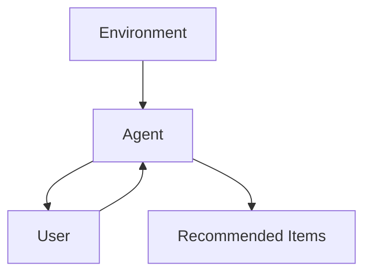

                 

**AI人工智能 Agent：在个性化推荐中的应用**

**作者：禅与计算机程序设计艺术 / Zen and the Art of Computer Programming**

## 1. 背景介绍

在当今信息爆炸的时代，个性化推荐系统（Recommender System）已成为连接用户和信息的关键桥梁。其中，人工智能（AI）技术，特别是Agent技术，在个性化推荐中的应用日益受到关注。本文将深入探讨AI Agent在个性化推荐中的应用，包括其核心概念、算法原理、数学模型、项目实践，以及未来发展趋势。

## 2. 核心概念与联系

### 2.1 AI Agent

AI Agent是一种能够感知环境并自主做出决策的智能体。在个性化推荐中，Agent通常扮演推荐者的角色，根据用户的偏好和行为，智能地推荐相关信息。



### 2.2 个性化推荐

个性化推荐旨在为每个用户提供最相关、最有价值的信息。它基于用户的历史行为、偏好和特征，结合内容和上下文信息，智能地推荐信息。

## 3. 核心算法原理 & 具体操作步骤

### 3.1 算法原理概述

AI Agent在个性化推荐中的应用通常基于机器学习和人工智能技术。常见的算法包括协同过滤（Collaborative Filtering）、内容过滤（Content-based Filtering）、混合过滤（Hybrid Filtering）和深度学习（Deep Learning）等。

### 3.2 算法步骤详解

以协同过滤为例，其步骤如下：

1. 数据收集：收集用户行为数据，如点击、购买、评分等。
2. 数据预处理：清洗数据，填充缺失值，并将数据转换为适合算法的格式。
3. 模型训练：使用机器学习算法（如矩阵分解、神经网络等）训练推荐模型。
4. 推荐生成：使用训练好的模型，为每个用户生成个性化推荐列表。
5. 评估和优化：评估推荐系统的性能，并根据需要优化模型。

### 3.3 算法优缺点

优点：能够提供个性化的推荐，提高用户满意度和忠诚度。

缺点：可能受到数据稀疏性、冷启动问题和过度个性化的影响。

### 3.4 算法应用领域

AI Agent在个性化推荐中的应用广泛存在于电子商务、视频流媒体、新闻推荐等领域。

## 4. 数学模型和公式 & 详细讲解 & 举例说明

### 4.1 数学模型构建

在协同过滤算法中，常用的数学模型是矩阵分解。假设用户-物品评分矩阵为$R \in \mathbb{R}^{m \times n}$, 其中$m$为用户数，$n$为物品数。矩阵分解的目标是找到两个矩阵$U \in \mathbb{R}^{m \times k}$和$V \in \mathbb{R}^{n \times k}$，使得$R \approx UV^T$, 其中$k$为隐因子数。

### 4.2 公式推导过程

使用最小平方法（Least Squares）优化目标函数$min ||R - UV^T||_F^2$, 其中$||.||_F$表示Frobenius范数。通过梯度下降法或其他优化算法，可以更新$U$和$V$直到收敛。

### 4.3 案例分析与讲解

例如，在电影推荐系统中，$R_{ij}$表示用户$i$对电影$j$的评分。通过矩阵分解，我们可以找到用户和电影的隐因子表示$u_i$和$v_j$, 并预测用户$i$对电影$j$的评分为$r_{ij} = u_i^T v_j$.

## 5. 项目实践：代码实例和详细解释说明

### 5.1 开发环境搭建

本项目使用Python、NumPy、Pandas和Surprise库。首先，安装必要的库：

```bash
pip install numpy pandas surprise
```

### 5.2 源代码详细实现

以下是使用Surprise库实现矩阵分解的示例代码：

```python
from surprise import Dataset, Reader, SVD
from surprise.model_selection import cross_validate

# Load the movielens-100k dataset (100,000 ratings from 1000 users on 1700 movies)
data = Dataset.load_builtin('ml-100k')

# Use the SVD algorithm.
algo = SVD()

# Run 5-fold cross-validation and print results.
cross_validate(algo, data, measures=['RMSE', 'MAE'], cv=5, verbose=True)
```

### 5.3 代码解读与分析

这段代码使用Surprise库加载了movielens-100k数据集，并使用SVD算法进行5折交叉验证。结果以均方根误差（RMSE）和平均绝对误差（MAE）的形式打印出来。

### 5.4 运行结果展示

运行结果将显示每折的RMSE和MAE，以及平均值。这些指标可以用来评估推荐系统的性能。

## 6. 实际应用场景

### 6.1 当前应用

AI Agent在个性化推荐中的应用已广泛存在于各种平台，如Netflix、Amazon、YouTube等。

### 6.2 未来应用展望

未来，AI Agent在个性化推荐中的应用将更加智能化和个性化。例如，Agent将能够理解用户的情感状态、上下文信息和长期偏好，并提供更准确、更及时的推荐。

## 7. 工具和资源推荐

### 7.1 学习资源推荐

- "Recommender Systems: The Textbook" by Lathia et al.
- "Minimizing the Cold Start Problem in Recommender Systems" by Adomavicius and Tuzhilin.

### 7.2 开发工具推荐

- Surprise: A Python scikit for building and analyzing recommender systems. (https://surprise.readthedocs.io/en/latest/)
- LightFM: A Python implementation of the LightFM algorithm. (https://github.com/lyst/lightfm)

### 7.3 相关论文推荐

- "The Wisdom of Crowds" by James Surowiecki.
- "Efficient Collaborative Filtering with Singular Value Decomposition" by Simon Funk.

## 8. 总结：未来发展趋势与挑战

### 8.1 研究成果总结

本文介绍了AI Agent在个性化推荐中的应用，包括核心概念、算法原理、数学模型和项目实践。

### 8.2 未来发展趋势

未来，AI Agent在个性化推荐中的应用将更加智能化、个性化和多模式。此外，Agent将需要处理更大、更复杂的数据集，并需要考虑隐私和安全问题。

### 8.3 面临的挑战

挑战包括数据稀疏性、冷启动问题、过度个性化和隐私保护等。

### 8.4 研究展望

未来的研究将关注Agent的学习能力、适应能力和解释能力的提高，以及Agent与用户的互动和个性化推荐的结合。

## 9. 附录：常见问题与解答

**Q：什么是AI Agent？**

**A：**AI Agent是一种能够感知环境并自主做出决策的智能体。

**Q：AI Agent在个性化推荐中的优势是什么？**

**A：**AI Agent在个性化推荐中的优势包括能够提供个性化的推荐，提高用户满意度和忠诚度。

**Q：AI Agent在个性化推荐中的挑战是什么？**

**A：**挑战包括数据稀疏性、冷启动问题、过度个性化和隐私保护等。

**作者署名：**

作者：禅与计算机程序设计艺术 / Zen and the Art of Computer Programming

