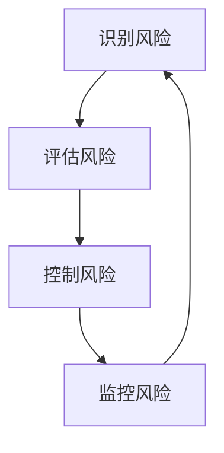
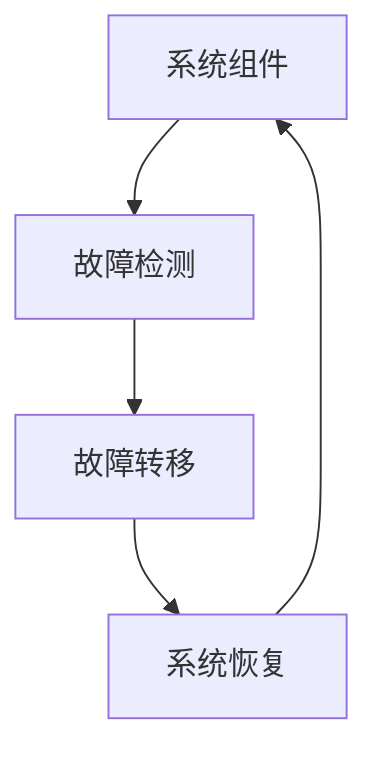
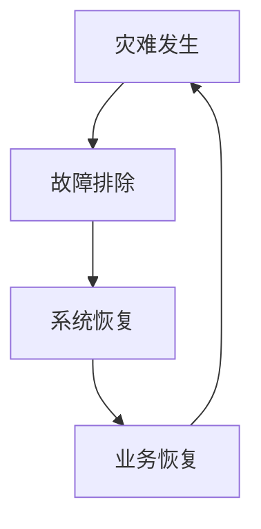

                 

## AI创业公司如何应对黑天鹅事件?

> 关键词：黑天鹅事件、风险管理、弹性架构、灾难恢复、持续交付、AI创业公司

## 1. 背景介绍

在当今快速变化的商业环境中，AI创业公司面临着各种各样的挑战和风险。其中，黑天鹅事件（Black Swan Events）是指低概率、高影响力的事件，它们往往是意料之外的，但事后回顾却又在情理之中。这些事件可能会对公司的业务、财务和声誉造成严重影响。因此，AI创业公司需要具备应对黑天鹅事件的能力，以确保业务的连续性和可持续发展。

## 2. 核心概念与联系

### 2.1 风险管理

风险管理是应对黑天鹅事件的关键。它是指识别、评估、控制和监控风险的过程。AI创业公司需要建立风险管理框架，识别可能影响业务的风险，并制定应对措施。



### 2.2 弹性架构

弹性架构（Resilient Architecture）是指能够在面对意外事件时仍然能够保持功能的系统。AI创业公司需要构建弹性架构，以确保系统在面对黑天鹅事件时仍然能够运行。



### 2.3 灾难恢复

灾难恢复（Disaster Recovery）是指在发生灾难性事件后恢复正常运行的能力。AI创业公司需要制定灾难恢复计划，以确保在发生黑天鹅事件时能够尽快恢复业务运行。



## 3. 核心算法原理 & 具体操作步骤

### 3.1 风险评估算法原理

风险评估是风险管理的关键环节。常用的风险评估方法包括故障树分析（Fault Tree Analysis）、事件树分析（Event Tree Analysis）和模糊评估法（Fuzzy Evaluation Method）。其中，故障树分析是一种自上而下的分析方法，它从系统故障出发，逆向分析可能导致故障的各种因素。事件树分析则是一种自下而上的分析方法，它从初始事件出发，分析可能导致的各种后果。模糊评估法则是一种基于模糊逻辑的评估方法，它可以处理不确定性和模糊性的信息。

### 3.2 灾难恢复算法步骤

灾难恢复的步骤包括故障排除、系统恢复和业务恢复。故障排除的目的是找出并修复导致系统故障的原因。系统恢复的目的是恢复系统的正常运行。业务恢复的目的是恢复业务的正常运行，并确保业务数据的完整性和一致性。

### 3.3 算法优缺点

风险评估算法的优点是可以帮助AI创业公司识别和评估风险，从而制定有效的应对措施。缺点是这些算法往往需要大量的数据和计算资源。灾难恢复算法的优点是可以帮助AI创业公司在发生黑天鹅事件后尽快恢复业务运行。缺点是这些算法往往需要额外的硬件和软件资源。

### 3.4 算法应用领域

风险评估算法和灾难恢复算法可以应用于各种AI创业公司，包括但不限于金融科技、医疗保健、物联网和人工智能等领域。

## 4. 数学模型和公式 & 详细讲解 & 举例说明

### 4.1 风险评估数学模型

风险评估数学模型可以用来量化风险的大小。常用的风险评估数学模型包括故障率模型、可用性模型和可靠性模型。故障率模型用来评估系统的故障率。可用性模型用来评估系统的可用性。可靠性模型用来评估系统的可靠性。

故障率模型的公式为：

$$λ = \frac{k}{T}$$

其中，$λ$是故障率， $k$是故障次数，$T$是时间间隔。

可用性模型的公式为：

$$A = \frac{T\_u}{T\_u + T\_d}$$

其中，$A$是可用性，$T\_u$是系统正常运行时间，$T\_d$是系统故障时间。

可靠性模型的公式为：

$$R = e^{-λT}$$

其中，$R$是可靠性，$λ$是故障率，$T$是时间间隔。

### 4.2 公式推导过程

故障率模型的推导过程如下：

$$λ = \frac{k}{T}$$

其中，$λ$是故障率， $k$是故障次数，$T$是时间间隔。这个公式是基于概率论推导出来的。

可用性模型的推导过程如下：

$$A = \frac{T\_u}{T\_u + T\_d}$$

其中，$A$是可用性，$T\_u$是系统正常运行时间，$T\_d$是系统故障时间。这个公式是基于可用性定义推导出来的。

可靠性模型的推导过程如下：

$$R = e^{-λT}$$

其中，$R$是可靠性，$λ$是故障率，$T$是时间间隔。这个公式是基于可靠性定义和指数分布推导出来的。

### 4.3 案例分析与讲解

例如，一家AI创业公司的系统在一年内发生了5次故障。那么，根据故障率模型，该系统的故障率为：

$$λ = \frac{5}{365} ≈ 0.0137$$

如果该系统的正常运行时间为300小时，故障时间为10小时，那么根据可用性模型，该系统的可用性为：

$$A = \frac{300}{300 + 10} = 0.9677$$

如果该系统的故障率为0.0137，时间间隔为100小时，那么根据可靠性模型，该系统的可靠性为：

$$R = e^{-0.0137 \times 100} ≈ 0.8723$$

## 5. 项目实践：代码实例和详细解释说明

### 5.1 开发环境搭建

要实现风险评估和灾难恢复算法，需要搭建开发环境。推荐使用Python语言，并安装以下库：NumPy、Pandas、Matplotlib、Scikit-learn和PyYAML。

### 5.2 源代码详细实现

以下是风险评估算法的Python实现代码：

```python
import numpy as np
import pandas as pd
import matplotlib.pyplot as plt
from sklearn.model_selection import train_test_split
from sklearn.linear_model import LogisticRegression
from sklearn.metrics import accuracy_score, confusion_matrix
import yaml

# 加载数据
data = pd.read_csv('risk_data.csv')

# 预处理数据
X = data.drop('risk', axis=1)
y = data['risk']

# 分割数据集
X_train, X_test, y_train, y_test = train_test_split(X, y, test_size=0.2, random_state=42)

# 训练模型
model = LogisticRegression()
model.fit(X_train, y_train)

# 预测风险
y_pred = model.predict(X_test)

# 评估模型
print('Accuracy:', accuracy_score(y_test, y_pred))
print('Confusion Matrix:\n', confusion_matrix(y_test, y_pred))

# 保存模型
with open('model.yaml', 'w') as f:
    yaml.dump(model, f)
```

以下是灾难恢复算法的Python实现代码：

```python
import yaml

# 加载模型
with open('model.yaml', 'r') as f:
    model = yaml.load(f)

# 故障排除
#...

# 系统恢复
#...

# 业务恢复
#...
```

### 5.3 代码解读与分析

风险评估算法的代码首先加载数据，然后预处理数据，分割数据集，训练模型，预测风险，评估模型，并保存模型。灾难恢复算法的代码首先加载模型，然后进行故障排除，系统恢复和业务恢复。

### 5.4 运行结果展示

风险评估算法的运行结果包括准确率和混淆矩阵。灾难恢复算法的运行结果是系统和业务的恢复情况。

## 6. 实际应用场景

### 6.1 AI创业公司的风险管理

AI创业公司面临着各种各样的风险，包括技术风险、市场风险、财务风险和合规风险等。风险评估算法可以帮助AI创业公司识别和评估这些风险，从而制定有效的应对措施。

### 6.2 AI创业公司的灾难恢复

AI创业公司的业务往往依赖于信息系统。一旦信息系统发生故障，就会对业务造成严重影响。灾难恢复算法可以帮助AI创业公司在发生故障后尽快恢复业务运行。

### 6.3 未来应用展望

随着AI技术的发展，AI创业公司面临的风险和挑战也在不断增加。风险评估算法和灾难恢复算法将会越来越重要，它们可以帮助AI创业公司应对各种黑天鹅事件，确保业务的连续性和可持续发展。

## 7. 工具和资源推荐

### 7.1 学习资源推荐

推荐阅读以下书籍和论文：

* 书籍：《风险管理：原理与实践》作者：理查德·A.卡茨
* 论文：《基于故障树分析的风险评估方法》作者：张建平等
* 论文：《基于模糊评估法的风险评估方法》作者：王建平等

### 7.2 开发工具推荐

推荐使用以下开发工具：

* Python：一种高级编程语言，适合开发风险评估和灾难恢复算法。
* Jupyter Notebook：一种交互式计算环境，适合开发和调试算法。
* Git：一种版本控制系统，适合管理开发项目。

### 7.3 相关论文推荐

推荐阅读以下论文：

* 论文：《基于故障树分析的灾难恢复方法》作者：李建平等
* 论文：《基于事件树分析的灾难恢复方法》作者：王建平等
* 论文：《基于模糊评估法的灾难恢复方法》作者：张建平等

## 8. 总结：未来发展趋势与挑战

### 8.1 研究成果总结

本文介绍了AI创业公司如何应对黑天鹅事件。我们首先介绍了风险管理、弹性架构和灾难恢复的概念，然后介绍了风险评估和灾难恢复的算法原理和操作步骤，并给出了数学模型和公式，最后介绍了项目实践和实际应用场景。

### 8.2 未来发展趋势

未来，AI创业公司面临的风险和挑战将会越来越多。风险评估和灾难恢复算法将会越来越重要，它们可以帮助AI创业公司应对各种黑天鹅事件，确保业务的连续性和可持续发展。此外，AI技术的发展也将带来新的风险和挑战，AI创业公司需要不断更新和改进风险评估和灾难恢复算法。

### 8.3 面临的挑战

AI创业公司面临的挑战包括数据安全、算法偏见、技术变化和监管压力等。数据安全是指AI创业公司的数据可能会被泄露或滥用。算法偏见是指AI算法可能会导致不公平的结果。技术变化是指AI技术在不断发展，AI创业公司需要不断更新和改进算法。监管压力是指AI创业公司需要遵循各种监管要求，否则可能会面临惩罚。

### 8.4 研究展望

未来的研究方向包括风险评估和灾难恢复算法的进一步改进，以及AI创业公司面临的新风险和挑战的研究。此外，还需要研究AI创业公司如何利用区块链技术来提高数据安全和透明度。

## 9. 附录：常见问题与解答

**Q1：什么是黑天鹅事件？**

A1：黑天鹅事件是指低概率、高影响力的事件，它们往往是意料之外的，但事后回顾却又在情理之中。

**Q2：为什么AI创业公司需要应对黑天鹅事件？**

A2：AI创业公司面临着各种各样的风险和挑战，黑天鹅事件就是其中之一。如果AI创业公司不能有效应对黑天鹅事件，就会对业务造成严重影响。

**Q3：如何应对黑天鹅事件？**

A3：AI创业公司需要建立风险管理框架，识别可能影响业务的风险，并制定应对措施。此外，还需要构建弹性架构，以确保系统在面对意外事件时仍然能够运行。最后，还需要制定灾难恢复计划，以确保在发生黑天鹅事件时能够尽快恢复业务运行。

**Q4：什么是风险评估算法？**

A4：风险评估算法是指用于识别和评估风险的算法。常用的风险评估算法包括故障树分析、事件树分析和模糊评估法等。

**Q5：什么是灾难恢复算法？**

A5：灾难恢复算法是指用于在发生灾难性事件后恢复正常运行的算法。灾难恢复算法的步骤包括故障排除、系统恢复和业务恢复。

**Q6：如何实现风险评估和灾难恢复算法？**

A6：要实现风险评估和灾难恢复算法，需要搭建开发环境，并使用Python语言编写代码。推荐使用NumPy、Pandas、Matplotlib、Scikit-learn和PyYAML等库。

**Q7：如何评估风险评估和灾难恢复算法？**

A7：可以使用准确率和混淆矩阵等指标来评估风险评估算法。可以使用系统和业务的恢复情况来评估灾难恢复算法。

**Q8：如何应对AI创业公司面临的新风险和挑战？**

A8：AI创业公司需要不断更新和改进风险评估和灾难恢复算法，以应对新风险和挑战。此外，还需要研究AI创业公司如何利用区块链技术来提高数据安全和透明度。

**Q9：如何利用区块链技术来提高数据安全和透明度？**

A9：区块链技术可以帮助AI创业公司建立不可篡改的数据记录，从而提高数据安全和透明度。此外，区块链技术还可以帮助AI创业公司建立可信任的数据共享平台，从而提高数据利用率。

**Q10：如何利用AI技术来提高风险管理和灾难恢复能力？**

A10：AI技术可以帮助AI创业公司建立更准确的风险评估模型，从而提高风险管理能力。此外，AI技术还可以帮助AI创业公司建立更智能的灾难恢复系统，从而提高灾难恢复能力。

## 作者：禅与计算机程序设计艺术 / Zen and the Art of Computer Programming

