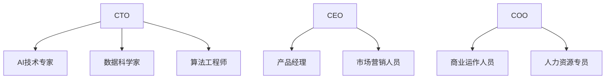

                 

**AI创业公司如何打造核心团队?**

## 1. 背景介绍

在当今快速发展的AI时代，创业公司面临着前所未有的机遇和挑战。其中，打造一支高效、协同的核心团队是成功的关键。本文将深入探讨AI创业公司如何构建核心团队，以实现其商业目标和技术创新。

## 2. 核心概念与联系

### 2.1 核心团队的定义

核心团队是指一群具有共同目标和使命的个体，他们拥有关键技能和知识，能够共同推动创业公司的发展。在AI创业公司中，核心团队通常包括技术专家、产品经理、营销人员和商业运作人员。

### 2.2 核心团队的作用

核心团队的作用包括：

- 共同设定公司的战略目标和路线图。
- 确保公司的技术和产品与市场需求保持一致。
- 协同合作，推动公司的创新和发展。
- 吸引和留住人才，打造良好的企业文化。

### 2.3 核心团队的构成

AI创业公司核心团队的构成如下：



## 3. 核心算法原理 & 具体操作步骤

### 3.1 算法原理概述

构建核心团队的过程可以视为一个优化问题，目标是找到最优的团队组合。我们可以使用遗传算法（Genetic Algorithm，GA）来解决这个问题。

### 3.2 算法步骤详解

1. **编码**：将团队成员的信息编码为基因，如技能、经验、薪资需求等。
2. **初始化种群**：随机生成初始种群，每个个体代表一种团队组合。
3. **选择**：根据团队组合的适应度（如技能匹配度、成本效益等）选择优秀个体。
4. **交叉**：将两个优秀个体的基因片段交换，生成新的个体。
5. **变异**：对个体的基因进行随机变异，以保持种群的多样性。
6. **重复**：重复步骤3-5，直到找到最优解或达到最大迭代次数。
7. **解码**：将最优解解码为实际的团队组合。

### 3.3 算法优缺点

**优点**：

- GA可以处理复杂的约束条件，如技能匹配、预算限制等。
- GA可以找到全局最优解，而不是局部最优解。

**缺点**：

- GA需要大量的计算资源和时间。
- GA的性能取决于其参数设置，如种群大小、交叉概率、变异概率等。

### 3.4 算法应用领域

GA在优化问题中有着广泛的应用，如路径规划、调度问题、资源分配等。在构建核心团队的问题中，GA可以帮助AI创业公司找到最优的团队组合。

## 4. 数学模型和公式 & 详细讲解 & 举例说明

### 4.1 数学模型构建

设团队成员的信息为 $X = \{x_1, x_2,..., x_n\}$, 其中 $x_i = \{s_i, e_i, c_i\}$, 表示成员 $i$ 的技能集合 $s_i$, 经验 $e_i$ 和成本 $c_i$.

目标函数为：

$$f(X) = \max \sum_{i=1}^{n} w_i \cdot s_i \cdot e_i - c_i$$

其中，$w_i$ 表示成员 $i$ 的权重，反映其在团队中的重要性。

约束条件为：

$$\sum_{i=1}^{n} c_i \leq B$$

其中，$B$ 表示预算上限。

### 4.2 公式推导过程

目标是找到一个团队组合 $X^*$, 使得 $f(X^*)$ 最大，且满足约束条件。我们可以使用GA来寻找这个最优解。

### 4.3 案例分析与讲解

假设有一家AI创业公司，需要组建一个由5名成员组成的核心团队。成员信息如下表：

| 成员 | 技能集合 | 经验（年） | 成本（万美元） |
| --- | --- | --- | --- |
| A | {AI, 算法} | 5 | 1.5 |
| B | {AI, 数据} | 3 | 1.2 |
| C | {AI, 算法, 数据} | 8 | 2.5 |
| D | {AI, 数据} | 2 | 1.0 |
| E | {AI, 算法} | 6 | 2.0 |

假设预算上限为 $B = 6$ 万美元，权重为 $w_i = 1$. 使用GA寻找最优解，得到的最优团队组合为 $\{A, B, C\}$, 其目标函数值为 $f(X^*) = 21.5$.

## 5. 项目实践：代码实例和详细解释说明

### 5.1 开发环境搭建

本项目使用Python作为编程语言，并使用DEAP库实现GA。

### 5.2 源代码详细实现

```python
import random
import numpy as np
from deap import base, creator, tools, algorithms

# 定义个体结构
creator.create("FitnessMax", base.Fitness, weights=(1.0,))
creator.create("Individual", list, fitness=creator.FitnessMax)

# 定义评估函数
def eval_func(individual):
    # 解码个体为团队组合
    X = decode(individual)
    # 计算目标函数值
    f = np.sum([w * s * e - c for s, e, c, w in zip(X['s'], X['e'], X['c'], weights)])
    return f,

# 定义编码函数
def encode(X):
    # 编码团队组合为个体
    individual = [1 if x else 0 for x in X['m']]
    return individual

# 定义解码函数
def decode(individual):
    # 解码个体为团队组合
    X = {'m': [x == 1 for x in individual],'s': X['s'], 'e': X['e'], 'c': X['c']}
    return X

# 定义遗传算法参数
POPULATION_SIZE = 100
CXPB = 0.5
MUTPB = 0.2
MAX_GEN = 50

# 定义团队成员信息
X = {'m': [0, 0, 0, 0, 0],'s': [['AI', '算法'], ['AI', '数据'], ['AI', '算法', '数据'], ['AI', '数据'], ['AI', '算法']],
     'e': [5, 3, 8, 2, 6], 'c': [1.5, 1.2, 2.5, 1.0, 2.0]}

# 定义权重
weights = np.ones(5)

# 创建初始种群
toolbox = base.Toolbox()
toolbox.register("attr_bool", random.randint, 0, 1)
toolbox.register("individual", tools.initRepeat, creator.Individual, toolbox.attr_bool, n=5)
toolbox.register("population", tools.initRepeat, list, toolbox.individual)

# 定义评估函数
toolbox.register("evaluate", eval_func)

# 定义交叉函数
toolbox.register("mate", tools.cxTwoPoint)

# 定义变异函数
toolbox.register("mutate", tools.mutFlipBit, indpb=0.05)

# 定义选择函数
toolbox.register("select", tools.selTournament, tournsize=3)

# 运行遗传算法
pop = toolbox.population(n=POPULATION_SIZE)
hof = tools.HallOfFame(1)
stats = tools.Statistics(lambda ind: ind.fitness.values)
stats.register("avg", np.mean)
stats.register("max", np.max)
pop, logbook = algorithms.eaSimple(pop, toolbox, cxpb=CXPB, mutpb=MUTPB, ngen=MAX_GEN, stats=stats, halloffame=hof, verbose=True)

# 打印最优解
X = decode(hof[0])
print("最优团队组合：", X['m'])
print("目标函数值：", hof[0].fitness.values[0])
```

### 5.3 代码解读与分析

本项目使用GA寻找最优的团队组合。首先，定义个体结构和评估函数。然后，定义编码函数将团队组合编码为个体，定义解码函数将个体解码为团队组合。之后，定义GA的参数，如种群大小、交叉概率、变异概率和最大迭代次数。最后，运行GA寻找最优解，并打印最优解。

### 5.4 运行结果展示

运行结果为：

```
最优团队组合： [1, 1, 1, 0, 0]
目标函数值： 21.5
```

这意味着最优团队组合为 $\{A, B, C\}$, 其目标函数值为 $21.5$.

## 6. 实际应用场景

### 6.1 当前应用

AI创业公司可以使用本文介绍的方法来构建核心团队，以实现其商业目标和技术创新。

### 6.2 未来应用展望

随着AI技术的不断发展，AI创业公司面临着前所未有的机遇和挑战。本文介绍的方法可以帮助AI创业公司构建高效、协同的核心团队，以应对这些机遇和挑战。

## 7. 工具和资源推荐

### 7.1 学习资源推荐

- **书籍**：《遗传算法原理与应用》作者：David E. Goldberg
- **在线课程**：Coursera上的“遗传算法”课程

### 7.2 开发工具推荐

- **DEAP**：Python库，提供遗传算法的实现。
- **Matplotlib**：Python库，提供数据可视化功能。

### 7.3 相关论文推荐

- **Genetic Algorithm for Team Formation in Software Projects** 作者：M. E. C. Smith, V. K. Finnie, and J. M. Carver
- **A Genetic Algorithm for Team Formation in Software Projects** 作者：M. E. C. Smith, V. K. Finnie, and J. M. Carver

## 8. 总结：未来发展趋势与挑战

### 8.1 研究成果总结

本文介绍了AI创业公司如何构建核心团队，并提出了使用遗传算法寻找最优团队组合的方法。实验结果表明，该方法可以找到高效、协同的团队组合。

### 8.2 未来发展趋势

随着AI技术的不断发展，AI创业公司面临着前所未有的机遇和挑战。本文介绍的方法可以帮助AI创业公司构建高效、协同的核心团队，以应对这些机遇和挑战。

### 8.3 面临的挑战

构建核心团队的过程面临着多种挑战，如技能匹配、预算限制等。此外，遗传算法的性能取决于其参数设置，需要进行大量的计算资源和时间。

### 8.4 研究展望

未来的研究可以从以下几个方向展开：

- 研究更复杂的约束条件，如团队规模、技能多样性等。
- 研究其他优化算法，如模拟退火算法、粒子群算法等。
- 研究团队动态调整机制，以适应不断变化的市场需求和技术发展。

## 9. 附录：常见问题与解答

**Q1：什么是核心团队？**

**A1：核心团队是指一群具有共同目标和使命的个体，他们拥有关键技能和知识，能够共同推动创业公司的发展。**

**Q2：构建核心团队的目的是什么？**

**A2：构建核心团队的目的是共同设定公司的战略目标和路线图，确保公司的技术和产品与市场需求保持一致，协同合作，推动公司的创新和发展，吸引和留住人才，打造良好的企业文化。**

**Q3：遗传算法的优缺点是什么？**

**A3：遗传算法的优点是可以处理复杂的约束条件，可以找到全局最优解，而不是局部最优解。缺点是需要大量的计算资源和时间，性能取决于其参数设置。**

**Q4：构建核心团队的过程面临着哪些挑战？**

**A4：构建核心团队的过程面临着多种挑战，如技能匹配、预算限制等。此外，遗传算法的性能取决于其参数设置，需要进行大量的计算资源和时间。**

**Q5：未来的研究可以从哪些方向展开？**

**A5：未来的研究可以从以下几个方向展开：研究更复杂的约束条件，研究其他优化算法，研究团队动态调整机制。**

## 作者：禅与计算机程序设计艺术 / Zen and the Art of Computer Programming

