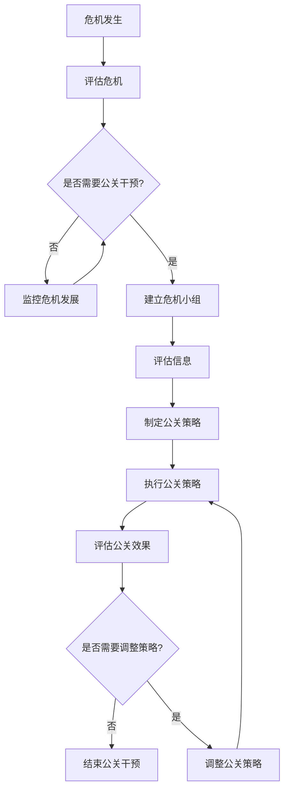

                 

- AI 创业公司
- 危机公关
- 策略设计
- 信息透明度
- 客户关系
- 员工沟通
- 危机管理流程
- 媒体关系
- 网络安全
- 创新与适应

## 1. 背景介绍

随着人工智能（AI）技术的飞速发展，AI 创业公司如雨后春笋般涌现。然而，这些公司也面临着各种挑战和风险，其中之一就是危机管理。本文将探讨AI创业公司在面对危机时的公关策略设计，帮助他们有效应对危机，维护公司形象，并实现可持续发展。

## 2. 核心概念与联系

### 2.1 危机公关的定义

危机公关是指在危机发生时，通过有效沟通，帮助组织维护形象，恢复正常运作，并重建信任的过程。对于AI创业公司来说，危机公关至关重要，因为它们往往面临着高度不确定性和快速变化的环境。

### 2.2 危机公关的目标

危机公关的目标是：

- 及时、准确地传达信息，以减轻危机的影响。
- 维护组织的声誉和形象。
- 恢复正常运作，并重建信任。
- 学习和适应，以应对未来的挑战。

### 2.3 危机公关的关键要素

危机公关的关键要素包括：

- 信息透明度：及时、准确地传达信息，以减轻危机的影响。
- 客户关系：维护与客户的关系，并重建信任。
- 员工沟通：及时、有效地与员工沟通，以维护士气和凝聚力。
- 危机管理流程：建立和执行危机管理流程，以应对危机。
- 媒体关系：与媒体建立良好关系，以帮助传达组织的信息。
- 网络安全：保护组织的网络安全，以防范网络攻击和数据泄露。

### 2.4 危机公关的流程图

以下是危机公关的流程图，使用Mermaid语言绘制：



## 3. 核心算法原理 & 具体操作步骤

### 3.1 算法原理概述

危机公关算法的核心原理是基于信息传播理论和危机管理理论。信息传播理论强调信息的及时、准确和透明度，而危机管理理论则强调危机的预防、准备和应对。

### 3.2 算法步骤详解

危机公关算法的具体操作步骤如下：

1. 危机评估：评估危机的严重性、影响范围和发展趋势。
2. 公关干预决策：根据危机评估结果，决定是否需要公关干预。
3. 危机小组建立：建立危机小组，负责危机管理和公关干预。
4. 信息评估：评估危机相关信息，确定需要传达的信息。
5. 公关策略制定：根据信息评估结果，制定公关策略。
6. 公关策略执行：执行公关策略，包括新闻发布会、媒体沟通、客户沟通和员工沟通。
7. 公关效果评估：评估公关策略的效果，并根据需要调整策略。
8. 公关干预结束：结束公关干预，并总结经验教训。

### 3.3 算法优缺点

危机公关算法的优点包括：

- 有助于及时、准确地传达信息，减轻危机的影响。
- 有助于维护组织的声誉和形象。
- 有助于恢复正常运作，并重建信任。
- 有助于学习和适应，以应对未来的挑战。

缺点包括：

- 可能需要大量资源和时间。
- 可能会面临媒体和公众的质疑和批评。
- 可能会面临网络攻击和数据泄露的风险。

### 3.4 算法应用领域

危机公关算法适用于各种AI创业公司，包括但不限于：

- AI软件开发公司
- AI芯片制造商
- AI数据服务提供商
- AI咨询公司
- AI金融服务提供商

## 4. 数学模型和公式 & 详细讲解 & 举例说明

### 4.1 数学模型构建

危机公关数学模型的核心是信息传播模型。信息传播模型描述了信息在人群中的传播过程，可以用以下公式表示：

$$I(t) = I_0 \cdot e^{-kt} + I_{\infty}(1 - e^{-kt})$$

其中，$I(t)$表示时间$t$时的信息强度，$I_0$表示初始信息强度，$I_{\infty}$表示信息强度的平衡值，$k$表示信息衰减率。

### 4.2 公式推导过程

信息传播模型的推导过程基于信息在人群中的传播和衰减。信息在人群中的传播可以用信息强度的增加表示，而信息的衰减则可以用信息强度的减少表示。信息传播模型描述了信息强度随时间的变化，并考虑了信息的初始强度、平衡值和衰减率。

### 4.3 案例分析与讲解

例如，一家AI芯片制造商发现其芯片存在安全漏洞，并立即发布了安全更新。信息传播模型可以用于预测信息强度随时间的变化，从而帮助公司制定公关策略。

假设初始信息强度$I_0 = 100$，平衡值$I_{\infty} = 50$，衰减率$k = 0.5$，则信息强度随时间的变化如下：

| 时间（天） | 信息强度 |
| --- | --- |
| 0 | 100 |
| 1 | 75 |
| 2 | 56.25 |
| 3 | 42.19 |
| 4 | 31.64 |
| 5 | 23.73 |
| 6 | 17.78 |
| 7 | 13.34 |
| 8 | 10.01 |
| 9 | 7.50 |
| 10 | 5.62 |

从表中可以看出，信息强度随着时间而减小，并最终趋于平衡值。这意味着信息传播模型可以帮助公司预测信息强度的变化，从而制定有效的公关策略。

## 5. 项目实践：代码实例和详细解释说明

### 5.1 开发环境搭建

危机公关项目的开发环境包括：

- Python 3.8+
- NumPy 1.20+
- Matplotlib 3.3+
- Pandas 1.2+

可以使用以下命令安装这些依赖项：

```bash
pip install numpy matplotlib pandas
```

### 5.2 源代码详细实现

以下是信息传播模型的Python实现代码：

```python
import numpy as np
import matplotlib.pyplot as plt
import pandas as pd

def info_propagation_model(t, I0, I_inf, k):
    return I0 * np.exp(-k * t) + I_inf * (1 - np.exp(-k * t))

# 定义参数
t = np.linspace(0, 10, 100)
I0 = 100
I_inf = 50
k = 0.5

# 计算信息强度
I = info_propagation_model(t, I0, I_inf, k)

# 绘制信息强度随时间的变化图
plt.plot(t, I)
plt.xlabel('Time (days)')
plt.ylabel('Information Intensity')
plt.title('Information Propagation Model')
plt.grid(True)
plt.show()

# 打印信息强度随时间的变化表格
df = pd.DataFrame({'Time (days)': t, 'Information Intensity': I})
print(df)
```

### 5.3 代码解读与分析

代码首先定义了信息传播模型函数`info_propagation_model`，该函数接受时间`t`、初始信息强度`I0`、平衡值`I_inf`和衰减率`k`作为输入，并返回信息强度`I`。

然后，代码定义了时间`t`、初始信息强度`I0`、平衡值`I_inf`和衰减率`k`的值，并计算信息强度`I`。

最后，代码绘制了信息强度随时间的变化图，并打印了信息强度随时间的变化表格。

### 5.4 运行结果展示

运行代码后，将生成信息强度随时间的变化图和表格。图中显示了信息强度随着时间而减小，并最终趋于平衡值。表格中则列出了信息强度随时间的变化情况。

## 6. 实际应用场景

### 6.1 信息透明度

信息透明度是危机公关的关键要素。AI创业公司应及时、准确地传达信息，以减轻危机的影响。例如，如果一家AI软件开发公司发现其软件存在安全漏洞，则应立即发布安全更新并通知客户。

### 6.2 客户关系

客户关系是危机公关的关键要素。AI创业公司应维护与客户的关系，并重建信任。例如，如果一家AI金融服务提供商出现数据泄露事件，则应立即通知客户，并提供帮助和补偿。

### 6.3 员工沟通

员工沟通是危机公关的关键要素。AI创业公司应及时、有效地与员工沟通，以维护士气和凝聚力。例如，如果一家AI芯片制造商面临财务困难，则应及时通知员工，并提供帮助和支持。

### 6.4 未来应用展望

未来，AI创业公司将面临更多的挑战和风险，包括网络攻击、数据泄露和监管压力。危机公关将变得越来越重要，AI创业公司应建立和执行危机管理流程，以应对这些挑战和风险。

## 7. 工具和资源推荐

### 7.1 学习资源推荐

以下是危机公关相关的学习资源推荐：

- 书籍：《危机公关：应对挑战、维护形象、重建信任》作者：James E. Lukaszewski
- 课程：Coursera上的《危机管理》课程
- 网站：PRWeek（<https://www.prweek.com/>）和PRNews（<https://www.prnewsonline.com/>）

### 7.2 开发工具推荐

以下是危机公关相关的开发工具推荐：

- Python：用于信息传播模型的实现和分析。
- R：用于信息传播模型的实现和分析。
- Tableau：用于信息传播模型的可视化。
- Hootsuite：用于社交媒体管理和监控。

### 7.3 相关论文推荐

以下是危机公关相关的论文推荐：

- Coombs, W. T. (2007). Protecting organization reputations during crises: The development and application of situational crisis communication theory. Corporate Reputation Review, 10(3), 163-178.
- Fearn-Banks, K. (2017). Crisis communications: A casebook approach (6th ed.). Routledge.
- Sellnow, T. L., Seeger, M. W., & Ulmer, R. R. (2009). Effective crisis communication: Moving from crisis to opportunity. Routledge.

## 8. 总结：未来发展趋势与挑战

### 8.1 研究成果总结

本文介绍了AI创业公司的危机公关策略设计，包括危机公关的定义、目标、关键要素和流程图，信息传播模型的构建、推导和应用，以及项目实践、实际应用场景、工具和资源推荐。

### 8.2 未来发展趋势

未来，AI创业公司将面临更多的挑战和风险，包括网络攻击、数据泄露和监管压力。危机公关将变得越来越重要，AI创业公司应建立和执行危机管理流程，以应对这些挑战和风险。

### 8.3 面临的挑战

AI创业公司面临的挑战包括：

- 信息传播速度快、范围广，危机公关压力大。
- 网络攻击和数据泄露的风险高。
- 监管压力大，需要遵循严格的合规要求。
- 媒体和公众对AI技术的理解和接受度不一。

### 8.4 研究展望

未来的研究可以从以下几个方向展开：

- 危机公关算法的优化和改进。
- 信息传播模型的扩展和应用。
- AI创业公司危机公关实践的案例分析。
- AI技术在危机公关中的应用。

## 9. 附录：常见问题与解答

### 9.1 什么是危机公关？

危机公关是指在危机发生时，通过有效沟通，帮助组织维护形象，恢复正常运作，并重建信任的过程。

### 9.2 危机公关的目标是什么？

危机公关的目标是及时、准确地传达信息，以减轻危机的影响。维护组织的声誉和形象。恢复正常运作，并重建信任。学习和适应，以应对未来的挑战。

### 9.3 危机公关的关键要素是什么？

危机公关的关键要素包括信息透明度、客户关系、员工沟通、危机管理流程、媒体关系和网络安全。

### 9.4 信息传播模型是什么？

信息传播模型是描述信息在人群中的传播过程的数学模型。它可以用于预测信息强度随时间的变化，从而帮助公司制定公关策略。

### 9.5 如何实现信息传播模型？

信息传播模型可以使用Python、R等编程语言实现。本文提供了Python实现代码的示例。

### 9.6 危机公关的未来发展趋势是什么？

未来，AI创业公司将面临更多的挑战和风险，包括网络攻击、数据泄露和监管压力。危机公关将变得越来越重要，AI创业公司应建立和执行危机管理流程，以应对这些挑战和风险。

### 9.7 AI创业公司面临的挑战是什么？

AI创业公司面临的挑战包括信息传播速度快、范围广，危机公关压力大。网络攻击和数据泄露的风险高。监管压力大，需要遵循严格的合规要求。媒体和公众对AI技术的理解和接受度不一。

### 9.8 未来的研究方向是什么？

未来的研究可以从危机公关算法的优化和改进、信息传播模型的扩展和应用、AI创业公司危机公关实践的案例分析和AI技术在危机公关中的应用等方向展开。

## 作者署名

作者：禅与计算机程序设计艺术 / Zen and the Art of Computer Programming

