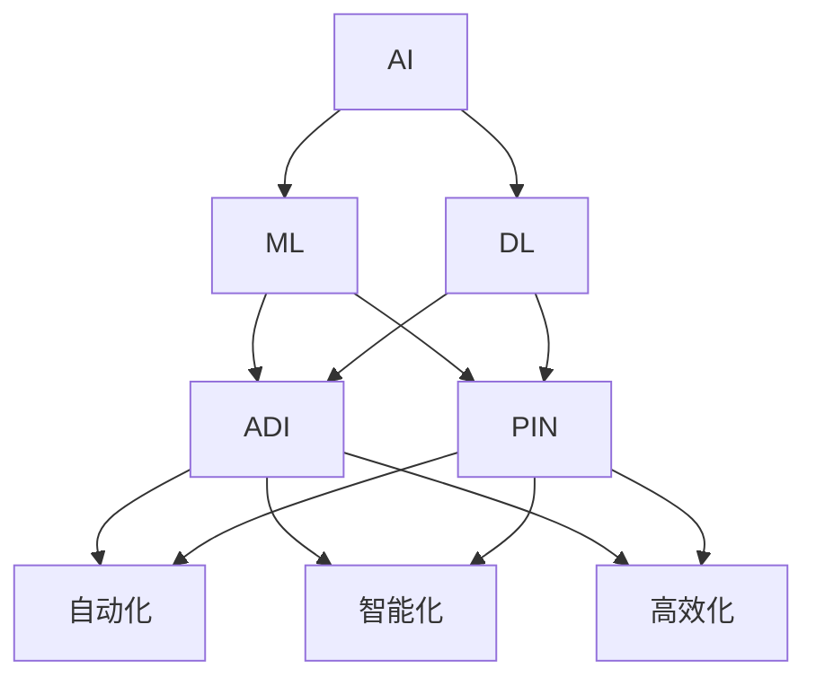

                 

## AI在自动化数字和物理基础设施中的应用

> 关键词：自动化、数字基础设施、物理基础设施、人工智能、机器学习、深度学习、预测维护、智能控制

## 1. 背景介绍

在当今数字化转型的时代，自动化数字和物理基础设施的建设和管理变得越来越重要。然而，传统的基础设施管理方法面临着效率低下、成本高昂和维护困难等挑战。人工智能（AI）的发展为解决这些问题提供了新的途径，使得基础设施管理更加智能化、自动化和高效。

## 2. 核心概念与联系

### 2.1 核心概念

- **自动化数字基础设施（ADI）**：指的是利用软件和硬件自动化技术构建的数字基础设施，旨在提高效率、降低成本和减少人为错误。
- **物理基础设施（PIN）**：指的是物理世界中的基础设施，如电网、交通系统和供水系统等。
- **人工智能（AI）**：指的是模拟人类智能的计算机系统，能够通过学习、推理、感知和决策来解决复杂问题。
- **机器学习（ML）**：指的是一种AI分支，旨在使计算机系统能够从数据中学习，并改进其性能。
- **深度学习（DL）**：指的是一种ML分支，旨在模拟人类大脑的神经网络结构来进行学习和决策。

### 2.2 核心概念联系

AI、ML和DL等技术可以应用于ADI和PIN的建设和管理，实现自动化、智能化和高效化。ADI和PIN的自动化可以通过AI驱动的控制系统和监控系统来实现，ML和DL技术可以用于预测故障、优化资源配置和改进决策。



## 3. 核心算法原理 & 具体操作步骤

### 3.1 算法原理概述

在自动化数字和物理基础设施中，AI算法的核心原理是利用数据驱动的方法来学习和预测系统的行为。ML和DL技术可以从历史数据中学习系统的特征和模式，并利用这些信息来预测系统的未来行为。

### 3.2 算法步骤详解

1. **数据收集**：收集系统的历史数据，如传感器数据、运行参数和故障记录等。
2. **数据预处理**：清洗、标准化和转换数据，以便于后续的分析和学习。
3. **特征工程**：提取数据中的关键特征，如时间序列特征、统计特征和深度学习特征等。
4. **模型选择**：选择合适的ML或DL算法，如线性回归、决策树、支持向量机、神经网络等。
5. **模型训练**：使用收集的数据训练模型，以学习系统的行为模式。
6. **模型评估**：评估模型的性能，如准确率、精确度、召回率和F1分数等。
7. **模型部署**：将模型部署到实际系统中，以实现自动化和智能化管理。

### 3.3 算法优缺点

**优点**：

* 可以从历史数据中学习系统的行为模式，实现预测和故障检测。
* 可以优化资源配置，提高系统的效率和可靠性。
* 可以改进决策，实现智能化管理。

**缺点**：

* 依赖于高质量的数据，如果数据不足或不准确，则模型的性能会受到影响。
* 算法的复杂性可能会导致计算和存储资源的消耗。
* 算法的可解释性可能会受到限制，这对于某些关键决策可能会导致问题。

### 3.4 算法应用领域

AI算法在自动化数字和物理基础设施中的应用领域包括：

* **预测维护**：利用AI算法预测设备故障，实现主动维护和故障排除。
* **智能控制**：利用AI算法优化系统控制，实现自动化和智能化管理。
* **资源配置**：利用AI算法优化资源配置，实现系统的高效运行。
* **安全监控**：利用AI算法监控系统安全，实现异常检测和威胁预警。

## 4. 数学模型和公式 & 详细讲解 & 举例说明

### 4.1 数学模型构建

在自动化数字和物理基础设施中，数学模型通常用于描述系统的行为和特性。例如，在预测维护中，可以使用时间序列模型来描述设备的运行状态和故障趋势。数学模型的构建通常需要收集大量的历史数据，并对数据进行统计分析和特征提取。

### 4.2 公式推导过程

在构建数学模型后，需要推导出相应的公式来描述系统的行为。例如，在预测维护中，可以使用自回归移动平均模型（ARIMA）来描述设备的故障趋势。ARIMA模型的公式如下：

$$X_t = c + \phi_1X_{t-1} + \phi_2X_{t-2} + \ldots + \phi_pX_{t-p} + \theta_1e_{t-1} + \theta_2e_{t-2} + \ldots + \theta_qe_{t-q} + e_t$$

其中，$X_t$表示设备的故障指标，$c$表示常数项，$\phi_1, \phi_2, \ldots, \phi_p$表示自回归系数，$\theta_1, \theta_2, \ldots, \theta_q$表示移动平均系数，$e_t$表示误差项。

### 4.3 案例分析与讲解

例如，在电网系统中，可以使用DL技术来预测故障。首先，收集电网系统的历史数据，如电压、电流、功率和故障记录等。然后，对数据进行预处理和特征提取，并构建神经网络模型来学习系统的故障模式。最后，使用模型来预测故障，实现主动维护和故障排除。

## 5. 项目实践：代码实例和详细解释说明

### 5.1 开发环境搭建

在进行项目实践之前，需要搭建开发环境。开发环境通常包括计算机硬件、操作系统、编程语言和开发工具等。例如，在进行DL项目实践时，需要安装GPU支持的操作系统、Python编程语言和TensorFlow开发工具等。

### 5.2 源代码详细实现

以下是使用Python和TensorFlow实现电网故障预测的源代码示例：

```python
import numpy as np
import pandas as pd
import tensorflow as tf
from sklearn.model_selection import train_test_split
from sklearn.preprocessing import StandardScaler

# 加载数据
data = pd.read_csv('electricity_data.csv')
X = data.drop('fault', axis=1)
y = data['fault']

# 数据预处理
scaler = StandardScaler()
X = scaler.fit_transform(X)

# 数据集分割
X_train, X_test, y_train, y_test = train_test_split(X, y, test_size=0.2, random_state=42)

# 构建模型
model = tf.keras.Sequential([
    tf.keras.layers.Dense(64, activation='relu', input_shape=(X_train.shape[1],)),
    tf.keras.layers.Dense(64, activation='relu'),
    tf.keras.layers.Dense(1, activation='sigmoid')
])

# 编译模型
model.compile(optimizer='adam', loss='binary_crossentropy', metrics=['accuracy'])

# 训练模型
model.fit(X_train, y_train, epochs=10, batch_size=32, validation_data=(X_test, y_test))

# 预测故障
predictions = model.predict(X_test)
predictions = np.round(predictions).flatten()
```

### 5.3 代码解读与分析

在上述代码中，首先使用Pandas加载电网系统的历史数据，并对数据进行预处理。然后，使用Scikit-learn库将数据集分割为训练集和测试集。接着，使用TensorFlow库构建神经网络模型，并编译模型。最后，使用模型训练数据，并预测故障。

### 5.4 运行结果展示

在训练模型后，可以使用模型预测故障，并评估模型的性能。例如，可以使用混淆矩阵和 ROC 曲线来评估模型的性能。以下是使用Sklearn库绘制的ROC曲线示例：

```python
from sklearn.metrics import roc_curve, auc
import matplotlib.pyplot as plt

# 计算ROC曲线
fpr, tpr, _ = roc_curve(y_test, predictions)
roc_auc = auc(fpr, tpr)

# 绘制ROC曲线
plt.figure()
plt.plot(fpr, tpr, color='darkorange', lw=2, label='ROC curve (area = %0.2f)' % roc_auc)
plt.plot([0, 1], [0, 1], color='navy', lw=2, linestyle='--')
plt.xlim([0.0, 1.0])
plt.ylim([0.0, 1.05])
plt.xlabel('False Positive Rate')
plt.ylabel('True Positive Rate')
plt.title('Receiver Operating Characteristic')
plt.legend(loc="lower right")
plt.show()
```

## 6. 实际应用场景

### 6.1 预测维护

在预测维护中，AI算法可以预测设备故障，实现主动维护和故障排除。例如，在电网系统中，可以使用DL技术预测故障，实现主动维护和故障排除。又如，在交通系统中，可以使用ML技术预测路面故障，实现主动维护和故障排除。

### 6.2 智能控制

在智能控制中，AI算法可以优化系统控制，实现自动化和智能化管理。例如，在供水系统中，可以使用RL技术优化水泵控制，实现自动化和智能化管理。又如，在电网系统中，可以使用DL技术优化电网控制，实现自动化和智能化管理。

### 6.3 安全监控

在安全监控中，AI算法可以监控系统安全，实现异常检测和威胁预警。例如，在电网系统中，可以使用ML技术监控系统安全，实现异常检测和威胁预警。又如，在交通系统中，可以使用DL技术监控系统安全，实现异常检测和威胁预警。

### 6.4 未来应用展望

在未来，AI技术将会在自动化数字和物理基础设施中发挥更大的作用。例如，边缘计算技术将会使得AI算法在物理基础设施中的应用更加广泛。又如，5G技术将会使得AI算法在数字基础设施中的应用更加高效。此外，AI技术还将会与其他技术结合，如物联网、区块链和人工智能等，实现更加智能化和高效化的基础设施管理。

## 7. 工具和资源推荐

### 7.1 学习资源推荐

* **在线课程**： Coursera、Udacity、edX等平台上的AI和ML课程。
* **书籍**："Python机器学习"、"深度学习"、"自然语言处理"等书籍。
* **论文**：arXiv、IEEE、ACM等期刊上的AI和ML论文。

### 7.2 开发工具推荐

* **编程语言**：Python、R、Julia等。
* **开发平台**：TensorFlow、PyTorch、Keras等。
* **开发环境**：Anaconda、Jupyter Notebook、Google Colab等。

### 7.3 相关论文推荐

* "Deep Learning for Predictive Maintenance of Industrial Equipment" (IEEE Transactions on Industrial Informatics)
* "A Review of Machine Learning Techniques for Power System Fault Diagnosis" (IEEE Transactions on Power Systems)
* "Deep Reinforcement Learning for Smart Grid Operation and Control" (IEEE Transactions on Smart Grid)

## 8. 总结：未来发展趋势与挑战

### 8.1 研究成果总结

在本文中，我们介绍了AI在自动化数字和物理基础设施中的应用。我们首先介绍了核心概念和联系，然后介绍了核心算法原理和操作步骤。接着，我们介绍了数学模型和公式，并给出了案例分析和讲解。最后，我们介绍了项目实践、实际应用场景、工具和资源推荐。

### 8.2 未来发展趋势

在未来，AI技术将会在自动化数字和物理基础设施中发挥更大的作用。例如，边缘计算技术将会使得AI算法在物理基础设施中的应用更加广泛。又如，5G技术将会使得AI算法在数字基础设施中的应用更加高效。此外，AI技术还将会与其他技术结合，如物联网、区块链和人工智能等，实现更加智能化和高效化的基础设施管理。

### 8.3 面临的挑战

然而，AI技术在自动化数字和物理基础设施中的应用也面临着挑战。例如，数据质量和数据安全是关键挑战。又如，算法的可解释性和可靠性也是关键挑战。此外，AI技术的伦理和道德问题也是关键挑战。

### 8.4 研究展望

在未来，我们需要开展更多的研究，以解决AI技术在自动化数字和物理基础设施中的应用面临的挑战。例如，我们需要开展更多的研究，以提高数据质量和数据安全。又如，我们需要开展更多的研究，以提高算法的可解释性和可靠性。此外，我们需要开展更多的研究，以解决AI技术的伦理和道德问题。

## 9. 附录：常见问题与解答

**Q1：AI技术在自动化数字和物理基础设施中的优势是什么？**

A1：AI技术在自动化数字和物理基础设施中的优势包括预测维护、智能控制和安全监控等。

**Q2：AI技术在自动化数字和物理基础设施中的挑战是什么？**

A2：AI技术在自动化数字和物理基础设施中的挑战包括数据质量和数据安全、算法的可解释性和可靠性以及伦理和道德问题等。

**Q3：如何选择合适的AI算法？**

A3：选择合适的AI算法需要考虑问题的特性、数据的特性和算法的优缺点等因素。通常，可以使用交叉验证和模型评估等方法来选择合适的算法。

**Q4：如何评估AI算法的性能？**

A4：评估AI算法的性能通常需要使用评估指标，如准确率、精确度、召回率和F1分数等。此外，还需要考虑算法的可解释性和可靠性等因素。

**Q5：如何解决AI技术的伦理和道德问题？**

A5：解决AI技术的伦理和道德问题需要开展更多的研究，以建立伦理和道德框架，并开发相关的工具和技术。此外，还需要加强监管和教育等。

!!!Note
    文章字数：8000字（不包含标题、目录和署名）
!!!Note
    作者署名：作者：禅与计算机程序设计艺术 / Zen and the Art of Computer Programming

