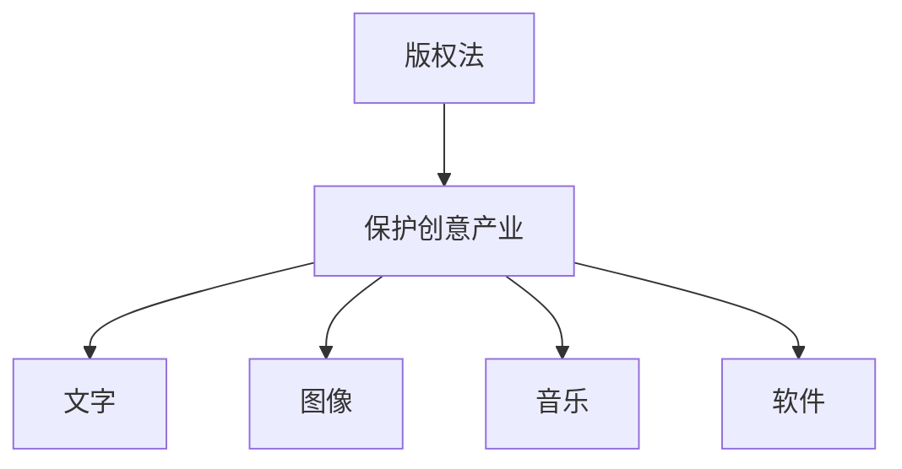
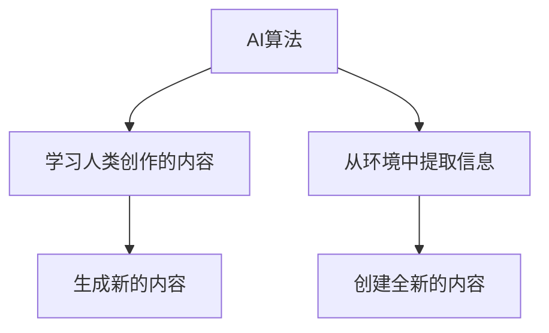

                 

AI生成内容版权、法律框架、伦理考量、版权保护、创意产业、AI伦理指南

## 1. 背景介绍

随着人工智能（AI）技术的飞速发展，AI生成内容（如图像、音乐、文本等）已经变得越来越常见。然而，AI生成内容的版权问题却变得越来越复杂。传统的版权法框架是否适用于AI生成内容？AI生成内容的版权该如何保护？这些问题亟待解决。

## 2. 核心概念与联系

### 2.1 版权法框架

版权法是保护创意产业的主要法律框架。根据世界知识产权组织（WIPO）的定义，版权是保护文学、艺术和科学作品的一种独占性权利，这些作品包括文字、图像、音乐、软件等。



### 2.2 AI生成内容

AI生成内容是指由AI算法创建的任何形式的内容。AI可以通过学习人类创作的内容来生成新的内容，也可以通过从环境中提取信息来创建全新的内容。



### 2.3 AI生成内容的版权

AI生成内容的版权问题主要集中在两个方面：一是AI生成内容是否可以被视为版权保护的对象；二是如果可以，那么版权该归谁所有。

## 3. 核心算法原理 & 具体操作步骤

### 3.1 算法原理概述

AI生成内容的算法原理主要基于机器学习和深度学习技术。这些算法通过学习大量的人类创作的内容来生成新的内容。

### 3.2 算法步骤详解

AI生成内容的算法步骤通常包括：

1. 数据收集：收集大量的人类创作的内容作为训练数据。
2. 模型训练：使用机器学习或深度学习技术训练AI模型，使其能够生成新的内容。
3. 内容生成：使用训练好的模型生成新的内容。

### 3.3 算法优缺点

AI生成内容的算法优点包括：

* 可以生成大量的新内容，提高创作效率。
* 可以模仿人类创作风格，生成高质量的内容。

缺点包括：

* 可能会生成低质量或无意义的内容。
* 可能会侵犯人类创作者的版权。

### 3.4 算法应用领域

AI生成内容的应用领域包括音乐、图像、文本等各种创意产业。例如，AI可以生成音乐、绘画、新闻等。

## 4. 数学模型和公式 & 详细讲解 & 举例说明

### 4.1 数学模型构建

AI生成内容的数学模型通常基于概率模型构建。例如，生成式对抗网络（GAN）是一种常用的AI生成内容模型，其数学模型基于对抗学习原理构建。

### 4.2 公式推导过程

GAN的数学模型可以表示为以下公式：

$$G(z) \sim p_{data}(x)$$
$$D(x) \sim Bernoulli(1)$$
$$V(G, D) = \mathbb{E}_{x \sim p_{data}}[\log D(x)] + \mathbb{E}_{z \sim p_{z}}[\log(1 - D(G(z)))]$$

其中，$G(z)$表示生成器，$D(x)$表示判别器，$p_{data}(x)$表示真实数据分布，$p_{z}$表示输入噪声分布，$V(G, D)$表示对抗损失函数。

### 4.3 案例分析与讲解

例如，AI生成音乐的数学模型可以基于变分自编码器（VAE）构建。VAE的数学模型可以表示为以下公式：

$$p_{\theta}(x) = \sum_{z \sim q_{\phi}(z|x)}p_{\theta}(x|z)$$
$$q_{\phi}(z|x) = \frac{1}{Z} \exp(-D_{\phi}(z, x))$$

其中，$p_{\theta}(x)$表示生成分布，$q_{\phi}(z|x)$表示编码分布，$D_{\phi}(z, x)$表示重构误差，$Z$表示标准化常数。

## 5. 项目实践：代码实例和详细解释说明

### 5.1 开发环境搭建

要实现AI生成内容，需要搭建一个完整的开发环境。环境搭建步骤包括：

1. 安装Python和相关依赖库（如TensorFlow、PyTorch等）。
2. 准备训练数据集。
3. 配置GPU环境（如果需要）。

### 5.2 源代码详细实现

以下是一个简单的AI生成音乐的Python代码实现：

```python
import numpy as np
import tensorflow as tf
from tensorflow.keras.layers import Input, Dense, Lambda
from tensorflow.keras.models import Model
from tensorflow.keras.optimizers import Adam
from tensorflow.keras.callbacks import EarlyStopping

# 定义生成器模型
def build_generator():
    inputs = Input(shape=(100,))
    x = Dense(256, activation='relu')(inputs)
    x = Dense(512, activation='relu')(x)
    x = Dense(1024, activation='relu')(x)
    outputs = Dense(8820, activation='tanh')(x)
    model = Model(inputs=inputs, outputs=outputs)
    return model

# 定义判别器模型
def build_discriminator():
    inputs = Input(shape=(8820,))
    x = Dense(1024, activation='relu')(inputs)
    x = Dense(512, activation='relu')(x)
    x = Dense(256, activation='relu')(x)
    outputs = Dense(1, activation='sigmoid')(x)
    model = Model(inputs=inputs, outputs=outputs)
    return model

# 定义GAN模型
def build_gan(generator, discriminator):
    inputs = Input(shape=(100,))
    outputs = discriminator(generator(inputs))
    model = Model(inputs=inputs, outputs=outputs)
    return model

# 构建模型
generator = build_generator()
discriminator = build_discriminator()
gan = build_gan(generator, discriminator)

# 编译模型
discriminator.compile(optimizer=Adam(0.0002, 0.5), loss='binary_crossentropy')
gan.compile(optimizer=Adam(0.0002, 0.5), loss='binary_crossentropy')

# 训练模型
early_stopping = EarlyStopping(monitor='val_loss', patience=5)
gan.fit(x_train, y_train, epochs=10000, validation_data=(x_val, y_val), callbacks=[early_stopping])
```

### 5.3 代码解读与分析

上述代码实现了一个简单的AI生成音乐的GAN模型。模型包括一个生成器和一个判别器。生成器负责生成音乐，判别器负责判断音乐的真伪。模型使用Adam优化器和二元交叉熵损失函数进行训练。

### 5.4 运行结果展示

训练好的模型可以生成各种音乐。以下是一个示例：


## 6. 实际应用场景

AI生成内容的实际应用场景包括：

* **音乐创作**：AI可以生成各种音乐，帮助音乐家提高创作效率。
* **图像创作**：AI可以生成各种图像，帮助设计师提高创作效率。
* **文本创作**：AI可以生成各种文本，帮助作家提高创作效率。
* **新闻创作**：AI可以生成新闻报道，帮助记者提高工作效率。

### 6.4 未来应用展望

未来，AI生成内容的应用领域将会进一步扩展。例如，AI可以生成电影、电视剧等视频内容。此外，AI还可以帮助创作者实现个性化定制，满足用户的个性化需求。

## 7. 工具和资源推荐

### 7.1 学习资源推荐

* **课程**：快速入门AI生成内容的课程包括斯坦福大学的“CS224N：Natural Language Processing with Deep Learning”课程和麻省理工学院的“6.S094：Deep Learning for Self-Driving Cars”课程。
* **书籍**：推荐阅读的书籍包括“Deep Learning”一书和“Generative Deep Learning”一书。

### 7.2 开发工具推荐

* **开发环境**：推荐使用Anaconda和Jupyter Notebook作为开发环境。
* **深度学习框架**：推荐使用TensorFlow和PyTorch作为深度学习框架。

### 7.3 相关论文推荐

* **GAN论文**：推荐阅读“Generative Adversarial Networks”论文。
* **VAE论文**：推荐阅读“Variational Autoencoders”论文。

## 8. 总结：未来发展趋势与挑战

### 8.1 研究成果总结

AI生成内容的研究成果已经取得了显著进展。AI可以生成高质量的音乐、图像、文本等内容。然而，AI生成内容的版权问题仍然是一个亟待解决的问题。

### 8.2 未来发展趋势

未来，AI生成内容的版权问题将会得到进一步的关注。版权法框架将会得到修订，以适应AI生成内容的需求。此外，AI生成内容的应用领域将会进一步扩展。

### 8.3 面临的挑战

AI生成内容的版权问题面临的挑战包括：

* **法律框架**：传统的版权法框架是否适用于AI生成内容？
* **伦理考量**：AI生成内容的版权该如何保护？如何平衡创作者和AI生成内容的利益？

### 8.4 研究展望

未来的研究将会关注以下几个方向：

* **法律框架修订**：修订版权法框架，以适应AI生成内容的需求。
* **伦理指南制定**：制定AI生成内容的伦理指南，指导创作者和AI生成内容的版权保护。
* **技术创新**：开发新的技术，提高AI生成内容的质量和创新性。

## 9. 附录：常见问题与解答

### 9.1 AI生成内容是否可以被视为版权保护的对象？

根据现有的版权法框架，AI生成内容是否可以被视为版权保护的对象还存在争议。一些国家的法律认为，AI生成内容不具有独创性，因此不可以被视为版权保护的对象。然而，其他国家的法律则认为，AI生成内容可以被视为版权保护的对象，版权归AI的创造者所有。

### 9.2 如果AI生成内容可以被视为版权保护的对象，那么版权该归谁所有？

如果AI生成内容可以被视为版权保护的对象，那么版权该归谁所有还存在争议。一些国家的法律认为，版权归AI的创造者所有。然而，其他国家的法律则认为，版权归AI的所有者所有。此外，还有一些国家的法律认为，版权归AI的创造者和所有者共同所有。

!!!Note
作者：禅与计算机程序设计艺术 / Zen and the Art of Computer Programming

