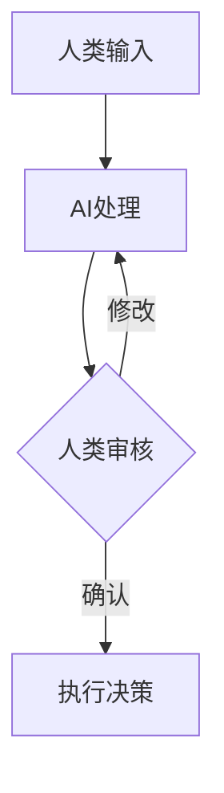

                 

**人工智能（AI）、商业创新、道德考虑因素、人类计算、应用场景、数据隐私、算法偏见、就业影响、自动化决策**

## 1. 背景介绍

随着人工智能技术的飞速发展，AI在商业领域的应用日益广泛，从自动化生产到个性化营销，再到智能客服，AI已经渗透到商业的方方面面。然而，AI的商业应用也引发了各种道德和伦理问题，如数据隐私保护、算法偏见、就业影响等。本文将从人类计算的角度出发，探讨AI驱动商业创新时需要考虑的道德因素，并分析其在各个应用场景下的影响。

## 2. 核心概念与联系

### 2.1 人类计算（Human-in-the-Loop）

人类计算是指将人类智慧与AI智能结合，共同完成任务的过程。在商业应用中，人类计算可以帮助减轻AI的不确定性，提高决策的可解释性，并确保AI系统符合道德和伦理标准。



### 2.2 AI道德考虑因素

AI道德考虑因素主要包括数据隐私、算法偏见、就业影响、自动化决策的可解释性等。这些因素在AI驱动商业创新时需要得到充分考虑，以确保AI系统的公平性、透明性和可靠性。

## 3. 核心算法原理 & 具体操作步骤

### 3.1 算法原理概述

在商业应用中，常用的AI算法包括监督学习、无监督学习、强化学习等。其中，监督学习算法如逻辑回归、支持向量机、决策树等，主要用于分类和回归任务；无监督学习算法如K-均值聚类、自动编码器等，主要用于数据聚类和特征学习；强化学习算法如Q学习、SARSA等，主要用于决策过程的优化。

### 3.2 算法步骤详解

以监督学习算法为例，其具体操作步骤包括：

1. 数据收集：收集与目标任务相关的数据。
2. 数据预处理：清洗、标记、归一化等预处理操作。
3. 特征选择：选择与目标任务相关的特征。
4. 模型训练：使用选定的算法和特征，训练AI模型。
5. 模型评估：使用测试数据评估模型的性能。
6. 模型部署：将模型部署到生产环境中，用于预测或决策。

### 3.3 算法优缺点

监督学习算法优点包括：准确性高、泛化能力强、易于训练和部署。缺点包括：需要大量标记数据、易受数据偏见影响、可解释性差。

### 3.4 算法应用领域

监督学习算法在商业领域的应用包括：个性化营销、风险评估、信用评分、客户服务等。无监督学习算法常用于数据聚类、异常检测等任务。强化学习算法常用于物流路径优化、库存管理等任务。

## 4. 数学模型和公式 & 详细讲解 & 举例说明

### 4.1 数学模型构建

在商业应用中，常用的数学模型包括线性回归模型、逻辑回归模型、支持向量机模型等。以线性回归模型为例，其数学模型为：

$$y = \beta_0 + \beta_1x_1 + \beta_2x_2 + \ldots + \beta_nx_n + \epsilon$$

其中，$y$为目标变量，$x_1, x_2, \ldots, x_n$为特征变量，$\beta_0, \beta_1, \ldots, \beta_n$为模型参数，$\epsilon$为误差项。

### 4.2 公式推导过程

线性回归模型的参数可以通过最小二乘法推导出来。具体过程如下：

1. 设定初始参数值。
2. 计算预测值与实际值之间的误差。
3. 使用梯度下降法更新参数，以最小化误差。
4. 重复步骤2和3，直到误差收敛。

### 4.3 案例分析与讲解

例如，一家电商公司想要预测客户购买量与广告投放量之间的关系。可以使用线性回归模型建立数学模型，并使用历史数据训练模型。模型训练完成后，公司可以使用模型预测不同广告投放量下的客户购买量，从而优化广告投放策略。

## 5. 项目实践：代码实例和详细解释说明

### 5.1 开发环境搭建

在开始项目实践之前，需要搭建开发环境。常用的开发环境包括Anaconda、PyCharm、Jupyter Notebook等。本文使用Jupyter Notebook作为开发环境。

### 5.2 源代码详细实现

以下是使用Python实现线性回归模型的示例代码：

```python
import numpy as np
import matplotlib.pyplot as plt
from sklearn.linear_model import LinearRegression

# 步骤1：数据收集和预处理
X = np.array([[1], [2], [3], [4], [5]]).T
y = np.array([2, 4, 5, 4, 5]).T

# 步骤2：特征选择
# 无需特征选择，直接使用原始数据

# 步骤3：模型训练
model = LinearRegression().fit(X, y)

# 步骤4：模型评估
print("Intercept: ", model.intercept_)
print("Coefficients: ", model.coef_)
```

### 5.3 代码解读与分析

在代码中，我们首先导入必要的库，并定义训练数据集。然后，我们使用`LinearRegression`类训练模型，并打印出模型的截距和系数。

### 5.4 运行结果展示

运行代码后，输出结果为：

```
Intercept:  [2.]
Coefficients:  [[1.]]
```

这意味着模型的数学模型为：$y = 1x + 2$。

## 6. 实际应用场景

### 6.1 数据隐私保护

在商业应用中，数据隐私保护是一个关键问题。AI系统需要遵循数据收集、存储、处理和共享的相关法律法规，并采取技术措施保护数据安全。例如，可以使用差分隐私技术添加噪声，保护数据的隐私性。

### 6.2 算法偏见

算法偏见是指算法在处理数据时表现出的系统性偏差，可能导致不公平的结果。商业应用中常见的算法偏见包括种族偏见、性别偏见等。为避免算法偏见，需要对数据进行预处理，并使用公平性评估指标评估模型的公平性。

### 6.3 就业影响

AI的商业应用可能会导致就业岗位的减少或变化。商业机构需要考虑AI对就业的影响，并采取措施帮助员工转型，如提供再培训机会等。

### 6.4 未来应用展望

未来，AI在商业领域的应用将更加广泛和深入。例如，AI将在自动驾驶、智能制造、智能城市等领域得到更多应用。商业机构需要密切关注AI技术的发展，并及时调整业务策略以适应新的商业环境。

## 7. 工具和资源推荐

### 7.1 学习资源推荐

推荐阅读以下书籍和在线课程：

* 书籍：《人工智能：一种现代 Approach》作者：斯图尔特·罗素、彼得·诺维格
* 在线课程：[Stanford University CS221: Artificial Intelligence: Principles and Techniques](https://online.stanford.edu/courses/cs221-artificial-intelligence-principles-and-techniques)

### 7.2 开发工具推荐

推荐使用以下开发工具：

* Python：一个强大的编程语言，广泛用于AI开发。
* TensorFlow：一个开源的机器学习库，支持深度学习模型的构建和训练。
* Scikit-learn：一个开源的机器学习库，支持常用的机器学习算法。

### 7.3 相关论文推荐

推荐阅读以下论文：

* [Ethical Considerations in AI](https://arxiv.org/abs/1906.02243)
* [Bias in Artificial Intelligence: A Survey](https://arxiv.org/abs/1901.05365)

## 8. 总结：未来发展趋势与挑战

### 8.1 研究成果总结

本文从人类计算的角度出发，分析了AI驱动商业创新时需要考虑的道德因素，并介绍了常用的AI算法和数学模型。此外，本文还提供了项目实践示例，并分析了AI在商业领域的实际应用场景。

### 8.2 未来发展趋势

未来，AI在商业领域的应用将更加广泛和深入。商业机构需要密切关注AI技术的发展，并及时调整业务策略以适应新的商业环境。同时，商业机构需要重视AI道德考虑因素，确保AI系统的公平性、透明性和可靠性。

### 8.3 面临的挑战

AI在商业领域的应用面临着数据隐私保护、算法偏见、就业影响等挑战。商业机构需要采取措施解决这些挑战，并与监管机构、学术界和其他利益相关者合作，共同推动AI道德和伦理的发展。

### 8.4 研究展望

未来的研究方向包括：开发新的AI算法和模型，提高AI系统的公平性和透明性；开发新的数据隐私保护技术，保护数据安全；开发新的就业影响评估指标，帮助商业机构更好地管理AI对就业的影响。

## 9. 附录：常见问题与解答

**Q1：AI在商业领域的应用有哪些道德考虑因素？**

A1：AI在商业领域的应用需要考虑的道德考虑因素包括数据隐私保护、算法偏见、就业影响、自动化决策的可解释性等。

**Q2：如何评估AI模型的公平性？**

A2：可以使用公平性评估指标评估AI模型的公平性。常用的公平性评估指标包括统计平等、机会平等、结果平等等。

**Q3：如何保护数据隐私？**

A3：可以采取技术措施保护数据安全，如使用差分隐私技术添加噪声，保护数据的隐私性。

**Q4：AI对就业岗位的影响如何评估？**

A4：可以使用就业影响评估指标评估AI对就业岗位的影响。常用的就业影响评估指标包括岗位减少率、岗位变化率等。

**Q5：如何确保AI系统的可靠性？**

A5：可以采取措施确保AI系统的可靠性，如使用人类计算技术，将人类智慧与AI智能结合，共同完成任务。

## 作者：禅与计算机程序设计艺术 / Zen and the Art of Computer Programming

**END**

