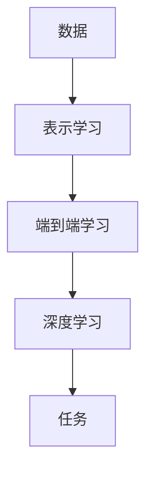

                 

## 1. 背景介绍

在当今的计算机科学领域，人工智能（AI）已经成为最具前途和挑战性的领域之一。随着AI技术的不断发展，传统的编程范式已经无法满足当前的需求。因此，寻找一种新的AI编程范式变得至关重要。本文将讨论Andrej Karpathy提出的AI编程新范式，并深入探讨其核心概念、算法原理、数学模型、项目实践，以及未来的发展趋势。

## 2. 核心概念与联系

Karpathy的AI编程新范式建立在以下核心概念之上：

- **表示学习（Representation Learning）**：自动学习表示数据的方式，使得数据可以更容易地被模型理解和处理。
- **端到端学习（End-to-End Learning）**：直接从原始数据到最终任务的学习，无需人工特征工程。
- **深度学习（Deep Learning）**：使用深度神经网络来学习表示和建模数据。

这些概念是相互关联的，如下图所示：



## 3. 核心算法原理 & 具体操作步骤

### 3.1 算法原理概述

Karpathy的AI编程新范式的核心是使用深度学习算法进行表示学习和端到端学习。具体地说，它使用卷积神经网络（CNN）和循环神经网络（RNN）等深度学习模型，直接从原始数据中学习表示，然后将这些表示用于最终任务。

### 3.2 算法步骤详解

1. **数据预处理**：收集和预处理原始数据，使其可以被模型使用。
2. **表示学习**：使用深度学习模型（如CNN或RNN）从原始数据中学习表示。
3. **端到端学习**：将学习到的表示直接用于最终任务，无需人工特征工程。
4. **训练**：使用反向传播算法和梯度下降优化算法训练模型。
5. **评估**：评估模型的性能，并进行调优以提高性能。

### 3.3 算法优缺点

**优点**：

- 自动学习表示，无需人工特征工程。
- 可以处理各种类型的数据（图像、文本、音频等）。
- 可以学习复杂的非线性关系。

**缺点**：

- 需要大量的数据和计算资源。
- 训练过程可能会出现不稳定的情况。
- 模型的可解释性较差。

### 3.4 算法应用领域

Karpathy的AI编程新范式已经成功应用于各种领域，包括：

- 计算机视觉：图像分类、物体检测、图像分割等。
- 自然语言处理：文本分类、命名实体识别、机器翻译等。
- 语音识别：自动语音识别、语音合成等。

## 4. 数学模型和公式 & 详细讲解 & 举例说明

### 4.1 数学模型构建

karpathy的AI编程新范式使用深度学习模型作为数学模型。例如，CNN模型可以表示为：

$$y = f(x; W, b) = \sigma(W \cdot x + b)$$

其中，$x$是输入数据，$W$和$b$是模型的参数，$\sigma$是激活函数，如ReLU或sigmoid。

### 4.2 公式推导过程

深度学习模型的参数通常使用反向传播算法和梯度下降优化算法来学习。给定损失函数$L(y, \hat{y})$，其中$y$是真实值，$\hat{y}$是模型的预测值，则模型的目标是最小化损失函数：

$$\min_W L(y, f(x; W, b))$$

梯度下降优化算法更新模型参数的公式为：

$$W_{t+1} = W_t - \eta \nabla_W L(y, f(x; W_t, b))$$

其中，$\eta$是学习率，$\nabla_W$是梯度。

### 4.3 案例分析与讲解

例如，在图像分类任务中，输入数据$x$是图像，输出$y$是图像的类别。模型的目标是学习表示，使得模型可以正确预测图像的类别。通过训练模型，模型可以学习到表示，从而提高图像分类的准确性。

## 5. 项目实践：代码实例和详细解释说明

### 5.1 开发环境搭建

要实现karpathy的AI编程新范式，需要以下开发环境：

- Python：用于编写代码。
- TensorFlow或PyTorch：用于构建和训练深度学习模型。
- Jupyter Notebook：用于交互式开发和可视化。

### 5.2 源代码详细实现

以下是使用TensorFlow构建CNN模型的示例代码：

```python
import tensorflow as tf
from tensorflow.keras import layers

# 定义模型
model = tf.keras.Sequential([
    layers.Conv2D(32, (3, 3), activation='relu', input_shape=(32, 32, 3)),
    layers.MaxPooling2D((2, 2)),
    layers.Conv2D(64, (3, 3), activation='relu'),
    layers.MaxPooling2D((2, 2)),
    layers.Flatten(),
    layers.Dense(64, activation='relu'),
    layers.Dense(10, activation='softmax')
])

# 编译模型
model.compile(optimizer='adam',
              loss='sparse_categorical_crossentropy',
              metrics=['accuracy'])

# 训练模型
model.fit(x_train, y_train, epochs=10)
```

### 5.3 代码解读与分析

代码首先导入必要的库，然后定义CNN模型。模型由多个卷积层、池化层、flatten层和全连接层组成。然后，代码编译模型，指定优化器、损失函数和评估指标。最后，代码训练模型，指定训练数据和训练轮数。

### 5.4 运行结果展示

训练好的模型可以用于预测新数据的类别。例如，可以使用以下代码进行预测：

```python
predictions = model.predict(x_test)
```

## 6. 实际应用场景

karpathy的AI编程新范式已经成功应用于各种实际应用场景，包括：

- **自动驾驶**：使用CNN模型检测道路和障碍物。
- **医疗影像分析**：使用CNN模型分析X射线和MRI图像，检测疾病。
- **语音助手**：使用RNN模型识别和合成语音。

### 6.4 未来应用展望

未来，karpathy的AI编程新范式有望在更多领域得到应用，例如：

- **生物信息学**：使用深度学习模型分析基因组数据，发现新的基因和疾病关系。
- **量子计算**：使用深度学习模型优化量子算法，提高量子计算机的性能。

## 7. 工具和资源推荐

### 7.1 学习资源推荐

- **书籍**："Deep Learning" by Ian Goodfellow, Yoshua Bengio, and Aaron Courville。
- **在线课程**：Coursera上的"Deep Learning Specialization"课程。

### 7.2 开发工具推荐

- **TensorFlow**：一个流行的开源深度学习框架。
- **PyTorch**：另一个流行的开源深度学习框架。

### 7.3 相关论文推荐

- "ImageNet Classification with Deep Convolutional Neural Networks" by Krizhevsky, Sutskever, and Hinton。
- "A Neural Probabilistic Language Model" by Bengio, Courville, and Vincent。

## 8. 总结：未来发展趋势与挑战

### 8.1 研究成果总结

karpathy的AI编程新范式已经取得了显著的研究成果，包括在计算机视觉、自然语言处理和语音识别等领域的成功应用。

### 8.2 未来发展趋势

未来，karpathy的AI编程新范式有望在更多领域得到应用，并与其他技术（如量子计算）结合，取得更大的成功。

### 8.3 面临的挑战

karpathy的AI编程新范式面临的挑战包括：

- **计算资源**：深度学习模型需要大量的计算资源。
- **数据量**：模型需要大量的数据才能学习到有用的表示。
- **可解释性**：模型的可解释性较差，难以理解模型的决策过程。

### 8.4 研究展望

未来的研究方向包括：

- **模型压缩**：开发新的技术来压缩模型，降低计算资源需求。
- **生成对抗网络（GAN）**：使用GAN生成新的数据，提高模型的泛化能力。
- **自监督学习**：开发新的自监督学习技术，减少对人工标签的依赖。

## 9. 附录：常见问题与解答

**Q：karpathy的AI编程新范式需要大量的数据吗？**

A：是的，karpathy的AI编程新范式需要大量的数据才能学习到有用的表示。通常，模型需要数千甚至数百万的数据样本才能取得良好的性能。

**Q：karpathy的AI编程新范式的可解释性如何？**

A：karpathy的AI编程新范式的可解释性较差。模型的决策过程通常很难理解，这也是当前的研究方向之一。

**Q：karpathy的AI编程新范式需要大量的计算资源吗？**

A：是的，karpathy的AI编程新范式需要大量的计算资源。深度学习模型的训练过程需要大量的计算资源，通常需要GPU或TPU等专用硬件。

## 作者：禅与计算机程序设计艺术 / Zen and the Art of Computer Programming

