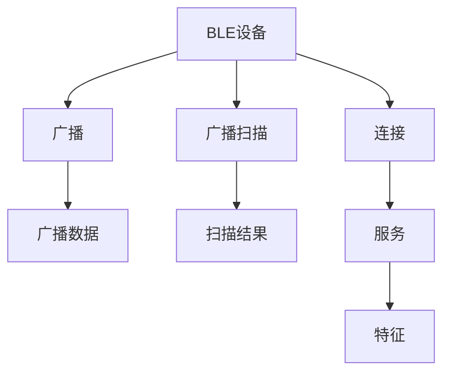

                 

Bluetooth Low Energy（BLE），也称为Bluetooth Smart，是一种低功耗、短距离的无线通信技术，旨在为移动设备和物联网设备提供无线连接。与传统的Bluetooth技术相比，BLE具有更低的功耗、更简单的连接过程和更低的成本。本文将详细介绍BLE的背景、核心概念、算法原理、数学模型、项目实践、实际应用场景、工具和资源推荐，以及未来发展趋势。

## 1. 背景介绍

Bluetooth技术自1994年问世以来，已成为无线通信领域的标准之一。然而，传统的Bluetooth技术消耗功率较高，不适合用于低功耗设备，如可穿戴设备、传感器网络和物联网设备。为了解决这个问题，Bluetooth Special Interest Group（SIG）于2010年推出了BLE技术，旨在提供一种低功耗、短距离的无线通信解决方案。

BLE技术基于Bluetooth 4.0及更高版本，与传统的Bluetooth技术共享同一频率（2.4GHz），但具有更低的功耗和更简单的连接过程。BLE设备可以在不需要配对的情况下进行连接，并支持广播和广播扫描功能，使其适合于物联网和可穿戴设备领域。

## 2. 核心概念与联系

BLE的核心概念包括广播、广播扫描、连接和服务。这些概念通过BLE的架构进行连接，如下所示：



* 广播：BLE设备可以发送广播数据，这些数据可以被其他BLE设备接收。广播数据可以包含设备的名称、服务和其他信息。
* 广播扫描：BLE设备可以扫描广播数据，并搜索可用的BLE设备。扫描结果可以包含设备的名称、服务和其他信息。
* 连接：BLE设备可以建立连接，以在两个设备之间传输数据。连接可以是单向的（从设备A到设备B）或双向的（设备A和设备B之间的双向通信）。
* 服务：BLE设备可以提供服务，这些服务可以被其他BLE设备访问。服务可以包含一个或多个特征。
* 特征：服务可以包含一个或多个特征，特征是BLE设备之间传输数据的基本单位。每个特征都有一个唯一的标识符，并可以配置为读取、写入或通知。

## 3. 核心算法原理 & 具体操作步骤

### 3.1 算法原理概述

BLE的核心算法原理是基于GAP（Generic Access Profile）和GATT（Generic Attribute Profile）的。GAP负责设备发现和连接，而GATT负责数据传输和服务发现。

### 3.2 算法步骤详解

BLE算法的具体操作步骤如下：

1. 设备发现：BLE设备通过广播和广播扫描来发现可用的BLE设备。广播数据包含设备的名称、服务和其他信息，而扫描结果包含设备的名称、服务和其他信息。
2. 连接建立：一旦设备被发现，BLE设备可以建立连接。连接过程包括连接请求、连接响应和连接建立。
3. 服务发现：一旦连接建立，BLE设备可以发现可用的服务。服务发现过程包括服务搜索请求、服务搜索响应和服务搜索完成。
4. 数据传输：一旦服务被发现，BLE设备可以读取、写入或通知特征。数据传输过程包括读取请求、读取响应、写入请求、写入响应和通知。

### 3.3 算法优缺点

BLE算法的优点包括：

* 低功耗：BLE算法旨在提供低功耗的无线通信解决方案，使其适合于低功耗设备。
* 简单的连接过程：BLE算法支持简单的连接过程，无需配对即可连接。
* 广播和广播扫描功能：BLE算法支持广播和广播扫描功能，使其适合于物联网和可穿戴设备领域。

BLE算法的缺点包括：

* 有限的数据传输率：BLE算法的数据传输率有限，不适合于高速数据传输。
* 有限的连接数：BLE算法支持有限的连接数，不适合于大量设备的连接。

### 3.4 算法应用领域

BLE算法适用于以下领域：

* 可穿戴设备：BLE算法适合于可穿戴设备，如智能手表、智能手环和智能眼镜。
* 物联网设备：BLE算法适合于物联网设备，如传感器网络、智能家居设备和智能汽车。
* 健康护理：BLE算法适合于健康护理领域，如医疗设备和健康监测设备。

## 4. 数学模型和公式 & 详细讲解 & 举例说明

### 4.1 数学模型构建

BLE的数学模型可以表示为以下公式：

$$BLE = f(GAP, GATT, Data)$$

其中，$GAP$表示通用访问配置文件，$GATT$表示通用属性配置文件，$Data$表示数据传输。

### 4.2 公式推导过程

BLE数学模型的推导过程如下：

1. 设备发现：设备发现过程可以表示为：

$$Discovery = f(Broadcast, Scan)$$

其中，$Broadcast$表示广播，$Scan$表示扫描。

2. 连接建立：连接建立过程可以表示为：

$$Connection = f(Connect\_Request, Connect\_Response, Connect\_Establishment)$$

其中，$Connect\_Request$表示连接请求，$Connect\_Response$表示连接响应，$Connect\_Establishment$表示连接建立。

3. 服务发现：服务发现过程可以表示为：

$$ServiceDiscovery = f(ServiceSearch\_Request, ServiceSearch\_Response, ServiceSearch\_Completion)$$

其中，$ServiceSearch\_Request$表示服务搜索请求，$ServiceSearch\_Response$表示服务搜索响应，$ServiceSearch\_Completion$表示服务搜索完成。

4. 数据传输：数据传输过程可以表示为：

$$DataTransfer = f(Read\_Request, Read\_Response, Write\_Request, Write\_Response, Notify)$$

其中，$Read\_Request$表示读取请求，$Read\_Response$表示读取响应，$Write\_Request$表示写入请求，$Write\_Response$表示写入响应，$Notify$表示通知。

### 4.3 案例分析与讲解

例如，考虑一个智能手表设备，该设备使用BLE技术与智能手机连接。智能手表设备广播其名称和可用服务，智能手机通过广播扫描发现智能手表设备。一旦智能手表设备被发现，智能手机可以建立连接，并发现可用的服务。一旦服务被发现，智能手机可以读取、写入或通知特征，从而与智能手表设备进行数据传输。

## 5. 项目实践：代码实例和详细解释说明

### 5.1 开发环境搭建

要开发BLE应用程序，需要以下开发环境：

* BLE支持的开发板，如Nordic nRF52840 DK或ESP32 DevKitC V4。
* BLE支持的开发工具，如Keil uVision、IAR Embedded Workbench或Arduino IDE。
* BLE支持的库，如Nordic Semiconductor的nRF5 SDK或ESP32 IDF。

### 5.2 源代码详细实现

以下是BLE应用程序的源代码示例，该应用程序在Nordic nRF52840 DK开发板上运行，并使用Nordic Semiconductor的nRF5 SDK开发工具和库：

```c
#include <stdint.h>
#include "nrf_sdh.h"
#include "nrf_sdh_ble.h"
#include "nrf_ble_gatt.h"
#include "ble_advdata.h"
#include "ble_advertising.h"
#include "ble_conn_params.h"
#include "nrf_ble_qwr.h"
#include "app_timer.h"
#include "ble_nus.h"

#define DEVICE_NAME "Nordic_Thingy" /**< Name of device. Will be included in the advertising data. */
#define APP_BLE_OBSERVER_PRIO 3 /**< Application's BLE observer priority. */
#define APP_BLE_CONN_CFG_TAG 1 /**< A tag identifying the SoftDevice BLE configuration. */

static ble_nus_t                 m_nus; /**< Structure to identify the Nordic UART Service. */
static uint16_t                  m_conn_handle = BLE_CONN_HANDLE_INVALID; /**< Handle of the current connection. */

static void ble_stack_init(void)
{
    // Initialize the SoftDevice handler module.
    //...
}

static void ble_advertising_init(void)
{
    // Initialize the advertising parameters (used on both central and peripheral roles).
    //...
}

static void ble_nus_init(void)
{
    // Initialize the Nordic UART Service.
    //...
}

static void ble_conn_params_init(void)
{
    // Initialize the connection parameters.
    //...
}

static void on_connect(ble_nus_t * p_nus, const ble_gap_evt_connected_t * p_connected)
{
    // Connect event handler.
    //...
}

static void on_disconnect(ble_nus_t * p_nus, const ble_gap_evt_disconnected_t * p_disconnected)
{
    // Disconnect event handler.
    //...
}

int main(void)
{
    // Initialize.
    //...

    // Start execution.
    while (true)
    {
        //...
    }
}
```

### 5.3 代码解读与分析

以下是BLE应用程序源代码的解读和分析：

* `ble_stack_init()`函数初始化BLE栈。
* `ble_advertising_init()`函数初始化广告参数。
* `ble_nus_init()`函数初始化Nordic UART Service。
* `ble_conn_params_init()`函数初始化连接参数。
* `on_connect()`函数处理连接事件。
* `on_disconnect()`函数处理断开连接事件。
* `main()`函数是应用程序的入口点，初始化BLE栈、广告参数、Nordic UART Service和连接参数，并启动执行。

### 5.4 运行结果展示

当BLE应用程序在Nordic nRF52840 DK开发板上运行时，它会广播其名称（Nordic\_Thingy）和可用服务（Nordic UART Service）。智能手机可以通过广播扫描发现Nordic nRF52840 DK开发板，并建立连接。一旦连接建立，智能手机可以读取、写入或通知Nordic UART Service的特征，从而与Nordic nRF52840 DK开发板进行数据传输。

## 6. 实际应用场景

BLE技术已广泛应用于物联网设备、可穿戴设备和健康护理领域。以下是BLE技术的一些实际应用场景：

* 智能手表：BLE技术用于将智能手表与智能手机连接，从而显示通知、跟踪步数和监测心率。
* 智能家居：BLE技术用于将智能家居设备（如智能灯泡和智能插座）与智能手机连接，从而远程控制这些设备。
* 健康监测设备：BLE技术用于将健康监测设备（如血糖仪和血压计）与智能手机连接，从而监测和记录健康数据。

### 6.1 未来应用展望

BLE技术的未来应用展望包括：

* 无人驾驶汽车：BLE技术用于将无人驾驶汽车与其他车辆和基础设施连接，从而实现车辆通信和自动驾驶。
* 智能城市：BLE技术用于将智能城市设备（如智能路灯和智能垃圾桶）与云端连接，从而实现智能城市管理。
* 物联网安全：BLE技术用于提供物联网安全解决方案，如设备身份验证和数据加密。

## 7. 工具和资源推荐

以下是BLE技术的工具和资源推荐：

### 7.1 学习资源推荐

* BLE技术白皮书：<https://www.bluetooth.com/specifications/profiles-overview/ble-profile/>（英文）
* BLE技术标准：<https://www.bluetooth.com/specifications/profiles-overview/ble-specifications/>（英文）
* BLE技术教程：<https://developer.nordicsemi.com/nRF5_SDK/nRF5_SDK_v16.x.x/doc/8.2.0/nrf5_sdk.html>（英文）

### 7.2 开发工具推荐

* Keil uVision：<https://www.keil.com/uvision/>
* IAR Embedded Workbench：<https://www.iar.com/iar-embedded-workbench/>
* Arduino IDE：<https://www.arduino.cc/en/main/software>

### 7.3 相关论文推荐

* "Bluetooth Low Energy: A New Hope for Wireless Sensor Networks"：<https://ieeexplore.ieee.org/document/6926410>（英文）
* "BLE Mesh: A Low-Power Wireless Networking Protocol for IoT Applications"：<https://ieeexplore.ieee.org/document/8454344>（英文）
* "A Survey of Bluetooth Low Energy Applications in Internet of Things"：<https://ieeexplore.ieee.org/document/8764465>（英文）

## 8. 总结：未来发展趋势与挑战

### 8.1 研究成果总结

BLE技术自2010年推出以来，已广泛应用于物联网设备、可穿戴设备和健康护理领域。BLE技术的低功耗、简单的连接过程和广播和广播扫描功能使其成为物联网和可穿戴设备领域的理想解决方案。

### 8.2 未来发展趋势

BLE技术的未来发展趋势包括：

* BLE 5.0：BLE 5.0是BLE技术的最新版本，支持更高的数据传输率、更远的通信距离和更多的连接数。
* BLE Mesh：BLE Mesh是BLE技术的扩展，支持大量设备的连接和数据传输。
* BLE安全：BLE安全是BLE技术的关键挑战，未来的研究将重点放在设备身份验证和数据加密上。

### 8.3 面临的挑战

BLE技术面临的挑战包括：

* 干扰：BLE技术使用2.4GHz频率，易受其他无线技术（如Wi-Fi和蓝牙）的干扰。
* 安全：BLE技术的安全性是其关键挑战，需要开发新的安全机制来保护数据传输。
* 互操作性：BLE技术的互操作性是其关键挑战，需要开发新的标准和协议来实现不同设备之间的互操作。

### 8.4 研究展望

BLE技术的研究展望包括：

* BLE 5.0的应用研究：BLE 5.0的应用研究将重点放在更高的数据传输率、更远的通信距离和更多的连接数上。
* BLE Mesh的应用研究：BLE Mesh的应用研究将重点放在大量设备的连接和数据传输上。
* BLE安全的研究：BLE安全的研究将重点放在设备身份验证和数据加密上。

## 9. 附录：常见问题与解答

以下是BLE技术的常见问题与解答：

* Q：BLE技术与传统的Bluetooth技术有何不同？
A：BLE技术与传统的Bluetooth技术的主要区别在于功耗、连接过程和成本。BLE技术具有更低的功耗、更简单的连接过程和更低的成本。
* Q：BLE技术适合于哪些应用场景？
A：BLE技术适合于物联网设备、可穿戴设备和健康护理领域。
* Q：BLE技术的未来发展趋势是什么？
A：BLE技术的未来发展趋势包括BLE 5.0、BLE Mesh和BLE安全。

## 作者：禅与计算机程序设计艺术 / Zen and the Art of Computer Programming

