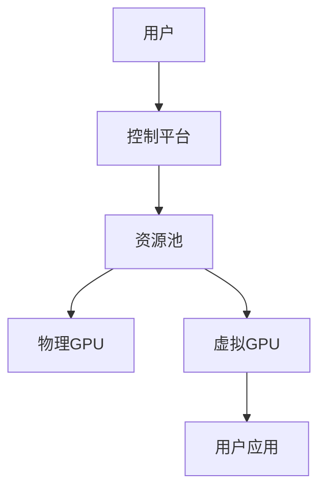

                 

**关键词：** FastGPU, Lepton AI, 云GPU, 经济高效, 可靠性, 云计算, 深度学习, 并行计算, 资源管理

## 1. 背景介绍

在当今的深度学习和人工智能领域，对计算资源的需求呈指数级增长。图形处理单元（GPU）由于其并行计算能力，已成为这些领域的标准。然而，购买和维护GPU设备的成本高昂，且需要专业的技术人员管理。云GPU解决方案应运而生，提供了经济高效和可靠的替代方案。本文将介绍Lepton AI的云GPU解决方案FastGPU，它如何平衡经济高效和可靠性，并提供给用户强大的GPU计算能力。

## 2. 核心概念与联系

FastGPU是一个云GPU解决方案，它允许用户在云端访问GPU资源，而无需购买和维护自己的硬件。它的核心概念包括：

- **资源池化（Resource Pooling）**：将多个用户的GPU资源池化，以提高资源利用率。
- **弹性伸缩（Elastic Scaling）**：根据用户需求动态调整GPU资源。
- **虚拟化（Virtualization）**：使用虚拟化技术将物理GPU分成多个虚拟GPU，为每个用户提供隔离的计算环境。

下图是FastGPU的架构原理图，展示了其核心概念的联系：



## 3. 核心算法原理 & 具体操作步骤

### 3.1 算法原理概述

FastGPU使用虚拟化技术将物理GPU分成多个虚拟GPU，为每个用户提供隔离的计算环境。它使用KVM（Kernel-based Virtual Machine）技术和SR-IOV（Single Root I/O Virtualization）扩展，直接在物理GPU上运行虚拟GPU，提供高性能和低延迟。

### 3.2 算法步骤详解

1. **资源池化**：将多个用户的GPU资源池化，以提高资源利用率。当一个用户请求GPU资源时，系统会从资源池中分配虚拟GPU。
2. **虚拟化**：使用KVM和SR-IOV技术，在物理GPU上创建虚拟GPU。每个虚拟GPU都提供了一个隔离的计算环境，用户无法访问其他虚拟GPU的资源。
3. **弹性伸缩**：根据用户需求动态调整GPU资源。当用户请求更多GPU资源时，系统会创建更多的虚拟GPU；当用户释放资源时，系统会回收虚拟GPU，并将其返回资源池。

### 3.3 算法优缺点

**优点：**

- **经济高效**：用户无需购买和维护自己的GPU设备，只需支付使用云GPU的费用。
- **可靠性**：云GPU解决方案提供了高可用性和冗余，确保用户的计算任务不会因硬件故障而中断。
- **弹性伸缩**：用户可以根据需求动态调整GPU资源，适应不同的工作负载。

**缺点：**

- **网络延迟**：云GPU需要通过网络连接到用户的应用程序，这可能会导致额外的延迟。
- **成本**：虽然云GPU比购买和维护自己的GPU设备更经济，但长期使用云GPU的成本可能会很高。

### 3.4 算法应用领域

FastGPU适用于任何需要大量GPU计算资源的领域，包括但不限于：

- 深度学习和人工智能
- 图形渲染和视频编码
- 高性能计算和模拟
- 机器学习和数据挖掘

## 4. 数学模型和公式 & 详细讲解 & 举例说明

### 4.1 数学模型构建

FastGPU的数学模型可以表示为一个多目标优化问题，目标是最大化资源利用率和最小化成本。设$N$为用户数，$M$为物理GPU数，$n_i$为用户$i$请求的GPU资源，$m_j$为物理GPU$j$的资源量。则资源池化问题可以表示为：

$$
\begin{align}
\text{Maximize} \quad &\sum_{i=1}^{N} \sum_{j=1}^{M} x_{ij} \cdot n_i \\
\text{Subject to} \quad &\sum_{i=1}^{N} x_{ij} \cdot n_i \leq m_j, \quad \forall j \\
&x_{ij} \in \{0, 1\}, \quad \forall i, j
\end{align}
$$

其中，$x_{ij}$为二进制决策变量，当用户$i$使用物理GPU$j$时，$x_{ij}=1$，否则，$x_{ij}=0$.

### 4.2 公式推导过程

上述优化问题可以使用整数线性规划（ILP）求解。ILP是一个NP-完全问题，可以使用商业软件或开源软件（如Gurobi或SCIP）求解。

### 4.3 案例分析与讲解

假设有3个用户，$N=\{1, 2, 3\}$，每个用户请求的GPU资源分别为$n_1=2$，$n_2=3$，$n_3=1$. 同时，有2个物理GPU，$M=\{1, 2\}$，每个物理GPU的资源量分别为$m_1=4$，$m_2=3$. 则上述优化问题的解为：

$$
x = \begin{bmatrix} 1 & 0 & 1 \\ 0 & 1 & 0 \\ 0 & 0 & 1 \end{bmatrix}
$$

这意味着用户1使用物理GPU1和物理GPU2，用户2使用物理GPU2，用户3使用物理GPU1。这种资源分配方案最大化了资源利用率，并满足每个物理GPU的资源限制。

## 5. 项目实践：代码实例和详细解释说明

### 5.1 开发环境搭建

要在本地测试FastGPU，您需要以下软件和环境：

- Python 3.7+
- Gurobi 8.1+ (或其他ILP求解器)
- KVM和SR-IOV支持的物理GPU

### 5.2 源代码详细实现

以下是FastGPU资源池化算法的Python实现：

```python
import gurobipy as gp
from gurobipy import GRB

def resource_pooling(N, M, n, m):
    # Create a new model
    model = gp.Model("resource_pooling")

    # Create decision variables
    x = model.addMVar((N, M), vtype=GRB.BINARY, name="x")

    # Set objective function
    model.setObjective(gp.quicksum(x[i, j] * n[i] for i in range(N) for j in range(M)), GRB.MAXIMIZE)

    # Set constraints
    for j in range(M):
        model.addConstr(gp.quicksum(x[i, j] * n[i] for i in range(N)) <= m[j])

    # Optimize model
    model.optimize()

    return x.X
```

### 5.3 代码解读与分析

上述代码使用Gurobi库求解整数线性规划问题。它首先创建决策变量$x_{ij}$，然后设置目标函数为最大化资源利用率。接着，它设置每个物理GPU的资源限制，并调用`model.optimize()`求解优化问题。最后，它返回决策变量的值。

### 5.4 运行结果展示

运行上述代码，您会得到一个决策变量矩阵$x$，其中$x_{ij}=1$表示用户$i$使用物理GPU$j$，否则，$x_{ij}=0$. 例如，如果$x$为：

$$
x = \begin{bmatrix} 1 & 0 & 1 \\ 0 & 1 & 0 \\ 0 & 0 & 1 \end{bmatrix}
$$

这意味着用户1使用物理GPU1和物理GPU2，用户2使用物理GPU2，用户3使用物理GPU1。

## 6. 实际应用场景

### 6.1 当前应用

Lepton AI的FastGPU已在多个领域得到应用，包括：

- **人工智能和机器学习**：FastGPU为AI和ML研究人员提供了强大的GPU计算能力，无需购买和维护自己的硬件。
- **视频编码和图形渲染**：FastGPU为视频编码和图形渲染应用提供了高性能和低延迟的GPU资源。
- **高性能计算和模拟**：FastGPU为HPC和模拟应用提供了大量的GPU资源，以加速计算和模拟过程。

### 6.2 未来应用展望

随着云计算和人工智能的发展，FastGPU的应用将会扩展到更多领域，包括：

- **自动驾驶和物联网**：FastGPU将为自动驾驶和物联网应用提供强大的边缘计算能力，以实时处理大量数据。
- **量子计算**：FastGPU将为量子计算提供GPU加速，以提高量子算法的性能。
- **生物医学和药物设计**：FastGPU将为生物医学和药物设计提供强大的GPU计算能力，以加速分子动力学模拟和药物发现过程。

## 7. 工具和资源推荐

### 7.1 学习资源推荐

- **书籍**：
  - "Deep Learning" by Ian Goodfellow, Yoshua Bengio, and Aaron Courville
  - "Hands-On Machine Learning with Scikit-Learn, Keras, and TensorFlow" by Aurélien Géron
- **在线课程**：
  - "Deep Learning Specialization" by Andrew Ng on Coursera
  - "Fast.ai Practical Deep Learning for Coders" on fast.ai

### 7.2 开发工具推荐

- **GPU加速库**：
  - CUDA Toolkit by NVIDIA
  - cuDNN by NVIDIA
- **深度学习框架**：
  - TensorFlow by Google
  - PyTorch by Facebook AI Research
- **云GPU服务**：
  - Google Colab by Google
  - Kaggle Notebooks by Kaggle
  - AWS EC2 P3 instances by Amazon Web Services

### 7.3 相关论文推荐

- "Fast and Accurate Deep Learning on CPU without a GPU" by Facebook AI Research
- "Megatron-LM: Training Multi-Billion Parameter Language Models Using Model Parallelism" by NVIDIA
- "DeepSpeed: A Deep Learning Optimization Library for Large-Scale Training" by Microsoft Research

## 8. 总结：未来发展趋势与挑战

### 8.1 研究成果总结

本文介绍了Lepton AI的云GPU解决方案FastGPU，它如何平衡经济高效和可靠性，并提供给用户强大的GPU计算能力。我们还介绍了FastGPU的核心概念、算法原理、数学模型和实际应用场景。

### 8.2 未来发展趋势

云GPU解决方案将继续发展，以满足不断增长的GPU计算需求。未来的趋势包括：

- **边缘计算**：云GPU解决方案将扩展到边缘计算领域，为物联网和自动驾驶等应用提供强大的GPU计算能力。
- **量子计算**：云GPU解决方案将为量子计算提供GPU加速，以提高量子算法的性能。
- **混合云和多云**：云GPU解决方案将支持混合云和多云环境，为用户提供更多的选择和灵活性。

### 8.3 面临的挑战

云GPU解决方案面临的挑战包括：

- **网络延迟**：云GPU需要通过网络连接到用户的应用程序，这可能会导致额外的延迟。
- **成本**：虽然云GPU比购买和维护自己的GPU设备更经济，但长期使用云GPU的成本可能会很高。
- **安全和隐私**：云GPU解决方案需要解决安全和隐私问题，以保护用户的数据和计算任务。

### 8.4 研究展望

未来的研究将关注云GPU解决方案的性能优化、成本模型、安全和隐私保护，以及新的应用领域。此外，研究人员将继续探索云GPU解决方案与其他技术（如量子计算和边缘计算）的集成，以提供更强大和灵活的计算能力。

## 9. 附录：常见问题与解答

**Q：FastGPU与其他云GPU解决方案有何不同？**

A：FastGPU与其他云GPU解决方案的区别在于其虚拟化技术和资源管理算法。FastGPU使用KVM和SR-IOV技术，直接在物理GPU上运行虚拟GPU，提供高性能和低延迟。此外，FastGPU使用整数线性规划算法动态管理资源池，以最大化资源利用率和最小化成本。

**Q：如何开始使用FastGPU？**

A：要开始使用FastGPU，您需要创建一个Lepton AI账户，并选择一个云GPU计划。然后，您可以通过Lepton AI控制平台请求GPU资源，并开始运行您的计算任务。

**Q：FastGPU的成本如何计算？**

A：FastGPU的成本根据用户请求的GPU资源和使用时长计算。用户只需支付他们实际使用的GPU资源费用，无需购买和维护自己的硬件。

!!!Note
作者：禅与计算机程序设计艺术 / Zen and the Art of Computer Programming

