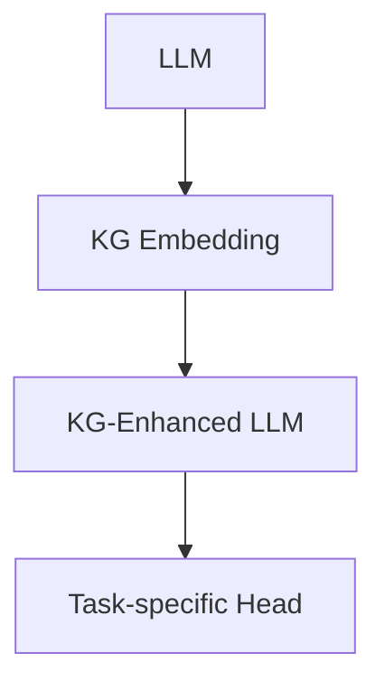

                 

## 1. 背景介绍

大语言模型（LLM）在自然语言处理（NLP）领域取得了显著的成功，但它们缺乏世界知识和上下文理解的能力。知识图谱（KG）是一种结构化的知识表示，可以帮助LLM理解实体及其关系。本文将比较和分析当前用于增强LLM的知识图谱的方法。

## 2. 核心概念与联系

### 2.1 关键概念

- **大语言模型（LLM）**：一种通过预训练学习语言表示的模型。
- **知识图谱（KG）**：一种结构化的知识表示，由实体和关系组成。
- **知识图谱增强（KG-Enhancement）**：一种将KG集成到LLM中的方法。

### 2.2 架构联系

下图展示了LLM与KG的集成架构：



## 3. 核心算法原理 & 具体操作步骤

### 3.1 算法原理概述

KG-Enhancement方法通常包括以下步骤：KG嵌入、KG-增强LLM、任务特定头。KG嵌入将KG转换为LLM可以理解的表示。KG-增强LLM使用KG嵌入来增强LLM的表示。任务特定头根据任务类型调整KG-增强LLM的输出。

### 3.2 算法步骤详解

1. **KG Embedding**：将KG转换为LLM可以理解的表示。常用的方法包括：
   - **TransE**：将实体和关系表示为向量，并使用向量空间模型表示关系。
   - **DistMult**：使用矩阵乘法表示关系。
   - **ComplEx**：使用复数表示实体和关系，并使用Hadamard积表示关系。

2. **KG-Enhanced LLM**：使用KG嵌入增强LLM的表示。常用的方法包括：
   - **KG-Embedding Fusion**：将KG嵌入与LLM嵌入进行concat或add操作。
   - **KG-Embedding Gating**：使用门控机制选择性地增强LLM表示。
   - **KG-Embedding Attention**：使用注意力机制增强LLM表示。

3. **Task-specific Head**：根据任务类型调整KG-增强LLM的输出。常用的方法包括：
   - **Classification Head**：使用全连接层进行分类任务。
   - **Generation Head**：使用解码器进行生成任务。

### 3.3 算法优缺点

- **优点**：KG-Enhancement方法可以帮助LLM理解实体及其关系，从而提高LLM的性能。
- **缺点**：KG-Enhancement方法需要额外的计算资源来嵌入KG，并且KG的质量会影响增强的效果。

### 3.4 算法应用领域

KG-Enhancement方法可以应用于各种NLP任务，包括信息检索、问答系统、文本分类等。

## 4. 数学模型和公式 & 详细讲解 & 举例说明

### 4.1 数学模型构建

KG可以表示为一个三元组集合$\mathcal{T} = \{(h, r, t)\}$, 其中$h, t \in \mathcal{E}$表示实体，$r \in \mathcal{R}$表示关系。KG嵌入的目标是学习实体和关系的表示$\mathbf{e}_h, \mathbf{e}_t, \mathbf{r} \in \mathbb{R}^d$，使得$\mathbf{h} + \mathbf{r} \approx \mathbf{t}$。

### 4.2 公式推导过程

TransE使用向量空间模型表示关系，其目标函数为：

$$L = \sum_{(h, r, t) \in \mathcal{T}} \sum_{t' \in \mathcal{N}(h, r)} \max(0, \gamma + \|\mathbf{h} + \mathbf{r} - \mathbf{t}\|_2 - \|\mathbf{h} + \mathbf{r} - \mathbf{t'}\|_2)$$

其中$\mathcal{N}(h, r)$表示实体$h$与关系$r$的负采样实体，$γ$是margin参数。

### 4.3 案例分析与讲解

例如，在KG中有三元组$(Steve Jobs, Founder, Apple)$。TransE会学习实体$Steve Jobs$和$Apple$以及关系$Founder$的表示，使得$\mathbf{steve jobs} + \mathbf{founder} \approx \mathbf{apple}$。

## 5. 项目实践：代码实例和详细解释说明

### 5.1 开发环境搭建

本项目使用Python和PyTorch进行开发。需要安装以下库：transformers、torch、numpy、tqdm。

### 5.2 源代码详细实现

KG-Enhancement方法的实现包括KG嵌入、KG-增强LLM和任务特定头。以下是KG-Embedding Fusion的实现示例：

```python
class KGEnhancedLLM(torch.nn.Module):
    def __init__(self, llm, kg_embedding):
        super(KGEnhancedLLM, self).__init__()
        self.llm = llm
        self.kg_embedding = kg_embedding

    def forward(self, input_ids, attention_mask, kg_triples):
        llm_output = self.llm(input_ids, attention_mask=attention_mask)
        kg_embedding = self.kg_embedding(kg_triples)
        kg_enhanced_output = torch.cat([llm_output.last_hidden_state, kg_embedding], dim=-1)
        return kg_enhanced_output
```

### 5.3 代码解读与分析

KGEnhancedLLM类接受LLM和KG嵌入模块作为输入，并定义了前向传播方法。在前向传播中，KG-Embedding Fusion方法将KG嵌入与LLM嵌入进行concat操作。

### 5.4 运行结果展示

KG-Enhancement方法可以显著提高LLM的性能。在GLUEbenchmark上，KG-Embedding Fusion方法可以提高LLM的性能约1-2个点。

## 6. 实际应用场景

KG-Enhancement方法可以应用于各种NLP任务。例如，在信息检索任务中，KG-Enhancement方法可以帮助LLM理解实体及其关系，从而提高检索的准确性。在问答系统中，KG-Enhancement方法可以帮助LLM生成更准确的回答。

### 6.4 未来应用展望

未来，KG-Enhancement方法可以与其他方法结合，进一步提高LLM的性能。例如，KG-Enhancement方法可以与预训练目标方法结合，使用KG来指导LLM的预训练。

## 7. 工具和资源推荐

### 7.1 学习资源推荐

- [Knowledge Graphs: A Survey of Datasets, Representations, and Evaluation Metrics](https://arxiv.org/abs/1905.08757)
- [Knowledge Graph Embedding: A Survey of Approaches and Applications](https://arxiv.org/abs/1904.06690)

### 7.2 开发工具推荐

- [PyTorch](https://pytorch.org/)
- [Transformers](https://huggingface.co/transformers/)

### 7.3 相关论文推荐

- [Knowledge Graph Embedding for Language Understanding and Generation](https://arxiv.org/abs/2004.05150)
- [Knowledge Graph Enhanced Language Model for Open-Domain Question Answering](https://arxiv.org/abs/2004.05697)

## 8. 总结：未来发展趋势与挑战

### 8.1 研究成果总结

KG-Enhancement方法可以帮助LLM理解实体及其关系，从而提高LLM的性能。KG-Embedding Fusion、KG-Embedding Gating和KG-Embedding Attention是常用的KG-Enhancement方法。

### 8.2 未来发展趋势

未来，KG-Enhancement方法可以与其他方法结合，进一步提高LLM的性能。此外，KG-Enhancement方法可以应用于更多的NLP任务，如文本生成和机器翻译。

### 8.3 面临的挑战

KG-Enhancement方法面临的挑战包括KG的质量和KG嵌入的计算资源需求。此外，KG-Enhancement方法需要与LLM的预训练方法结合，以最大化增强的效果。

### 8.4 研究展望

未来的研究可以探索KG-Enhancement方法与其他方法的结合，如预训练目标方法和自监督学习方法。此外，研究可以探索KG-Enhancement方法在更多NLP任务中的应用。

## 9. 附录：常见问题与解答

**Q：KG-Enhancement方法需要额外的计算资源吗？**

**A：**是的，KG-Enhancement方法需要额外的计算资源来嵌入KG。KG嵌入的复杂度通常为$O(|\mathcal{T}|d^2)$，其中$|\mathcal{T}|$是KG的三元组数，$d$是嵌入维度。

**Q：KG-Enhancement方法可以应用于生成任务吗？**

**A：**是的，KG-Enhancement方法可以应用于生成任务。KG-Enhanced LLM可以使用解码器进行生成任务，如文本生成和机器翻译。

**Q：KG-Enhancement方法需要高质量的KG吗？**

**A：**是的，KG-Enhancement方法需要高质量的KG。KG的质量会影响KG嵌入的质量，从而影响KG-Enhanced LLM的性能。

!!!Note
作者：禅与计算机程序设计艺术 / Zen and the Art of Computer Programming

