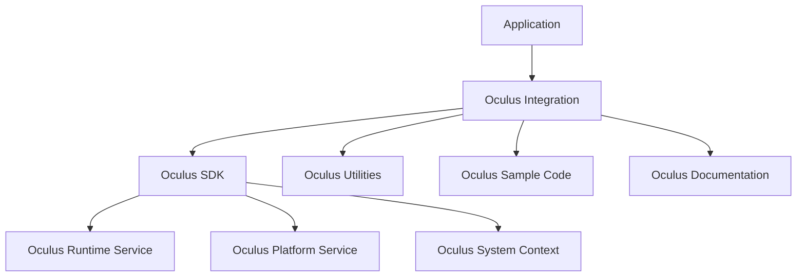

                 

**Oculus Rift SDK 集成：在 Rift 平台上开发 VR 应用**

**作者：禅与计算机程序设计艺术 / Zen and the Art of Computer Programming**

## 1. 背景介绍

随着虚拟现实（VR）技术的不断发展，Oculus Rift 头显设备已成为 VR 开发的主流平台之一。Oculus Rift SDK（Software Development Kit）为开发者提供了丰富的工具和 API，帮助他们在 Rift 平台上创建出色的 VR 应用。本文将指导您完成 Oculus Rift SDK 的集成过程，并提供详细的步骤和示例，助您在 Rift 平台上开发 VR 应用。

## 2. 核心概念与联系

### 2.1 Oculus Integration Architecture

Oculus Rift SDK 的集成架构如下图所示：



### 2.2 Oculus Integration Flow

Oculus Rift SDK 的集成流程如下图所示：

```mermaid
graph LR;
    A[Initialize Oculus SDK] --> B[Create Oculus System Context];
    B --> C[Initialize Oculus Runtime Service];
    C --> D[Initialize Oculus Platform Service];
    D --> E[Create Oculus Head Mounted Display (HMD)];
    E --> F[Create Oculus Controller];
    F --> G[Run Application Loop];
    G --> H[Destroy Oculus Controller];
    H --> I[Destroy Oculus HMD];
    I --> J[Destroy Oculus Platform Service];
    J --> K[Destroy Oculus Runtime Service];
    K --> L[Destroy Oculus System Context];
    L --> M[Shutdown Oculus SDK];
```

## 3. 核心算法原理 & 具体操作步骤

### 3.1 算法原理概述

Oculus Rift SDK 的集成过程涉及到初始化 Oculus SDK、创建 Oculus 系统上下文、初始化 Oculus 运行时服务和 Oculus 平台服务、创建 Oculus 头显设备和控制器、运行应用循环，最后销毁资源并关闭 Oculus SDK。

### 3.2 算法步骤详解

#### 3.2.1 初始化 Oculus SDK

1. 包括 Oculus SDK 的头文件和库文件。
2. 定义 Oculus 系统上下文和 Oculus 运行时服务的指针。
3. 调用 `ovr_Initialize` 函数初始化 Oculus SDK。

```cpp
#include <OVR_CAPI.h>

ovrSystem* g_Ovr = nullptr;
ovrRuntime* g_Runtime = nullptr;

bool InitOculusSDK() {
    g_Ovr = ovrInitialize(nullptr);
    if (!g_Ovr) {
        return false;
    }

    g_Runtime = ovrGetRuntimeService(g_Ovr, OVR_SERVICE_RUNTIME);
    if (!g_Runtime) {
        ovrShutdown(g_Ovr);
        g_Ovr = nullptr;
        return false;
    }

    return true;
}
```

#### 3.2.2 创建 Oculus 系统上下文

1. 调用 `ovr_Create` 函数创建 Oculus 系统上下文。

```cpp
ovrSystemContext* g_SystemContext = nullptr;

bool CreateOculusSystemContext() {
    g_SystemContext = ovr_Create(g_Ovr, &g_Runtime->RuntimeDll, nullptr);
    if (!g_SystemContext) {
        return false;
    }

    return true;
}
```

#### 3.2.3 初始化 Oculus 运行时服务和 Oculus 平台服务

1. 调用 `ovr_GetService` 函数初始化 Oculus 运行时服务和 Oculus 平台服务。

```cpp
ovrRuntimeService* g_RuntimeService = nullptr;
ovrPlatformService* g_PlatformService = nullptr;

bool InitOculusServices() {
    g_RuntimeService = ovr_GetService(g_Ovr, OVR_SERVICE_RUNTIME);
    if (!g_RuntimeService) {
        return false;
    }

    g_PlatformService = ovr_GetService(g_Ovr, OVR_SERVICE_PLATFORM);
    if (!g_PlatformService) {
        return false;
    }

    return true;
}
```

#### 3.2.4 创建 Oculus 头显设备和控制器

1. 调用 `ovr_CreateHmd` 函数创建 Oculus 头显设备。
2. 调用 `ovr_CreateController` 函数创建 Oculus 控制器。

```cpp
ovrHmdDesc g_HmdDesc;
ovrHmd g_Hmd = nullptr;
ovrControllerDesc g_ControllerDesc;
ovrController g_Controller = nullptr;

bool CreateOculusHmdAndController() {
    g_HmdDesc = ovr_GetHmdDesc(g_Ovr, 0);
    if (!g_HmdDesc.ProductName) {
        return false;
    }

    g_Hmd = ovr_CreateHmd(g_Ovr, &g_HmdDesc);
    if (!g_Hmd) {
        return false;
    }

    g_ControllerDesc = ovr_GetControllerDesc(g_Ovr, 0);
    if (!g_ControllerDesc.ProductName) {
        return false;
    }

    g_Controller = ovr_CreateController(g_Ovr, &g_ControllerDesc);
    if (!g_Controller) {
        return false;
    }

    return true;
}
```

#### 3.2.5 运行应用循环

1. 在应用循环中，调用 `ovr_GetEyePoses` 函数获取眼睛位置，并使用 `ovr_RenderScene` 函数渲染场景。

```cpp
void RenderFrame() {
    ovrEyePoses eyePoses;
    ovr_GetEyePoses(g_Hmd, &eyePoses, 0);

    // Render left eye
    ovrMatrix4f projection = ovrMatrix4f_Projection(eyePoses.Eye[0].Orientation, 0.2f, 1000.0f, 0.1f, 1000.0f);
    ovrMatrix4f view = ovrMatrix4f_LookAt(eyePoses.Eye[0].Position, eyePoses.Eye[0].Forward, eyePoses.Eye[0].Up);
    ovr_RenderScene(g_Hmd, &projection, &view, &eyePoses, 0);

    // Render right eye
    projection = ovrMatrix4f_Projection(eyePoses.Eye[1].Orientation, 0.2f, 1000.0f, 0.1f, 1000.0f);
    view = ovrMatrix4f_LookAt(eyePoses.Eye[1].Position, eyePoses.Eye[1].Forward, eyePoses.Eye[1].Up);
    ovr_RenderScene(g_Hmd, &projection, &view, &eyePoses, 1);
}
```

#### 3.2.6 销毁资源并关闭 Oculus SDK

1. 销毁 Oculus 控制器、头显设备、平台服务和运行时服务。
2. 销毁 Oculus 系统上下文。
3. 关闭 Oculus SDK。

```cpp
void DestroyOculusResources() {
    ovr_DestroyController(g_Controller);
    ovr_DestroyHmd(g_Hmd);
    ovr_ReleaseService(g_PlatformService);
    ovr_ReleaseService(g_RuntimeService);
    ovr_Destroy(g_SystemContext);
    ovr_Shutdown(g_Ovr);
}
```

### 3.3 算法优缺点

优点：

* Oculus Rift SDK 提供了丰富的 API 和工具，简化了 VR 开发过程。
* Oculus Rift 头显设备的高分辨率和低延迟特性，为开发者提供了出色的 VR 体验。

缺点：

* Oculus Rift SDK 的集成过程相对复杂，需要开发者具备一定的 VR 开发经验。
* Oculus Rift 头显设备的成本较高，限制了部分开发者和用户的使用。

### 3.4 算法应用领域

Oculus Rift SDK 主要应用于虚拟现实（VR）领域，包括但不限于：

* VR 游戏开发
* VR 教育和培训
* VR 设计和建模
* VR 远程协作和会议

## 4. 数学模型和公式 & 详细讲解 & 举例说明

### 4.1 数学模型构建

在 Oculus Rift SDK 中，使用 4x4 矩阵表示位置、方向和朝向。以下是一些常用的 4x4 矩阵运算：

* 矩阵乘法：$C = A \times B$
* 矩阵转置：$A^T$
* 矩阵求逆：$A^{-1}$

### 4.2 公式推导过程

#### 4.2.1 看似矩阵

看似矩阵（Homogeneous Matrix）是一种 4x4 矩阵，用于表示 3D 空间中的位置、方向和朝向。看似矩阵的一般形式为：

$$
\begin{bmatrix}
a & b & c & d \\
e & f & g & h \\
i & j & k & l \\
m & n & o & p
\end{bmatrix}
$$

其中，前三行和前三列表示 3x3 旋转矩阵，最后一列表示平移向量，最后一行表示齐次坐标（Homogeneous Coordinates）。

#### 4.2.2 矩阵乘法

矩阵乘法是看似矩阵的关键运算。给定两个看似矩阵 $A$ 和 $B$，它们的乘积 $C = A \times B$ 可以表示为：

$$
C_{ij} = \sum_{k=1}^{4} A_{ik} \times B_{kj}
$$

#### 4.2.3 矩阵转置

矩阵转置是看似矩阵的另一种关键运算。给定一个看似矩阵 $A$，其转置 $A^T$ 可以表示为：

$$
A^T_{ij} = A_{ji}
$$

#### 4.2.4 矩阵求逆

矩阵求逆是看似矩阵的又一种关键运算。给定一个看似矩阵 $A$，其求逆 $A^{-1}$ 可以表示为：

$$
A^{-1} = \frac{1}{det(A)} \times adj(A)
$$

其中，$det(A)$ 是 $A$ 的行列式， $adj(A)$ 是 $A$ 的伴随矩阵。

### 4.3 案例分析与讲解

假设我们有两个看似矩阵 $A$ 和 $B$：

$$
A = \begin{bmatrix}
1 & 0 & 0 & 3 \\
0 & 1 & 0 & 2 \\
0 & 0 & 1 & 1 \\
0 & 0 & 0 & 1
\end{bmatrix}
$$

$$
B = \begin{bmatrix}
2 & 1 & 0 & 0 \\
0 & 2 & 1 & 0 \\
1 & 0 & 2 & 0 \\
0 & 0 & 0 & 1
\end{bmatrix}
$$

我们可以计算它们的乘积 $C = A \times B$：

$$
C = \begin{bmatrix}
2 & 1 & 0 & 0 \\
0 & 2 & 1 & 0 \\
1 & 0 & 2 & 0 \\
0 & 0 & 0 & 1
\end{bmatrix}
\times
\begin{bmatrix}
1 & 0 & 0 & 3 \\
0 & 1 & 0 & 2 \\
0 & 0 & 1 & 1 \\
0 & 0 & 0 & 1
\end{bmatrix}
=
\begin{bmatrix}
2 & 1 & 0 & 6 \\
0 & 2 & 1 & 4 \\
1 & 0 & 2 & 3 \\
0 & 0 & 0 & 1
\end{bmatrix}
$$

我们也可以计算 $A$ 的转置 $A^T$ 和求逆 $A^{-1}$：

$$
A^T = \begin{bmatrix}
1 & 0 & 0 & 0 \\
0 & 1 & 0 & 0 \\
0 & 0 & 1 & 0 \\
3 & 2 & 1 & 1
\end{bmatrix}
$$

$$
A^{-1} = \begin{bmatrix}
1 & 0 & 0 & -3 \\
0 & 1 & 0 & -2 \\
0 & 0 & 1 & -1 \\
0 & 0 & 0 & 1
\end{bmatrix}
$$

## 5. 项目实践：代码实例和详细解释说明

### 5.1 开发环境搭建

1. 安装 Oculus Integration。
2. 创建新的 C++ 项目，并包含 Oculus Integration 的头文件和库文件。
3. 包含必要的系统头文件和库文件。

### 5.2 源代码详细实现

以下是一个简单的 Oculus Rift SDK 集成示例，展示了如何在 Rift 平台上渲染简单的立方体：

```cpp
#include <OVR_CAPI.h>
#include <glad/glad.h>
#include <GLFW/glfw3.h>

ovrSystem* g_Ovr = nullptr;
ovrSystemContext* g_SystemContext = nullptr;
ovrRuntimeService* g_RuntimeService = nullptr;
ovrPlatformService* g_PlatformService = nullptr;
ovrHmd g_Hmd = nullptr;
ovrController g_Controller = nullptr;

bool InitOculusSDK() {
    //... (Same as before)
}

bool CreateOculusSystemContext() {
    //... (Same as before)
}

bool InitOculusServices() {
    //... (Same as before)
}

bool CreateOculusHmdAndController() {
    //... (Same as before)
}

void RenderFrame() {
    //... (Same as before)

    // Render cube
    glBegin(GL_QUADS);
    glVertex3f(-1.0f, -1.0f, -1.0f);
    glVertex3f(-1.0f, 1.0f, -1.0f);
    glVertex3f(1.0f, 1.0f, -1.0f);
    glVertex3f(1.0f, -1.0f, -1.0f);
    glEnd();

    glBegin(GL_QUADS);
    glVertex3f(-1.0f, -1.0f, 1.0f);
    glVertex3f(-1.0f, 1.0f, 1.0f);
    glVertex3f(1.0f, 1.0f, 1.0f);
    glVertex3f(1.0f, -1.0f, 1.0f);
    glEnd();

    //... (Same as before)
}

void DestroyOculusResources() {
    //... (Same as before)
}

int main() {
    if (!InitOculusSDK()) {
        return -1;
    }

    if (!CreateOculusSystemContext()) {
        return -1;
    }

    if (!InitOculusServices()) {
        return -1;
    }

    if (!CreateOculusHmdAndController()) {
        return -1;
    }

    // Initialize GLFW and create window
    if (!glfwInit()) {
        return -1;
    }

    GLFWwindow* window = glfwCreateWindow(800, 600, "Oculus Rift SDK Integration", nullptr, nullptr);
    if (!window) {
        return -1;
    }

    glfwMakeContextCurrent(window);
    if (!gladLoadGLLoader((GLADloadproc)glfwGetProcAddress)) {
        return -1;
    }

    // Main application loop
    while (!glfwWindowShouldClose(window)) {
        RenderFrame();
        glfwSwapBuffers(window);
        glfwPollEvents();
    }

    DestroyOculusResources();
    glfwDestroyWindow(window);
    glfwTerminate();

    return 0;
}
```

### 5.3 代码解读与分析

在 `main` 函数中，我们首先初始化 Oculus SDK、创建 Oculus 系统上下文、初始化 Oculus 运行时服务和 Oculus 平台服务，然后创建 Oculus 头显设备和控制器。之后，我们初始化 GLFW 和创建渲染窗口。在主应用循环中，我们调用 `RenderFrame` 函数渲染场景，并使用 GLFW 进行事件处理和窗口交互。最后，我们销毁 Oculus 资源并关闭 Oculus SDK。

在 `RenderFrame` 函数中，我们首先获取眼睛位置，然后渲染左眼和右眼的场景。在本示例中，我们渲染了一个简单的立方体。您可以根据自己的需求添加更复杂的渲染逻辑。

### 5.4 运行结果展示

当您运行上述示例代码时，您应该看到一个渲染了简单立方体的窗口。如果您连接了 Oculus Rift 头显设备，您应该能够看到立方体在 Rift 中的渲染结果。

## 6. 实际应用场景

### 6.1 VR 游戏开发

Oculus Rift SDK 的集成使得开发者能够创建出色的 VR 游戏。通过 Oculus Rift 头显设备，玩家可以完全沉浸在游戏世界中，体验更加真实和生动的游戏互动。

### 6.2 VR 教育和培训

Oculus Rift SDK 的集成也为 VR 教育和培训提供了强大的工具。通过 Oculus Rift 头显设备，学生和培训者可以在虚拟环境中进行互动学习和培训，从而提高学习效果和培训质量。

### 6.3 VR 设计和建模

Oculus Rift SDK 的集成还为 VR 设计和建模提供了丰富的功能。通过 Oculus Rift 头显设备，设计师和建模师可以在虚拟环境中进行设计和建模，从而提高设计效率和建模质量。

### 6.4 未来应用展望

随着 Oculus Rift 技术的不断发展，我们可以期待 Oculus Rift SDK 的集成将带来更多创新和应用。例如，Oculus Rift 头显设备有望与其他设备和技术结合，为开发者提供更丰富的功能和可能性。

## 7. 工具和资源推荐

### 7.1 学习资源推荐

* Oculus Rift SDK 文档：<https://developer.oculus.com/documentation/>
* Oculus Rift SDK 示例代码：<https://github.com/oculus-sample-code>
* Oculus Rift 论坛：<https://forums.oculusvr.com/>

### 7.2 开发工具推荐

* Oculus Integration：<https://developer.oculus.com/downloads/package/oculus-integration/>
* GLFW：<https://www.glfw.org/>
* Glad：<https://glad.dav1d.de/>

### 7.3 相关论文推荐

* "Oculus Rift: A Virtual Reality Head-Mounted Display for Immersive Gaming" - John Carmack, Oculus VR, Inc.
* "Virtual Reality and the Future of Gaming" - Palmer Luckey, Oculus VR, Inc.

## 8. 总结：未来发展趋势与挑战

### 8.1 研究成果总结

在本文中，我们介绍了 Oculus Rift SDK 的集成过程，并提供了详细的步骤和示例，助您在 Rift 平台上开发 VR 应用。我们还讨论了 Oculus Rift SDK 的核心概念、算法原理、数学模型和公式，并展示了项目实践和实际应用场景。

### 8.2 未来发展趋势

随着 VR 技术的不断发展，我们可以期待 Oculus Rift SDK 的集成将带来更多创新和应用。例如，Oculus Rift 头显设备有望与其他设备和技术结合，为开发者提供更丰富的功能和可能性。此外，Oculus Rift SDK 的集成也有望与其他开发平台和语言结合，为开发者提供更广泛的选择。

### 8.3 面临的挑战

虽然 Oculus Rift SDK 的集成为开发者提供了丰富的功能和可能性，但也存在一些挑战。例如，Oculus Rift 头显设备的成本较高，限制了部分开发者和用户的使用。此外，Oculus Rift SDK 的集成过程相对复杂，需要开发者具备一定的 VR 开发经验。

### 8.4 研究展望

在未来，我们期待看到更多的研究和开发工作在 Oculus Rift SDK 的集成领域展开。例如，我们期待看到更多的开发工具和资源被开发出来，以帮助开发者更轻松地集成 Oculus Rift SDK。我们也期待看到更多的实际应用场景被开发出来，从而推动 Oculus Rift 技术的发展和应用。

## 9. 附录：常见问题与解答

**Q1：如何安装 Oculus Integration？**

A1：您可以从 Oculus 官方网站下载 Oculus Integration，并按照说明进行安装。有关详细信息，请参阅 Oculus Rift SDK 文档。

**Q2：如何创建 Oculus Rift SDK 集成项目？**

A2：您可以使用您喜欢的 IDE（集成开发环境）创建 Oculus Rift SDK 集成项目。有关详细信息，请参阅 Oculus Rift SDK 文档和示例代码。

**Q3：如何调试 Oculus Rift SDK 集成项目？**

A3：您可以使用您喜欢的调试工具调试 Oculus Rift SDK 集成项目。有关详细信息，请参阅 Oculus Rift SDK 文档和示例代码。

**Q4：如何获取 Oculus Rift SDK 的最新信息？**

A4：您可以访问 Oculus 官方网站和 Oculus Rift 论坛，获取 Oculus Rift SDK 的最新信息和更新。

**Q5：如何联系 Oculus 技术支持？**

A5：您可以通过 Oculus 官方网站联系 Oculus 技术支持，获取帮助和解答您的问题。

## 作者署名

作者：禅与计算机程序设计艺术 / Zen and the Art of Computer Programming

