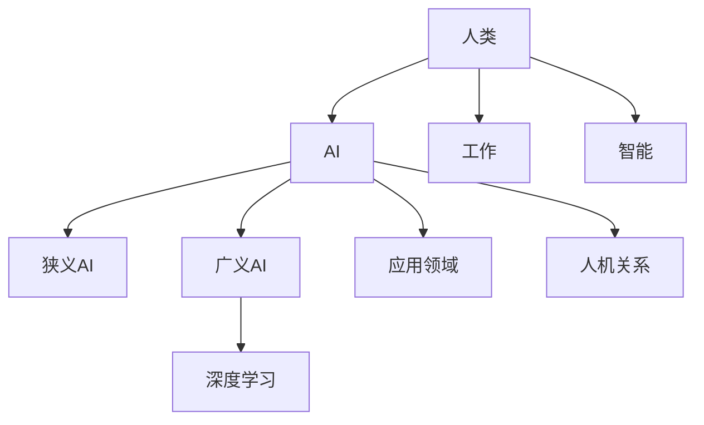

                 

人工智能、社会影响、伦理责任、算法偏见、就业变化、自动化、人机协作、数字鸿沟、监管、未来展望

## 1. 背景介绍

人工智能（AI）的发展正在重塑我们的世界，从工作场所到家庭生活，从商业到政府，AI无处不在。然而，AI的影响远不止于此。它正在改变我们的社会结构，重新定义我们的工作和就业，并提出了新的伦理和道德挑战。本文将探讨AI时代的社会影响和责任，分析AI对我们的生活和工作的影响，并讨论如何应对这些挑战。

## 2. 核心概念与联系

### 2.1 AI的定义与类型

AI是指模拟人类智能的计算机程序，这些程序能够通过学习、推理、问题解决和经验获取来执行任务。AI可以分为几个主要类型：

- 狭义AI：只能执行特定任务的AI系统。
- 广义AI：可以理解、学习和应用知识的AI系统。
- 深度学习：一种广义AI，使用神经网络模拟人类大脑的学习过程。

### 2.2 AI的发展历史

AI的发展可以追溯到20世纪50年代，当时计算机科学的先驱开始探索如何使计算机模拟人类智能。自那时以来，AI已经取得了巨大的进步，从简单的规则基AI到当前的深度学习AI。

### 2.3 AI的应用领域

AI正在各个领域得到广泛应用，从医疗保健到金融服务，从自动驾驶汽车到语音助手。AI的应用领域不断扩展，这也带来了新的挑战和机遇。

### 2.4 AI与人类的关系

AI的发展引发了关于人类与机器关系的讨论。AI是否会取代人类工作？AI是否会超越人类智能？这些问题都需要我们认真思考。



## 3. 核心算法原理 & 具体操作步骤

### 3.1 算法原理概述

AI的核心是算法，算法是一系列指令，告诉计算机如何解决特定的问题。AI算法的类型包括：

- 规则基算法：基于一系列如果-那么规则的算法。
- 机器学习算法：能够从数据中学习的算法。
- 深度学习算法：使用神经网络模拟人类大脑的学习过程。

### 3.2 算法步骤详解

以机器学习算法为例，其步骤通常包括：

1. 数据收集：收集与问题相关的数据。
2. 数据预处理：清洗和格式化数据。
3. 特征选择：选择与问题相关的特征。
4. 模型选择：选择适合问题的模型。
5. 模型训练：使用数据训练模型。
6. 模型评估：评估模型的性能。
7. 模型部署：将模型部署到生产环境。

### 3.3 算法优缺点

每种算法都有其优缺点。例如，规则基算法简单易懂，但缺乏灵活性；机器学习算法灵活性高，但可能会过度拟合数据；深度学习算法性能强大，但需要大量数据和计算资源。

### 3.4 算法应用领域

AI算法在各个领域得到广泛应用，从图像和语音识别到自然语言处理，从预测分析到自动驾驶。

## 4. 数学模型和公式 & 详细讲解 & 举例说明

### 4.1 数学模型构建

数学模型是AI算法的基础。例如，线性回归模型的数学表达式为：

$$y = wx + b$$

其中，$y$是预测值，$x$是输入特征，$w$是权重，$b$是偏置项。

### 4.2 公式推导过程

权重和偏置项可以通过最小化误差平方和来学习：

$$J(w, b) = \frac{1}{2n}\sum_{i=1}^{n}(h_{w, b}(x^{(i)}) - y^{(i)})^2$$

其中，$h_{w, b}(x)$是模型的预测，$y^{(i)}$是真实值，$n$是数据集的大小。

### 4.3 案例分析与讲解

例如，假设我们想预测房价。我们可以使用线性回归模型，其中输入特征$x$是房屋的面积，输出$y$是房屋的价格。我们可以使用梯度下降算法来学习权重和偏置项，从而预测房价。

## 5. 项目实践：代码实例和详细解释说明

### 5.1 开发环境搭建

要实现AI项目，我们需要一个开发环境。推荐使用Python，因为它是AI领域的事实标准。我们还需要安装一些库，如TensorFlow、PyTorch和Scikit-learn。

### 5.2 源代码详细实现

以下是一个简单的线性回归示例：

```python
import numpy as np
from sklearn.linear_model import LinearRegression

# 创建数据集
X = np.array([[1], [2], [3], [4], [5]]).reshape(-1, 1)
y = np.array([2, 4, 6, 8, 10])

# 创建模型
model = LinearRegression()

# 训练模型
model.fit(X, y)

# 预测
predictions = model.predict([[6], [7], [8]])

print(predictions)
```

### 5.3 代码解读与分析

这段代码使用Scikit-learn库创建了一个简单的线性回归模型。我们首先创建了一个数据集，其中输入特征是数字1到5，输出是这些数字的两倍。然后，我们创建了一个线性回归模型，并使用`fit()`方法训练模型。最后，我们使用`predict()`方法预测数字6到8的两倍。

### 5.4 运行结果展示

运行这段代码的结果是：

```
[[12.]
 [14.]
 [16.]]
```

这意味着模型预测数字6、7和8的两倍分别是12、14和16。

## 6. 实际应用场景

### 6.1 AI在工作场所的影响

AI正在改变我们的工作场所。根据麦肯锡的报告，到2025年，AI将创造1500万个新的工作岗位，但也将取代3000万个岗位。AI将重新定义我们的工作，从自动化重复性任务到需要人类技能的工作。

### 6.2 AI在家庭生活的影响

AI也正在改变我们的家庭生活。从语音助手到智能家居，AI正在使我们的家庭更智能、更便利。然而，这也提出了隐私和安全的新挑战。

### 6.3 AI在社会不平等中的作用

AI的发展也加剧了社会不平等。AI算法可能会受到偏见的影响，导致不公平的结果。此外，AI的发展可能会导致数字鸿沟，使得没有互联网接入的人群被排斥在外。

### 6.4 未来应用展望

未来，AI将继续渗透到我们的生活和工作中。我们将看到AI在医疗保健、教育和交通等领域的更多应用。然而，我们也需要考虑AI的伦理和道德影响。

## 7. 工具和资源推荐

### 7.1 学习资源推荐

- 书籍：《人工智能：一种现代方法》作者：斯图尔特·罗素、彼得·诺维格
- 在线课程：Coursera、Udacity、edX上的AI课程
- 研究论文：arXiv.org上的AI论文

### 7.2 开发工具推荐

- 编程语言：Python
- AI库：TensorFlow、PyTorch、Scikit-learn
- 云平台：Google Cloud AI、Amazon Web Services、Microsoft Azure

### 7.3 相关论文推荐

- 《伦理人工智能》作者：斯图尔特·罗素
- 《人工智能的未来》作者：马克斯·泰格马克
- 《人工智能的挑战》作者：斯图尔特·罗素

## 8. 总结：未来发展趋势与挑战

### 8.1 研究成果总结

本文讨论了AI的社会影响和责任。我们分析了AI的定义、发展历史和应用领域。我们还讨论了AI算法的原理、步骤、优缺点和应用领域。我们还提供了一个简单的AI项目示例，并讨论了AI在工作场所、家庭生活和社会不平等中的影响。最后，我们推荐了一些学习资源、开发工具和相关论文。

### 8.2 未来发展趋势

未来，AI将继续发展，我们将看到AI在更多领域的应用。然而，我们也需要考虑AI的伦理和道德影响。我们需要开发公平、透明和可解释的AI算法，并需要监管AI的应用。

### 8.3 面临的挑战

AI的发展面临着几个挑战。首先，我们需要解决AI算法的偏见问题。其次，我们需要解决AI的就业影响。最后，我们需要解决AI的监管问题。

### 8.4 研究展望

未来的研究应该关注AI的伦理和道德影响。我们需要开发公平、透明和可解释的AI算法。我们还需要研究AI的就业影响，并开发政策来缓解AI导致的就业变化。最后，我们需要研究AI的监管问题，并开发政策来监管AI的应用。

## 9. 附录：常见问题与解答

### 9.1 AI会取代人类工作吗？

AI可能会取代一些重复性工作，但也会创造新的工作岗位。根据麦肯锡的报告，到2025年，AI将创造1500万个新的工作岗位，但也将取代3000万个岗位。

### 9.2 AI是否会超越人类智能？

目前，AI还没有超越人类智能。AI是狭义的，只能执行特定任务。然而，未来的AI可能会更智能，能够理解、学习和应用知识。

### 9.3 如何解决AI算法的偏见问题？

解决AI算法偏见的方法包括数据收集的多样性、算法的公平性评估和偏见的检测与修正。

## 作者：禅与计算机程序设计艺术 / Zen and the Art of Computer Programming

