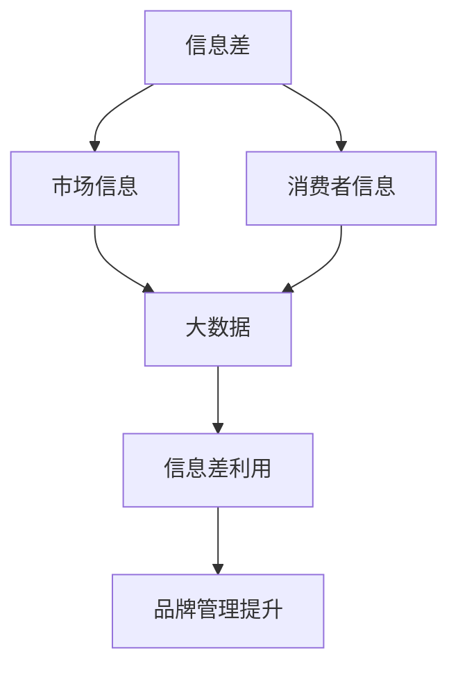

                 

**信息差的商业品牌管理：大数据如何提升品牌管理**

**作者：禅与计算机程序设计艺术 / Zen and the Art of Computer Programming**

## 1. 背景介绍

在当今信息爆炸的时代，品牌管理面临着前所未有的挑战。消费者信息获取渠道的多样化，使得品牌建设和维护变得更加复杂。信息差，即企业对市场和消费者信息的掌握和利用，成为品牌管理的关键。大数据的出现，为企业提供了海量的信息，如何有效地利用大数据提升品牌管理，是本文的重点。

## 2. 核心概念与联系

### 2.1 信息差

信息差是指企业对市场和消费者信息的掌握和利用，它是企业竞争优势的来源之一。信息差可以分为两种：一是企业对市场和消费者信息的掌握优势，二是企业对信息的利用优势。

### 2.2 大数据

大数据是指无法在传统数据处理系统中进行存储、管理和处理的数据集合。大数据具有四个特征：海量（Volume）、高速（Velocity）、多样（Variety）、价值（Value），简称为4V。

### 2.3 信息差与大数据的联系

信息差与大数据的联系在于，大数据为企业提供了海量的市场和消费者信息，企业可以通过对大数据的有效利用，获取信息差，从而提升品牌管理。



## 3. 核心算法原理 & 具体操作步骤

### 3.1 算法原理概述

大数据品牌管理算法的核心原理是利用机器学习和数据挖掘技术，从大数据中提取有价值的信息，并将其转化为品牌管理决策。

### 3.2 算法步骤详解

大数据品牌管理算法的具体操作步骤如下：

1. **数据收集**：收集市场和消费者数据，包括但不限于社交媒体数据、电子商务数据、搜索数据等。
2. **数据预处理**：对收集到的数据进行清洗、转换、整合等预处理，以便于后续分析。
3. **特征提取**：从预处理后的数据中提取有意义的特征，这些特征将作为后续分析的输入。
4. **模型构建**：构建机器学习模型，如分类模型、回归模型、聚类模型等，以从数据中提取有价值的信息。
5. **模型训练**：使用标记数据训练模型，以提高模型的准确性。
6. **模型评估**：对模型进行评估，以确保其准确性和有效性。
7. **决策支持**：将模型的输出转化为品牌管理决策，如品牌定位、营销策略等。

### 3.3 算法优缺点

大数据品牌管理算法的优点包括：

- 提供了海量的市场和消费者信息，有助于企业获取信息差。
- 可以帮助企业更好地理解消费者需求和偏好，从而提高品牌管理的针对性和有效性。
- 可以帮助企业及早发现市场趋势和变化，从而提高品牌管理的灵活性和适应性。

大数据品牌管理算法的缺点包括：

- 需要大量的数据收集和预处理工作，对企业的技术和人力资源提出了较高的要求。
- 模型构建和训练需要专业的数据科学家，对企业的技术人才提出了较高的要求。
- 大数据品牌管理算法的有效性和准确性受数据质量的影响较大，如果数据存在偏差或噪声，则模型的有效性和准确性将受到影响。

### 3.4 算法应用领域

大数据品牌管理算法的应用领域包括但不限于：

- 品牌定位：利用大数据分析消费者需求和偏好，帮助企业确定品牌定位。
- 营销策略：利用大数据分析市场趋势和消费者行为，帮助企业制定有效的营销策略。
- 产品开发：利用大数据分析消费者需求和偏好，帮助企业开发符合市场需求的产品。
- 客户关系管理：利用大数据分析客户行为和偏好，帮助企业建立和维护客户关系。

## 4. 数学模型和公式 & 详细讲解 & 举例说明

### 4.1 数学模型构建

大数据品牌管理的数学模型可以构建为以下形式：

$$Y = f(X; \theta)$$

其中，$Y$表示品牌管理决策，$X$表示特征向量，$f$表示模型函数，$\theta$表示模型参数。

### 4.2 公式推导过程

模型参数$\theta$可以通过最大似然估计或最小二乘法等方法进行估计。例如，在线性回归模型中，模型参数$\theta$可以通过最小二乘法进行估计：

$$\theta = (X^TX)^{-1}X^TY$$

其中，$X^T$表示特征向量的转置，$X^TX$表示特征向量的协方差矩阵，$Y$表示品牌管理决策。

### 4.3 案例分析与讲解

例如，在品牌定位问题中，可以构建一个分类模型，将消费者分为不同的群体，并为每个群体提供不同的品牌定位。模型的输入特征可以包括消费者的年龄、性别、收入、消费习惯等，模型的输出则是品牌定位决策。模型的构建和训练可以使用支持向量机（SVM）等分类算法。

## 5. 项目实践：代码实例和详细解释说明

### 5.1 开发环境搭建

大数据品牌管理项目的开发环境需要包括以下软件和工具：

- Python：作为项目的开发语言。
- Pandas：用于数据处理和分析。
- Scikit-learn：用于机器学习模型构建和训练。
- TensorFlow或PyTorch：用于深度学习模型构建和训练。
- Jupyter Notebook：作为项目的开发和调试环境。

### 5.2 源代码详细实现

以下是大数据品牌管理项目的源代码实现示例：

```python
import pandas as pd
from sklearn.model_selection import train_test_split
from sklearn.ensemble import RandomForestClassifier
from sklearn.metrics import accuracy_score

# 加载数据
data = pd.read_csv('data.csv')

# 特征选择
X = data[['age', 'income','spending_score']]
y = data['segment']

# 数据分割
X_train, X_test, y_train, y_test = train_test_split(X, y, test_size=0.2, random_state=42)

# 模型构建和训练
model = RandomForestClassifier(n_estimators=100, random_state=42)
model.fit(X_train, y_train)

# 模型评估
y_pred = model.predict(X_test)
print('Accuracy:', accuracy_score(y_test, y_pred))
```

### 5.3 代码解读与分析

上述代码实现了一个品牌定位的分类模型。首先，加载数据并选择特征。然后，将数据分为训练集和测试集。接着，构建和训练一个随机森林分类器模型。最后，使用测试集评估模型的准确性。

### 5.4 运行结果展示

运行上述代码后，输出的结果为模型的准确性。例如：

```
Accuracy: 0.85
```

## 6. 实际应用场景

### 6.1 当前应用

大数据品牌管理已经在各行各业得到广泛应用，例如：

- **电子商务**：电子商务平台可以利用大数据分析消费者行为和偏好，帮助企业制定有效的营销策略。
- **零售业**：零售商可以利用大数据分析市场趋势和消费者需求，帮助企业开发符合市场需求的产品。
- **金融业**：金融机构可以利用大数据分析客户行为和偏好，帮助企业建立和维护客户关系。

### 6.2 未来应用展望

未来，大数据品牌管理的应用将更加广泛和深入。例如：

- **实时品牌管理**：随着物联网和边缘计算技术的发展，企业可以实时获取市场和消费者信息，并进行实时品牌管理决策。
- **个性化品牌管理**：随着人工智能技术的发展，企业可以为每个消费者提供个性化的品牌管理决策，从而提高品牌管理的针对性和有效性。
- **跨界品牌管理**：随着大数据技术的发展，企业可以跨界获取市场和消费者信息，从而进行跨界品牌管理决策。

## 7. 工具和资源推荐

### 7.1 学习资源推荐

- **书籍**：《大数据时代》《数据科学实践》《机器学习》《深度学习》等。
- **在线课程**：Coursera、Udacity、edX等平台上的大数据和机器学习课程。
- **论坛和社区**：KDnuggets、Towards Data Science、Data Science Stack Exchange等。

### 7.2 开发工具推荐

- **编程语言**：Python、R、Julia等。
- **数据处理和分析**：Pandas、NumPy、Spark等。
- **机器学习**：Scikit-learn、TensorFlow、PyTorch等。
- **可视化**：Matplotlib、Seaborn、Tableau等。

### 7.3 相关论文推荐

- **大数据品牌管理**：[Big Data Analytics for Brand Management: A Review](https://link.springer.com/chapter/10.1007/978-981-15-6008-6_12)
- **机器学习**：[A Brief Introduction to Machine Learning](https://www.coursera.org/learn/machine-learning)
- **深度学习**：[Deep Learning Specialization](https://www.coursera.org/specializations/deep-learning)

## 8. 总结：未来发展趋势与挑战

### 8.1 研究成果总结

大数据品牌管理是一个新兴的研究领域，已经取得了丰富的研究成果。例如，大数据品牌管理算法的提出和应用，大数据品牌管理数学模型的构建和推导，大数据品牌管理项目的实践和应用等。

### 8.2 未来发展趋势

未来，大数据品牌管理的发展趋势包括：

- **实时品牌管理**：随着物联网和边缘计算技术的发展，企业可以实时获取市场和消费者信息，并进行实时品牌管理决策。
- **个性化品牌管理**：随着人工智能技术的发展，企业可以为每个消费者提供个性化的品牌管理决策，从而提高品牌管理的针对性和有效性。
- **跨界品牌管理**：随着大数据技术的发展，企业可以跨界获取市场和消费者信息，从而进行跨界品牌管理决策。

### 8.3 面临的挑战

未来，大数据品牌管理面临的挑战包括：

- **数据质量**：大数据品牌管理的有效性和准确性受数据质量的影响较大，如果数据存在偏差或噪声，则模型的有效性和准确性将受到影响。
- **数据隐私**：大数据品牌管理涉及大量的消费者数据，如何保护消费者数据隐私是一个亟待解决的问题。
- **模型解释性**：大数据品牌管理模型的解释性较差，如何提高模型的解释性是一个亟待解决的问题。

### 8.4 研究展望

未来，大数据品牌管理的研究展望包括：

- **实时品牌管理**：研究实时品牌管理决策的算法和模型。
- **个性化品牌管理**：研究个性化品牌管理决策的算法和模型。
- **跨界品牌管理**：研究跨界品牌管理决策的算法和模型。
- **数据隐私保护**：研究大数据品牌管理中的数据隐私保护技术。
- **模型解释性提高**：研究大数据品牌管理模型解释性提高的技术。

## 9. 附录：常见问题与解答

**Q1：大数据品牌管理与传统品牌管理有何区别？**

A1：大数据品牌管理与传统品牌管理的区别在于，大数据品牌管理利用大数据分析市场和消费者信息，帮助企业进行品牌管理决策，而传统品牌管理则主要依赖于经验和直觉。

**Q2：大数据品牌管理的优点是什么？**

A2：大数据品牌管理的优点包括：

- 提供了海量的市场和消费者信息，有助于企业获取信息差。
- 可以帮助企业更好地理解消费者需求和偏好，从而提高品牌管理的针对性和有效性。
- 可以帮助企业及早发现市场趋势和变化，从而提高品牌管理的灵活性和适应性。

**Q3：大数据品牌管理的缺点是什么？**

A3：大数据品牌管理的缺点包括：

- 需要大量的数据收集和预处理工作，对企业的技术和人力资源提出了较高的要求。
- 模型构建和训练需要专业的数据科学家，对企业的技术人才提出了较高的要求。
- 大数据品牌管理的有效性和准确性受数据质量的影响较大，如果数据存在偏差或噪声，则模型的有效性和准确性将受到影响。

**Q4：大数据品牌管理的应用领域有哪些？**

A4：大数据品牌管理的应用领域包括但不限于：

- 品牌定位：利用大数据分析消费者需求和偏好，帮助企业确定品牌定位。
- 营销策略：利用大数据分析市场趋势和消费者行为，帮助企业制定有效的营销策略。
- 产品开发：利用大数据分析消费者需求和偏好，帮助企业开发符合市场需求的产品。
- 客户关系管理：利用大数据分析客户行为和偏好，帮助企业建立和维护客户关系。

**Q5：大数据品牌管理的未来发展趋势是什么？**

A5：未来，大数据品牌管理的发展趋势包括：

- **实时品牌管理**：随着物联网和边缘计算技术的发展，企业可以实时获取市场和消费者信息，并进行实时品牌管理决策。
- **个性化品牌管理**：随着人工智能技术的发展，企业可以为每个消费者提供个性化的品牌管理决策，从而提高品牌管理的针对性和有效性。
- **跨界品牌管理**：随着大数据技术的发展，企业可以跨界获取市场和消费者信息，从而进行跨界品牌管理决策。

**Q6：大数据品牌管理面临的挑战是什么？**

A6：未来，大数据品牌管理面临的挑战包括：

- **数据质量**：大数据品牌管理的有效性和准确性受数据质量的影响较大，如果数据存在偏差或噪声，则模型的有效性和准确性将受到影响。
- **数据隐私**：大数据品牌管理涉及大量的消费者数据，如何保护消费者数据隐私是一个亟待解决的问题。
- **模型解释性**：大数据品牌管理模型的解释性较差，如何提高模型的解释性是一个亟待解决的问题。

**Q7：大数据品牌管理的研究展望是什么？**

A7：未来，大数据品牌管理的研究展望包括：

- **实时品牌管理**：研究实时品牌管理决策的算法和模型。
- **个性化品牌管理**：研究个性化品牌管理决策的算法和模型。
- **跨界品牌管理**：研究跨界品牌管理决策的算法和模型。
- **数据隐私保护**：研究大数据品牌管理中的数据隐私保护技术。
- **模型解释性提高**：研究大数据品牌管理模型解释性提高的技术。

## 结束语

大数据品牌管理是一个新兴的研究领域，具有广阔的应用前景和挑战。本文从信息差和大数据的角度，介绍了大数据品牌管理的核心概念和算法原理，并通过项目实践和实际应用场景，展示了大数据品牌管理的实用性和有效性。未来，大数据品牌管理的发展将为企业带来更多的机遇和挑战，我们期待着大数据品牌管理的进一步发展和应用。

**作者：禅与计算机程序设计艺术 / Zen and the Art of Computer Programming**

（完）

