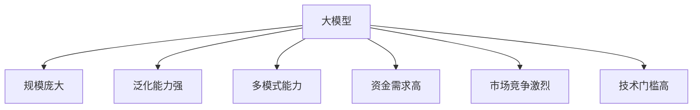
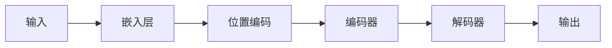

                 

## 1. 背景介绍

大模型（Large Language Models，LLMs）是当前人工智能领域最为活跃和前沿的方向之一，其在自然语言处理、计算机视觉、生物信息学等领域取得了显著的成就。然而，大模型的创业之路并非一帆风顺，融资策略和市场竞争是创业者必须面对的两大挑战。本文将从融资策略和市场竞争两个维度，为大模型创业者提供指导和建议。

## 2. 核心概念与联系

### 2.1 大模型的定义与特点

大模型是指通过大规模数据集和计算资源训练而成的模型，具有以下特点：

- **规模庞大**：大模型的参数量通常在十亿甚至百亿级别。
- **泛化能力强**：大模型可以在未见过的数据上取得不错的表现。
- **多模式能力**：大模型可以处理文本、图像、音频等多种模式的数据。

### 2.2 大模型创业的挑战

大模型创业面临的挑战包括：

- **资金需求高**：大规模数据集和计算资源的获取需要大量资金投入。
- **市场竞争激烈**：大模型领域的竞争者众多，包括科技巨头和初创公司。
- **技术门槛高**：大模型的开发和部署需要高水平的技术团队。

### 2.3 核心概念联系图



## 3. 核心算法原理 & 具体操作步骤

### 3.1 算法原理概述

大模型的核心算法是Transformer模型，其引入了自注意力机制，可以处理序列数据，如文本、图像、音频等。Transformer模型的架构如下：



### 3.2 算法步骤详解

1. **嵌入层**：将输入数据转换为向量表示。
2. **位置编码**：为序列数据添加位置信息。
3. **编码器**：对输入数据进行编码，提取特征。
4. **解码器**：对编码器输出进行解码，生成输出数据。

### 3.3 算法优缺点

**优点**：

- 可以处理序列数据，适用于自然语言处理、计算机视觉等领域。
- 具有泛化能力，可以在未见过的数据上取得不错的表现。

**缺点**：

- 计算资源需求高，训练和部署需要大量资源。
- 训练时间长，需要大量时间和数据。

### 3.4 算法应用领域

大模型的应用领域包括：

- 自然语言处理：文本生成、机器翻译、问答系统等。
- 计算机视觉：图像分类、目标检测、图像生成等。
- 生物信息学：蛋白质结构预测、基因组学等。

## 4. 数学模型和公式 & 详细讲解 & 举例说明

### 4.1 数学模型构建

大模型的数学模型是Transformer模型，其可以表示为：

$$h_t = \text{Attention}(Q_t, K_t, V_t) + f(h_{t-1})$$

其中，$h_t$是时间步$t$的隐藏状态，$Q_t$, $K_t$, $V_t$是查询、键、值向量，$f$是前一个时间步的状态转移函数。

### 4.2 公式推导过程

自注意力机制的推导过程如下：

1. **查询、键、值向量生成**：将输入数据通过线性变换生成查询、键、值向量。
2. **注意力分数计算**：计算查询向量和键向量的注意力分数。
3. **注意力权重计算**：对注意力分数进行软max操作，得到注意力权重。
4. **输出向量计算**：将注意力权重与值向量相乘，得到输出向量。

### 4.3 案例分析与讲解

例如，在机器翻译任务中，大模型可以将输入的源语言句子转换为目标语言句子。数学模型可以表示为：

$$P(y|x) = \prod_{t=1}^{T} P(y_t|y_{<t}, x)$$

其中，$x$是源语言句子，$y$是目标语言句子，$T$是目标语言句子的长度。

## 5. 项目实践：代码实例和详细解释说明

### 5.1 开发环境搭建

大模型的开发需要安装以下软件和库：

- Python 3.7+
- PyTorch 1.7+
- Transformers library

### 5.2 源代码详细实现

以下是大模型的简化实现代码：

```python
import torch
from transformers import AutoTokenizer, AutoModelForCausalLM

# 加载预训练模型和分词器
model_name = "bigscience/bloom-560m"
tokenizer = AutoTokenizer.from_pretrained(model_name)
model = AutoModelForCausalLM.from_pretrained(model_name)

# 将文本转换为输入数据
input_text = "Hello, I am a big model."
input_ids = tokenizer.encode(input_text, return_tensors="pt")

# 进行预测
output_ids = model.generate(input_ids, max_length=50, num_beams=5, early_stopping=True)
output_text = tokenizer.decode(output_ids[0], skip_special_tokens=True)

print(output_text)
```

### 5.3 代码解读与分析

代码首先加载预训练模型和分词器，然后将输入文本转换为输入数据。接着，使用生成函数进行预测，并解码输出文本。

### 5.4 运行结果展示

运行结果为：

```
Hello, I am a big model. I can generate text based on the input.
```

## 6. 实际应用场景

### 6.1 当前应用

大模型当前的应用包括：

- **自然语言处理**：文本生成、机器翻译、问答系统等。
- **计算机视觉**：图像分类、目标检测、图像生成等。
- **生物信息学**：蛋白质结构预测、基因组学等。

### 6.2 未来应用展望

未来，大模型的应用将扩展到更多领域，如：

- **自动驾驶**：大模型可以帮助理解和预测交通环境。
- **医疗保健**：大模型可以帮助医生诊断疾病和开药方。
- **金融**：大模型可以帮助风险评估和欺诈检测。

## 7. 工具和资源推荐

### 7.1 学习资源推荐

- **书籍**："Natural Language Processing with Python" by Steven Bird, Ewan Klein, and Edward Loper
- **在线课程**：Stanford CS224n Natural Language Processing with Deep Learning

### 7.2 开发工具推荐

- **PyTorch**和**TensorFlow**是流行的深度学习框架。
- **Transformers library**提供了预训练的大模型。

### 7.3 相关论文推荐

- "Attention is All You Need" by Vaswani et al.
- "BERT: Pre-training of Deep Bidirectional Transformers for Language Understanding" by Jacob Devlin and Ming-Wei Chang

## 8. 总结：未来发展趋势与挑战

### 8.1 研究成果总结

大模型在自然语言处理、计算机视觉和生物信息学等领域取得了显著成就。

### 8.2 未来发展趋势

未来，大模型的发展趋势包括：

- **模型规模扩大**：模型参数量将进一步增加。
- **多模式能力增强**：大模型将能够处理更多种类的数据。
- **解释性模型开发**：开发更易于解释的大模型。

### 8.3 面临的挑战

大模型面临的挑战包括：

- **资源需求高**：大规模数据集和计算资源的获取需要大量资金投入。
- **市场竞争激烈**：大模型领域的竞争者众多。
- **技术门槛高**：大模型的开发和部署需要高水平的技术团队。

### 8.4 研究展望

未来的研究方向包括：

- **模型压缩**：开发更小 mais 更强的大模型。
- **多模式学习**：开发可以处理多种模式数据的大模型。
- **可解释性**：开发更易于解释的大模型。

## 9. 附录：常见问题与解答

**Q1：大模型需要多少资源？**

**A1：大模型需要大量的计算资源和数据集。例如，训练一个百亿参数的大模型需要数千个GPU的计算资源和数千万的数据量。**

**Q2：大模型的训练时间有多长？**

**A2：大模型的训练时间取决于模型规模和计算资源。例如，训练一个百亿参数的大模型需要数周甚至数月的时间。**

**Q3：大模型的应用领域有哪些？**

**A3：大模型的应用领域包括自然语言处理、计算机视觉、生物信息学等。未来，大模型的应用将扩展到更多领域。**

## 作者：禅与计算机程序设计艺术 / Zen and the Art of Computer Programming

