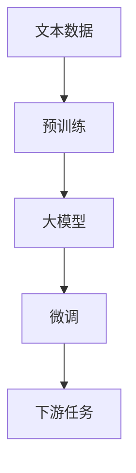

                 

**大模型应用落地加速，AI商业化进程提速**

**作者：禅与计算机程序设计艺术 / Zen and the Art of Computer Programming**

## 1. 背景介绍

随着人工智能（AI）技术的不断发展，大模型（Large Language Models）已然成为AI领域的一个重要方向。大模型的出现，为AI的商业化应用带来了新的机遇和挑战。本文将从技术原理、应用实践、工具资源等多个角度，深入剖析大模型应用落地的关键，以期加速AI商业化进程。

## 2. 核心概念与联系

### 2.1 核心概念

- **大模型（Large Language Models）**：指的是通过大量文本数据训练而成的语言模型，具有强大的理解和生成文本的能力。
- **Transformer模型**：大模型的核心架构，由自注意力机制（Self-Attention）和位置编码（Positional Encoding）组成。
- **预训练（Pre-training）和微调（Fine-tuning）**：大模型训练的两个关键步骤，前者用于学习语言表示，后者用于适应特定任务。

### 2.2 核心概念联系

大模型通过预训练和微调两个步骤，学习到丰富的语义表示，并能够在各种下游任务中取得优异的性能。Transformer模型是大模型的核心架构，它通过自注意力机制捕捉文本中的上下文信息，并通过位置编码保持序列信息。



## 3. 核心算法原理 & 具体操作步骤

### 3.1 算法原理概述

大模型的核心是Transformer模型，其自注意力机制允许模型在处理输入序列时考虑到上下文信息。具体而言，自注意力机制计算每个词汇在整个序列中的注意力权重，从而生成表示序列上下文的向量。

### 3.2 算法步骤详解

1. **位置编码**：为输入序列中的每个词汇添加位置信息。
2. **嵌入**：将词汇转换为向量表示。
3. **自注意力**：计算每个词汇在整个序列中的注意力权重，生成表示序列上下文的向量。
4. **前向传播**：通过多个Transformer块（包含自注意力机制和Feed-Forward网络）进行前向传播。
5. **输出**：生成表示输入序列的向量表示。

### 3.3 算法优缺点

**优点**：
- 可以处理长序列，并考虑到上下文信息。
- 具有强大的理解和生成文本的能力。
- 可以在各种下游任务中取得优异的性能。

**缺点**：
- 训练和推理开销大。
- 存在过拟合和泄漏问题。
- 缺乏解释性。

### 3.4 算法应用领域

大模型在各种NLP任务中取得了优异的性能，包括文本分类、命名实体识别、机器翻译、问答系统等。此外，大模型还可以应用于生成式任务，如文本生成、代码生成等。

## 4. 数学模型和公式 & 详细讲解 & 举例说明

### 4.1 数学模型构建

大模型的数学模型可以表示为：

$$P(\mathbf{y} | \mathbf{x}) = \prod_{i=1}^{n} P(y_i | y_{<i}, \mathbf{x})$$

其中，$\mathbf{x}$是输入序列，$\mathbf{y}$是输出序列，$P(y_i | y_{<i}, \mathbf{x})$表示生成第$i$个词汇的概率。

### 4.2 公式推导过程

自注意力机制的数学表达式为：

$$Attention(\mathbf{Q}, \mathbf{K}, \mathbf{V}) = softmax\left(\frac{\mathbf{Q}\mathbf{K}^T}{\sqrt{d_k}}\right)\mathbf{V}$$

其中，$\mathbf{Q}$, $\mathbf{K}$, $\mathbf{V}$分别是查询、键、值向量，$\sqrt{d_k}$是缩放因子，用于控制梯度消失问题。

### 4.3 案例分析与讲解

例如，在机器翻译任务中，输入序列$\mathbf{x}$是源语言句子，输出序列$\mathbf{y}$是目标语言句子。大模型需要学习源语言句子的语义表示，并生成对应的目标语言句子。

## 5. 项目实践：代码实例和详细解释说明

### 5.1 开发环境搭建

大模型的开发需要强大的计算资源，推荐使用GPU集群进行训练。开发环境可以基于PyTorch或TensorFlow搭建。

### 5.2 源代码详细实现

大模型的实现可以参考开源项目，如Hugging Face的Transformers库。以下是一个简单的大模型训练示例：

```python
from transformers import AutoTokenizer, AutoModelForCausalLM, Trainer, TrainingArguments

tokenizer = AutoTokenizer.from_pretrained("t5-base")
model = AutoModelForCausalLM.from_pretrained("t5-base")

training_args = TrainingArguments(
    output_dir="./results",
    num_train_epochs=3,
    per_device_train_batch_size=16,
    per_device_eval_batch_size=64,
    warmup_steps=500,
    weight_decay=0.01,
    logging_dir="./logs",
)

trainer = Trainer(
    model=model,
    args=training_args,
    train_dataset=train_dataset,
    eval_dataset=eval_dataset,
)

trainer.train()
```

### 5.3 代码解读与分析

上述代码首先加载预训练的大模型，然后配置训练参数，并创建Trainer对象进行训练。

### 5.4 运行结果展示

训练完成后，可以使用生成文本的示例来评估大模型的性能：

```python
inputs = tokenizer("翻译成英语：", return_tensors="pt")
outputs = model.generate(inputs["input_ids"], max_length=50)
print(tokenizer.decode(outputs[0]))
```

## 6. 实际应用场景

### 6.1 当前应用

大模型已经在各种商业应用中得到广泛应用，包括搜索引擎、虚拟助手、内容生成等。

### 6.2 未来应用展望

未来，大模型有望在更多领域得到应用，如自动驾驶、医疗诊断等。此外，大模型还可以与其他AI技术结合，如强化学习，以实现更复杂的任务。

## 7. 工具和资源推荐

### 7.1 学习资源推荐

- **课程**：斯坦福大学的CS224n自然语言处理课程。
- **书籍**："Natural Language Processing with Python"。
- **论文**："Attention is All You Need"，"BERT: Pre-training of Deep Bidirectional Transformers for Language Understanding"等。

### 7.2 开发工具推荐

- **PyTorch**和**TensorFlow**：深度学习框架。
- **Transformers库**：Hugging Face开源的大模型库。
- **GPU集群**：大模型训练的计算资源。

### 7.3 相关论文推荐

- "BERT: Pre-training of Deep Bidirectional Transformers for Language Understanding"。
- "XLNet: Generalized Autoregressive Pretraining for Natural Language Processing"。
- "T5: Text-to-Text Transfer Transformer"。

## 8. 总结：未来发展趋势与挑战

### 8.1 研究成果总结

大模型在各种NLP任务中取得了优异的性能，并已广泛应用于商业领域。

### 8.2 未来发展趋势

未来，大模型有望在更多领域得到应用，并与其他AI技术结合，以实现更复杂的任务。

### 8.3 面临的挑战

大模型面临的挑战包括训练和推理开销大、存在过拟合和泄漏问题、缺乏解释性等。

### 8.4 研究展望

未来的研究方向包括提高大模型的训练和推理效率、研究大模型的解释性、探索大模型与其他AI技术的结合等。

## 9. 附录：常见问题与解答

**Q：大模型的训练需要多少资源？**

**A：大模型的训练需要强大的计算资源，推荐使用GPU集群进行训练。**

**Q：大模型的优点是什么？**

**A：大模型的优点包括可以处理长序列，并考虑到上下文信息，具有强大的理解和生成文本的能力，可以在各种下游任务中取得优异的性能。**

**Q：大模型的缺点是什么？**

**A：大模型的缺点包括训练和推理开销大，存在过拟合和泄漏问题，缺乏解释性。**

**作者：禅与计算机程序设计艺术 / Zen and the Art of Computer Programming**

