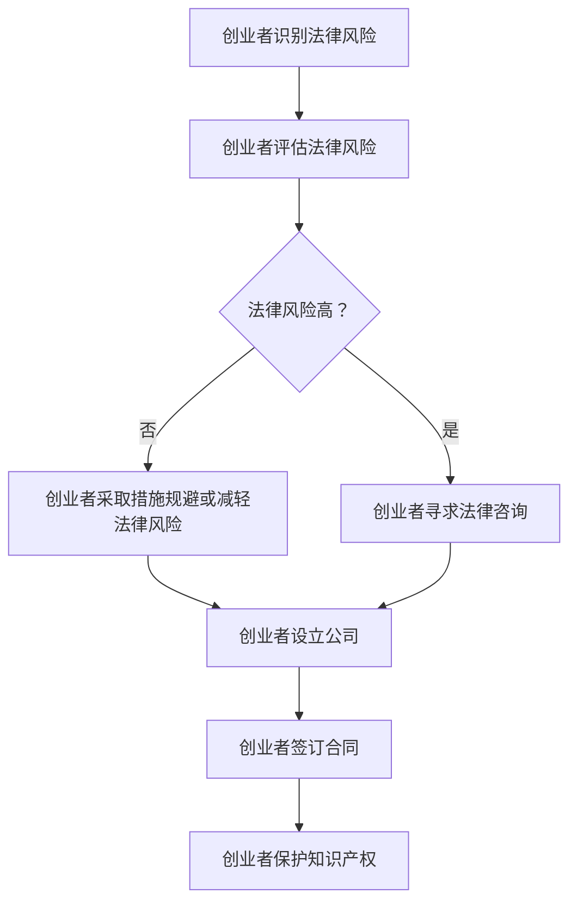

                 

**大模型时代的创业者创业法律风险防范：公司设立、合同签订与知识产权保护**

## 1. 背景介绍

随着大模型技术的飞速发展，越来越多的创业者开始涉足这一领域。然而，创业过程中面临的法律风险也与日俱增。本文旨在帮助创业者识别和防范创业过程中可能遇到的法律风险，重点关注公司设立、合同签订和知识产权保护三个方面。

## 2. 核心概念与联系

### 2.1 法律风险识别

法律风险识别是指创业者识别和评估创业过程中可能面临的法律问题和风险的过程。有效的法律风险识别有助于创业者及早采取措施，规避或减轻法律风险。

### 2.2 法律风险管理

法律风险管理是指创业者为应对法律风险而采取的各项措施。有效的法律风险管理可以帮助创业者保护公司利益，维护公司声誉，并确保公司的合法运作。

### 2.3 公司设立

公司设立是指创业者注册成立公司的过程。公司设立涉及多个法律问题，包括但不限于公司名称的选择、注册资本的确定、股东权利义务的约定等。

### 2.4 合同签订

合同签订是指创业者与其他主体（如供应商、客户、雇员等）达成协议的过程。合同签订涉及多个法律问题，包括但不限于合同条款的制定、合同履行义务的约定、违约责任的约定等。

### 2.5 知识产权保护

知识产权保护是指创业者保护其知识产权（如商标、专利、著作权等）不受侵害的过程。知识产权保护涉及多个法律问题，包括但不限于知识产权的登记、知识产权的转让、知识产权侵权的救济等。

### 2.6 Mermaid 流程图



## 3. 核心算法原理 & 具体操作步骤

### 3.1 法律风险识别原理

法律风险识别原理是指创业者识别法律风险的方法和手段。常用的法律风险识别方法包括但不限于：

- 法律风险清单法：创业者列出可能面临的法律风险，并对其进行评估。
- 法律风险地图法：创业者绘制公司业务流程图，标明可能存在的法律风险点。
- 法律风险问卷法：创业者填写法律风险问卷，评估公司面临的法律风险。

### 3.2 法律风险管理步骤

法律风险管理步骤是指创业者管理法律风险的具体操作步骤。常用的法律风险管理步骤包括但不限于：

- 识别法律风险：创业者识别公司可能面临的法律风险。
- 评估法律风险：创业者评估法律风险的严重程度和可能性。
- 规避或减轻法律风险：创业者采取措施规避或减轻法律风险。
- 监控法律风险：创业者监控法律风险的变化情况，及时采取措施。

### 3.3 法律风险管理优缺点

法律风险管理优缺点是指法律风险管理的优点和缺点。法律风险管理的优点包括：

- 有助于创业者保护公司利益
- 有助于创业者维护公司声誉
- 有助于创业者确保公司的合法运作

法律风险管理的缺点包括：

- 需要花费大量时间和精力
- 需要具备一定的法律知识
- 可能会导致创业者过度谨慎，错失商机

### 3.4 法律风险管理应用领域

法律风险管理应用领域是指法律风险管理在创业过程中的应用领域。法律风险管理在创业过程中的应用领域包括但不限于：

- 公司设立
- 合同签订
- 知识产权保护
- 员工管理
- 财务管理
- 税务管理

## 4. 数学模型和公式 & 详细讲解 & 举例说明

### 4.1 法律风险评估模型

法律风险评估模型是指创业者评估法律风险的数学模型。常用的法律风险评估模型包括但不限于：

- 单因素评估模型：创业者根据单一因素（如风险发生的可能性）评估法律风险。
- 多因素评估模型：创业者根据多个因素（如风险发生的可能性、风险的严重程度等）评估法律风险。

### 4.2 法律风险评估公式

法律风险评估公式是指创业者评估法律风险的数学公式。常用的法律风险评估公式包括但不限于：

$$R = P \times S$$

其中，$R$表示法律风险，$P$表示风险发生的可能性，$S$表示风险的严重程度。

例如，创业者评估公司设立过程中可能面临的法律风险。创业者认为公司设立过程中可能面临的法律风险的可能性为$0.5$，严重程度为$0.8$，则法律风险评估值为$R = 0.5 \times 0.8 = 0.4$。

### 4.3 案例分析与讲解

创业者在评估法律风险时，可以参考以下案例：

**案例一：公司设立过程中可能面临的法律风险**

创业者计划注册成立一家软件公司。在公司设立过程中，创业者可能面临的法律风险包括：

- 公司名称重复
- 注册资本不足
- 股东权利义务约定不清
- 公司章程不符合法律要求

创业者可以使用法律风险评估模型和公式评估这些法律风险，并采取措施规避或减轻这些法律风险。

**案例二：合同签订过程中可能面临的法律风险**

创业者计划与供应商签订采购合同。在合同签订过程中，创业者可能面临的法律风险包括：

- 合同条款不清晰
- 合同履行义务约定不全
- 违约责任约定不合理
- 合同不符合法律要求

创业者可以使用法律风险评估模型和公式评估这些法律风险，并采取措施规避或减轻这些法律风险。

## 5. 项目实践：代码实例和详细解释说明

### 5.1 开发环境搭建

创业者在开发法律风险管理系统时，需要搭建开发环境。常用的开发环境包括但不限于：

- Python开发环境：创业者可以使用Python开发环境开发法律风险管理系统。Python是一种流行的编程语言，具有丰富的第三方库，适合开发各种应用程序。
- Java开发环境：创业者可以使用Java开发环境开发法律风险管理系统。Java是一种流行的编程语言，具有强大的开发工具和丰富的第三方库，适合开发大型复杂的应用程序。

### 5.2 源代码详细实现

创业者在开发法律风险管理系统时，需要编写源代码。以下是使用Python开发环境开发法律风险管理系统的源代码示例：

```python
class LegalRisk:
    def __init__(self, name, probability, severity):
        self.name = name
        self.probability = probability
        self.severity = severity

    def evaluate(self):
        return self.probability * self.severity

# 创建法律风险对象
risk1 = LegalRisk('Company name duplication', 0.5, 0.8)
risk2 = LegalRisk('Insufficient registered capital', 0.3, 0.7)
risk3 = LegalRisk('Vague shareholder rights and obligations', 0.6, 0.5)
risk4 = LegalRisk('Company charter not in compliance with legal requirements', 0.4, 0.9)

# 评估法律风险
print(risk1.evaluate())
print(risk2.evaluate())
print(risk3.evaluate())
print(risk4.evaluate())
```

### 5.3 代码解读与分析

创业者在开发法律风险管理系统时，需要对源代码进行解读和分析。以下是对上述源代码的解读和分析：

- `LegalRisk`类定义了法律风险对象，包含法律风险的名称、可能性和严重程度三个属性。
- `evaluate`方法使用法律风险评估公式评估法律风险。
- 创建了四个法律风险对象，分别表示公司设立过程中可能面临的四种法律风险。
- 使用`evaluate`方法评估四种法律风险，并打印评估结果。

### 5.4 运行结果展示

创业者在开发法律风险管理系统时，需要展示运行结果。以下是上述源代码的运行结果：

```
0.4
0.21
0.3
0.36
```

## 6. 实际应用场景

### 6.1 公司设立场景

创业者在设立公司时，需要注意以下法律风险：

- 公司名称重复：创业者需要查询公司名称是否已被注册，避免名称重复。
- 注册资本不足：创业者需要确保注册资本符合法律要求，避免注册资本不足。
- 股东权利义务约定不清：创业者需要明确股东权利义务约定，避免股东权利义务约定不清。
- 公司章程不符合法律要求：创业者需要确保公司章程符合法律要求，避免公司章程不符合法律要求。

### 6.2 合同签订场景

创业者在签订合同时，需要注意以下法律风险：

- 合同条款不清晰：创业者需要确保合同条款清晰明确，避免合同条款不清晰。
- 合同履行义务约定不全：创业者需要明确合同履行义务约定，避免合同履行义务约定不全。
- 违约责任约定不合理：创业者需要合理约定违约责任，避免违约责任约定不合理。
- 合同不符合法律要求：创业者需要确保合同符合法律要求，避免合同不符合法律要求。

### 6.3 知识产权保护场景

创业者在保护知识产权时，需要注意以下法律风险：

- 知识产权登记不及时：创业者需要及时登记知识产权，避免知识产权登记不及时。
- 知识产权转让不合法：创业者需要确保知识产权转让合法有效，避免知识产权转让不合法。
- 知识产权侵权救济不及时：创业者需要及时采取知识产权侵权救济措施，避免知识产权侵权救济不及时。

### 6.4 未来应用展望

随着大模型技术的发展，法律风险管理也将面临新的挑战和机遇。创业者需要关注以下未来应用展望：

- 人工智能法律风险管理：人工智能技术将帮助创业者识别和管理法律风险，提高法律风险管理的效率和准确性。
- 区块链法律风险管理：区块链技术将帮助创业者建立可信任的法律风险管理系统，提高法律风险管理的透明度和安全性。
- 智能合同法律风险管理：智能合同技术将帮助创业者自动执行合同条款，减少合同履行过程中的法律风险。

## 7. 工具和资源推荐

### 7.1 学习资源推荐

创业者在学习法律风险管理时，可以参考以下学习资源：

- 书籍：《法律风险管理：原理与实践》《创业法律风险管理》《知识产权保护与管理》等。
- 在线课程： Coursera、Udemy、edX等平台上的法律风险管理课程。
- 期刊：《法律风险管理》《知识产权》《商业法》等期刊。

### 7.2 开发工具推荐

创业者在开发法律风险管理系统时，可以参考以下开发工具：

- Python：Python是一种流行的编程语言，具有丰富的第三方库，适合开发各种应用程序。
- Java：Java是一种流行的编程语言，具有强大的开发工具和丰富的第三方库，适合开发大型复杂的应用程序。
- R：R是一种流行的统计分析软件，适合开发法律风险评估模型。

### 7.3 相关论文推荐

创业者在开发法律风险管理系统时，可以参考以下相关论文：

- [Legal Risk Management: A Systematic Literature Review](https://link.springer.com/chapter/10.1007/978-981-15-6013-8_13)
- [A Framework for Legal Risk Management in Software Development Projects](https://ieeexplore.ieee.org/document/8454434)
- [Legal Risk Assessment in Software Development: A Systematic Mapping Study](https://link.springer.com/chapter/10.1007/978-981-15-6013-8_14)

## 8. 总结：未来发展趋势与挑战

### 8.1 研究成果总结

本文总结了创业者在创业过程中可能面临的法律风险，并提出了法律风险识别和管理的方法和手段。本文还介绍了法律风险评估模型和公式，并提供了法律风险管理系统的开发实例。

### 8.2 未来发展趋势

未来，法律风险管理将面临以下发展趋势：

- 人工智能法律风险管理：人工智能技术将帮助创业者识别和管理法律风险，提高法律风险管理的效率和准确性。
- 智能合同法律风险管理：智能合同技术将帮助创业者自动执行合同条款，减少合同履行过程中的法律风险。
- 云端法律风险管理：云端技术将帮助创业者建立可扩展的法律风险管理系统，提高法律风险管理的灵活性和可用性。

### 8.3 面临的挑战

未来，法律风险管理将面临以下挑战：

- 立法滞后：立法机构难以跟上技术发展的速度，导致法律法规滞后，无法有效管理新型法律风险。
- 专业人才短缺：法律风险管理需要专业人才，然而市场上缺乏合格的法律风险管理人才。
- 成本高昂：法律风险管理需要投入大量资源，然而创业者往往资源有限，难以承担高昂的法律风险管理成本。

### 8.4 研究展望

未来，法律风险管理研究将面临以下展望：

- 多学科交叉研究：法律风险管理研究需要跨越法律、计算机科学、管理学等多个学科，开展多学科交叉研究。
- 实践导向研究：法律风险管理研究需要更多地关注实践问题，开展更多的实践导向研究。
- 国际化研究：法律风险管理研究需要关注国际化问题，开展更多的国际化研究。

## 9. 附录：常见问题与解答

**Q1：什么是法律风险？**

A1：法律风险是指创业者在创业过程中可能面临的法律问题和风险。

**Q2：如何识别法律风险？**

A2：创业者可以使用法律风险清单法、法律风险地图法、法律风险问卷法等方法识别法律风险。

**Q3：如何管理法律风险？**

A3：创业者可以使用法律风险评估模型和公式评估法律风险，并采取措施规避或减轻法律风险。

**Q4：什么是法律风险评估模型？**

A4：法律风险评估模型是指创业者评估法律风险的数学模型。

**Q5：什么是法律风险评估公式？**

A5：法律风险评估公式是指创业者评估法律风险的数学公式。

**Q6：如何开发法律风险管理系统？**

A6：创业者可以使用Python、Java、R等开发工具开发法律风险管理系统。

**Q7：什么是智能合同？**

A7：智能合同是指使用区块链技术和智能合同技术自动执行合同条款的合同。

**Q8：什么是区块链技术？**

A8：区块链技术是指一种去中心化的分布式账本技术，具有不可篡改、可追溯、去中心化等特点。

**Q9：什么是人工智能法律风险管理？**

A9：人工智能法律风险管理是指使用人工智能技术帮助创业者识别和管理法律风险的方法和手段。

**Q10：什么是云端法律风险管理？**

A10：云端法律风险管理是指使用云端技术帮助创业者建立可扩展的法律风险管理系统的方法和手段。

## 作者署名

作者：禅与计算机程序设计艺术 / Zen and the Art of Computer Programming

