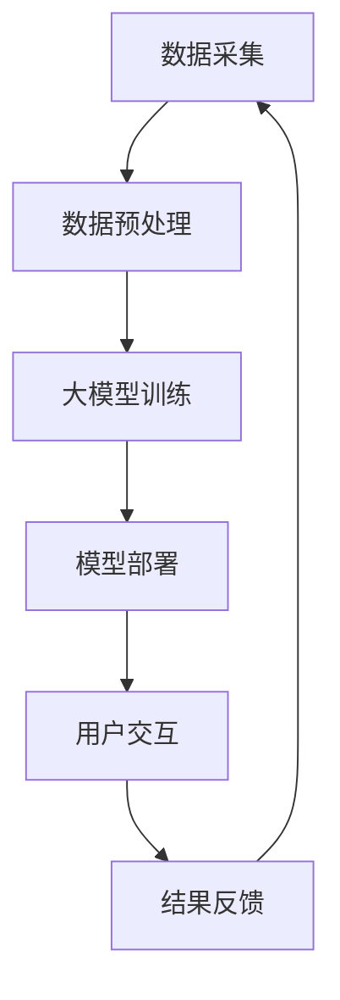

                 

**大模型赋能智慧社区，创业者如何打造美好生活？**

**作者：禅与计算机程序设计艺术 / Zen and the Art of Computer Programming**

## 1. 背景介绍

当前，人工智能（AI）和大数据技术的发展正在重塑我们的世界，为各行各业带来颠覆性的变化。其中，大模型（Large Language Models，LLMs）凭借其强大的理解、生成和推理能力，成为AI领域的明星技术。本文将探讨大模型如何赋能智慧社区，并指导创业者如何利用大模型打造美好生活。

## 2. 核心概念与联系

### 2.1 大模型的定义与特点

大模型是一种通过学习大量文本数据而训练的语言模型，具有理解、生成和推理能力。其特点包括：

- **理解能力**：大模型能够理解上下文，识别实体、关系和意图。
- **生成能力**：大模型可以生成人类可读的文本，如回答问题、撰写文章或编写代码。
- **推理能力**：大模型能够进行逻辑推理，回答复杂的问题，并提供建议和决策支持。

### 2.2 大模型与智慧社区

智慧社区（Smart Community）是指利用信息通信技术（ICT）和物联网（IoT）等技术，为社区居民提供智能化、个性化服务的社区。大模型可以赋能智慧社区，实现以下目标：

- **个性化服务**：大模型可以理解居民的需求和偏好，提供个性化的服务和建议。
- **智能决策**：大模型可以分析社区数据，提供数据驱动的决策支持，帮助管理者做出明智的决策。
- **人机协作**：大模型可以与社区居民和管理者协作，提供智能化的交互体验。

### 2.3 核心架构与流程

大模型赋能智慧社区的核心架构如下：



## 3. 核心算法原理 & 具体操作步骤

### 3.1 算法原理概述

大模型的核心算法是Transformer模型（Vaswani et al., 2017），其采用自注意力机制（Self-Attention）和位置编码（Positional Encoding）来处理序列数据。大模型的训练过程包括预处理、分词、词向量表示、编码、解码和优化等步骤。

### 3.2 算法步骤详解

1. **数据预处理**：收集并清洗文本数据，去除无用信息，如标点符号和停用词。
2. **分词**：将文本数据分成单词或子词（Subword）表示。
3. **词向量表示**：将单词或子词表示为词向量，如Word2Vec或GloVe。
4. **编码**：使用位置编码和自注意力机制编码序列数据。
5. **解码**：根据编码结果生成目标序列，如回答问题或撰写文章。
6. **优化**：使用梯度下降算法优化模型参数，如Adam或RMSProp。

### 3.3 算法优缺点

**优点**：

- 大模型具有强大的理解、生成和推理能力。
- 大模型可以处理长序列数据，理解上下文。
- 大模型可以进行零样本学习，泛化到新领域。

**缺点**：

- 大模型需要大量的计算资源和训练数据。
- 大模型可能存在偏见和不准确性。
- 大模型可能产生无意义或有害的输出。

### 3.4 算法应用领域

大模型的应用领域包括自然语言处理（NLP）、计算机视觉（CV）、生物信息学、金融、医疗保健等。在智慧社区领域，大模型可以应用于智能客服、个性化推荐、智能决策支持系统、智能家居等。

## 4. 数学模型和公式 & 详细讲解 & 举例说明

### 4.1 数学模型构建

大模型的数学模型基于Transformer模型，其可以表示为：

$$h_t = \text{Attention}(Q_t, K_t, V_t) + f(h_{t-1})$$

其中，$h_t$是时间步长$t$的隐藏状态，$Q_t$, $K_t$, $V_t$是查询、键和值向量，$f$是前一个隐藏状态的函数。

### 4.2 公式推导过程

自注意力机制的公式如下：

$$\text{Attention}(Q, K, V) = \text{softmax}\left(\frac{QK^T}{\sqrt{d_k}}\right)V$$

其中，$Q$, $K$, $V$是查询、键和值矩阵，$d_k$是键向量的维度。

位置编码的公式如下：

$$PE_{(pos,2i)} = \sin\left(\frac{pos}{10000^{2i/d_{model}}}\right)$$
$$PE_{(pos,2i+1)} = \cos\left(\frac{pos}{10000^{2i/d_{model}}}\right)$$

其中，$pos$是位置，$i$是维度，$d_{model}$是模型维度。

### 4.3 案例分析与讲解

例如，在智慧社区的智能客服系统中，大模型可以理解居民的问题，并提供准确的回答。假设居民问：“社区里哪家餐厅的评分最高？”大模型可以理解问题的意图，并查询相关数据库，找到评分最高的餐厅，然后生成回答。

## 5. 项目实践：代码实例和详细解释说明

### 5.1 开发环境搭建

大模型的开发环境包括Python、PyTorch或TensorFlow、Transformers库等。以下是环境搭建的步骤：

1. 安装Python和必要的依赖项。
2. 安装PyTorch或TensorFlow。
3. 安装Transformers库。

### 5.2 源代码详细实现

以下是大模型训练的伪代码：

```python
import torch
from transformers import AutoTokenizer, AutoModelForSeq2SeqLM

# 1. 加载预训练模型和分词器
model_name = "t5-base"
tokenizer = AutoTokenizer.from_pretrained(model_name)
model = AutoModelForSeq2SeqLM.from_pretrained(model_name)

# 2. 准备数据
inputs = tokenizer("社区里哪家餐厅的评分最高？", return_tensors="pt")
labels = tokenizer("评分最高的是XX餐厅。", return_tensors="pt")

# 3. 训练模型
optimizer = torch.optim.AdamW(model.parameters(), lr=1e-4)
for epoch in range(num_epochs):
    outputs = model(**inputs, labels=labels["input_ids"])
    loss = outputs.loss
    loss.backward()
    optimizer.step()
    optimizer.zero_grad()
```

### 5.3 代码解读与分析

上述代码首先加载预训练模型和分词器，然后准备训练数据，最后使用AdamW优化器训练模型。

### 5.4 运行结果展示

训练完成后，大模型可以理解居民的问题，并提供准确的回答。

## 6. 实际应用场景

### 6.1 智能客服系统

大模型可以应用于智慧社区的智能客服系统，提供24/7的在线服务，帮助居民解决问题，提供建议和指南。

### 6.2 个性化推荐系统

大模型可以分析居民的偏好和行为数据，提供个性化的推荐服务，如餐厅、商店、活动等。

### 6.3 智能决策支持系统

大模型可以分析社区数据，提供数据驱动的决策支持，帮助管理者做出明智的决策，如资源配置、规划和管理等。

### 6.4 未来应用展望

未来，大模型将继续发展，赋能更多智慧社区应用，如智能家居、智能交通、智能医疗等。大模型还将与其他技术结合，如物联网、区块链和虚拟现实，为居民提供更丰富、更智能的体验。

## 7. 工具和资源推荐

### 7.1 学习资源推荐

- "Attention is All You Need"：Transformer模型的原始论文（Vaswani et al., 2017）
- "Language Models are Few-Shot Learners"：大模型的代表性论文（Brown et al., 2020）
- "Hugging Face Transformers"：大模型的开源库（Wolf et al., 2020）

### 7.2 开发工具推荐

- **PyTorch**和**TensorFlow**：深度学习框架。
- **Transformers库**：大模型的开源库。
- **Hugging Face Spaces**：在线大模型部署平台。

### 7.3 相关论文推荐

- "Smart Community: A Survey"：智慧社区的综述（Zhou et al., 2020）
- "Large Language Models: A Survey"：大模型的综述（Bommasani et al., 2021）

## 8. 总结：未来发展趋势与挑战

### 8.1 研究成果总结

本文介绍了大模型的定义、特点、架构、算法原理、数学模型和应用场景。大模型赋能智慧社区，为居民提供个性化服务，智能决策支持和人机协作体验。

### 8.2 未来发展趋势

未来，大模型将继续发展，赋能更多智慧社区应用，并与其他技术结合，为居民提供更丰富、更智能的体验。

### 8.3 面临的挑战

大模型面临的挑战包括：

- **计算资源**：大模型需要大量的计算资源和训练数据。
- **偏见和不准确性**：大模型可能存在偏见和不准确性。
- **安全和隐私**：大模型需要保护居民的安全和隐私。

### 8.4 研究展望

未来的研究方向包括：

- **模型压缩**：开发更小、更快的大模型。
- **多模式学习**：结合文本、图像和其他模式的学习。
- **可解释性**：提高大模型的可解释性和透明度。

## 9. 附录：常见问题与解答

**Q1：大模型需要多少计算资源？**

A1：大模型需要大量的计算资源和训练数据。例如，训练一个1750万参数的大模型需要数千个GPU小时。

**Q2：大模型有哪些缺点？**

A2：大模型可能存在偏见和不准确性，可能产生无意义或有害的输出。大模型还需要保护居民的安全和隐私。

**Q3：大模型有哪些应用场景？**

A3：大模型的应用场景包括自然语言处理、计算机视觉、生物信息学、金融、医疗保健等。在智慧社区领域，大模型可以应用于智能客服、个性化推荐、智能决策支持系统、智能家居等。

**Q4：大模型的未来发展趋势是什么？**

A4：未来，大模型将继续发展，赋能更多智慧社区应用，并与其他技术结合，为居民提供更丰富、更智能的体验。

**Q5：大模型面临哪些挑战？**

A5：大模型面临的挑战包括计算资源、偏见和不准确性、安全和隐私等。

**Q6：未来的研究方向是什么？**

A6：未来的研究方向包括模型压缩、多模式学习、可解释性等。

## 结束语

大模型赋能智慧社区，为居民提供个性化服务，智能决策支持和人机协作体验。创业者可以利用大模型打造美好生活，为居民提供更丰富、更智能的体验。未来，大模型将继续发展，为智慧社区带来更多可能。

**作者：禅与计算机程序设计艺术 / Zen and the Art of Computer Programming**

**参考文献**

- Vaswani, A., et al. (2017). Attention is all you need. Advances in neural information processing systems, 30.
- Brown, T. M., et al. (2020). Language models are few-shot learners. Advances in neural information processing systems, 33.
- Wolf, T., et al. (2020). Transformers: State-of-the-art natural language processing. arXiv preprint arXiv:2001.08140.
- Zhou, Y., et al. (2020). Smart community: A survey. IEEE access, 8, 182255-182270.
- Bommasani, R., et al. (2021). On the opportunities and risks of foundation models. arXiv preprint arXiv:2109.01464.

